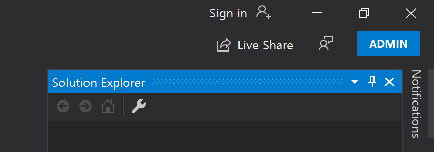
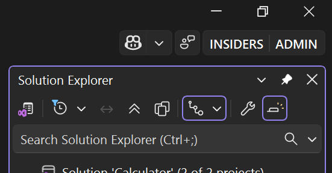

# User permissions and Visual Studio

For reasons of security, you should run Visual Studio as a typical user whenever possible.

> [!WARNING]
> Be sure not to compile, launch, or debug any Visual Studio solution that does not come from a trusted person or a trusted location.

You can do nearly everything in the Visual Studio IDE as a typical user. You need administrator permissions to complete the following tasks:

|Area|Task|For more information|
|----------|----------| - |
|Installation|Initial installation and configuration of Visual Studio|[Install Visual Studio](../install/install-visual-studio.md), [Configure Visual Studio policies](https://aka.ms/vs/setup/policies)|
|Installation|Modify or update Visual Studio. Requires administrator permissions by default, but can be configured and delegated to [standard users](https://aka.ms/vs/setup/policies).|[Update Visual Studio](../install/update-visual-studio.md), [Modify Visual Studio](../install/modify-visual-studio.md)|
|Help|Install, update, or remove local Help content.|[Install and manage local Help content](../help-viewer/install-manage-local-content.md)|
|Toolbox|Add classic COM controls to **Toolbox**.|[Toolbox](../ide/reference/toolbox.md)|
|Building|Use post-build events that register a component, or include a registration step when you build C++ projects. |[Understand custom build steps and build events](/cpp/build/understanding-custom-build-steps-and-build-events)|
|Debugging|Debug applications that run with elevated permissions.|[Debugger settings and preparation](../debugger/debugger-settings-and-preparation.md)|
|Debugging|Debug applications that run under a different user account, such as ASP.NET websites.|[Debug ASP.NET and AJAX applications](../debugger/how-to-enable-debugging-for-aspnet-applications.md)|
|Debugging|Debug in Zone for XAML Browser Applications (XBAP).|[WPF host (PresentationHost.exe)](/dotnet/framework/wpf/app-development/wpf-host-presentationhost-exe)|
|Debugging|Use the emulator to debug cloud service projects for Microsoft Azure.|[Debug a cloud service in Visual Studio](/azure/vs-azure-tools-debug-cloud-services-virtual-machines)|
|Debugging|Configure a firewall for remote debugging.|[Remote debugging](../debugger/remote-debugging.md)|
|Performance tools|Attaching to an elevated application.|[Measure application performance](../profiling/beginners-guide-to-performance-profiling.md)|
|Profiling|Use the GPU Profiler.|[GPU profiling](../profiling/gpu-usage.md)|
|Deployment|Deploy a web application to Internet Information Services (IIS) on a local computer.|[ASP.NET web deployment using Visual Studio](/aspnet/web-forms/overview/deployment/visual-studio-web-deployment/introduction)|
|Development|Developing SharePoint Solutions.|[Create SharePoint solutions](../sharepoint/create-sharepoint-solutions.md)|

## Run Visual Studio as an administrator

If you need to run Visual Studio as an administrator, here's how.

### Use the Start menu

1. Depending on the version of Windows you're using, perform one of the following steps:

   - In **Windows 10**, open the **Start** menu, and then scroll to Visual Studio.
   - In **Windows 11**, select the Start button, and then in the **Search** box, type **Visual Studio**.

1. Next, right-click Visual Studio in the list, and then select **Run as administrator**.

   :::moniker range="<=vs-2022"
   When Visual Studio starts, **(Administrator)** appears after the product name in the title bar, and **ADMIN** appears near the top right of the Visual Studio window, in the same area where **PREVIEW** appears if you are using a preview build of Visual Studio. You can click on this button to view the **About** dialog.

   
   :::moniker-end

   :::moniker range="visualstudio"
   When Visual Studio starts, **(Administrator)** appears after the product name in the title bar, and **ADMIN** appears near the top right of the Visual Studio window, in the same area where **INSIDERS** appears if you are using an Insiders build of Visual Studio. You can select this button to view the **About** dialog.

   
   :::moniker-end

### Modify the shortcut

You can also modify the application shortcut to always run with administrative permissions. Here's how.

#### Windows 10

1. Open the **Start** menu, scroll to the version of Visual Studio that you're using, and then select **More** > **Open file location**.

1. In **File Explorer**, locate the **Visual Studio** shortcut for the version that you're using. Then, right-click the shortcut and select **Send to** > **Desktop (create shortcut)**.

1. On the **Windows 10** desktop, right-click the **Visual Studio** shortcut, and then select **Properties**.

1. Select the **Advanced** button, and then select the **Run as administrator** check box.

1. Select **OK**, and then select **OK** again.

#### Windows 11

1. Select the **Start** button, and then in the **Search** box, enter **Visual Studio**.

1. From the search results, right-click either **Visual Studio 2019** or **Visual Studio 2022**, and then select **Open file location**.

1. In **File Explorer**, locate the **Visual Studio** shortcut for the version that you're using. Then, right-click the shortcut and select **Show more options** > **Send to** > **Desktop (create shortcut)**.

1. On the **Windows 11** desktop, right-click the **Visual Studio** shortcut, and then select **Properties**.

1. Next, select the **Advanced** button, and then select the **Run as administrator** check box.

1. Select **OK** two times to close the dialog.

## Related content

- [Install Visual Studio](../install/install-visual-studio.md)
- [Port, migrate, and upgrade Visual Studio projects](/visualstudio/releases/2022/port-migrate-and-upgrade-visual-studio-projects)
