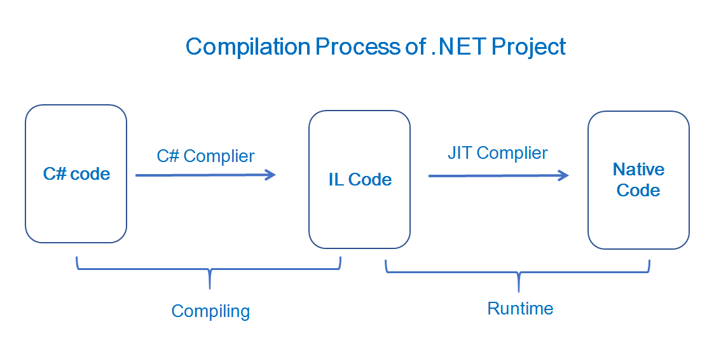
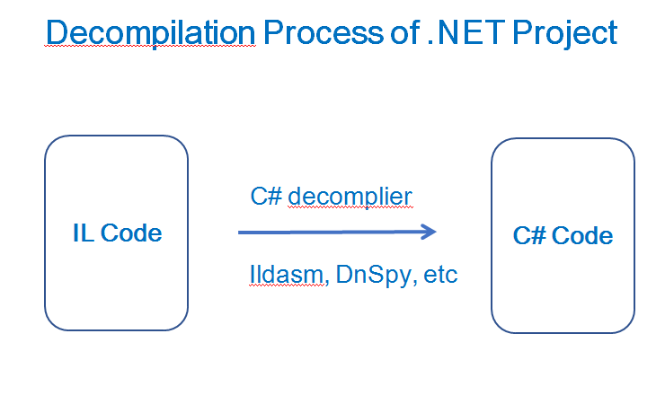
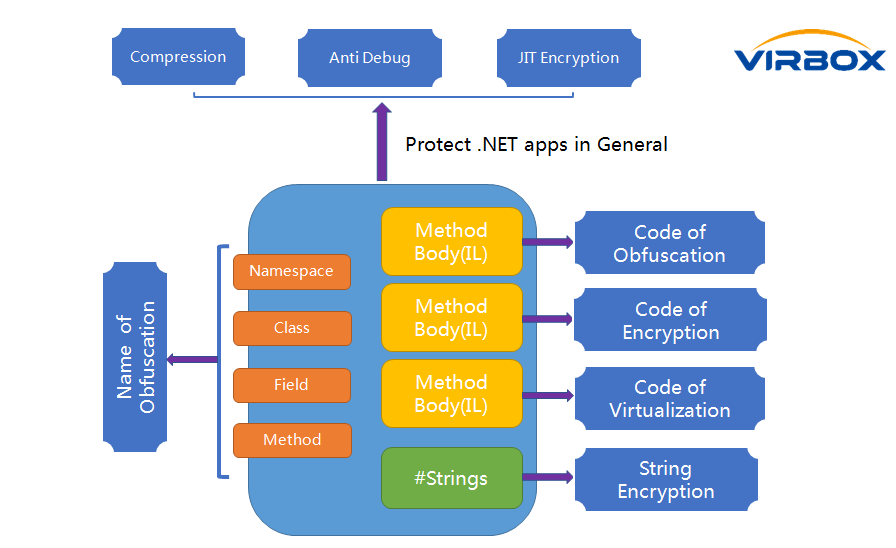

# Virbox Protector for .NET applications

.NET is an open-source and cross-platform development platform to build many types of applications. and widely used to  web, mobile, desktop, IoT applications. 

To implement for cross platform execution: Unlikely the traditional high level language compilation process, the C# in .NET project consist of 2 compiling steps:

With C# compiler, to compile C# to MSIL code first, then with JIT compiler in Runtime, to compile into executable file: exe, dll... and executed in target environment.




so, with latest decompiler or reverse engineering tools, it is extremely easy to the cracker to decompile .NET project, decompile the IL code to get the original C# code, to further analyze, to understand and modify the operation of the application or program.



[**Virbox Protector**](https://appshield.virbox.com/index.html),  use multiple layers encryption technology to protect .NET project in highly security level to defend cracker to decompile, reverse engineering .NET project. 

In general, Virbox Protector supports developer to protect their .NET project in following aspect: 

​	1. Overall  protection and encryption to .NET project: JIT encryption, string encryption, etc.

​	2. Runtime protection: Debugging detection, Name of Obfuscation;

​	3. Obfuscation/encryption in function/methods level, which to protect those critical method, code logic with following code protection options: Code encryption, obfuscation and most secured of code of virtualization; 

Developer may combine to use those protection technology and balance execution performance, application scenario, integration and build project to design your own protection scheme for your .net project. 

With secured and powerful obfuscator and protector, it is still not easy to developer to complete protection process quickly, developer have to spend lot of time to design and finetone in tailor-made protection scheme, based on each .NET project, platform,  environment and security requirement.  In this article, we introduce and summarize some of protection experience (configuration, option setting etc.) of [Virbox Protector](https://appshield.virbox.com/index.html) which can be referral to  developer when they use Virbox Protector to protect their .NET project. 


## Virbox Protector support to protect .NET project in following .NET platform


### Support .NET Platform & Operation Environment

| .NET platform & Environment | Support or Not  | Remarks                                                      |
| --------------------------- | --------------- | ------------------------------------------------------------ |
| .NET Framework 2.x ~ 4.x    | Yes             | Fully support                                                |
| .NET Core 2                 | Partial support | end of life of version.                                      |
| .NET Core 3                 | Yes             | Part of features not available for non windows system        |
| .NET 5 ~.NET 7              | Yes             | Part of features not available for non windows system        |
| Mono Runtime                | No              | For Unity Engine project, Developer may use and follow the  Protector's protection process  to  the Unity3D projects. |

### Protection Options & Technical Matrix to .NET Project

| Option Setting                        | Compatibility                                                | Remarks                                                    |
| ------------------------------------- | ------------------------------------------------------------ | ---------------------------------------------------------- |
| Compression                           | Support Windows system only;Not support`In Memory Module`,  such as the dll loaded by`Assembly.Load` |                                                            |
| JIT Encryption                        | Support in Window Environment                                |                                                            |
| String of Encryption                  | Fully Support                                                |                                                            |
| Overlay data encryption               | Support in Windows Environment                               | Some of archive/Packer tool will generate the overlay data |
| Detect Debug tool                     | Fully Support                                                |                                                            |
| Name of Obfuscation                   | Fully Support                                                |                                                            |
| **Function/Method protection option** |                                                              |                                                            |
| [E] Code of Encryption                | Fully Support                                                |                                                            |
| [M] Code of Obfuscation               | Fully Support                                                |                                                            |
| [V] Code of Virtualization            | Fully Support                                                |                                                            |


## Best Practice to .NET protection

With multiple Obfuscation/Encryption technology, Virbox Protector support developer to design a general protection scheme to protect your .NET project.




### General Guide to obfuscate .NET Project

For those developer who only want to protect/obfuscate their .NET project in general and without special security and protection to some of critical functions/methods, you may follow below process which help you to complete the .NET protection process quickly, which provides general protection to your .NET project. with general protection scheme, Virbox Protector support developer to obfuscate .NET project effectively to defend the decompiling and prevent the normal memory dump.

For the developer who require highly secured protection scheme to protect .NET project, then you can follow the second way to protect your .NET project.


Here are some recommendation to those developer who want to protect .NET project in general and quickly.

Protection Scheme:

| Protection Option                | Recommendation Setting                                       | Notes                                                        |
| -------------------------------- | ------------------------------------------------------------ | ------------------------------------------------------------ |
| Compression                      | it is recommend not select this option                       |                                                              |
| JIT Encryption                   | Select this option in Windows system                         |                                                              |
| String of Encryption             | Select this option if you have sensitive string to hide/encrypt. |                                                              |
| Overlay data encryption          | Select this option if overlay data exist                     | Some of archive/packer  tool will generate overlay data file. |
| Debugging detection (Anti Debug) | Select the "Debugging detection" feature to one module  to each process only, for example to enable debugging detection to main .exe program  only);If the module be used to be the SDK which released to third party program to call. then please DO Not to enable this debugging detection feature. |                                                              |
| Name of Obfuscation              | To "main exe program", Select "Keep the Name of Self defined" to avoid of miss calling functions/methods after name of obfuscation;For "dll files", Select "Obfuscate private member only" |                                                              |
| [E] Code of encryption           | For Windows project, use on default option (encrypt the entry functions only); For Non Windows project, since it doesn't support JIT encryption, so it is required to select  to enable this feature to protect those  functions which necessary to protect. |                                                              |
| [M] Code of Obfuscation          | On default feature, no need to select to enable this feature |                                                              |
| [V] Code of Virtualization       | On default feature, no need to select to enable this feature. |                                                              |


### For those developer who require highly security protection scheme, following protection setting recommended & used in protection process.


Use "**Name of obfuscation**" and use the "**Code of Virtualization**" to protect class name and those critical functions/methods;

**Self-defined the Name of Obfuscation**: 

This features used to obfuscate to name of space, class, method, usually it may exist calling among the modules each other, so, if you obfuscate the name of functions which has the public attribute, it may failed to find the function/method when call relate functions and cause the calling error , so it is required the developer to self define the name of obfuscation of function. to avoid failed to find functions/method with public attributes.

"**Assembly merge**"

For Calling among the modules, developer may use "**Assembly merge**" feature to combine/merge multiple of module/assembly to one assembly and then to protect one assembly only. Virbox protector provides the **Assembly merge** function and support developer to merge the assemly togethers. 

**Assembly Merge** functions can be accessed in the GUI menu -> Tools->Assembly Merge in the Virbox Protector GUI tools, 

**Assembly Merge** function can be available in Virbox Protector CLI tools (virboxprotector_con) also, by adding the option: `-ilmerge`， to merge assembly accordingly.

**Sample：**

```shell
# in the sample case, developer will merge the "test.exe" and dependent test.dll together with new assembly: "test.exe"

virboxprotector_con -ilmerge test.exe test.dll -o merged/test.exe
```


**Virtualization**: 

For those critical and sensetive functions/methods, such as the critical encryption/dycryption coding logic, it is recommend to use "Code of Virtualization" to protect these fucntions/method. 

Note: 

For the functions/method which use the "Code of Virtualization", the execution performance may be negative impacted., so it is NOT recommend to use the "code of virtualization" to every functions/method, only select the critical function to implement;

For performance impact, Virbox Protector provides "Performance Analysis" feature to developer to "pre-view" the performance in execution, which can be available in  the "Function Option" tabs.

```
->Add Function->Analysis
```


## Automatic Integration

### Use Virbox Protector CLI tool to integrate to build project

The on default path of CLI tool of`Virbox Protector`:  `virboxprotector_con`:

```plain
Windows:
C:\Program Files\senseshield\Virbox Protector 3\bin

Linux:
/usr/share/virboxprotector/bin

macOS:
/Applications/Virbox Protector 3.app/Contents/MacOS/bin
```

### Use the configuration file to integrate to build project

There are 2 ways to use Virbox Protector CLI tools to build your project:

With the protection configuration file or Without protection configuration file 

1. **With Configuration file to integrate and build your project**

   Use the Virbox Protector GUI tool to generate the configuration file first and then use the CLI tool to protect your project WITH the configuration generated previously.

   For how to generate the configuration file by use of Virbox GUI, the process is similar to the process to protect the project. More details, pls refer to relate the section of Quick Start Guide to Virbox Protector GUI tool. 

   then, you can find the .ssp file in the 

   ```
   \protected
   ```

    the sub directory in the output path. then call the CLI tool:

   ```
   virboxprotector_con.exe
   ```

    to protect your project with following command:

```shell
virboxprotector_con <input_file> -o <output_file>
```

`virboxprotector_con` will automatically to search the <input_file>.ssp which to be the configuration file to start the protection.

2. **Without configuration file to protect project** 

   Use Virbox Protector CLI to protect your project without configuration file (.ssp file)

   2.1 Use and set the option/argument  to Virbox Protector CLI tool to protect your project. 

   for those developer has rich experience in Virbox Protector protection process, they can use Virbox Protector CLI tool with specified option/argument to protect their project directly. 

   2.2 If  no additional option/argument pass in the CLI tool, 

   ```
   virboxprotector_con
   ```

    will use the option/argument on default to protect the project. the on default option/argument setting, pls refer CLI user manual. or refer following protection option setting in below

   2.3 Developer also can use a SDK label to mark those critical function/method, then protect the project.


### Use Command Line Interface to protect .NET apps: Protection Option Setting: 

**Protection Option**

| Option                               | CLI Argument     | On default value setting                                     |
| ------------------------------------ | ---------------- | ------------------------------------------------------------ |
| Compression                          | `--pack=`        | `0`                                                          |
| JIT encryption                       | `--jit-enc=`     | `1`                                                          |
| String of encryption                 | `--str-enc=`     | `1`                                                          |
| Overlay data encryption              | `--overlay-enc=` | `1`                                                          |
| Debugging detection                  | `--detect-dbg=`  | `0`                                                          |
| Name of Obfuscation                  | `--rename=`      | For exe file,  to obfuscate all of name;For DLL file, to obfuscate  private name only`1` |
| Keep the rule of name of Obfuscation | `--keep-rules=`  | `""`                                                         |


**Function Option Setting**

| Option                                  | CLI Argument setting                                     |
| --------------------------------------- | -------------------------------------------------------- |
| Ignore these function doesn't supported | `--ignore-unsupported=<value>`On default to disable：0） |
| Code of Encryption                      | `-e`                                                     |
| Code of Obfuscation (mutation)          | `-m `                                                    |
| Code of Virtualization                  | `-v`                                                     |


Virbox protector support developer to specify the function/method name or use "rule" to protect .NET projects, which to protect the critical functions/method with different kind of protection options: Code of Encryption, Code of obfuscation (Mutation) and Code of Virtualization. 

Use the semicolon: `;`  to separate functions, support to use wild card: `*`

`-m "function1;function2" -v "function3;function4" -e "test*" --ignore-unsupported=1`


### The protection sample of using Virbox Protector CLI tool

**Protect main program(Obfuscation all of name and enable the anti-debugging features)**:

```shell
virboxprotector_con test.exe --pack=0 --jit-enc=1 --str-enc=1 --rename=2 --keep-rules="" -detect-dbg=1 -o protected/test.exe
```


**Protect the dll (obfuscate the private method name):**

```shell
virboxprotector_con test.dll --pack=0 --jit-enc=1 --str-enc=1 --rename=1 
```


**Protect dll (Reserve and keep self defined method name and not obfuscate):**

```shell
virboxprotector_con test.dll --pack=0 --jit-enc=1 --str-enc=1 --rename=2 --keep-rules="MyNamespace.MyClass1.*;MyNamespace.MyClass2.*"
```


**Protect dll in Non Windows Platform with following option setting:** 

​	Not use JIT encryption;

​	Encryption to all of method;

​	Enable the anti-debugging fucntions;

​	Ignore the functions which not support.

Note: for the option value settings, pls refer the CLI user manual, there are fully description to Option value setting, usually, value setting to "0" means disable, "1" means enable;

```shell
virboxprotector_con test.dll --pack=0 --jit-enc=0 --detect-dbg=1 --str-enc=1 --rename=1 -e "*" --ignore-unsupported=1
```

