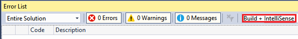
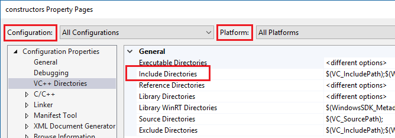
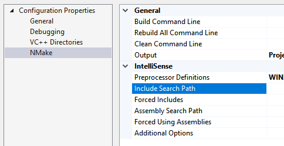
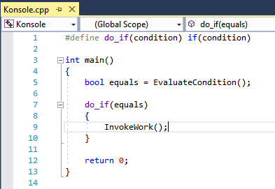
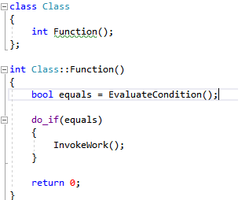

# Configure a C++ project for IntelliSense

In some cases, you might need to manually configure your C++ project to get IntelliSense working properly. For MSBuild projects (based on .vcxproj files), you can adjust settings in project properties. For non-MSBuild projects, you adjust settings in the CppProperties.json file in the root directory of the project. In some cases, you may need to create a hint file to help IntelliSense understand macro definitions. The Visual Studio IDE helps you identify and fix IntelliSense problems.

## Single-file IntelliSense

When you open a file that is not included in a project, Visual Studio provides some IntelliSense support but by default no error squiggles are shown. If the **Navigation Bar** says *Miscellaneous Files*, then that probably explains why you are not seeing error squiggles under incorrect code, or why a preprocessor macro is not defined.

## Check the Error List

If a file is not open in single-file mode, and IntelliSense is not working correctly, the first place to check is the Error List window. To see all the IntelliSense errors for the current source file together with all included header files, choose **Build + IntelliSense** in the dropdown:



IntelliSense produces a maximum of 1000 errors. If there are over 1000 errors in the header files included by a source file, then the source file shows only a single error squiggle at the very start of the source file.

## Ensure #include paths are correct

### MSBuild projects

If you run your builds outside of the Visual Studio IDE, and your builds are succeeding but IntelliSense is incorrect, it is possible that your command line is out of sync with the project settings for one or more configurations. Right-click on the project node in **Solution Explorer** and make sure that all **#include** paths are correct for the current configuration and platform. If the paths are identical in all configurations and platforms, you can select **All configurations** and **All platforms** and then verify that the paths are correct.



To see the current values for build macros such as **VC_IncludePath**, select the Include Directories line and click the dropdown on the right. Then choose **\<Edit>** and click on the **Macros** button.

### Makefile projects

For Makefile projects that are based on the NMake project template, choose **NMake** in the left pane and then choose **Include search path** under the **IntelliSense** category:



### Open Folder projects

For CMake projects, make sure that #include paths are specified correctly for all configurations in CMakeLists.txt. Other project types might require a CppProperties.json file. For more information, see [Configure IntelliSense with CppProperties.json](/cpp/build/open-folder-projects-cpp#configure-code-navigation-with-cpppropertiesjson). Make sure that the paths are correct for each configuration that is defined in the file.

If there is a syntax error in the CppProperties.json file, IntelliSense in the affected files will be incorrect. Visual Studio will display the error in the Output Window.

## Tag parser issues

The tag parser is a "fuzzy" C++ parser that is used for browsing and navigation. It is very fast but does not attempt to completely comprehend every code construct.

For example, it doesn’t evaluate preprocessor macros, and therefore it may incorrectly parse code that makes heavy use of them. When the Tag Parser encounters an unfamiliar code construct, it may skip that entire region of code.

There are two common ways in which this problem manifests in Visual Studio:

1. If the Navigation Bar shows an innermost macro, then the current function definition was skipped:

   

1. The IDE offers to create a function definition for a function that is already defined:

   

To fix these kinds of problems, add a file named **cpp.hint** to the root of your solution directory. For more information, see [Hint Files](/cpp/build/reference/hint-files).

Tag parser errors appear in the **Error List** window.

## Validate project settings with diagnostic logging

To check whether IntelliSense compiler is using correct compiler options, including Include Paths and Preprocessor macros, turn on Diagnostic Logging of IntelliSense command lines in **Tools > Options > Text Editor > C/C++ > Advanced > Diagnostic Logging**. Set **Enable Logging** to True, **Logging Level** to 5 (most verbose), and **Logging Filter** to 8 (IntelliSense logging).

The Output Window will now show the command lines that are passed to the IntelliSense compiler. Here is a sample output:

```output
[IntelliSense] Configuration Name: Debug|Win32
[IntelliSense] Toolset IntelliSense Identifier:
[IntelliSense] command line options:
/c
/I.
/IC:\Repo\Includes
/DWIN32
/DDEBUG
/D_DEBUG
/Zc:wchar_t-
/Zc:forScope
/Yustdafx.h
```

This information may help you understand why IntelliSense is providing inaccurate information. For example, if your project’s Include directory contains **$(MyVariable)\Include**, and the diagnostic log shows **/I\Include** as an Include path, it means that **$(MyVariable)** wasn’t evaluated, and was removed from the final include path.

## About the IntelliSense build

Visual Studio uses a dedicated C++ compiler to create and maintain the database that powers all the IntelliSense features. To keep the IntelliSense database in sync with the code, Visual Studio automatically launches IntelliSense-only builds as background tasks in response to certain changes made in the project settings or source files.

However, in some cases Visual Studio might not update the IntelliSense database in a timely manner. For example, when you run a **git pull** or **git checkout** command, Visual Studio might take up to an hour to detect changes in the files. You can force a rescan of all files in a solution by right-clicking on the project node in **Solution Explorer** and choosing **Rescan Solution**.

## Troubleshooting IntelliSense build failures

An IntelliSense build does not produce binaries, but it can still fail. One possible cause for failure is custom .props or .targets files. In Visual Studio 2017 version 15.6 and later, IntelliSense-only build errors are logged to the Output window. To see them, set **Show output from** to **Solution**:


The error message might instruct you to enable design-time tracing:

```output
error: Designtime build failed for project 'E:\src\MyProject\MyProject.vcxproj',
configuration 'Debug|x64'. IntelliSense might be unavailable.
Set environment variable TRACEDESIGNTIME=true and restart
Visual Studio to investigate.
```

If you set the environment variable TRACEDESIGNTIME to true and restart Visual Studio, you will see a log file in the %TEMP% directory, which might help diagnose the build failure.

To learn more about TRACEDESIGNTIME environment variable, see [Roslyn](https://github.com/dotnet/roslyn/blob/main/docs/wiki/Diagnosing-Project-System-Build-Errors.md) and [Common Project System](https://github.com/dotnet/project-system/blob/master/docs/design-time-builds.md). The information in these articles is relevant for C++ projects.

## Related content

- [Visual C++ IntelliSense](visual-cpp-intellisense.md)
