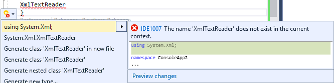

# C# IntelliSense

C# IntelliSense is a language-specific code-completion aid. It's available to you when you write C# code in the code editor and debug it in the [Immediate mode](../ide/immediate-window.md) command window.

## Completion lists

The IntelliSense completion lists in C# contain tokens from List Members, Complete Word, and more. It provides quick access to:

- Members of a type or namespace

- Variables, commands, and functions names

- Code snippets

- Language keywords

- Extension methods

The completion lists in C# filter out irrelevant tokens and preselect tokens based on context. For more information, see [Filtered completion lists](#filtered-completion-lists).

### Code snippets in completion lists

In C#, the completion list includes code snippets to help you easily insert predefined bodies of code into your program. Code snippets appear in the completion list as the snippet's [shortcut text](../ide/code-snippets-schema-reference.md#shortcut-element). For more information about code snippets that are available in C# by default, see [C# code snippets](../ide/visual-csharp-code-snippets.md).

### Language keywords in completion lists

The completion list includes C# language keywords to help you insert them into your program. For more information about C# language keywords, see [C# keywords](/dotnet/csharp/language-reference/keywords/index).

### Extension methods in completion lists

In C#, the completion list includes extension methods that are in scope.

Extension methods use a different icon than instance methods. When an instance method and extension method with the same name are both in scope, the completion list displays the extension method icon.

> [!NOTE]
> For <xref:System.String> objects, the completion list does not display all extension methods.

### Filtered completion lists

IntelliSense removes unnecessary members from the completion list by using filters. C# filters the completion lists that appear for these items:

- **Interfaces and base classes**: IntelliSense automatically removes unnecessary items from the interface and base class completion lists, This removal includes class declaration bases, and interface lists and constraint lists. For example, enums don't appear in the completion list for base classes, because enums can't be used for base classes. The completion list of base classes contains only interfaces and namespaces. If you select an item in the list and then type a Comma key, IntelliSense removes the base classes from the completion list. It does so because C# doesn't support multiple inheritance. The same behavior also occurs for constraint clauses.

- **Attributes**: When you apply an attribute to a type, the completion list is filtered so that the list contains only those types that descend from the namespaces that contain those types. For example, <xref:System.Attribute>.

- **Catch clauses**: Only valid try-catch keywords appear in the completion list.

- **Object initializers**: Only members that can be initialized appear in the completion list.

- **new keyword**: When you type `new` and then press the **Space** key, a completion list appears. IntelliSense automatically selects an item in the list, based on the context in your code. For example, IntelliSense automatically select items in the completion list for declarations and for return statements in methods.

- **enum keyword**: When you press the **Space** key after an equal sign for an enum assignment, a completion list appears. IntelliSense automatically selects an item in the list, based on the context in your code. For example, IntelliSense automatically select items in the completion list after you type the `return` keyword and when you make a declaration.

- **as and is operators**: IntelliSense automatically displays a filtered completion list when you press the **Space** key after you type the `as` or `is` keyword.

- **Events**: When you type the keyword `event`, the completion list contains only delegate types.

- **Parameter help**: IntelliSense automatically sorts to the first method overload that matches the parameters as you enter them. If multiple method overloads are available, you can use the up and down arrows to navigate to the next possible overload in the list.

### Most recently used members

IntelliSense remembers the members that you recently select in the pop-up [List Members](../ide/using-intellisense.md#list-members) box for automatic object name completion. The next time you use **Member List**, the most recently used members are shown at the top. IntelliSense clears the history of the most recently used members between each Visual Studio session.

### override

When you type [override](/dotnet/csharp/language-reference/keywords/override) and then press the **Space** key, IntelliSense displays all of the valid base class members that you can override in a pop-up list box. Typing the return type of the method after `override` prompts IntelliSense to show only methods that return the same type. If IntelliSense can't find any matches, it displays all of the base class members.

### AI-enhanced IntelliSense

[Visual Studio IntelliCode](/visualstudio/intellicode/intellicode-visual-studio) provides artificial intelligence-enhanced IntelliSense completion lists. IntelliCode predicts the most likely correct API to use rather than just presenting an alphabetical list of members. It uses your current code context and patterns to provide the dynamic list.

## Automatic code generation

### Add using

The **Add using** IntelliSense operation automatically adds required `using` directives to your code file. This feature enables you to maintain your focus on the code you're writing rather than requiring you to shift your focus to another part of the code.

To initiate the **Add using** operation, position the cursor on a type reference that can't be resolved. For example, when you create a console application and then add `XmlReader` to the body of the `Main` method, a red squiggle line appears on that line of code because the type reference can't be resolved. You can then invoke the **Add using** operation through the **Quick Actions** menu. The **using \<namespace>** menu item is visible only when the cursor is positioned on the unresolved reference.

For this example, to automatically add the `using` directive to your code, select the error light bulb icon, and then choose **using System.Xml;**.

### Add missing using directives on paste

IntelliSense can automatically add missing `using` directives to your code when you paste a type to your code file. This feature saves you time by automating the task of adding missing using directives when pasting a type to a file.

To enable this feature:

1. Select **Tools** > **Options**.
1. Select **Text Editor** > **C#** (or **Visual Basic**) > **Advanced** from the left pane.
1. Under **Using Directives**, select **Add missing using directives on paste**.

### Remove and sort usings

The **Remove and Sort Usings** option sorts and removes `using` and `extern` declarations without changing the behavior of the source code. Over time, source files might become too large and difficult to read because of unnecessary and unorganized `using` directives. The **Remove and Sort Usings** option compacts source code by removing unused `using` directives, and improves readability by sorting them.

To use this option, select **Edit** > **IntelliSense** > **Sort Usings** from the menu bar, or right-click in the code editor and select **Remove and Sort Usings**.

### Implement interface

IntelliSense provides an option to help you implement an [interface](/dotnet/csharp/language-reference/keywords/interface) while you work in the code editor. Normally, to implement an interface properly, you must create a method declaration for every member of the interface in your class. After you type the name of an interface in a class declaration, IntelliSense displays a **Quick Actions** light bulb. The light bulb gives you the option to implement the interface automatically, using explicit or implicit naming. Under explicit naming, the method declarations carry the name of the interface. Under implicit naming, the method declarations don't indicate the interface to which they belong. An explicitly named interface method can only be accessed through an interface instance, and not through a class instance. For more information, see [Explicit interface implementation](/dotnet/csharp/programming-guide/interfaces/explicit-interface-implementation).

Implement interface generates the minimum number of method stubs required to satisfy the interface. If a base class implements parts of the interface, then those stubs aren't regenerated.

### Implement abstract base class

IntelliSense provides an option to help you implement members of an abstract base class automatically while working in the code editor. Normally, to implement members of an abstract base class requires creating a new method definition for each method of the abstract base class in your derived class. After you type the name of an abstract base class in a class declaration, IntelliSense displays a **Quick Actions** light bulb. The light bulb gives you the option to implement the base class methods automatically.

The method stubs that are generated by the **Implement Abstract Base Class** feature are modeled by the code snippet defined in the file *MethodStub.snippet*. Code snippets are modifiable. For more information, see [Walkthrough: Create a code snippet in Visual Studio](../ide/walkthrough-creating-a-code-snippet.md).

### Generate from usage

The **Generate From Usage** feature enables you to use classes and members before you define them. You can generate a stub for any class, constructor, method, property, field, or enum that you want to use but aren't defined. You can generate new types and members without leaving your current location in code. Doing so minimizes interruption to your workflow.

A red squiggle line appears under each undefined identifier. When you hover the mouse pointer on the identifier, an error message appears in a tooltip. To display the appropriate options, use one of the following procedures:

- Select the undefined identifier. A **Quick Actions** error light bulb appears under the identifier. Select the error light bulb.

- Select the undefined identifier, and then press **Ctrl**+**Period** (**.**).

- Right-click the undefined identifier, and then select **Quick Actions and Refactorings**.

The following options can appear:

- **Generate property**

- **Generate field**

- **Generate method**

- **Generate class**

- **Generate new type** (for a class, struct, interface, or enum)

## Generate event handlers

In the code editor, IntelliSense can help you hook up methods (event handlers) to event fields.

When you type the `+=` operator after an event field in a *.cs* file, IntelliSense prompts you with the option to press the **Tab** key. This inserts a new instance of a delegate that points to the method handling the event.

:::image type="content" source="../ide/media/vxautohookup.gif" alt-text="Screenshot that shows a prompted hook up event handler method.":::

If you press the **Tab** key, IntelliSense automatically finishes the statement for you and displays the event handler reference as selected text in the code editor. To complete the automatic event hookup, IntelliSense prompts you to press the **Tab** key again to create an empty stub for the event handler.

:::image type="content" source="../ide/media/vxgenerateeventhandler.gif" alt-text="Screenshot that shows a generated event handler method.":::

If you press the **Tab** key again, IntelliSense adds a method stub with the correct signature and places the cursor in the body of your event handler.

If a new delegate created by IntelliSense references an existing event handler, IntelliSense communicates this information in the tooltip. You can then modify this reference; the text is already selected in the code editor. Otherwise, automatic event hookup is now complete.

> [!NOTE]
> Use the **Navigate Backward** command on the **View** menu (**Ctrl**+**-**) to return to the event hookup statement.

## Related content

- [Use IntelliSense in Visual Studio](../ide/using-intellisense.md)
- [What is Visual Studio?](../get-started/visual-studio-ide.md)
