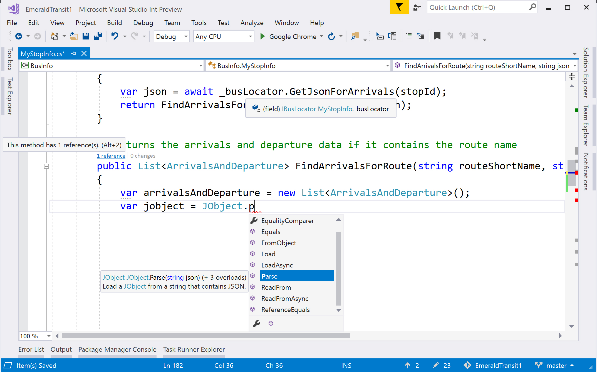
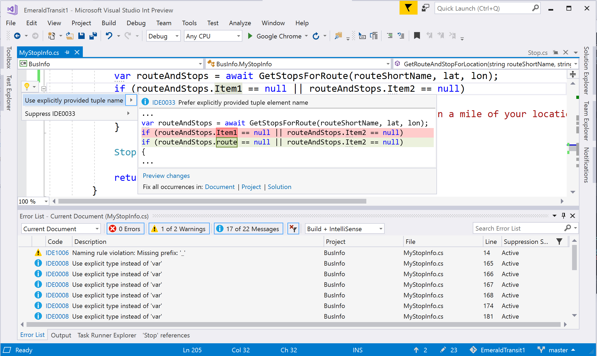
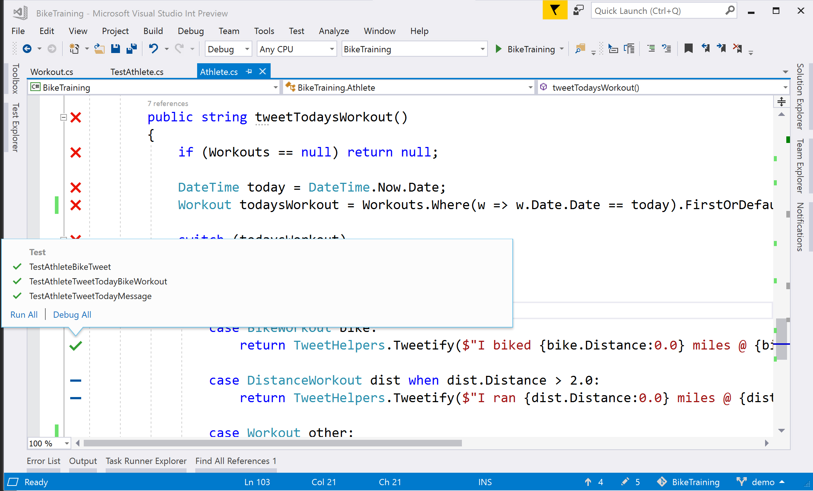
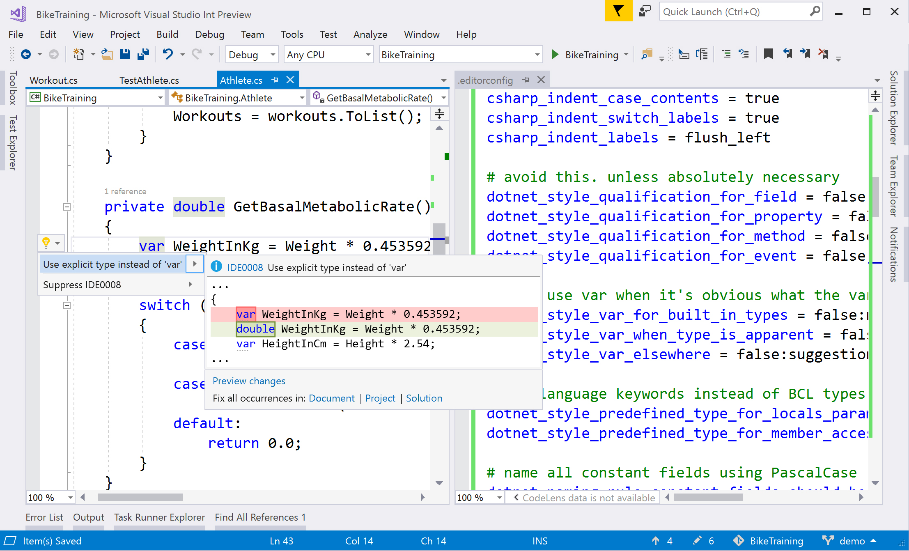
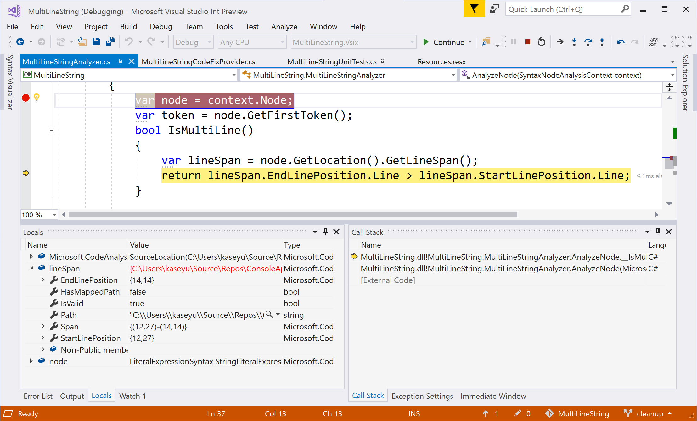

# Visual Studio 2017 for .NET Developers

## Smart code editor

[Documentation: Using IntelliSense](using-intellisense.md)  
[Documentation: Smart editor features](writing-code-in-the-code-and-text-editor.md)

Visual Studio has a deep understanding of your code via the Roslyn compiler to provide you with smart editing features like syntax colorization, code completion, spell-checking mistyped variables, unimported type resolution, outlining, structure visualizers, [CodeLens](find-code-changes-and-other-history-with-codelens.md), call hierarchy, hover-able quick info, parameter help, as well as tools for refactoring, applying quick actions, and generating code.

## Navigate and search your codebase

[Documentation: Navigating code](navigating-code.md)

Quickly navigate your .NET code by jumping to any file, type, member, or symbol declaration with the *Go To All* shortcut (**Ctrl+T**). Find all the references of a symbol or literal in your code, including references across .NET languages (**Shift+F12**). And use our targeted navigation commands to help you jump directly to symbol definitions (**F12**) or implementations (**Ctrl+F12**).

## Live code analysis for code quality

[Documentation: Refactorings and quick actions](refactoring-code-generation-quick-actions.md)

Visual Studio has live code diagnostics to help you improve your code quality by detecting errors and potentially problematic code. We provide quick-actions (**Ctrl+.**) to resolve detected problems across your document, project, or solution. Enable *full-solution analysis* to find issues across your entire solution even if you don’t have those files open in the editor.

Additionally, use code suggestions to learn best practices, stub or generate code, refactor code, and adopt new language features with the **Ctrl+.** shortcut.

## Unit testing

[Documentation: Unit testing in Visual Studio](../test/improve-code-quality.md)

Run and debug your unit tests based on the MSTest, NUnit, or XUnit testing frameworks for any application targeting .NET Framework, .NET Standard, or .NET Core. Explore and review your tests in the *Test Explorer* or immediately see how code changes impact your unit tests inside the editor with *Live Unit Testing* (Enterprise SKU only). 

## Code consistency and style

[Documentation: Portable custom editor options](create-portable-custom-editor-options.md)  
[Documentation: EditorConfig code style settings for .NET](editorconfig-code-style-settings-reference.md)

Visual Studio enables coding convention configuration, detects coding style violations, and provides quick-fixes to remedy style issues with the **Ctrl+.** shortcut. Configure and enforce your team’s formatting, naming, and code style conventions across a repository—allowing overriding values at the project and file level—using *EditorConfig*.

## Debugging

[Documentation: Debugging in Visual Studio](../debugger/index.md)

Visual Studio includes a top-notch debugger that allows you to debug your .NET applications targeting the .NET Framework, .NET Standard, and .NET Core. Toggle and set conditional breakpoints (**F9**), step into method calls, evaluate LINQ and lambda expressions, set variable watches, reattach to processes, examine your call stack, or even make live code edits while debugging with *Edit and Continue*.

If your service runs in Azure, use *Snapshot debugging* to diagnose issues on your live, deployed cloud applications in Visual Studio 2017 Enterprise.

## Version control

[Documentation: Version control in Visual Studio](/vsts/index)

Use git or TFVC to store and update your code in Visual Studio. Inside the editor, organize local changes with Team Explorer and use the status bar to track pending commits and changes. Set up continuous integration and delivery inside of Visual Studio with our [Continuous Delivery Tools for Visual Studio](https://marketplace.visualstudio.com/items?itemName=VSIDEDevOpsMSFT.ContinuousDeliveryToolsforVisualStudio) extension to adopt the agile developer workflow.

## Extensibility

[Documentation: Extending Visual Studio](../extensibility/index.md)

Visual Studio has a rich ecosystem of extensions that you can install or create as you need them. Install extensions from the *Extension Gallery* or the *Visual Studio Marketplace*, build your own editor plugin with the *VS SDK*, or create your own live code analyzer or refactoring using the *.NET Compiler Platform SDK*. You can find additional code fixes and suggestions by downloading the [Microsoft Code Analysis](https://marketplace.visualstudio.com/items?itemName=VisualStudioPlatformTeam.MicrosoftCodeAnalysis2017) extension.

## Popular extensions & shortcuts

If you are coming from another IDE or coding environment, you may find installing one of these extensions helpful:

- [Emacs Emulation](https://marketplace.visualstudio.com/items?itemName=JustinClareburtMSFT.EmacsEmulation )
- [HotKeys for Visual Studio (ReSharper/IntelliJ)](https://marketplace.visualstudio.com/items?itemName=JustinClareburtMSFT.HotKeys)
- [VSVim](https://marketplace.visualstudio.com/items?itemName=JaredParMSFT.VsVim)

The following are popular Visual Studio shortcuts. Note that some extensions unbind default Visual Studio keybindings and you must restore the keybindings to use the commands below. To restore your keybindings to Visual Studio's defaults, go to **Tools > Import and Export Settings... > Reset all settings**.

| Shortcut (All Profiles) | Command | Description |
|-|-|-|
| **Ctrl+T** | Go To All | Navigate to any file/type/member/symbol declaration |
| **F12** (also **Ctrl+Click**) | Go To Definition | Navigate to where a symbol is defined |
| **Ctrl+F12** | Go To Implementation | Navigate from a base type or member to its various implementations |
| **Shift+F12** | Find All References | See all symbol or literal references |
| **Ctrl+.** (also **Alt+Enter** in C# Profile) | Quick Actions and Refactorings | See what code fixes, code generation actions, refactorings, or other quick actions are available at your cursor position or code selection |
| **Ctrl**+**E**,**V** | Duplicate line | Duplicates the line of code that the cursor is in (available in **Visual Studio 2017 version 15.6 preview 2** and later) |
| **Ctrl**+**W** | Expand selection | Expands the current selection by one structural unit (available in **Visual Studio 2017 version 15.5**) |
| **Ctrl**+**Shift**+**W** | Contract selection | Contracts (decreases) the current selection by one structural unit (available in **Visual Studio 2017 version 15.5**) |
| **Ctrl+Q** | Quick Launch | Search all Visual Studio settings |
| **F5** | Start Debugging | Start debugging your application |
| **Ctrl+F5** | Run without Debug | Run your application locally without debugging |
| **Ctrl+K,D** (Default Profile) or **Ctrl+E,D** (C# Profile) | Format Document | Cleans up formatting violations in your file based on your newline, spacing, and indentation settings |
| **Ctrl+\\,E** (Default Profile) or **Ctrl+W,E** (C# Profile) | View Error List | See all errors in your document, project, or solution |