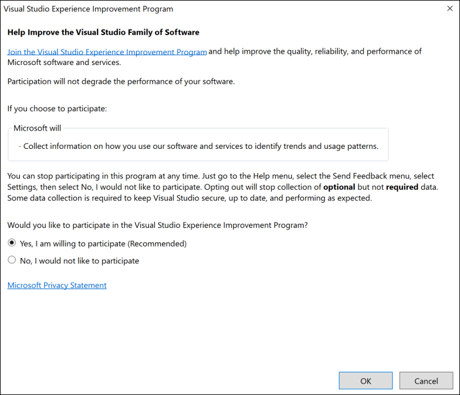

# Visual Studio Customer Experience Improvement Program

The Visual Studio Customer Experience Improvement Program (VSCEIP) is designed to help Microsoft improve Visual Studio over time. This program [collects information about errors](../ide/visual-studio-experience-improvement-program.md#types-of-collected-data), computer hardware, and how people use Visual Studio, without interrupting users in their tasks at the computer. The information that's collected helps Microsoft identify which features to improve. This document covers how to [opt in or out](../ide/visual-studio-experience-improvement-program.md#opt-in-or-out) of the VSCEIP, and provides some information about the types of data we collect and how we use it. It also provides tips on how extension authors can avoid inadvertent disclosure of personal or sensitive information.

## Opt out of diagnostic data collection
Given the purpose of the data we collect and the constraints on its access and retention, we recommend that you use the default privacy settings for Visual Studio and Windows. However, you can [opt out](../ide/visual-studio-experience-improvement-program.md#opt-in-or-out) of the Visual Studio Experience Improvement Program. When you opt out, you are opting out of **optional** diagnostic data collection. Some diagnostic data collection is **required** to make sure Visual Studio is secure, up to date, and performing as expected. Required diagnostic data collection will not be affected by your choice to opt out of VSCEIP.

[!INCLUDE [gdpr-hybrid-note](../misc/includes/gdpr-hybrid-note.md)]
> [!NOTE]
> VSCEIP telemetry opt in or out settings do not apply to 'Report a Problem' in Visual Studio. When you report a problem logs are collected and sent to Microsoft only when you provide permission by clicking ‘Submit’. If you are interested in managing logs before submitting to 'Report a Problem' please see [Feedback Data Privacy](./developer-community-privacy.md) for more details.

### Opt in or out

The VSCEIP is turned on by default. You can turn it off, or back on again, by following these instructions:

1. In Visual Studio, choose **Help** > **Privacy** > **Privacy Settings**.

   The **Visual Studio Experience Improvement Program** dialog box opens.

1. To opt out, select **No, I would not like to participate**, and then select **OK**. To opt in, select **Yes, I am willing to participate (Recommended)**, and then select **OK**.

   

#### Registry settings

If you install the [Build Tools for Visual Studio](https://visualstudio.microsoft.com/vs/older-downloads/#visual-studio-2017-and-other-products), you must update the registry to configure the VSCEIP. Enterprise customers can construct a group policy to opt in or out of the VSCEIP by setting a registry-based policy.

The relevant registry key and settings are as follows:

::: moniker range="vs-2019"

- On a 64-bit OS, Key = **HKEY_LOCAL_MACHINE\SOFTWARE\Wow6432Node\Microsoft\VSCommon\16.0\SQM**
- On a 32-bit OS, Key = **HKEY_LOCAL_MACHINE\SOFTWARE\Microsoft\VSCommon\16.0\SQM**
- When Group Policy is enabled, Key = **HKEY_LOCAL_MACHINE\Software\Policies\Microsoft\VisualStudio\SQM**

::: moniker-end

::: moniker range=">=vs-2022"

- On a 64-bit OS, Key = **HKEY_LOCAL_MACHINE\SOFTWARE\Wow6432Node\Microsoft\VSCommon\17.0\SQM**
- On a 32-bit OS, Key = **HKEY_LOCAL_MACHINE\SOFTWARE\Microsoft\VSCommon\17.0\SQM**
- When Group Policy is enabled, Key = **HKEY_LOCAL_MACHINE\Software\Policies\Microsoft\VisualStudio\SQM**

::: moniker-end

Entry = **OptIn**

Value = (DWORD)

- **0** is opted out (turn off the VSCEIP)
- **1** is opted in (turn on the VSCEIP)

> [!CAUTION]
> Incorrectly editing the registry may severely damage your system. Before making changes to the registry, you should back up any valued data on the computer. You can also use the **Last Known Good Configuration** startup option if you encounter problems after manual changes have been applied.

For more information about the information collected, processed, or transmitted by the VSCEIP, see the [Microsoft Privacy Statement](https://privacy.microsoft.com/privacystatement).

## System-generated logs collected by Visual Studio

Visual Studio collects system-generated logs to fix problems and improve the quality of the product. Here's some information about the types of data we collect and how we use it. It also provides tips on how extension authors can avoid inadvertent disclosure of personal or sensitive information.

### Types of collected data

Visual Studio collects system-generated logs for crashes, UI unresponsiveness, and high CPU or memory usage. We also collect information about errors encountered during product installation or usage. The collected data varies based on the error, and may include stack traces, memory dumps, and exception information:

- For high CPU usage and unresponsiveness, stack traces of relevant Visual Studio threads are collected.

- For cases where stack traces of some threads aren't enough to determine the root cause of the issue, for example, crashes, unresponsiveness or high memory usage, we collect a memory *dump*. The dump represents the state of the process when the error occurred.

- For unexpected error conditions, for example, an exception while trying to write to a file on disk, we collect information about the exception. The information includes the name of the exception, the stack trace of the thread where the exception occurred, the message associated with the exception, and other information relevant to the specific exception.

   The following example of collected data shows an exception name, stack trace, and exception message:

   ```text
   "Reserved.DataModel.Fault.Exception.TypeString": "System.IO.IOException",
   "Reserved.DataModel.Fault.Exception.StackTrace": "System.IO.__Error.WinIOError(Int32,String)\r\n
   System.IO.FileStream.Init(String,FileMode,FileAccess,Int32,Boolean,FileShare,Int32,FileOptions,SECURITY_ATTRIBUTES,String,Boolean,Boolean,Boolean)\r\n
   System.IO.FileStream..ctor(String,FileMode,FileAccess,FileShare,Int32,FileOptions,String,Boolean,Boolean,Boolean)\r\nSystem.IO.StreamWriter.CreateFile(String,Boolean,Boolean)\r\n
   System.IO.StreamWriter..ctor(String,Boolean,Encoding,Int32,Boolean)\r\n
   System.IO.StreamWriter..ctor(String,Boolean)\r\n
   System.IO.File.CreateText(String)\r\n
   Microsoft.VisualStudio.Setup.Services.FileSystem.CreateText(String,Boolean)\r\n
   Microsoft.VisualStudio.Setup.Cache.ChannelManifestRepository.WriteChannelManifest(IChannelManifest,String,String)\r\n
   Microsoft.VisualStudio.Setup.Cache.ChannelManifestRepository.AddChannel(ChannelManifestPair,Boolean)\r\n
   Microsoft.VisualStudio.Setup.Cache.CacheManager.AddChannel(ChannelManifestPair,Boolean)\r\n
   Microsoft.VisualStudio.Setup.ChannelManager.\<UpdateAsync>d__37.MoveNext()\r\n”,
   "Reserved.DataModel.Fault.Exception.Message": " The process cannot access the file 'C:\\Users\\[UserName]\\AppData\\Local\\Microsoft\\VisualStudio\\Packages\\_Channels\\4CB340F5\\channelManifest.json' because it is being used by another process."
   ```

### How we use system-generated logs

The workflow to determine the root cause of an error varies depending on the type of error and its severity.

#### Error classification

Based on the logs, errors are classified and counted to prioritize their investigation. For example, we may discover that “System.IO.\__Error.WinIOError” at “System.IO.FileStream.Init” has occurred 500 times in version \<x> of the product, and has the highest rate of occurrence in that version.

#### Work items for tracking

Work items for individual, prioritized errors are created and assigned to engineers for investigation. These work items typically contain the classification, priority, and diagnostic information relevant to the type of error. This information is derived from the collected system-generated logs for the error. For example, a work item for a crash might contain the stack trace where the crash is occurring.

#### Error investigation

Engineers use the information available in a work item to determine the root cause of an error. In some cases, they need more information than what's present in the work item, in which case they refer to the original system-generated log that was collected. For example, an engineer might inspect a memory dump to understand a product crash.

### Tips for extension authors

Extension authors should limit exposure of personal information by not using personal or other sensitive information in the names of their modules, types, and methods. If a crash or similar error condition occurs with that code on the stack, that information gets collected as part of the system-generated logs.

## Related content

* [How to report a problem with Visual Studio](../ide/how-to-report-a-problem-with-visual-studio.md)
* [Visual Studio Developer Community](https://developercommunity.visualstudio.com/home)
* [Microsoft Privacy Statement](https://privacy.microsoft.com/privacystatement)
* [Diagnostics, feedback, and privacy in Windows 10](https://privacy.microsoft.com/windows-10-feedback-diagnostics-and-privacy)
