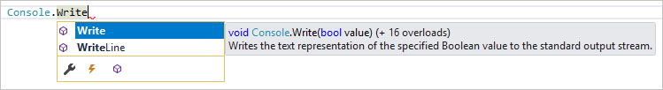
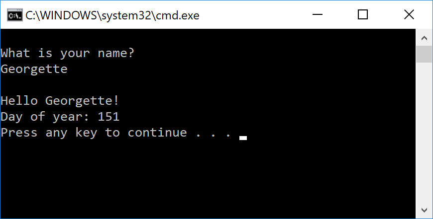
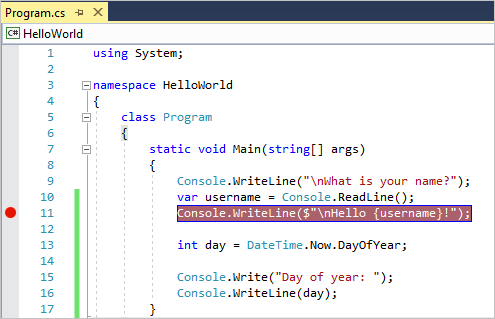
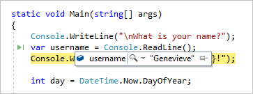

# Visual Studio IDE overview

The Visual Studio interactive development environment (IDE) is a creative launching pad that you can use to view and edit code, and then debug, build, and publish an app. There are versions available for Mac and Windows.

This article introduces you to the basic features of the Visual Studio IDE. We'll walk through some things you can do with Visual Studio, including creating a simple project, using IntelliSense as a coding aid, and debugging an app to see the value of a variable "in flight". We'll also take a tour of the various tool windows.

## Install the Visual Studio IDE

To get started, [download Visual Studio 2017](https://aka.ms/vsdownload?utm_source=mscom&utm_campaign=msdocs) and install it on your system.

The modular installer enables you to choose and install *workloads*, which are groups of features needed for the programming language or platform you prefer. To follow the steps for [creating a program](#create-a-program), be sure to select the **.NET Core cross-platform development** workload during installation.


When you start Visual Studio for the first time, you can optionally sign in using your Microsoft account, or your work or school account.

## Create a program

Let's dive in and create a new, simple program.

1. Open Visual Studio. On the menu, choose **File** > **New** > **Project**.

  

1. The **New Project** dialog box shows several project *templates*. A template contains the basic files and settings needed for a given project type. Choose the **.NET Core** category under **Visual C#**, and then choose the **Console App (.NET Core)** template. In the **Name** text box, type **HelloWorld**, and then select the **OK** button.

  

   Visual Studio creates the project. It's a simple "Hello World" application that calls the <xref:System.Console.WriteLine> method to display the literal string "Hello World!" in the console window.

  > [!NOTE]
  > If you don't see the **.NET Core** category, you need to install the **.NET Core cross-platform development** workload. To do this, choose the **Open Visual Studio Installer** link on the bottom left of the **New Project** dialog. After **Visual Studio Installer** opens, scroll down and select the **.NET Core cross-platform development** workload, and then select **Modify**.

   Shortly, you should see something like the following screenshot:

   

   The C# code for your application is shown in the editor window, which takes up most of the space. Notice that the text is automatically colorized to indicate different aspects of the code, such as keywords and types. In addition, small, vertical dashed lines in the code indicate which braces match one another, and line numbers help you locate code later. You can choose the small, boxed minus signs to collapse or expand code. This code outlining feature lets you hide code you don't need, helping to minimize onscreen clutter.

   The project files are listed on the right side in a window called **Solution Explorer**.

  

  There are other menus and tool windows available, but let's move on for now.

1. Now, start the app. You can do this by choosing **Start Without Debugging** from the **Debug** menu on the menu bar. You can also press **Ctrl**+**F5**.

  

  Visual Studio builds the app, and a console window opens with the message **Hello World!**. You now have a running app!

  

1. To close the console window, press any key on your keyboard.

1. Let's add some additional code to the app. Add the following C# code before the line that says `Console.WriteLine("Hello World!");`:

   ```csharp
   Console.WriteLine("\nWhat is your name?");
   var name = Console.ReadLine();
   ```

   This code displays **What is your name?** in the console window, and then waits until the user enters some text followed by the **Enter** key.

1. Change the line that says `Console.WriteLine("Hello World!");` to the following code:

   ```csharp
   Console.WriteLine($"\nHello {name}!");
   ```

1. Run the app again by selecting **Debug** > **Start Without Debugging** or by pressing **Ctrl**+**F5**.

   Visual Studio rebuilds the app, and a console window opens and prompts you for your name.

1. Enter your name in the console window and press **Enter**.

   

1. Press any key to close the console window and stop the running program.

## Use refactoring and IntelliSense

Let's look at a couple of the ways that [refactoring](refactoring-in-visual-studio.md) and [IntelliSense](using-intellisense.md) can help you code more efficiently.

First, let's rename the `name` variable:

1. Double-click the `name` variable to select it.

1. Type in the new name for the variable, `username`.

   Notice that a gray box appears around the variable, and a light bulb appears in the margin.

1. Select the light bulb icon to show the available [Quick Actions](quick-actions.md). Select **Rename 'name' to 'username'**.

   

   The variable is renamed across the project, which in our case is only two places.

   

1. Now let's take a look at IntelliSense. Below the line that says `Console.WriteLine($"\nHello {username}!");`, type **DateTime now = DateTime.**.

   A box displays the members of the <xref:System.DateTime> class. In addition, the description of the currently selected member displays in a separate box.

   

1. Select the member named **Now**, which is a property of the class, by double-clicking on it or pressing **Tab**. Complete the line of code by adding a semi-colon **;**.

1. Below that, type in or copy the following lines of code:

   ```csharp
   int dayOfYear = now.DayOfYear;

   Console.Write("Day of year: ");
   Console.WriteLine(dayOfYear);
   ```

   > [!TIP]
   > <xref:System.Console.Write> is a little different to <xref:System.Console.WriteLine%2A> in that it doesn't add a line terminator after it prints. That means that the next piece of text that's sent to the output will print on the same line. You can hover over each of these methods in your code to see the IntelliSense **Quick Info** description again.

1. Next, we'll use refactoring again to make the code a little more concise. Click on the variable `now` in the line `DateTime now = DateTime.Now;`.

   Notice that a little screwdriver icon appears in the margin on that line.

1. Click the screwdriver icon to see what suggestions Visual Studio has available. In this case, it's showing the [Inline temporary variable](reference/inline-temporary-variable.md) refactoring to remove a line of code without changing its behavior:

   

1. Click **Inline temporary variable** to refactor the code.

1. Run the program again by pressing **Ctrl**+**F5**. The output looks something like this:

   

## Debug code

When you write code, you need to run it and test it for bugs. Visual Studio's debugging system lets you step through code one statement at a time and inspect variables as you go. You can set breakpoints that are only hit when a specified condition is true. You can monitor the values of variables as the code runs, and more.

Let's set a breakpoint to see the value of the `username` variable while the program is "in flight".

1. Find the line of code that says `Console.WriteLine($"\nHello {username}!");`. To set a breakpoint on this line of code, that is, to make the program pause execution at this line, click in the far left margin of the editor. You can also click anywhere on the line of code and then press **F9**.

   A red circle appears in the far left margin, and the code is highlighted in red.

   

1. Start debugging by selecting **Debug** > **Start Debugging** or by pressing **F5**.

1. When the console window appears and asks for your name, type it in and press **Enter**.

   Notice that the focus returns to the Visual Studio code editor and the line of code with the breakpoint is highlighted in yellow. This signifies that it's the next line of code that the program will execute.

1. Hover your mouse over the `username` variable to see its value. Alternatively, you can right-click on `username` and select **Add Watch** to add the variable to the **Watch** window, where you can also see its value.

   

1. To let the program run to completion, press **F5** again.

To get more details about debugging in Visual Studio, see [Debugger feature tour](../debugger/debugger-feature-tour.md).

## Customize Visual Studio

You can personalize the IDE, including changing the default color theme. To change to the **Dark** theme:

1. On the menu bar, choose **Tools** > **Options** to open the **Options** dialog.

1. On the **Environment** > **General** options page, change the **Color theme** selection to **Dark**, and then choose **OK**.

   The color theme for the entire IDE changes to **Dark**.

   

To learn about other ways you can personalize the IDE, see [Personalize Visual Studio](../ide/personalizing-the-visual-studio-ide.md).

## Tour of the IDE

To give you a high-level visual overview of Visual Studio, the following image shows Visual Studio with an open project along with several key tool windows you will most likely use:

- [Solution Explorer](../ide/solutions-and-projects-in-visual-studio.md) lets you view, navigate, and manage your code files. Solution Explorer can help organize your code by grouping the files into solutions and projects.

- The [editor](../ide/writing-code-in-the-code-and-text-editor.md) window, where you'll likely spend a majority of your time, shows your code and enables you to edit source code and design a UI.

- The [Output](../ide/reference/output-window.md) window is where Visual Studio sends its notifications, such as debugging and error messages, compiler warnings, publishing status messages, and more. Each message source has its own tab.

- [Team Explorer (VSTS)](/vsts/user-guide/work-team-explorer) lets you track work items and share code with others using version control technologies such as [Git](https://git-scm.com/) and [Team Foundation Version Control (TFVC)](/vsts/tfvc/overview).


Following are some other common productivity features in Visual Studio:

- The [Quick Launch](../ide/reference/quick-launch-environment-options-dialog-box.md) search box is a great way to rapidly find what you need in Visual Studio. Just start typing in the name of whatever you are looking for, and Visual Studio lists results that take you exactly where you want to go. **Quick Launch** also shows links that start **Visual Studio Installer** for any workload or individual component.

   

- [Refactoring](../ide/refactoring-in-visual-studio.md) includes operations such as intelligent renaming of variables, moving selected lines of code into a separate function, moving code to other locations, reordering function parameters, and more.

   

- [IntelliSense](../ide/using-intellisense.md) is an umbrella term for a set of popular features that display type information about your code directly in the editor and, in some cases, write small bits of code for you. It's like having basic documentation inline in the editor, which saves you from having to look up type information in a separate help window. IntelliSense features vary by language. For more information, see [C# IntelliSense](../ide/visual-csharp-intellisense.md), [Visual C++ IntelliSense](../ide/visual-cpp-intellisense.md), [JavaScript IntelliSense](../ide/javascript-intellisense.md), and [Visual Basic IntelliSense](../ide/visual-basic-specific-intellisense.md). The following illustration shows some IntelliSense features at work:

   

- **Squiggles** are wavy underlines that alert you to errors or potential problems in your code in real time as you type. This enables you to fix them immediately without waiting for the error to be discovered during compilation or run time. If you hover over the squiggle, you see additional information about the error. A light bulb may also appear in the left margin with actions to fix the error. For more information, see [Quick Actions](../ide/quick-actions.md).

   

- The [Call Hierarchy](../ide/reference/call-hierarchy.md) window can be opened on the text editor context menu to show the methods that call, and are called by, the method under the caret (insertion point).

   

- [CodeLens](../ide/find-code-changes-and-other-history-with-codelens.md) enables you to find references and changes to your code, linked bugs, work items, code reviews, and unit tests, all without leaving the editor.

   

- The [Peek to Definition](../ide/how-to-view-and-edit-code-by-using-peek-definition-alt-plus-f12.md) window shows a method or type definition inline, without navigating away from your current context.

   

- The [Go To Definition](../ide/go-to-and-peek-definition.md) context menu option takes you directly to the place where the function or object is defined. Other navigation commands are also available by right-clicking in the editor.

   

## Delve deeper

Do you want to create an app for an Android phone? You can do that. How about create a cutting edge game using C++? You can do that too, and much more. Visual Studio provides templates that help you make websites, games, desktop apps, mobile apps, apps for Office, and more. Or, you can simply open some code you get from almost anywhere and get working. See a project on GitHub that you like? Just clone the repository, open it in Visual Studio, and start coding!

To start learning about these and other features of Visual Studio, see [Features of Visual Studio 2017](../ide/advanced-feature-overview.md), or choose one of the Quickstart topics from the table of contents.

## See also

* [Advanced feature tour](../ide/advanced-feature-overview.md)
* [Visual Studio IDE](https://www.visualstudio.com/vs/)
* [Visual Studio downloads](https://www.visualstudio.com/downloads/)
* [The Visual Studio blog](https://blogs.msdn.microsoft.com/visualstudio/)
* [Microsoft Virtual Academy](https://mva.microsoft.com/)