# Visual Studio IDE overview

The Visual Studio interactive development environment (IDE) is a creative launching pad that you can use to view and edit nearly any kind of code, and then debug, build, and publish apps for Android, iOS, Windows, the web, and the cloud. There are versions available for Mac and Windows. This topic introduces you to the features of the Visual Studio IDE. We'll walk through some things you can do with Visual Studio and how to install and use it, create a simple project, get pointers on debugging and deploying code, and take a tour of the various tool windows.

## What can you do with the Visual Studio IDE?

Do you want to create an app for an Android phone? You can do that. How about create a cutting edge game using C++? You can do that too and much, much more. Visual Studio provides templates that help you make websites, games, desktop apps, mobile apps, apps for Office, and more.

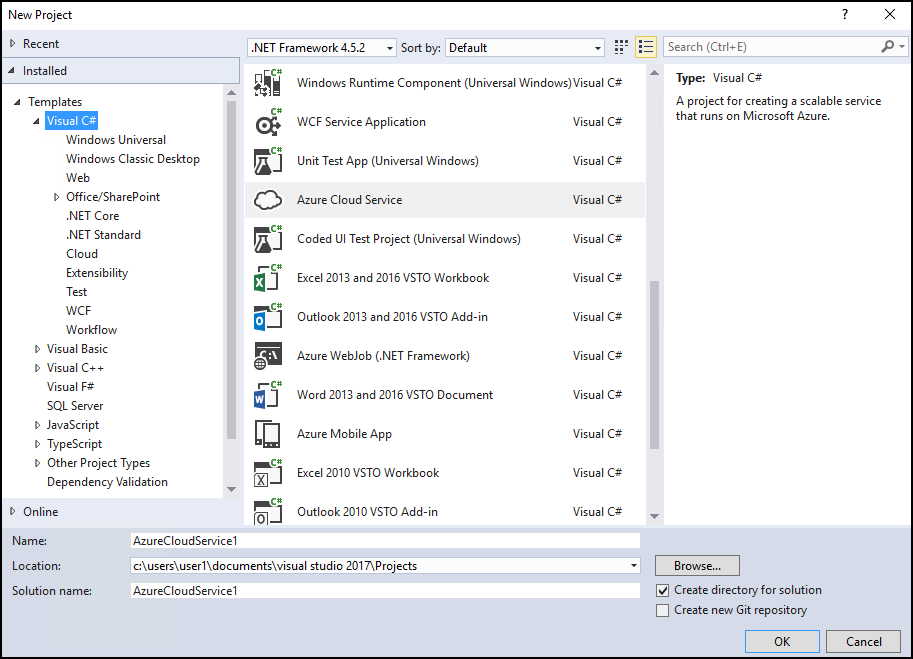

Or, you can simply open some code you get from almost anywhere and get working. See a project on GitHub that you like? Just clone the repository, open it in Visual Studio, and start coding!

### Create mobile apps

You can create native mobile apps for different platforms by using Visual C# and Xamarin, or Visual C++, or hybrid apps using JavaScript with Apache Cordova. You can write mobile games for Unity, Unreal, DirectX, Cocos, and more. Visual Studio includes an Android emulator to help you run and debug Android apps.

You can leverage the power of the cloud for your mobile apps by creating Azure app services. Azure app services enable your apps to store data on the cloud, securely authenticate users, and automatically scale its resources up or down to accommodate the needs of your app and your business. To learn more, see [Mobile app development](https://www.visualstudio.com/vs/mobile-app-development/).

### Create cloud apps for Azure

Visual Studio offers a suite of tools that enable you to easily create cloud-enabled applications powered by Microsoft Azure. You can configure, build, debug, package, and deploy applications and services on Microsoft Azure directly from the IDE. To get Azure Tools for .NET, select the **Azure development** workload when you install Visual Studio. For more information, see [Visual Studio Tools for Azure](https://www.visualstudio.com/vs/azure-tools/).

You can leverage Azure services for your apps using Connected Services such as:

- [Azure Mobile Services](http://azure.microsoft.com/documentation/services/mobile-services/)

- [Azure Storage](http://azure.microsoft.com/documentation/services/storage/)

[HockeyApp](https://www.visualstudio.com/hockey-app/) helps you distribute beta versions, collect live crash reports, and get feedback from real users. In addition, you can integrate Office 365 REST APIs into your own app to connect to data stored in the cloud. For more information, see [these GitHub samples](https://github.com/OfficeDev/?utf8=%E2%9C%93&query=o365).

[Application Insights](https://marketplace.visualstudio.com/items?itemName=VisualStudioOnlineApplicationInsights.application-insights) helps you detect and diagnose quality issues in your apps and web services. Application Insights will also help you understand what your users actually do with your app so you can optimize the user experience.

### Create apps for the web

The web drives our modern world, and Visual Studio can help you write apps for it. You can create web apps using ASP.NET, Node.js, Python, JavaScript and TypeScript. Visual Studio understands web frameworks like Angular, jQuery, Express, and more. ASP.NET Core and .NET Core run on Windows, Mac, and Linux operating systems. [ASP.NET Core](http://www.asp.net/core/overview) is a major update to MVC, WebAPI and SignalR, and runs on Windows, Mac, and Linux.  ASP.NET Core has been designed from the ground up to provide you with a lean and composable .NET stack for building modern cloud-based web apps and services.

For more information, see [Modern Web Tooling](https://www.visualstudio.com/vs/modern-web-tooling/).

### Build cross-platform apps and games

You can use Visual Studio to build apps and games for Android, iOS, Linux, Windows, and other devices. Learn more about it at [Cross-Platform Mobile Development](../cross-platform/cross-platform-mobile-development-in-visual-studio.md). Universal Windows Apps help you leverage your code across multiple platforms. See [Universal Windows Apps](https://dev.windows.com/en-us/windows-apps) for more information.

Choose the tools you need based on your app requirements and the language you want to use:

- [Xamarin for Visual Studio](../cross-platform/build-apps-with-native-ui-using-xamarin-in-visual-studio.md): A common code base in C# for all devices.

- [Visual Studio Tools for Apache Cordova](../cross-platform/visual-studio-tools-for-apache-cordova.md): A common code base for HTML, CSS, and JavaScript or Typescript.

- [Visual Studio Tools for Unity](../cross-platform/visual-studio-tools-for-unity.md): 2D/3D game development in C#.

- [C++ for Cross-Platform Development](../cross-platform/visual-cpp-for-cross-platform-mobile-development.md): Shared code libraries and apps in C++.

- [Visual Studio Emulator for Android](../cross-platform/visual-studio-emulator-for-android.md): Visual Studio Emulator for Android: Debug and test your Android apps no matter the IDE.

[Create games using Visual Studio](https://www.visualstudio.com/vs/game-development/) with game development tools such as DirectX, Unity, Unreal, Cocos, and more.

Visual Studio can do help you do many more things. For a more complete list, see [Visual Studio IDE](https://www.visualstudio.com/vs/).

## Install the Visual Studio IDE

To get started, download Visual Studio and install it on your system. You can download it at [Visual Studio 2017](https://aka.ms/vsdownload?utm_source=mscom&utm_campaign=msdocs).

Visual Studio is now more lightweight than ever! The modular installer enables you to choose and install *workloads*, which are groups of features needed for the programming language or platform you prefer. This strategy helps keep the footprint of the Visual Studio installation smaller than ever before, which means it installs and updates faster too.

To follow the steps for creating a program below, be sure to select and install the **Universal Windows Platform Development** workload.

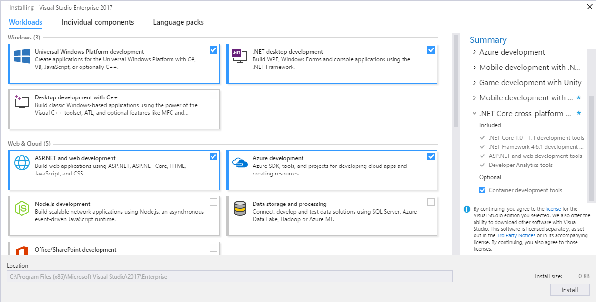

In addition to improved installation performance, Visual Studio 2017 also has shorter IDE start-up and solution load times.

To learn more about setting up Visual Studio on your system, see [Install Visual Studio 2017](../install/install-visual-studio.md).

## Sign in

When you start Visual Studio for the first time, you can optionally sign in using your Microsoft account, or your work or school account. Being signed in lets you synchronize Visual Studio settings, such as window layouts, across multiple devices. It also connects you automatically to the services you might need, such as Azure subscriptions and Visual Studio Team Services.

## Create a program

One good way to learn about something is to use it! Let's dive in and create a new, simple program.

1. Open Visual Studio. On the menu, choose **File** > **New** > **Project**.

  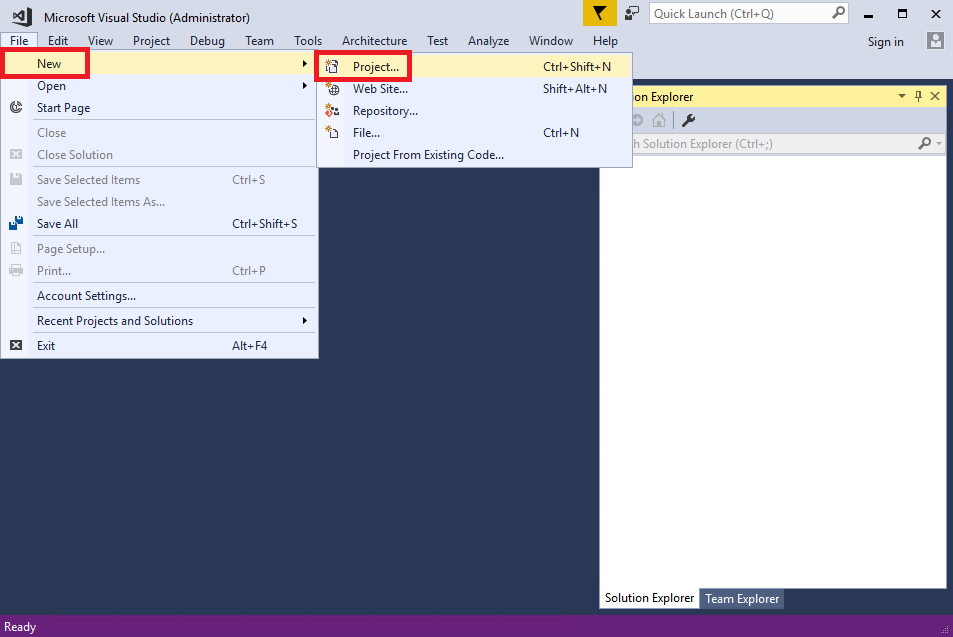

  As an alternative, you can create a new project by using the Start Page. For more information, see [Harness the Power of the Redesigned Start Page (blog)](https://blogs.msdn.microsoft.com/visualstudio/2016/11/29/harness-the-power-of-the-redesigned-start-page/).

1. The **New Project** dialog box shows several project templates. Choose the **Windows Universal** category under **Visual C#**, choose the **Blank App (Universal Windows)** template, and then choose the **OK** button.

  > [!NOTE]
  > If you don't see the **Windows Universal** category, you need to install the **Universal Windows Platform Development** workload. To do this, choose the **Open Visual Studio Installer** link on the bottom left of the **New Project** dialog. After **Visual Studio Installer** opens, select the **Universal Windows Platform Development** workload and then choose **Modify**.

  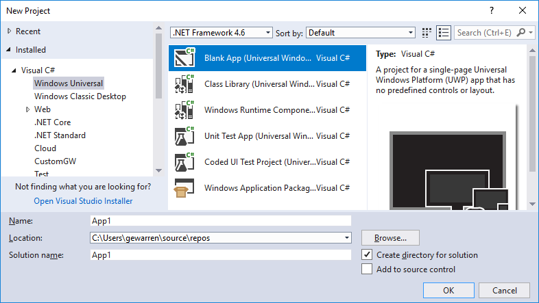

  This creates a new blank Universal Windows app project using Visual C# and XAML as the programming languages. Wait for a bit while Visual Studio sets up the project for you. If you are prompted for any information, just accept the default values for now.

1. In the **New Universal Windows Platform Project** dialog box, accept the defaults by choosing **OK**.

1. Shortly, you should see something like the following screenshot. Your project files are listed on the right side in a window called Solution Explorer.

  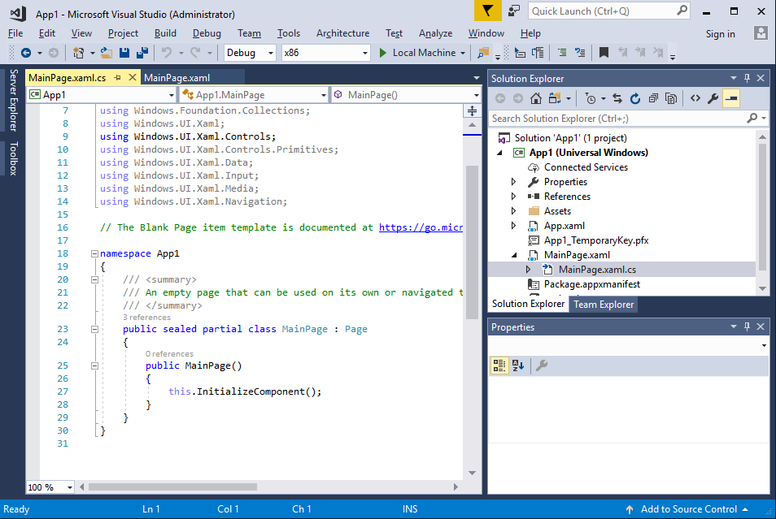

1. In Solution Explorer, choose the little black triangle next to the MainPage.xaml file to expand it, and you should see a MainPage.xaml.cs file underneath. Choose this file (which contains C# code) to open it.

  The C# code in MainPage.xaml.cs appears in the code editor on the left side of the screen. Notice that the code syntax is automatically colorized to indicate different types of code, such as statements or comments. In addition, small, vertical dashed lines in the code indicate which braces match one another, and line numbers help you locate code later. You can choose the small, boxed minus signs to collapse or expand code. This code outlining feature lets you hide code you don't need, helping to minimize onscreen clutter.

  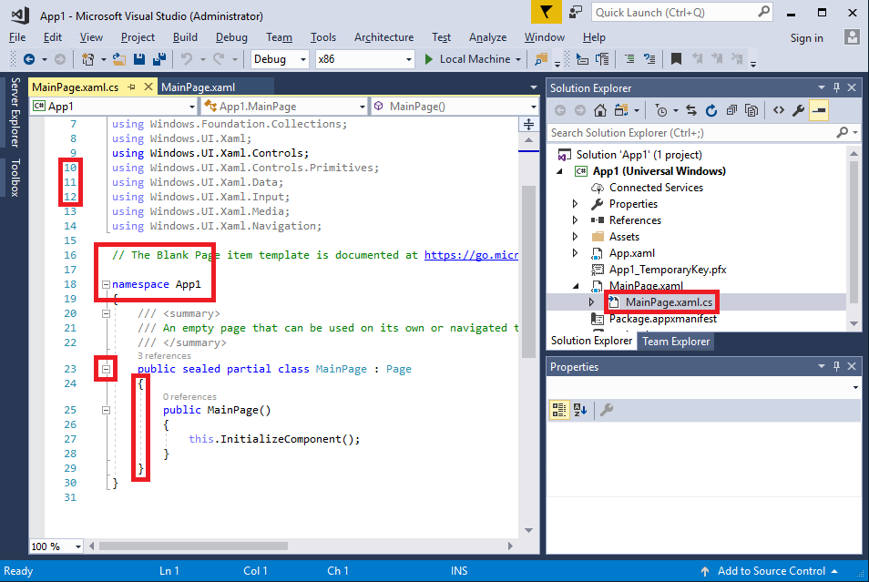

  There are other menus and tool windows available, but let's move on for now.

1. Add a button to the XAML form to give users a way to interact with your app. To do this, open the MainPage.xaml file. This shows a split view: a designer above, for visually placing controls, and a code view below, which shows the XAML code behind the designer. When you run the program later, what you see in the designer becomes a window that users will see, a "form", and the underlying XAML determines what appears on the form.

1. On the left side of the screen, choose the **Toolbox** tab to open the Toolbox. The Toolbox contains a number of visual controls that you can add to forms. For now, we'll just add a button control.

1. Expand the **Common XAML Controls** section and then drag the Button control out to about the middle of the form. (The exact location doesn't matter.)

  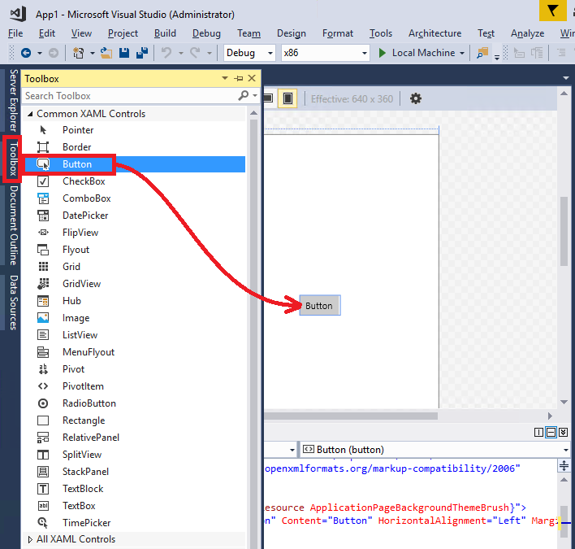

  When you're done, you should see something similar to the following.

  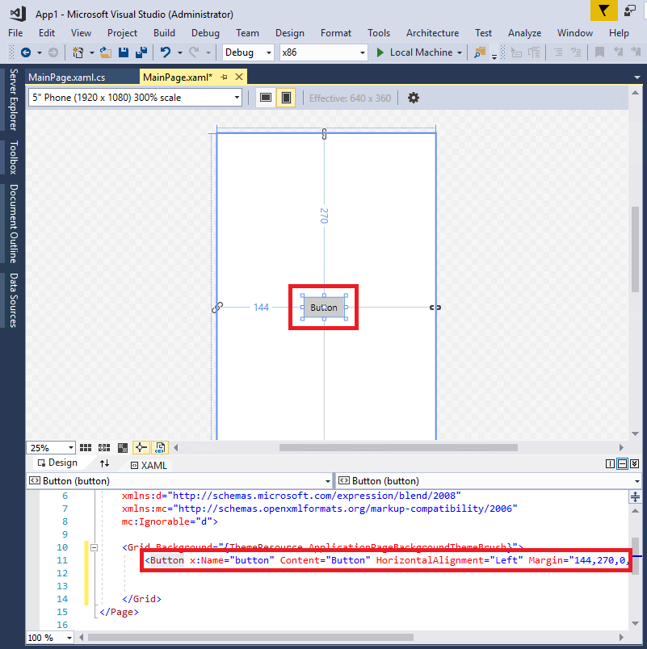

  The button is on the designer, and its underlying code (highlighted) is automatically added to the designer's XAML code.

1. Let's change some of the XAML code. Rename the text in the button code from `Button` to `Hello!`.

  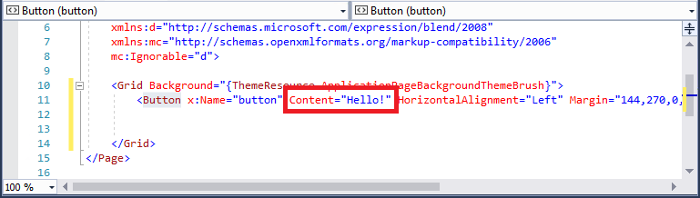

1. Now, start the app. You can do this by choosing the **Start** () button on the toolbar, or by choosing the **F5** key, or on the menu, choosing **Debug** > **Start Debugging**.

  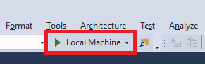

  The app begins its build process and status messages appear in the Output window. Soon, you should see the form appear with your button in it. You now have a running app!

  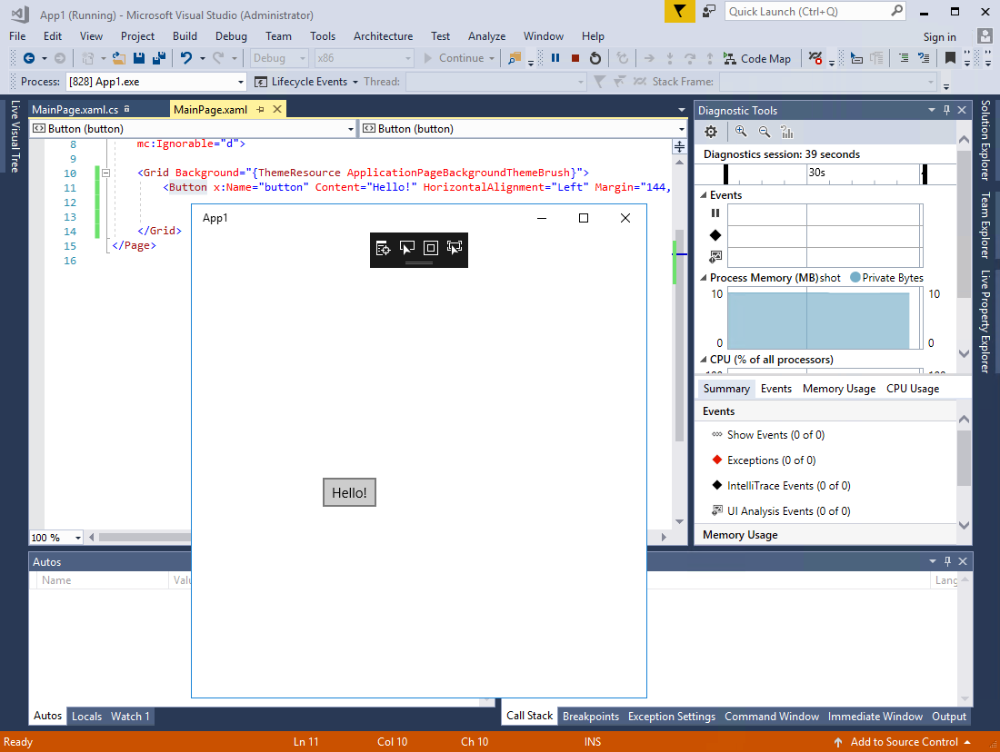

  Of course, it doesn't do much right now, but you can add more functionality to it later if you want.

1. When you're done running the program, choose the Stop () button on the toolbar to stop it.

Let's recap what you did so far: you created a new C# Windows Universal project in Visual Studio, viewed its code, added a control to the designer, changed some XAML code, and then ran the project. Although the process was simplified for this example, this shows you some common parts of the Visual Studio IDE that you will use when you develop your own apps. If you want further details about this example, see [Create a "Hello, world" app (XAML)](/windows/uwp/get-started/create-a-hello-world-app-xaml-universal).

## Debug, test, and improve your code

Nothing runs perfectly all the time. When you write code, you need to run it and test it for bugs and performance. Visual Studio's cutting edge debugging system enables you to debug code running in your local project, on a remote device, or on an emulator such as the ones for Android or Windows Phone devices. You can step through code one statement at a time and inspect variables as you go, you can step through multi-threaded applications, and you can set breakpoints that are only hit when a specified condition is true. You can monitor the values of variables as the code runs, and more. All of this can be managed in the code editor itself, so that you don't have to leave your code.

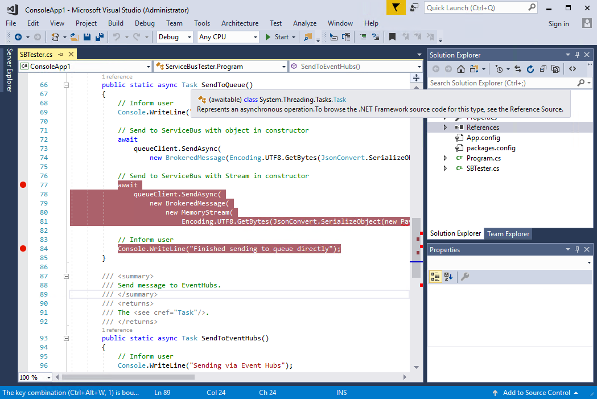

For testing, Visual Studio offers unit testing, IntelliTest, load and performance testing, and more. To get more details about the Visual Studio debugging process, see [Debugger Feature Tour](../debugger/debugger-feature-tour.md). To learn more about testing, see [Testing Tools and Scenarios](../test/developer-testing-scenarios.md). To learn more about improving the performance of your apps, see [Profiling Feature Tour](../profiling/profiling-feature-tour.md).

## Deploy your finished application

When your application is ready to deploy to users or customers, Visual Studio provides the tools to do that, whether you're deploying to Microsoft Store, to a SharePoint site, or with InstallShield or Windows Installer technologies. It's all accessible through the IDE. For more information, see [Deploying Applications, Services, and Components](../deployment/deploying-applications-services-and-components.md).

## Quick tour of the IDE

To give you a high-level visual overview of Visual Studio, the following image shows Visual Studio with an open project along with several key tool windows you will most likely use:

- [Solution Explorer](../ide/solutions-and-projects-in-visual-studio.md) lets you view, navigate, and manage your code files. Solution Explorer can help organize your code by grouping the files into solutions and projects.

- The [Editor](../ide/writing-code-in-the-code-and-text-editor.md) window, where you'll likely spend a majority of your time, shows your code and enables you to edit source code and design a UI.

- The [Output](../ide/reference/output-window.md) window is where Visual Studio sends its notifications, such as debugging and error messages, compiler warnings, publishing status messages, and more. Each message source has its own tab.

- [Team Explorer (VSTS)](/vsts/user-guide/work-team-explorer) lets you track work items and share code with others using version control technologies such as [Git](https://git-scm.com/) and [Team Foundation Version Control (TFVC)](/vsts/tfvc/overview).

- [Cloud Explorer](/azure/vs-azure-tools-resources-managing-with-cloud-explorer) lets you view and manage your Azure resources, such as virtual machines, tables, SQL databases, and more. If a particular operation requires the Azure portal, Cloud Explorer provides links that take you to the place in the Azure portal you need to go.

Following are some other common productivity features in Visual Studio:

- The [Quick Launch](../ide/reference/quick-launch-environment-options-dialog-box.md) search box is a great way to rapidly find what you need in Visual Studio. Just start entering in the name of whatever you are looking for, and Visual Studio lists results that take you exactly where you want to go. Quick Launch also shows links that start the Visual Studio Installer for any workload or individual component.

  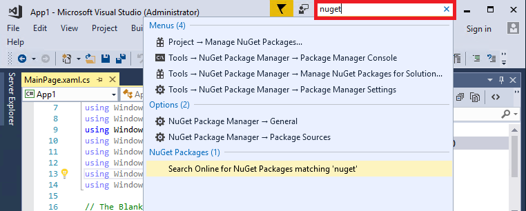

- [Refactoring](../ide/refactoring-in-visual-studio.md) includes operations such as intelligent renaming of variables, moving selected lines of code into a separate function, moving code to other locations, reordering function parameters, and more.

 

- **IntelliSense** is an umbrella term for a set of popular features that display type information about your code directly in the editor and, in some cases, write small bits of code for you. It's like having basic documentation inline in the editor, which saves you from having to look up type information in a separate help window. IntelliSense features vary by language. For more information, see [Visual C# IntelliSense](../ide/visual-csharp-intellisense.md), [Visual C++ Intellisense](../ide/visual-cpp-intellisense.md), [JavaScript IntelliSense](../ide/javascript-intellisense.md), and [Visual Basic-Specific IntelliSense](../ide/visual-basic-specific-intellisense.md). The following illustration shows some IntelliSense features at work:

  

- **Squiggles** are wavy red underlines that alert you to errors or potential problems in your code in real time as you type. This enables you to fix them immediately without waiting for the error to be discovered during compilation or run time. If you hover over the squiggle, you see additional information about the error. A light bulb may also appear in the left margin with suggestions for how to fix the error. For more information, see [Quick Actions](../ide/quick-actions.md).

 

- The [Call Hierarchy](../ide/reference/call-hierarchy.md) window can be opened on the text editor context menu to show the methods that call, and are called by, the method under the caret (insertion point).

 

- [CodeLens](../ide/find-code-changes-and-other-history-with-codelens.md) enables you to find references and changes to your code, linked bugs, work items, code reviews, and unit tests, all without leaving the editor.

 

- The [Peek to Definition](../ide/how-to-view-and-edit-code-by-using-peek-definition-alt-plus-f12.md) window shows a method or type definition inline, without navigating away from your current context.

 

- The **Go To Definition** context menu option takes you directly to the place where the function or object is defined. Other navigation commands are also available by right-clicking in the editor.

 

- A related tool, the [Object Browser](http://msdn.microsoft.com/f89acfc5-1152-413d-9f56-3dc16e3f0470), enables you to inspect .NET or Windows Runtime assemblies on your system to see what types they contain and what members (properties, methods, events, etc.) those types contain.

  

## Manage your source code and collaborate with others

You can manage your source code in Git repos hosted by any provider, including GitHub. Or use [Visual Studio Team Services (VSTS)](/vsts/index) to manage code alongside bugs and work items for your whole project. See [Get Started with Git and Team Services (VSTS)](/vsts/git/gitquickstart?tabs=visual-studio) to learn more about managing Git repos in Visual Studio using Team Explorer. Visual Studio also has other built-in source control features. To learn more about them, see [New Git Features in Visual Studio 2017 (blog)](https://blogs.msdn.microsoft.com/visualstudioalm/2017/03/06/new-git-features-in-visual-studio-2017/).

Visual Studio Team Services is a cloud-based service for hosting software projects and enabling collaboration in teams. VSTS supports both Git and Team Foundation Source Control systems, as well as Scrum, CMMI and Agile development methodologies. Team Foundation Version Control (TFVC) uses a single, centralized server repository to track and version files. Local changes are always checked in to the central server where other developers can get the latest changes.

Team Foundation Server (TFS) is the application lifecycle management hub for Visual Studio. It enables everyone involved with the development process to participate using a single solution. TFS is useful for managing heterogeneous teams and projects, too.

If you have a Visual Studio Team Services account or a Team Foundation Server on your network, you connect to it through the Team Explorer window in Visual Studio. From this window you can check code into or out of source control, manage work items, start builds, and access team rooms and workspaces. You can open Team Explorer from the **Quick Launch** box, or on the main menu from **View, Team Explorer** or from **Team, Manage Connections**.

The following image shows the Team Explorer window for a solution that is hosted in VSTS.

You can also automate your build process to build the code that the devs on your team have checked into version control. For example, you can build one or more projects nightly or every time that code is checked in. See [Continuous integration on any platform](https://www.visualstudio.com/en-us/docs/build/overview) for more information.

## Connect to services, databases, and cloud-based resources

The cloud is critical for today's online world, and Visual Studio provides you the means to leverage it. For example, the Connected Services feature enables you to connect your app to services. Your apps can use it to store their data on Azure storage, among other things.

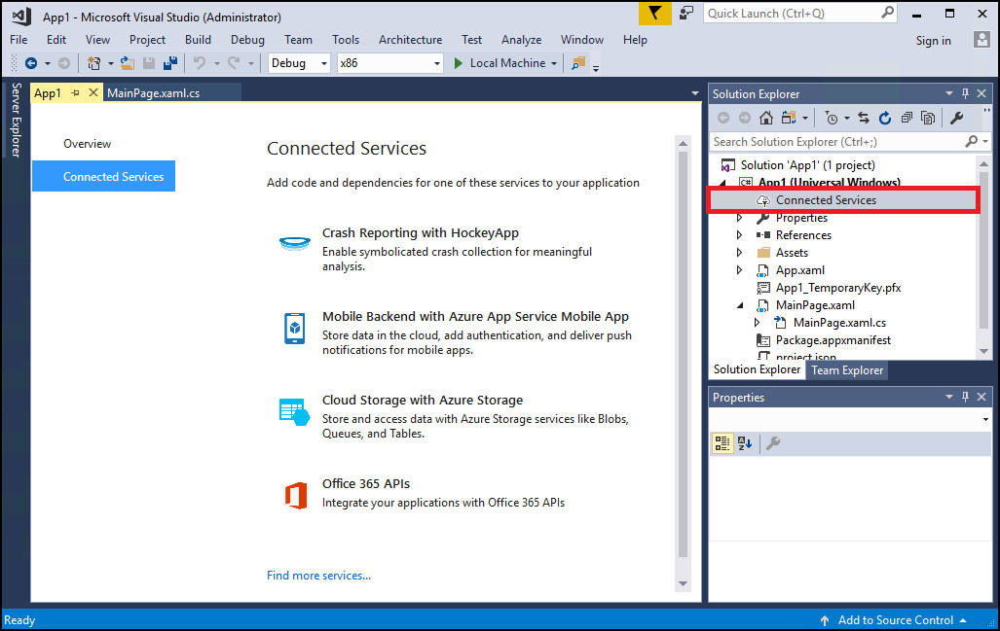

Choosing a service on the **Connected Services** page starts a Connected Services Wizard that configures your project and downloads the necessary NuGet packages to help get you started coding against the service.

You can view and manage your Azure-based cloud resources within Visual Studio using [Cloud Explorer](/azure/vs-azure-tools-resources-managing-with-cloud-explorer). Cloud Explorer shows the Azure resources in all the accounts managed under the Azure subscription you are logged into. You can get Cloud Explorer by selecting the **Azure development** workload in the Visual Studio installer.

**Server Explorer** helps you browse and manage SQL Server instances and assets locally, remotely, and on Azure, Salesforce.com, Office 365, and websites. To open Server Explorer, on the main menu, choose **View** > **Server Explorer**. See [Add new connections](../data-tools/add-new-connections.md) for more information on using Server Explorer.

[SQL Server Data Tools (SSDT)](/sql/ssdt/download-sql-server-data-tools-ssdt) is a powerful development environment for SQL Server, Azure SQL Database and Azure SQL Data Warehouse. It enables you to build, debug, maintain, and refactor databases. You can work with a database project, or directly with a connected database instance on- or off-premises.

**SQL Server Object Explorer** in Visual Studio provides a view of your database objects similar to SQL Server Management Studio. SQL Server Object Explorer enables you to do light-duty database administration and design work, including editing table data, comparing schemas, executing queries by using contextual menus right from SQL Server Object Explorer, and more.

## Extend Visual Studio

If Visual Studio doesn't have the exact functionality you need, you can add it! You can personalize the IDE based on your workflow and style, add support for external tools not yet integrated with Visual Studio, and modify existing functionality to increase your productivity. To find the latest version of the Visual Studio Extensibility Tools (VS SDK), see [Visual Studio SDK](../extensibility/visual-studio-sdk.md).

You can use the .NET Compiler Platform (Roslyn) to write your own code analyzers and code generators. Find everything you need at [Roslyn](https://github.com/dotnet/Roslyn).

Find [existing extensions](https://marketplace.visualstudio.com/vs) for Visual Studio created by Microsoft developers as well as our development community.

To learn more about extending Visual Studio, see [Extend Visual Studio IDE](https://www.visualstudio.com/vs/extend/).

## Learn more and find out what's new

If you've never used Visual Studio before, look at [Get Started Developing with Visual Studio](../ide/get-started-developing-with-visual-studio.md), or check out the free Visual Studio courses available on [Microsoft Virtual Academy](https://mva.microsoft.com/product-training/visual-studio-courses#!index=2&lang=1033). If you want to check out the new features in Visual Studio 2017, see [What's New in Visual Studio 2017](../ide/whats-new-in-visual-studio.md).

Congratulations on completing the tour of the Visual Studio IDE! We hope you learned something useful about some of its main features.

## See also

* [Visual Studio IDE](https://www.visualstudio.com/vs/)
* [Visual Studio Downloads](https://www.visualstudio.com/downloads/)
* [The Visual Studio Blog](https://blogs.msdn.microsoft.com/visualstudio/)
* [Visual Studio Forums](https://social.msdn.microsoft.com/Forums/vstudio/en-US/home?category=visualstudio%2Cvsarch%2Cvsdbg%2Cvstest%2Cvstfs%2Cvsdata%2Cvsappdev%2Cvisualbasic%2Cvisualcsharp%2Cvisualc)
* [Microsoft Virtual Academy](https://mva.microsoft.com/)
* [Channel 9](https://channel9.msdn.com/)