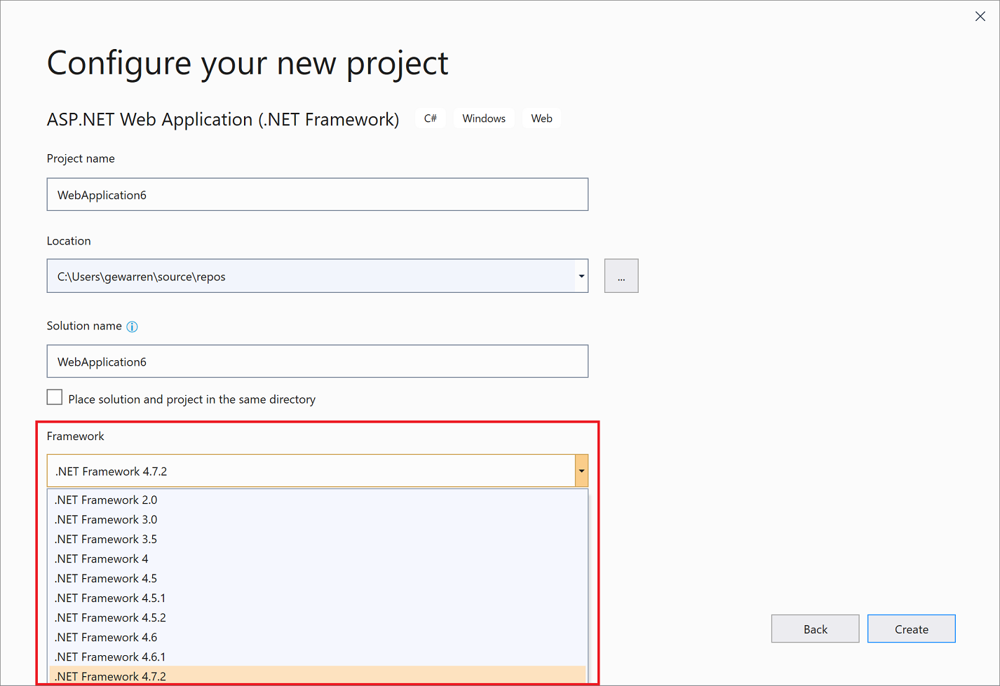

# Framework targeting overview

In Visual Studio, you can specify the version of .NET that you want your project to target. Framework targeting helps guarantee that the application uses only functionality that is available in the specified framework version. For .NET Framework apps to run on another computer, the framework version that the application targets must be compatible with the framework version that's installed on the computer.

A Visual Studio solution can contain projects that target different versions of .NET.  However, note that you can only build against a single version of .NET either using reference conditionals for a single build or build different binaries for each target framework.  For more information about target frameworks, see [Target frameworks](/dotnet/standard/frameworks).

> [!TIP]
> You can also target applications for different platforms. For more information, see [Multitargeting](../msbuild/msbuild-multitargeting-overview.md).

## Framework targeting features

Framework targeting includes the following features:

- When you open a project that targets an earlier framework version, Visual Studio can automatically upgrade the project or leave the target as-is.

- When you create a .NET Framework project, you can specify the version of the .NET Framework that you want to target.

- You can [target multiple frameworks](/dotnet/standard/frameworks#how-to-specify-target-frameworks) in a single project.

- You can target a different version of .NET in each of several projects in the same solution.

- You can change the version of .NET that an existing project targets.

   When you change the version of .NET that a project targets, Visual Studio makes any required changes to references and configuration files.

When you work on a project that targets an earlier framework version, Visual Studio dynamically changes the development environment, as follows:

- It filters items in the **Add New Item** dialog box, the **Add New Reference** dialog box, and the **Add Service Reference** dialog box to omit choices that aren't available in the targeted version.

- It filters custom controls in the **Toolbox** to remove those that aren't available in the targeted version and to show only the most up-to-date controls when multiple controls are available.

- It filters **IntelliSense** to omit language features that aren't available in the targeted version.

- It filters properties in the **Properties** window to omit those that aren't available in the targeted version.

- It filters menu options to omit options that aren't available in the targeted version.

- For builds, it uses the version of the compiler and the compiler options that are appropriate for the targeted version.

> [!NOTE]
> - Framework targeting does not guarantee that your application will run correctly. You must test your application to make sure it runs against the targeted version.
> - You cannot target framework versions below .NET Framework 2.0.

## Change the target framework

In an existing Visual Basic, C#, or F# project, you change the target .NET version in the project properties dialog box. For information about how to change the target version for C++ projects, see [How to modify the target framework and platform toolset](/cpp/build/how-to-modify-the-target-framework-and-platform-toolset) instead.

::: moniker range="<=vs-2019"

1. In **Solution Explorer**, open the right-click context menu for the project that you want to change, and then choose **Properties**.

1. In the left column of the **Properties** window, choose the **Application** tab.

   

   > [!NOTE]
   > After you create a UWP app, you can't change the targeted version of either Windows or .NET.

1. In the **Target Framework** list, choose the version that you want.

1. In the verification dialog box that appears, choose the **Yes** button.

   The project unloads. When it reloads, it targets the .NET version that you just chose.

::: moniker-end

::: moniker range=">=vs-2022"

1. In **Solution Explorer**, open the right-click context menu for the project that you want to change, and then choose **Properties**.

1. In the left column of the **Properties** window, choose the **Application** tab.

   > [!NOTE]
   > After you create a UWP app, you can't change the targeted version of either Windows or .NET.

1. In the **Target Framework** list, choose the version that you want.

    For a **.NET Framework project**, the dialog you see might look similar to the following screenshot:

   :::image type="content" source="media/vs-2022/project-properties-application-tab-framework.png" alt-text="Screenshot of the Project Properties dialog with .NET Framework options highlighted.":::

   For a **.NET project**, the dialog might look similar to the following screenshot:

   :::image type="content" source="media/vs-2022/visual-studio-multi-targeting-overview/project-properties-target-framework.png" alt-text="Screenshot of the General tab in the Project Properties dialog box, with the 'Target framework' selections showing.":::

1. If a verification dialog box appears, choose the **Yes** button.

   The project unloads. When it reloads, it targets the .NET version that you just chose.

### Target multiple frameworks

With .NET 5 and later, you can build a project for multiple frameworks in a single build by manually editing the project file. Open the project file and replace the `TargetFramework` property with `TargetFrameworks`, and specify your list of Target Framework Monikers (TFMs), separated by semicolons, as in the following code:

```xml
   <TargetFrameworks>net7.0;net8.0</TargetFrameworks>
```

See the list of TFMs at [Target frameworks in SDK-style projects](/dotnet/standard/frameworks).

You must reload the project after making this change. After that, if you open the **Properties** window, in the **Application** tab, you can edit the list of target frameworks.

:::image type="content" source="media/vs-2022/visual-studio-multi-targeting-overview/project-properties-target-frameworks.png" alt-text="Screenshot of the General tab in the Project Properties dialog box, with the 'Target frameworks' list showing.":::

::: moniker-end

> [!NOTE]
> If your code contains references to a different version of the .NET than the one that you targeted, error messages may appear when you compile or run the code. To resolve these errors, modify the references. See [Troubleshoot .NET targeting errors](/troubleshoot/developer/visualstudio/project-build/troubleshooting-dotnet-framework-targeting-errors).

> [!TIP]
> Depending on the target framework, it can be represented in the following ways in the project file:
>
> - For a .NET Core app: `<TargetFramework>netcoreapp2.1</TargetFramework>`
> - For a .NET Standard app: `<TargetFramework>netstandard2.0</TargetFramework>`
> - For a .NET Framework app: `<TargetFrameworkVersion>v4.7.2</TargetFrameworkVersion>`

## Select a target framework version

When you create a .NET Framework project, you can select the target .NET Framework version after you select a project template. The list of available frameworks includes the installed framework versions that are applicable to the selected template type. For non-.NET Framework project templates, for example .NET Core templates, the **Framework** drop-down list doesn't appear.

::: moniker range="vs-2019"



::: moniker-end

::: moniker range=">=vs-2022"

If you choose to **create a .NET Framework project**, you'll see an interface that's similar to the following screenshot:

:::image type="content" source="media/vs-2022/configure-new-project-framework.png" alt-text="Screenshot of the Framework drop-down list in Visual Studio 2022.":::

If you choose to **create a .NET project**, you'll see user interface (UI) that's similar to the following two screenshots.

The first screen you'll see is the **Configure your new project** dialog.

:::image type="content" source="media/vs-2022/configure-your-new-project.png" alt-text="Screenshot of the 'Configure your new project' dialog box in Visual Studio 2022.":::

The second screen you'll see is the **Additional options** dialog.

:::image type="content" source="media/vs-2022/visual-studio-multi-targeting-overview/configure-new-project-additional-info.png" alt-text="Screenshot of the 'Additional options' dialog box in Visual Studio 2022.":::

::: moniker-end

## Resolve system and user assembly references

To target a .NET version, you must first install the appropriate assembly references. You can download developer packs for different versions of .NET on the [.NET downloads](https://dotnet.microsoft.com/download) page.

For .NET Framework projects, the **Add Reference** dialog box disables system assemblies that don't pertain to the target .NET Framework version so that they can't be inadvertently added to a project. (System assemblies are *.dll* files that are included in a .NET Framework version.) References that belong to a framework version that's higher than the targeted version won't resolve, and controls that depend on such a reference can't be added. If you want to enable such a reference, reset the .NET Framework target of the project to one that includes the reference.

For more information about assembly references, see [Resolve assemblies at design time](../msbuild/resolving-assemblies-at-design-time.md).

## Enable LINQ

When you target the .NET Framework 3.5 or later, a reference to **System.Core** and a project-level import for <xref:System.Linq> (in Visual Basic only) are added automatically. If you want to use LINQ features, you must also turn `Option Infer` on (in Visual Basic only). The reference and import are removed automatically if you change the target to an earlier .NET Framework version. For more information, see [Work with LINQ](/dotnet/csharp/tutorials/working-with-linq).

## See also

- [Target frameworks](/dotnet/standard/frameworks)
- [Multi-targeting (MSBuild)](../msbuild/msbuild-multitargeting-overview.md)
- [How to: Modify the target framework and platform toolset (C++)](/cpp/build/how-to-modify-the-target-framework-and-platform-toolset)
