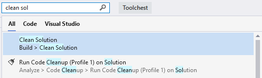
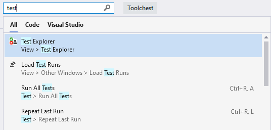
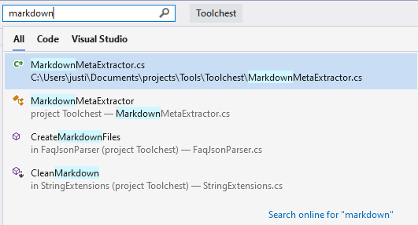
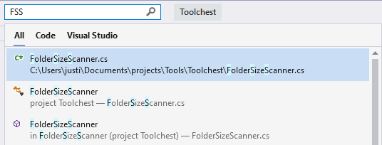

# Use Visual Studio Search

The Visual Studio integrated development environment (IDE) has many menus, options, and features, which can be difficult to remember. The Visual Studio Search feature is a single search box that helps developers find Visual Studio integrated development environment (IDE) settings, keyboard shortcuts, code files and components, and commands. Whether you're new to Visual Studio or an experienced developer, this feature offers a quick way to search across IDE features and your code.

> [!NOTE]
> The command executed by Visual Studio search is `Window.QuickLaunch` and you may see this feature referred to as quick search or quick launch.

Press **CTRL+Q** to access the search box or click the Visual Studio Search input box, located next to the menu bar by default:

Unlike other search features such as Find in Files or Search Solution Explorer, Visual Studio Search results include IDE features, menu options, file names, and more. The following sections discuss the different types of results that Visual Studio search can find.

## Search menus, options, and windows

You can use the Visual Studio search box to find settings, options, and similar configuration items. For example, search for **change theme** to quickly find and open the dialog that allows you to change the Visual Studio color theme as shown in the following screenshot:

> [!TIP]
> In most cases Visual Studio search will also remind you of the menu, shortcut keys, and location of each item in the results.

You can use the Visual Studio search box to find menu items and commands. For example, search for **clean sol** to quickly find and execute the Clean Solution command. The search results also offer a reminder of where to find this command in the menus as shown in the following screenshot:

Finally, you can search for windows or panels that you may have accidentally closed. For example, search for **test** to find and open the Test Explorer window:

## Search files and code

Visual Studio search also searches your solution items for filename, code, method, and other matches. In the following screenshot, a search for **markdown** has found the **MarkdownMetaExtractor.cs** file, the `MarkdownMetaExtractor` class, and two methods within the solution:

You can also do a "camel hump" search. In the following screenshot, a search for **FSS*** has found a **F**older**S**ize**S**canner file, class, and method:

## See also

- [Visual Studio commands](reference/visual-studio-commands.md)