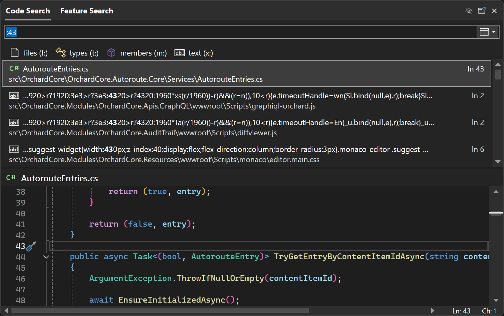
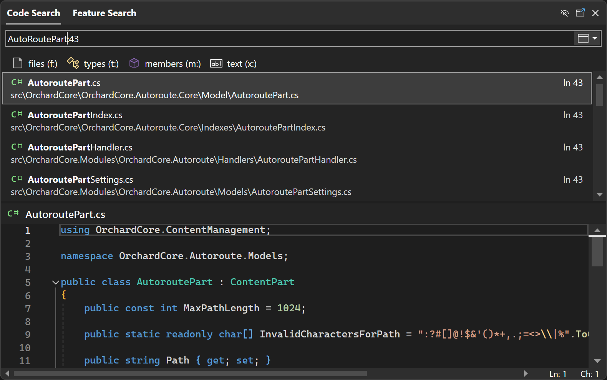
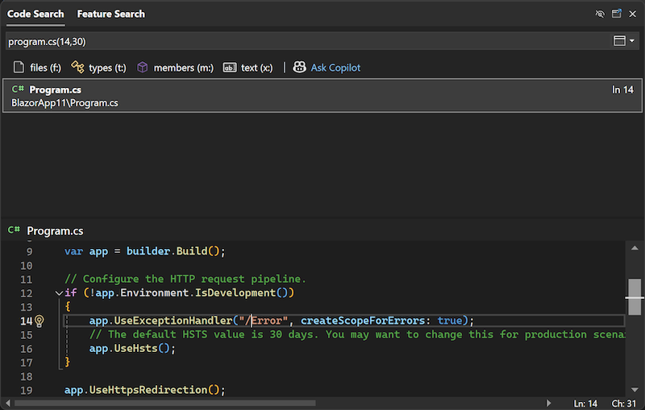
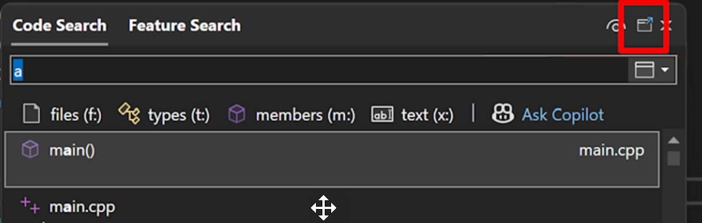
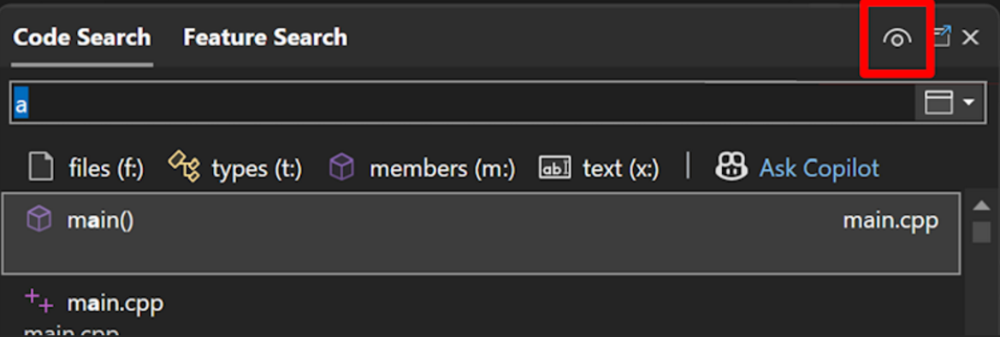

# Use Visual Studio search

The Visual Studio integrated development environment (IDE) has many menus, options, and features, which can be difficult to remember. The Visual Studio search feature is a single search box that helps developers find IDE menus and options, while also searching your code. Whether you're new to Visual Studio or an experienced developer, this feature offers a quick way to search across IDE features and your code.

::: moniker range=">=vs-2022"

## Search in Visual Studio 2022 version 17.6 or later

If you're using Visual Studio 2022 [version 17.6](/visualstudio/releases/2022/release-notes-v17.6) or later, the search experience is **All-In-One Search**. 

> [!TIP]
> To learn more about the new search experience, see both the [Better search in Visual Studio](https://devblogs.microsoft.com/visualstudio/new-better-search-in-visual-studio/) and [All-In-One Search available in 17.6](https://devblogs.microsoft.com/visualstudio/all-in-one-search-available-in-17-6/) blog posts.

### About the All-In-One Search experience

With **All-In-One Search**, not only can you search for features, but you can also search your code elements, such as files and symbols.

:::image type="content" source="media/vs-2022/all-in-one-search-member-filter.png" alt-text="Screenshot of the All-In-One Search experience in Visual Studio 2022 version 17.6 or later."::: 

The new search experience appears as an option next to the menu bar. 

:::image type="content" source="media/vs-2022/all-one-search-from-menu-bar.png" alt-text="Screenshot of the All-In-One Search experience from the Visual Studio menu bar.":::

In Visual Studio 17.13 and later, when you open Code Search without a query, you'll see a list of your recently navigated files. These include the files you opened through Code Search, but also any other files you opened in the solution. This makes it easy to jump back to a file you were recently working on without having to remember or type the file name.

:::image type="content" source="./media/vs-2022/code-search-recently-navigated-files.png" alt-text="Screenshot of All-In-One Search showing recently navigated files.":::

#### Keyboard shortcuts for search

You can use the **Ctrl**+**Q** keyboard shortcut for feature searches, and the **Ctrl**+**T** keyboard shortcut for code searches. 

#### Filters for Code Search queries

To quickly get a filtered experience, you can type the corresponding prefixes before your query or use the corresponding keyboard shortcuts to open the search with the filter you want.

|Filter   |Prefix   |Keyboard shortcut               |
|---------|---------|--------------------------------|
|files    |`f:`     | **Ctrl**+**Shift**+**T**       |     
|types    |`t:`     | **Ctrl**+**1**, **Ctrl**+**T** |
|members  |`m:`     | **Alt**+**\\**                 |
|text     |`x:`     | **Shift**+**Alt**+**F**        |

In Visual Studio 17.11 and later, you can set the scope of code search to the current document, current project, the entire solution, or external files that are referenced in your solution, such as header files or files open from locations outside your solution. You can set different scopes for different filters. For example, the default experience can be set to look through *Entire solution* and `members` can be set to look through only the current document. Your selections will be remembered the next time you use code search.

:::image type="content" alt-text="Screenshot of code search scope options." source="./media/vs-2022/search-code-scope.png" :::

The text filter (**Shift**+**Alt**+**F**) in Code Search is available in preview in Visual Studio 17.9 and later. See [17.9 Preview 3 brings exciting changes to Code Search](https://devblogs.microsoft.com/visualstudio/17-9-preview-3-brings-exciting-changes-to-code-search/). Search for a text string, with options to match the case, match whole words, or use a regular expression. The regular expression format is described at [Regular expressions](/dotnet/standard/base-types/regular-expression-language-quick-reference).

:::image type="content" alt-text="Screenshot of text search with various options." source="./media/vs-2022/search-text-search-text-options-highlighted.png" :::

#### Navigate to a specific line in Code Search

With Visual Studio 17.12 and later, you can now navigate to a specific line in the current document or other specified document.

To go to a line in the *current* document, type colon (`:`) followed by the line number. For example, `:39` navigates to line 39 in the active file.

You can also go to a line in a different document by typing the filename, colon, and then the line number. For example, `Order:43` navigates to line 43 in *Order.cs*. If you don't specify the exact file name, then the search will try to find the best match.

In Visual Studio 17.13 and later, you can also use parentheses to navigate to a specific line and column in a specified file. Use `file(line)` to navigate to a specific line in a specified file, or `file(line,col)` to navigate to a specific line and column in a specified file.

#### Dock as a tool window

With Visual Studio 17.12 or later, you can dock the search window instead of having it floating in front. This can be helpful to avoid interrupting your code editing. Use the icon near the top right of the window to enable docking as a tool window.

You can use a similar icon on the tool window to revert back to the floating window.

#### Toggle preview pane

With Visual Studio 17.12 or later, you can toggle the preview pane. Use the eye icon to disable or enable the preview pane.

Also new with Visual Studio 17.12, the preview panel's position automatically adjusts based on the dimensions of the search window.

::: moniker-end

## Search in Visual Studio 2022 version 17.5 or earlier

The following sections discuss the different types of search results you can find if you're using Visual Studio 2022 version 17.5 or earlier (to include Visual Studio 2019).

Unlike other search features such as [Find in Files](find-in-files.md) or Search Solution Explorer, the search results in Visual Studio include IDE features, menu options, file names, and more. To access it, use the **Ctrl**+**Q** keyboard shortcut to view the search box. Or, select the Visual Studio Search input box, which is located next to the menu bar:

:::image type="content" source="media/visual-studio-search-cropped.png" alt-text="Screenshot of the Visual Studio search box." lightbox="media/visual-studio-search.png":::

> [!NOTE]
> The command executed by Visual Studio search is `Window.QuickLaunch` and you might see this feature referred to as quick search or quick launch.

### Search menus, options, and windows

You can use the Visual Studio search box to find settings, options, and similar configuration items. For example, search for *change theme* to quickly find and open the dialog that allows you to change the Visual Studio color theme as shown in the following screenshot:

:::image type="content" source="media/visual-studio-search-options.png" alt-text="Search Visual Studio settings and options.":::

> [!TIP]
> In most cases Visual Studio search will also remind you of the menu, shortcut keys, and location of each item in the results.

You can use the Visual Studio search box to find menu items and commands. For example, search for *clean sol* to quickly find and execute the Clean Solution command. The search results also offer a reminder of where to find this command in the menus as shown in the following screenshot:

:::image type="content" source="media/visual-studio-search-menu.png" alt-text="Screenshot of an example of a search for Visual Studio menu items and commands.":::

Finally, you can search for windows or panels that you might have accidentally closed. For example, search for *test* to find and open the Test Explorer window:

:::image type="content" source="media/visual-studio-search-window.png" alt-text="Screenshot that shows an example of a search for Visual Studio windows and panels.":::

### Search files and code

Visual Studio search also searches your solution items for filename, code, method, and other matches. In the following screenshot, a search for *markdown* has found the MarkdownMetaExtractor.cs file, the `MarkdownMetaExtractor` class, and two methods within the solution:

:::image type="content" source="media/visual-studio-search-files.png" alt-text="Screenshot that shows an example of a search for a file by using Visual Studio search.":::

You can also do a "camel case" search. In the following screenshot, a search for *FSS* has found a **F**older**S**ize**S**canner file, class, and method:

:::image type="content" source="media/visual-studio-search-camel.png" alt-text="Screenshot of an example of a search that uses medial capitals in a text string in Visual Studio search.":::

### Keyboard shortcuts for search results

The search results include tabs for **All**, **Code**, **Visual Studio**. You can save time by using the following keyboard shortcuts for different types of searches:

- **Ctrl**+**Q**, **Ctrl**+**T** for files, types, and members
- **Ctrl**+**Q**, **Ctrl**+**M** for Visual Studio menus, options, components, and templates
- **Ctrl**+**Q**, **Ctrl**+**E** to go to the **All** tab, for both

## Related content

- [Visual Studio commands](reference/visual-studio-commands.md)
- [Keyboard shortcuts in Visual Studio](default-keyboard-shortcuts-in-visual-studio.md)
