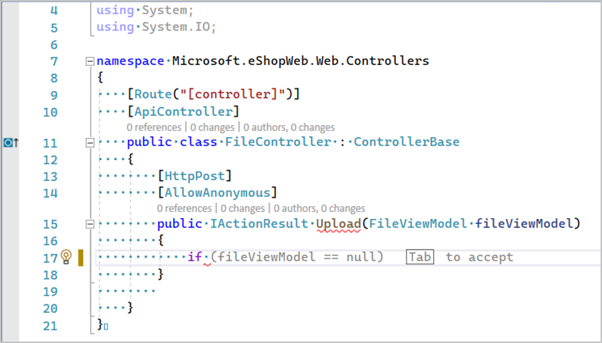
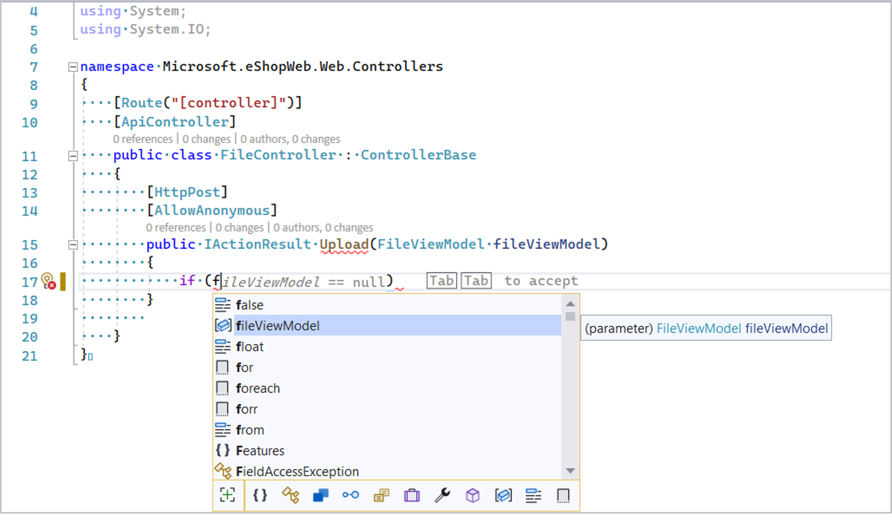
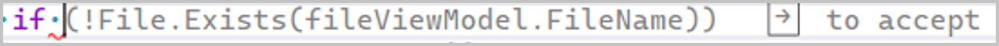
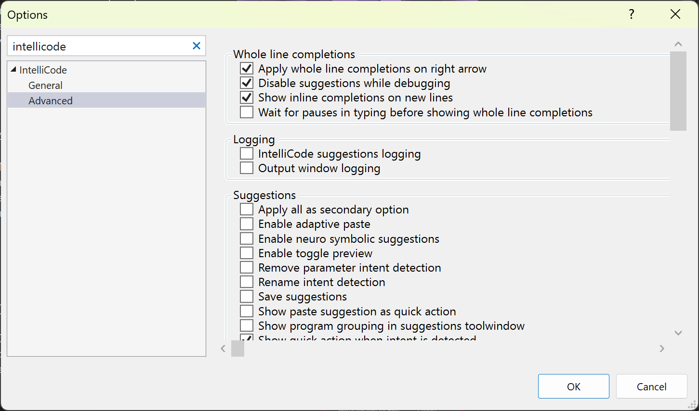
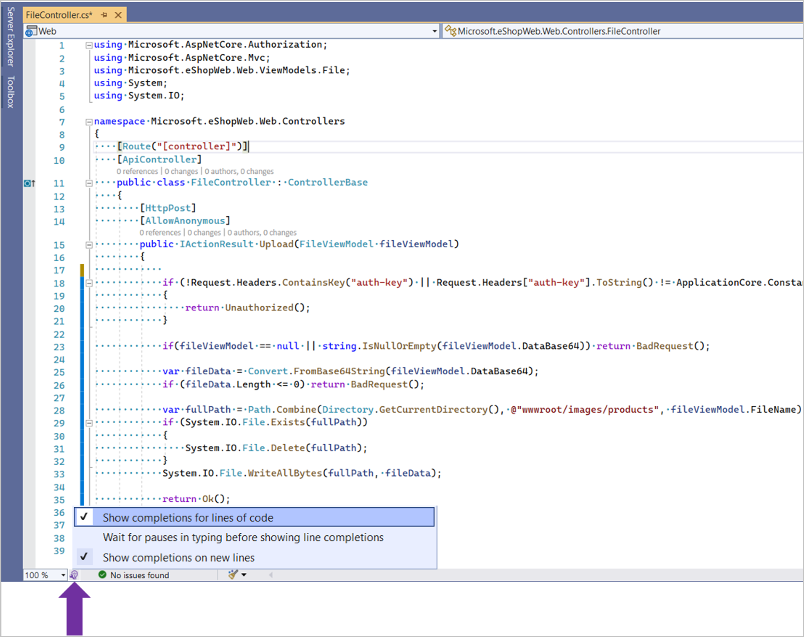
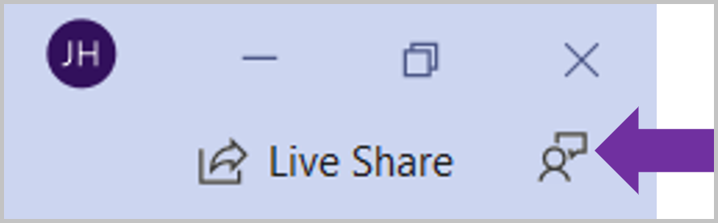

# Intellicode whole-line autocompletions

IntelliCode whole-line autocompletions predict the next chunk of your code based on your current code so far, and presents it as a gray text inline prediction. Think gray text autocompletion that you see when typing emails but for code.

This feature supports C# in Visual Studio 2022 and later.

To turn text predictions off, disable the IntelliCode extension. Select **Extensions** > **Manage Extensions** from the menu, find and select the IntelliCode extension, and then click **Disable**.

:::moniker range=">=vs-2022"

For the most advanced code completion functionality, try [GitHub Copilot completions](visual-studio-github-copilot-extension.md).

:::moniker-end

## How it works

IntelliCode uses a large scale transformer model, trained on around half a million public, open-source repos from GitHub. This model makes predictions on what you type next based on a rich knowledge of what you have coded so far, including:
- Variable names and positions
- Libraries you're using
- Functions in nearby code
- The IntelliSense list

The model runs on your local machine, which allows the feature to be available in offline and air-gapped environments. The feature supports C#.  

## Two modes

IntelliCode provides completions in two ways - one, when the user is typing and two, when the user has an item selected in the IntelliSense list. 

### Mode 1: Whole-line autocompletions when typing

When the user is typing, we show whole-line autocompletions, which you can accept by "Tab to accept." To dismiss the prediction, you can use the `Esc` or `Delete` keys.

### Mode 2: Whole-line autocompletions when IntelliSense item is selected

When the user has an item from the IntelliSense list selected, IntelliCode uses what the user has typed + what the user has selected as the context for providing predictions. In this case, you see "Tab Tab to accept" prediction. The first Tab accepts the selected item from the IntelliSense list and the second Tab accepts the whole-line completion. To dismiss the prediction, you can use the `Esc` or `Delete` keys. 

### Accept or dismiss whole-line autocompletions

By default, the `Tab` key is used to accept whole-line autocompletions. To change the default accept key to the right arrow, go to **Tools** > **Options** > **IntelliCode** -> **Advanced**.

:::moniker range="<=vs-2019"
Enable the setting named `Apply completions for whole lines on right arrow`.

:::moniker-end

:::moniker range=">=vs-2022"
Enable the setting `Apply whole line completions on right arrow`.

:::moniker-end

To dismiss whole-line autocompletions, the `ESC` or `Delete` keys can be used. 

## Privacy 

[See Privacy](intellicode-privacy.md#intellicode-whole-line-completions)

## Control whole-line autocompletions

You can control the whole-line autocompletions feature using the small purple light bulb shown at the bottom right of the editor, next to the zoom control. 

:::moniker range="<=vs-2019"

The first setting, `Show completions for lines of code` allows you to turn whole-line autocompletions on or off. 

The second setting, `Wait for pauses in typing before showing line completions`, when enabled, makes whole-line autocompletions only show up if the user has paused typing. You might prefer this option if you find the whole-line autocompletions distracting in the default mode.

The third setting, `Show completions on new lines` can be turned on or off depending on whether you want to see whole-line autocompletions when you enter a new line, that is, by pressing `Return` or `Enter`. 

:::moniker-end
:::moniker range=">=vs-2022"

In **Tools**, **Options**, **IntelliCode**, **General**, the setting `Show inline completions` allows you to turn whole-line autocompletions on or off.

The **Advanced** tab has further options.

The first setting, `Apply whole line completions on right arrow` was discussed previously in this article.

The second setting, `Disable suggestions while debugging` allows you to minimize distractions when debugging.

The third setting, `Show inline completions on new lines` can be turned on or off depending on whether you want to see whole-line autocompletions when you enter a new line, that is, by pressing `Return` or `Enter`. 

The last setting, `Wait for pauses in typing before showing line completions`, when enabled, makes whole-line autocompletions only show up if you pause typing. You might prefer this option if you find the whole-line autocompletions distracting in the default mode.

:::moniker-end

## Provide feedback

Click on the Feedback icon on the top right of Visual Studio to file a feedback ticket. Optionally, you can upload your IntelliCode log files to the feedback ticket in order to provide us with additional context. Make sure you review the contents of the log files and address any privacy concerns you may have. This data, when shared with us, will not be used for any purpose other than providing support assistance to you. You can find the logs at `%LOCALAPPDATA%\Temp\VSFeedbackIntelliCodeLogs`

## Next steps

[See Privacy](intellicode-privacy.md#intellicode-whole-line-completions)
