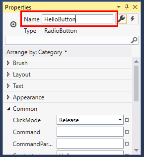

# Walkthrough: Create a Simple Application with Visual C# or Visual Basic
By completing this walkthrough, you'll become familiar with many of the tools, dialog boxes, and designers that you can use when you develop applications with Visual Studio. You'll create a simple "Hello, World" application, design the UI, add code, and debug errors, while you learn about working in the integrated development environment (IDE).
  
##  <a name="BKMK_ConfigureIDE"></a> Configure the IDE  
When you start Visual Studio for the first time, you'll be prompted to sign in. This step is optional for this walkthrough. Next you may be shown a dialog box that asks you to choose your development settings and color theme. Keep the defaults and choose **Start Visual Studio**.  


  
After Visual Studio launches, you'll see tool windows, the menus and toolbars, and the main window space. Tool windows are docked on the left and right sides of the application window, with **Quick Launch**, the menu bar, and the standard toolbar at the top. In the center of the application window is the **Start Page**. When you load a solution or project, editors and designers appear in the space where the **Start Page** is. When you develop an application, you'll spend most of your time in this central area.  
  
  
  
##  <a name="BKMK_CreateApp"></a> Create a simple application  
  
### Create the project  
When you create an application in Visual Studio, you first create a project and a solution. For this example, you'll create a Windows Presentation Foundation (WPF) project.  
  
#### To create the WPF project  
  
1.  Create a new project. On the menu bar, choose **File**, **New**, **Project...**.  
  
       
  
2.  Choose the Visual Basic or the Visual C# WPF App template by choosing in the left pane **Installed**, **Visual C#**, **Windows Classic Desktop**, for example, and then choosing **WPF App (.NET Framework)** in the middle pane.  Name the project HelloWPFApp at the bottom of the New Project dialog.  
  
       
  
Visual Studio creates the HelloWPFApp project and solution, and **Solution Explorer** shows the various files. The WPF Designer shows a design view and a XAML view of MainWindow.xaml in a split view. You can slide the splitter to show more or less of either view.  You can choose to see only the visual view or only the XAML view. (For more information, see [WPF Designer for Windows Forms Developers](http://msdn.microsoft.com/47ad0909-e89b-4996-b4ac-874d929f94ca).) The following items appear in **Solution Explorer**:  
  
  
  
After you create the project, you can customize it. By using the **Properties** window (found on the **View** menu), you can display and change options for project items, controls, and other items in an application.  
  
#### To change the name of MainWindow.xaml  
Let's give MainWindow a more specific name.  

1. In **Solution Explorer**, select MainWindow.xaml. You should see the **Properties** window, but if you don't, choose the **View** menu and then the **Properties Window** item.  
2. Change the **File Name** property to `Greetings.xaml`.  
  
       
  
     **Solution Explorer** shows that the name of the file is now Greetings.xaml, and the nested code file is now named Greetings.xaml.vb or Greetings.xaml.cs. This code file is nested under the .xaml file node to show they are closely related to each other.  
  
### Design the user interface (UI)  
We will add three types of controls to this application: a TextBlock control, two RadioButton controls, and a Button control.  
  
#### To add a TextBlock control  
  
1.  Open the **Toolbox** window by choosing the **View** menu and the **Toolbox** item.  
  
2.  In the **Toolbox**, expand the **Common WPF Controls** node to see the TextBlock control.  
  
       
  
3.  Add a TextBlock control to the design surface by choosing the **TextBlock** item and dragging it to the window on the design surface. Center the control near the top of the window.  
  
Your window should resemble the following illustration:  
  
  
  
The XAML markup should look something like the following:  
  
```xaml  
<TextBlock HorizontalAlignment="Center" TextWrapping="Wrap" VerticalAlignment="Center" RenderTransformOrigin="4.08,2.312" Margin="237,57,221,238"><Run Text="TextBlock"/><InlineUIContainer><TextBlock TextWrapping="Wrap" Text="TextBlock"/>  
```  

#### To customize the text in the text block  
  
1.  In the XAML view, locate the markup for TextBlock and change the Text attribute:  

   ```xaml
   Text="Select a message option and then choose the Display button."
   ```  
  
2.  Re-center the TextBlock if necessary, and save your changes by pressing **Ctrl-s** or using the **File** menu item.  
  
Next, you'll add two [RadioButton](/dotnet/framework/wpf/controls/radiobutton) controls to the form.  
  
#### To add radio buttons  
  
1.  In the **Toolbox**, find the **RadioButton** control.  
  
       
  
2.  Add two RadioButton controls to the design surface by choosing the **RadioButton** item and dragging it to the window on the design surface. Move the buttons (by selecting them and using the arrow keys) so that the buttons appear side by side under the TextBlock control.  
  
     Your window should look like this:  
  
       
  
3.  In the **Properties** window for the left RadioButton control, change the **Name** property (the property at the top of the **Properties** window) to **HelloButton**.  

       
  
4.  In the **Properties** window for the right RadioButton control, change the **Name** property to **GoodbyeButton**, and then save your changes.  
  
You can now add display text for each RadioButton control. The following procedure updates the **Content** property for a RadioButton control.  
  
#### To add display text for each radio button  
  
1.  On the design surface, open the shortcut menu for HelloButton by pressing the right mouse button on HelloButton, choose **Edit Text**, and then enter 'Hello'.  
  
2.  Open the shortcut menu for GoodbyeButton by pressing the right mouse button on GoodbyeButton, choose **Edit Text**, and then enter 'Goodbye'.  

### To set a radio button to be checked by default  
In this step we'll set HelloButton to be checked by default so that one of the two radio buttons is always selected.  

In the XAML view, locate the markup for HelloButton and add an **IsChecked** attribute:

```xaml
IsChecked="True"
```  

The final UI element that you'll add is a [Button](/dotnet/framework/wpf/controls/button) control.  
  
#### To add the button control  
  
1.  In the **Toolbox**, find the **Button** control, and then add it to the design surface under the RadioButton controls by dragging it to the form in the design view.  
  
2.  In the XAML view, change the value of **Content** for the Button control from `Content="Button"` to `Content="Display"`, and then save the changes.  
  
     The markup should resemble the following example:  
     `<Button Content="Display" HorizontalAlignment="Left" VerticalAlignment="Top" Width="75" Margin="215,204,0,0"/>`  
  
     Your window should resemble the following illustration.  
  
       
  
### Add code to the Display Button  
When this application runs, a message box appears after a user chooses a radio button and then chooses the **Display** button. One message box will appear for Hello, and another will appear for Goodbye. To create this behavior, you'll add code to the Button_Click event in Greetings.xaml.vb or Greetings.xaml.cs.  
  
#### Add code to display message boxes    
1.  On the design surface, double-click the **Display** button.  
  
     Greetings.xaml.vb or Greetings.xaml.cs opens, with the cursor in the Button_Click event. 
  
    ```vb  
    Private Sub Button_Click_1(sender As Object, e As RoutedEventArgs)  
  
    End Sub  
    ```    
    ```csharp  
    private void Button_Click_1(object sender, RoutedEventArgs e)  
    {  
  
    }  
    ```  
  
2.  Enter the following code:  
  
    ```vb  
    If HelloButton.IsChecked = True Then  
        MessageBox.Show("Hello.")  
    ElseIf GoodbyeButton.IsChecked = True Then 
        MessageBox.Show("Goodbye.")  
    End If  
  
    ```    
    ```csharp  
    if (HelloButton.IsChecked == true)
    {
         MessageBox.Show("Hello.");
    }
    else if (GoodbyeButton.IsChecked == true)
    {
        MessageBox.Show("Goodbye.");
    }
    ```  
  
3.  Save the application.  
  
##  <a name="BKMK_DebugTest"></a> Debug and test the application  
Next, you'll debug the application to look for errors and test that both message boxes appear correctly. The following instructions tell you how to build and launch the debugger, but later you might read [Building a WPF Application (WPF)](/dotnet/framework/wpf/app-development/building-a-wpf-application-wpf) and [Debugging WPF](../debugger/debugging-wpf.md) for more information.  
  
### Find and fix errors  
In this step, you'll find the error that we caused earlier by changing the name of the MainWindow.xaml file.  
  
#### To start debugging and find the error  
  
1.  Start the debugger by selecting **Debug**, then **Start Debugging**.  
  
       
  
     A **Break Mode** window appears, and the **Output** window indicates that an IOException has occurred: Cannot locate resource 'mainwindow.xaml'.  
  
2.  Stop the debugger by choosing **Debug**, **Stop Debugging**.  
  
       
  
We renamed MainWindow.xaml to Greetings.xaml at the start of this walkthrough, but the code still refers to mainwindow.xaml as the startup URI for the application, so the project can't start.  
  
#### To specify Greetings.xaml as the startup URI  
  
1.  In **Solution Explorer**, open the App.xaml file (in the C# project) or the Application.xaml file (in the Visual Basic project).  
  
2.  Change `StartupUri="MainWindow.xaml"` to `StartupUri="Greetings.xaml"`, and then save the changes.  
  
Start the debugger again (press **F5**). You should see the Greetings window of the application. Now close the application window to stop debugging.  
  
### To debug with breakpoints  
You can test the code during debugging by adding some breakpoints. You can add breakpoints by choosing **Debug**, **Toggle Breakpoint**, by clicking in the left margin of the editor next to the line of code where you want the break to occur, or by pressing **F9**.  
  
#### To add breakpoints  
  
1.  Open Greetings.xaml.vb or Greetings.xaml.cs, and select the following line: `MessageBox.Show("Hello.")`  
  
2.  Add a breakpoint from the menu by selecting **Debug**, then **Toggle Breakpoint**.  
  
       
  
     A red circle appears next to the line of code in the far left margin of the editor window.  
  
3.  Select the following line: `MessageBox.Show("Goodbye.")`.  
  
4.  Press the **F9** key to add a breakpoint, and then press **F5** to start debugging.  
  
5.  In the **Greetings** window, choose the **Hello** radio button, and then choose the **Display** button.  
  
     The line `MessageBox.Show("Hello.")` is highlighted in yellow. At the bottom of the IDE, the Autos, Locals, and Watch windows are docked together on the left side, and the Call Stack, Breakpoints, Command, Immediate, and Output windows are docked together on the right side.  
  
6.  On the menu bar, choose **Debug**, **Step Out**.  
  
     The application resumes execution, and a message box with the word "Hello" appears.  
  
7.  Choose the **OK** button on the message box to close it.  
  
8.  In the **Greetings** window, choose the **Goodbye** radio button, and then choose the **Display** button.  
  
     The line `MessageBox.Show("Goodbye.")` is highlighted in yellow.  
  
9. Choose the **F5** key to continue debugging. When the message box appears, choose the **OK** button on the message box to close it.  
  
10. Close the application window to stop debugging.  
  
11. On the menu bar, choose **Debug**, **Disable All Breakpoints**.  
  
### Build a release version of the application  
 Now that you've verified that everything works, you can prepare a release build of the application.  
  
#### To clean the solution files and build a release version  
  
1.  On the main menu, select **Build**, **Clean solution** to delete intermediate files and output files that were created during previous builds. This is not necessary, but it cleans up the debug build outputs.  
  
       
  
2.  Change the build configuration for HelloWPFApp from **Debug** to **Release** by using the dropdown control on the toolbar (it says "Debug" currently).  
  
       
  
3.  Build the solution by choosing **Build**, then **Build Solution**.  
  
       
  
Congratulations on completing this walkthrough! You can find the .exe you built under your solution and project directory (...\HelloWPFApp\HelloWPFApp\bin\Release\\). If you want to explore more examples, see [Visual Studio Samples](../ide/visual-studio-samples.md).  
  
## See also
[What's New in Visual Studio 2017](../ide/whats-new-in-visual-studio.md)   
[Get Started Developing with Visual Studio](../ide/get-started-developing-with-visual-studio.md)   
[Productivity Tips](../ide/productivity-tips-for-visual-studio.md)