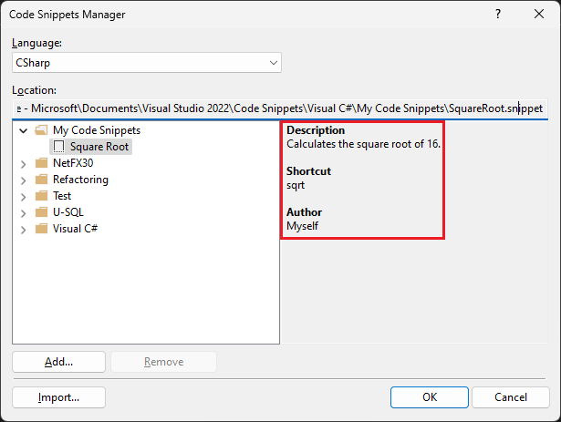

# Walkthrough: Create a code snippet

You can create a code snippet with only a few steps. All you need to do is create an XML file, fill in the appropriate elements, and add your code to it. You can optionally make use of replacement parameters and project references. Import the snippet to your Visual Studio installation by using the **Import** button in the **Code Snippets Manager** (**Tools** > **Code Snippets Manager**).

## Snippet template

The following XML is the basic snippet template:

```xml
<?xml version="1.0" encoding="utf-8"?>
<CodeSnippets xmlns="http://schemas.microsoft.com/VisualStudio/2005/CodeSnippet">
    <CodeSnippet Format="1.0.0">
        <Header>
            <Title></Title>
        </Header>
        <Snippet>
            <Code Language="">
                <![CDATA[]]>
            </Code>
        </Snippet>
    </CodeSnippet>
</CodeSnippets>
```

## Create a code snippet

1. Create a new XML file in Visual Studio and add the template shown above.

2. Fill in the title of the snippet in the **Title** element. Use the title **Square Root**.

3. Fill in the language of the snippet in the **Language** attribute of the **Code** element. For C#, use **CSharp**, and for Visual Basic, use **VB**.

   > [!TIP]
   > To see all the available language values, browse the [Code element attributes section](code-snippets-schema-reference.md#attributes) on the [Code snippets schema reference](code-snippets-schema-reference.md) page.

4. Add the snippet code in the **CDATA** section inside the **Code** element.

   For C#:

   ```xml
   <Code Language="CSharp">
       <![CDATA[double root = Math.Sqrt(16);]]>
   </Code>
   ```

   Or for Visual Basic:

   ```xml
   <Code Language="VB">
       <![CDATA[Dim root = Math.Sqrt(16)]]>
   </Code>
   ```

   > [!NOTE]
   > You can't specify how lines of code in the **CDATA** section of a code snippet should be indented or formatted. Upon insertion, the language service formats the inserted code automatically.

5. Save the snippet as *SquareRoot.snippet* (you can save it anywhere).

## Import a code snippet

1. You can import a snippet to your Visual Studio installation by using the **Code Snippets Manager**. Open it by choosing **Tools** > **Code Snippets Manager**.

2. Click the **Import** button.

3. Go to the location where you saved the code snippet in the previous procedure, select it, and click **Open**.

4. The **Import Code Snippet** dialog opens, asking you to choose where to add the snippet from the choices in the right pane. One of the choices should be **My Code Snippets**. Select it and click **Finish**, then **OK**.

5. The snippet is copied to one of the following locations, depending on the code language:

   ::: moniker range="vs-2017"

   *%USERPROFILE%\Documents\Visual Studio 2017\Code Snippets\Visual C#\My Code Snippets*
   *%USERPROFILE%\Documents\Visual Studio 2017\Code Snippets\Visual Basic\My Code Snippets*

   ::: moniker-end

   ::: moniker range=">=vs-2019"

   *%USERPROFILE%\Documents\Visual Studio 2019\Code Snippets\Visual C#\My Code Snippets*
   *%USERPROFILE%\Documents\Visual Studio 2019\Code Snippets\Visual Basic\My Code Snippets*

   ::: moniker-end

6. Test your snippet by opening a C# or Visual Basic project. With a code file open in the editor, choose **Snippets** > **Insert Snippet** from the right-click menu, then **My Code Snippets**. You should see a snippet named **Square Root**. Double-click it.

   The snippet code is inserted in the code file.

## Description and shortcut fields

::: moniker range="vs-2017"

1. Description fields give more information about your code snippet when viewed in the Code Snippets Manager. The shortcut is a tag that users can type in order to insert your snippet. Edit the snippet you have added by opening the file *%USERPROFILE%\Documents\Visual Studio 2017\Code Snippets\\[Visual C# or Visual Basic]\My Code Snippet\SquareRoot.snippet*.

::: moniker-end

::: moniker range=">=vs-2019"

1. Description fields give more information about your code snippet when viewed in the Code Snippets Manager. The shortcut is a tag that users can type in order to insert your snippet. Edit the snippet you have added by opening the file *%USERPROFILE%\Documents\Visual Studio 2019\Code Snippets\\[Visual C# or Visual Basic]\My Code Snippet\SquareRoot.snippet*.

::: moniker-end

   > [!TIP]
   > Since you're editing the file in the directory where Visual Studio placed it, you don't need to reimport it to Visual Studio.

2. Add **Author** and **Description** elements to the **Header** element, and fill them in.

3. The **Header** element should look something like this:

   ```xml
   <Header>
       <Title>Square Root</Title>
       <Author>Myself</Author>
       <Description>Calculates the square root of 16.</Description>
   </Header>
   ```

4. Open the **Code Snippets Manager** and select your code snippet. In the right pane, notice that the **Description** and **Author** fields are now populated.

   

5. To add a shortcut, add a **Shortcut** element within the **Header** element:

   ```xml
   <Header>
      <Title>Square Root</Title>
      <Author>Myself</Author>
      <Description>Calculates the square root of 16.</Description>
      <Shortcut>sqrt</Shortcut>
    </Header>
   ```

6. Save the snippet file again.

7. To test the shortcut, open the project you used previously, type **sqrt** in the editor and press **Tab** (once for Visual Basic, twice for C#).

   The snippet code is inserted.

## Replacement parameters

You may want parts of a code snippet to be replaced by the user. For example, you might want the user to replace a variable name with one in their current project. You can provide two types of replacements: literals and objects. Use the [Literal element](code-snippets-schema-reference.md#literal-element) to identify a replacement for a piece of code that is entirely contained within the snippet but will likely be customized after it's inserted into the code (for example, a string or numeric value). Use the [Object element](code-snippets-schema-reference.md#object-element) to identify an item that's required by the code snippet but is likely to be defined outside of the snippet itself (for example, an object instance or a control).

1. To enable the user to easily replace the number to calculate the square root of, modify the **Snippet** element of the *SquareRoot.snippet* file as follows:

   ```xml
   <Snippet>
     <Code Language="CSharp">
       <![CDATA[double root = Math.Sqrt($Number$);]]>
     </Code>
     <Declarations>
       <Literal>
         <ID>Number</ID>
         <ToolTip>Choose the number you want the square root of.</ToolTip>
         <Default>16</Default>
       </Literal>
     </Declarations>
   </Snippet>
   ```

   Notice that the literal replacement is given an ID (`Number`). That ID is referenced from within the code snippet by surrounding it with `$` characters:

   ```xml
   <![CDATA[double root = Math.Sqrt($Number$);]]>
   ```

2. Save the snippet file.

3. Open a project and insert the snippet.

   The code snippet is inserted and the editable literal is highlighted for replacement. Hover over the replacement parameter to see the tooltip for the value.

   

   > [!TIP]
   > If there's more than one replacable parameter in a snippet, you can press **Tab** to navigate from one to the other to change the values.

## Import a namespace

You can use a code snippet to add a `using` directive (C#) or `Imports` statement (Visual Basic) by including the [Imports element](code-snippets-schema-reference.md#imports-element). For .NET Framework projects, you can also add a reference to the project by using the [References element](code-snippets-schema-reference.md#references-element).

The following XML shows a code snippet that uses the method `File.Exists` in the System.IO namespace and, therefore, defines the **Imports** element to import the System.IO namespace.

```xml
<?xml version="1.0" encoding="utf-8"?>
<CodeSnippets xmlns="http://schemas.microsoft.com/VisualStudio/2005/CodeSnippet">
  <CodeSnippet Format="1.0.0">
    <Header>
      <Title>File Exists</Title>
      <Shortcut>exists</Shortcut>
    </Header>
    <Snippet>
      <Code Language="CSharp">
        <![CDATA[var exists = File.Exists("C:\\Temp\\Notes.txt");]]>
      </Code>
      <Imports>
        <Import>
          <Namespace>System.IO</Namespace>
        </Import>
      </Imports>
    </Snippet>
  </CodeSnippet>
</CodeSnippets>
```

## See also

- [Code snippets schema reference](../ide/code-snippets-schema-reference.md)
