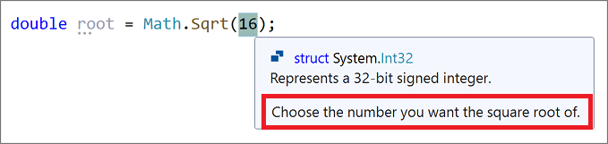

# Walkthrough: Create a code snippet in Visual Studio

You can increase productivity and reliability by using code snippets to reduce the time spent typing repetitive code or searching for samples. Code snippets are preauthored pieces of code that are ready to insert into your application.

You can create your own code snippets and add them to the code snippets that Visual Studio already includes. This article walks through how to create a code snippet in just a few steps. You create an XML file, fill in the appropriate elements, and add your code to the file. You can optionally use replacement parameters and project references. Then, you import the snippet to your Visual Studio installation.

## Create a code snippet

1. Open Visual Studio, and select **Continue without code** on the **Start** screen.

   :::image type="content" source="reference/media/start-visual-studio-continue-without-code.png" alt-text="Screenshot of the Start window with the Continue without code option selected.":::

1. From the menu bar, select **File** > **New File**, or enter **Ctrl**+**N**.

1. In the **New File** dialog box, select **XML File**, and then select **Open**.

    :::image type="content" source="reference/media/open-new-xml-file.png" alt-text="Screenshot of the New File dialog box with the XML File option selected.":::

1. Paste the following basic snippet template into the code editor.

   ```xml
   <?xml version="1.0" encoding="utf-8"?>
   <CodeSnippets xmlns="http://schemas.microsoft.com/VisualStudio/2005/CodeSnippet">
       <CodeSnippet Format="1.0.0">
           <Header>
               <Title></Title>
           </Header>
           <Snippet>
               <Code Language="">
                   <![CDATA[]]>
               </Code>
           </Snippet>
       </CodeSnippet>
   </CodeSnippets>
   ```

1. Enter the title *Square Root* into the snippet `Title` element.

1. In the `Language` attribute of the `Code` element, fill in *CSharp* for a C# snippet or *VB* for Visual Basic.

   > [!TIP]
   > To see all the available language values, see [Attributes](code-snippets-schema-reference.md#attributes) in the [Code snippets schema reference](code-snippets-schema-reference.md).

1. Add the following snippet code to the `CDATA` section inside the `Code` element.

   For C#:

   ```xml
       <![CDATA[double root = Math.Sqrt(16);]]>
   ```

   For Visual Basic:

   ```xml
       <![CDATA[Dim root = Math.Sqrt(16)]]>
   ```

   > [!NOTE]
   > You can't specify how to format or indent lines of code in the `CDATA` section of a code snippet. Upon insertion, the language service formats the inserted code automatically.

1. Save the snippet anywhere as *SquareRoot.snippet*.

## Import the code snippet

1. To import the snippet to your Visual Studio installation, select **Tools** > **Code Snippets Manager** or press **Ctrl**+**K**, **B**.

1. In the **Code Snippets Manager**, select the **Import** button.

1. Navigate to the location of your code snippet, select it, and select **Open**.

1. In the **Import Code Snippet** dialog box, select the **My Code Snippets** folder in the right pane. Select **Finish**, and then select **OK**.

   The snippet is copied to one of the following locations, depending on the code language:

   ::: moniker range=">= vs-2022"
   - *%USERPROFILE%\Documents\Visual Studio 2022\Code Snippets\Visual C#\My Code Snippets*
   - *%USERPROFILE%\Documents\Visual Studio 2022\Code Snippets\Visual Basic\My Code Snippets*
   ::: moniker-end

   ::: moniker range="<= vs-2019"
   - *%USERPROFILE%\Documents\Visual Studio 2019\Code Snippets\Visual C#\My Code Snippets*
   - *%USERPROFILE%\Documents\Visual Studio 2019\Code Snippets\Visual Basic\My Code Snippets*
   ::: moniker-end

1. Test your snippet by opening a C# or Visual Basic project. With a code file open in the editor, take one of the following actions:

   - On the Visual Studio menu bar, choose **Edit** > **IntelliSense** > **Insert Snippet**.
   - Right-click, and choose **Snippet** > **Insert Snippet** from the context menu.
   - From the keyboard, press **Ctrl**+**K**, **X**.

1. Open **My Code Snippets**, and double-click the snippet named **Square Root**. The snippet code is inserted in the code file.

## Description and shortcut fields

The description field provides more information about your code snippet when viewed in the **Code Snippets Manager**. The shortcut is a tag you can type to insert your snippet.

1. To edit your snippet, open the snippet file from one of the following locations, depending on the code language:

   ::: moniker range=">= vs-2022"
   - *%USERPROFILE%\Documents\Visual Studio 2022\Code Snippets\Visual C#\My Code Snippets/SquareRoot.snippet*
   - *%USERPROFILE%\Documents\Visual Studio 2022\Code Snippets\Visual Basic\My Code Snippets/SquareRoot.snippet*
   ::: moniker-end

   ::: moniker range="<= vs-2019"
   - *%USERPROFILE%\Documents\Visual Studio 2019\Code Snippets\Visual C#\My Code Snippets/SquareRoot.snippet*
   - *%USERPROFILE%\Documents\Visual Studio 2019\Code Snippets\Visual Basic\My Code Snippets/SquareRoot.snippet*
   ::: moniker-end

   > [!TIP]
   > Because you're editing the file in the directory where Visual Studio placed it, you don't need to reimport it to Visual Studio.

1. Add `Author`, `Description`, and `Shortcut` elements to the `Header` element, and fill them in.

1. Confirm that the `Header` element looks similar to the following example, and save the file.

   ```xml
   <Header>
       <Title>Square Root</Title>
       <Author>Myself</Author>
       <Description>Calculates the square root of 16.</Description>
       <Shortcut>sqrt</Shortcut>
   </Header>
   ```

1. Open the Visual Studio **Code Snippets Manager** and select your code snippet. In the right pane, notice that the **Description**, **Author**, and **Shortcut** fields are now populated.

   :::image type="content" source="media/code-snippet-description-author.png" alt-text="Screenshot showing a code snippet description in Code Snippet Manager.":::

1. To test the shortcut, open the project you used previously, type *sqrt* in the editor and press **Tab** once for Visual Basic or twice for C#. The snippet code is inserted.

## Replacement parameters

You might want the user to replace parts of a code snippet. For example, you might want the user to replace a variable name with one in their current project.

You can provide two types of replacements: literals and objects.

- Use the [literal element](code-snippets-schema-reference.md#literal-element) to identify a replacement for code entirely contained within the snippet that can be customized after being inserted into the code. For example, a string or numeric value.

- Use the [object element](code-snippets-schema-reference.md#object-element) to identify an item that the code snippet requires but is probably defined outside of the snippet. For example, an object instance or a control.

You can use a `literal` element in the *SquareRoot.snippet* file to help users easily change the number to calculate the square root of.

1. In the *SquareRoot.snippet* file, modify the `Snippet` element as follows:

   ```xml
   <Snippet>
     <Code Language="CSharp">
       <![CDATA[double root = Math.Sqrt($Number$);]]>
     </Code>
     <Declarations>
       <Literal>
         <ID>Number</ID>
         <ToolTip>Enter the number you want the square root of.</ToolTip>
         <Default>16</Default>
       </Literal>
     </Declarations>
   </Snippet>
   ```

   Notice that the literal replacement gets an ID, `Number`. You reference that ID in the code snippet by surrounding it with `$` characters, as follows:

   ```xml
   <![CDATA[double root = Math.Sqrt($Number$);]]>
   ```

1. Save the snippet file.

1. Open a project and insert the snippet.

   The code snippet is inserted and the editable literal is highlighted for replacement. Hover over the replacement parameter to see the tooltip for the value.

   

   > [!TIP]
   > If there's more than one replaceable parameter in a snippet, you can press **Tab** to navigate from one parameter to the other to change the values.

## Import a namespace

You can use a code snippet to add a `using` directive (C#) or `Imports` statement (Visual Basic) by including the [Imports element](code-snippets-schema-reference.md#imports-element). For .NET Framework projects, you can also add a reference to the project by using the [References element](code-snippets-schema-reference.md#references-element).

The following XML shows a code snippet that uses the method `File.Exists` in the `System.IO` namespace, and therefore defines the `Imports` element to import the `System.IO` namespace.

```xml
<?xml version="1.0" encoding="utf-8"?>
<CodeSnippets xmlns="http://schemas.microsoft.com/VisualStudio/2005/CodeSnippet">
  <CodeSnippet Format="1.0.0">
    <Header>
      <Title>File Exists</Title>
      <Shortcut>exists</Shortcut>
    </Header>
    <Snippet>
      <Code Language="CSharp">
        <![CDATA[var exists = File.Exists("C:\\Temp\\Notes.txt");]]>
      </Code>
      <Imports>
        <Import>
          <Namespace>System.IO</Namespace>
        </Import>
      </Imports>
    </Snippet>
  </CodeSnippet>
</CodeSnippets>
```

## Related content

- For the Visual Studio IntelliSense Code Snippet XML schema reference, see [Code snippets schema reference](code-snippets-schema-reference.md).
- To create snippets in Visual Studio Code, see [Create your own snippets](https://code.visualstudio.com/docs/editor/userdefinedsnippets#_create-your-own-snippets).
