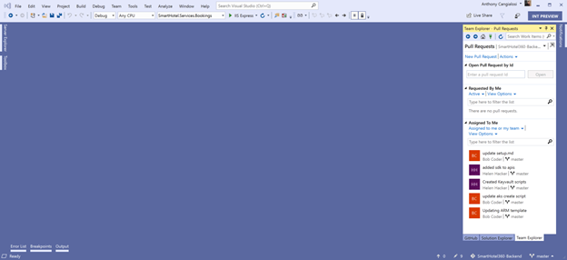
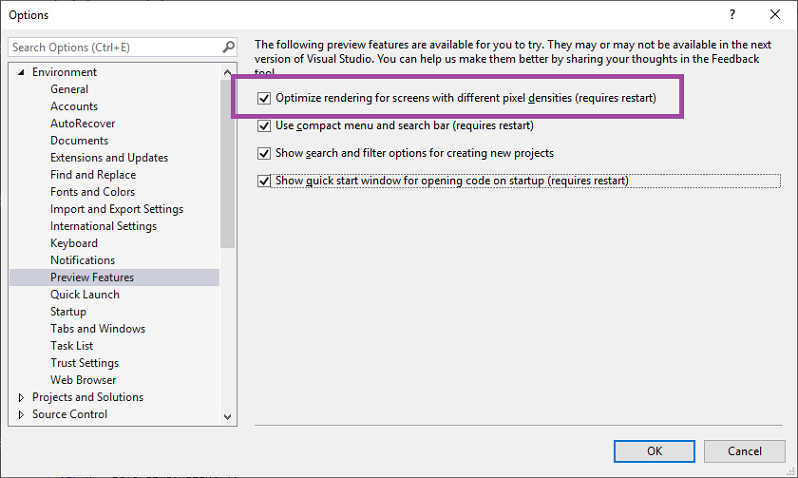

# What&#39;s new in Visual Studio 2019

**Updated for the [16.0 Preview 1 release](/visualstudio/releasenotes/vs2019-relnotes?context=visualstudio/default&contextView=vs-2017)**

Visual Studio 2019 includes many general improvements along with new features that optimize developer productivity and team collaboration. Whether you are using Visual Studio for the first time or have been using it for years, you'll be able to take advantage of its features for all aspects of the development lifecycle&mdash;from simplified project creation and code health management, to team- and open-source collaborative workflows.

Here's a high-level recap of what Visual Studio has to offer:

* **[Personal and team productivity](#personal-and-team-productivity)**. Productivity for everyone where it matters most.
* **[Modern development support](#modern-development-support)**. Support for your current projects and future solutions.
* **[Continuous innovation](#discoverability)**. Code smart with intelligent, cloud-powered support.

> [!NOTE]
> For a complete list of new features and functionality in Visual Studio 2019, see the [Preview release notes](/visualstudio/releasenotes/vs2019-preview-relnotes?context=visualstudio/default&contextView=vs-2017).

## Personal and team productivity

It's a given that performance improvements are top of mind with every release of Visual Studio, but right up there with it is improving your productivity. Here's how we can help with that.

### New start window

The first thing you'll notice when you open Visual Studio 2019 is its new start window.

   

This new start window presents you with options to clone or check out code, open a project or solution, open a local folder, or create a new project. Having these options presented in a simple dialog helps both beginners and advanced Visual Studio users get to code quickly.

### Better search

Formerly known as Quick Launch, we've rewritten the new search feature to make it faster and more effective. Now, Visual Studio displays search results are displayed dynamically as you type, and keyboard shortcuts are displayed next to search results for commands so you can more easily memorize them for future use.

   

Whether you are looking for commands, settings, documentation, or other useful things, the new search feature makes it easier to find what you're looking for.

### One-click Code Cleanup

Paired with a new Document Health Indicator feature is a new one-click Code Cleanup feature that you can use to fix all your code in one fell swoop.

   

The cleanup will format the code and apply any code fixes suggested by the current settings, .editorconfig files, or Roslyn analyzers.

### Debugger improvements

#### Search within a Watch window

You've probably been there before, looking in the Watch window for a string amongst a sea of values. We've enhanced search in the various watch windows (locals, auto, and watch). Now, Visual Studio can do that looking for you!

Now, if you want to format how a value is displayed, you can discover all possible formatting options by using a drop-down within the Watch, Locals, and Autos windows.  Double-click one of the items in any of the windows and add a comma (“,”) to access the dropdown of possible format specifiers, each of which includes a description of its intended effect.

   

### Live Share

[Live Share](https://visualstudio.microsoft.com/services/live-share/) is a new tool that allows you to share a codebase and its context with a teammate and get instant bi-directional collaboration directly from within Visual Studio. With Live Share, a teammate can read, navigate, edit, and debug a project that you've shared with them, and do so seamlessly and securely.

For more information, see the [Live Share FAQ](/visualstudio/liveshare/faq).

## Modern development support

### Manage PRs from the IDE

We're introducing a new pull request (PR) experience in Visual Studio 2019, which enables you to review, run, and even debug pull requests from your team without leaving the IDE. We support code in Azure repos today but are going to expand to support GitHub and improve the overall experience. To get started, you can download the [Pull Requests for Visual Studio](https://aka.ms/pr4vs) extension from the Visual Studio Marketplace.

   

### Develop with .NET Core 3 Preview 1

Visual Studio 2019 supports building [.NET Core 3](http://aka.ms/netcore3preview1) applications for any platform. We'll also continue to support and improve cross-platform C++ development, as well as .NET mobile development for iOS, and Android with Xamarin.

   

## Continuous innovation

### Per-Monitor Aware (PMA) rendering

If you use monitors that are configured with different display scale factors, or remote in to a machine with display scale factors that are different from your main device, you might notice that Visual Studio might look blurry or render at the wrong scale.

With Visual Studio 2019 Preview 1, we are taking the first steps towards making Visual Studio a Per-Monitor Aware (PMA) application. We're laying the foundational work that will allow Visual Studio to render correctly regardless of what display scale factors you use.  

   

To learn more, see the [Making Visual Studio a PMA application](http://add-url-here) blog post.

## Give us feedback

Why send feedback to the Visual Studio team? Because we take customer feedback seriously. It drives much of what we do.

* If you want to make a suggestion about how we can improve Visual Studio, see the [Suggest a feature](../ide/talk-to-us.md) page.

* If you experience a hang, crash, or other performance issue, you can easily share repro steps and supporting files with us by using the [Report a Problem](how-to-report-a-problem-with-visual-studio-2017.md) tool.

## See also

* [Visual Studio 2019 release notes](/visualstudio/releasenotes/vs2019-relnotes?context=visualstudio/default&contextView=vs-2017)
* [What's new in Visual Studio 2017](whats-new-in-visual-studio.md)
