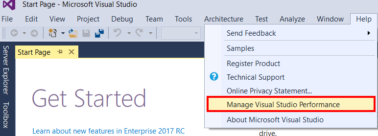
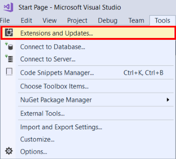

# What&#39;s New in Visual Studio 2017
Welcome to Visual Studio 2017 RC, an integrated suite of developer productivity tools, cloud services, and extensions that enable you and your team to create great apps and games for the web, for Windows Store, for the desktop, for Android, and for iOS.  

In this release candidate (RC) of our newest version of Visual Studio, we've focused on performance and productivity improvements. Performance-wise, we've made Visual Studio start faster, be more responsive, and use less memory than ever before. And productivity-wise, we've added or updated features that can help you be more efficient while you use Visual Studio.

But before we dig in to the details, here is high-level recap of the changes we've made:

* **Boosted productivity**. Enhancements to code navigation, IntelliSense, refactoring, code fixes, and debugging, saves you time and effort on everyday tasks regardless of language or platform. In addition, for teams embracing DevOps, Visual Studio 2017 streamlines the developer inner loop and speeds up code flow with brand new real-time features such as live unit testing and real-time architectural dependency validation.
* **Redefined fundamentals**.  There is a renewed focus to enhance the efficiency of the fundamental tasks that developers encounter on daily basis. From a brand-new lightweight and modular installation tailored to a developer's need, a faster IDE from startup to shut down, to a new way to view, edit, and debug any code without projects and solutions, Visual Studio 2017 helps developers stay focused on the big picture.
* **Streamlined Azure development**. Built-in suite of Azure tools that enable developers to easily create cloud-first applications powered by Microsoft Azure. Visual Studio makes it easy to configure, build, debug, package, and deploy applications and services on Microsoft Azure directly from the IDE.
* **Five-star mobile development**. With advanced debugging and profiling tools and unit test generation features, Visual Studio 2017 with Xamarin makes it faster and easier than ever for developers to build, connect, and tune mobile apps for Android, iOS, and Windows. Developers can also choose to develop mobile apps with Apache Cordova or with Visual C++ cross-platform library development, all in Visual Studio.  

And now, here are more details on our most notable changes.

> [!NOTE]
> For a complete list of new features and functionality in Visual Studio 2017 RC, see the [Release Notes](https://www.visualstudio.com/news/vs2015-vs), as well as the [Known Issues](https://www.visualstudio.com/news/vs2015-vs#knownissues) section of the Release Notes..   

## Performance improvements

### A new setup experience  
[Download Visual Studio Enterprise 2017 RC](https://aka.ms/vs/15/preview/vs_enterprise) or [Compare Visual Studio editions](https://www.visualstudio.com/vs/compare/)

 We've redesigned the Visual Studio setup experience to make it even easier to install just the features you need, when you need them. We've also reduced the minimum footprint, so that Visual Studio installs more quickly with less system impact. And, it uninstalls cleanly, too.

 The most important change you'll see when you install Visual Studio is its new install experience. On the **Workloads** tab, you'll see installation options that are grouped to represent common frameworks, languages, and platforms - covering everything from .NET desktop development to data science with R, Python, and F#.  

 

Choose the workloads you need, and change them up when you need to. The smallest install is just a few hundred megabytes, yet still contains basic code editing support for more than twenty languages along with source code control.

We've also added different ways to install Visual Studio. Want to pick your own components instead of using workloads? Simply select the **Individual components** tab from the installer. Want to install Language Packs without also having to change the Windows language option? Choose the **Language packs** tab of the installer.  

To learn even more about the new installation experience, including step-by-step instructions that walk you through it, see our [Install Visual Studio](../install/install-visual-studio.md) page.

### Start Visual Studio faster
If Visual Studio detects that IDE startup time is slow, it provides a new Visual Studio Performance Center to help you speed things up. The Performance Center lists all the extensions and tool windows that are slowing down IDE startup. You can use it to improve startup performance by determining when extensions start, or whether tool windows are open at startup.

### Decrease solution load time
Working on solutions that contain upwards of 100 projects doesn't mean you need to work with all the files or projects at once. Now you can edit and debug without waiting for Visual Studio to load every project. To try this out with managed projects, turn on the  **Lightweight Solution load** from Tools -> Options -> Projects and Solutions.

  

### Faster on-demand loading of extensions
The idea is simple: Load extensions when they're needed instead of when Visual Studio starts. First, we moved our Python and Xamarin extensions to load on demand, and next, we are working on moving all extensions that we ship with Visual Studio&#151;and extensions shipped by third-party vendors&#151;to this model. Curious about which extensions impact startup, solution load, and typing performance? You can see this information in Help -> Manage Visual Studio Performance.

  

## Productivity improvements

### Sign in across multiple accounts  
We've introduced a new identity service in Visual Studio 2017 RC that allows you to share user accounts across Microsoft developer tools, such as Team Explorer, Azure Tools, Windows Store publishing, and more.

As well, you can stay signed in longer; we won't ask you to sign in again every 12 hours. To learn more, see the [Fewer Visual Studio Sign-in Prompts](https://blogs.msdn.microsoft.com/visualstudio/2016/08/15/fewer-visual-studio-sign-in-prompts/) blog post.

### Manage your extensions with Roaming Extensions Manager
Now it's even easier to set up each dev environment with your favorite extensions when you sign in to Visual Studio. Our new Roaming Extension Manager keeps track of all your favorite extensions by creating a synchronized list in the cloud.  

To see a list of your extensions in Visual Studio, click  Tools > Extensions & Updates, and then click the Roaming Extension Manager.

The Roaming Extension Manager tracks all the extensions you install, but you can choose which ones you want to add to your Roaming list.

When you use the Roaming Extension Manager, you will notice 3 icon types on your list:
*  ***Roamed Icon***: An extension that is part of this Roaming List, but not installed on your machine.
  (You can install these by using the **Download** button.)
*  ***Roamed & Installed Icon***: All extensions that are part of this Roaming List and installed in your dev environment.
  (If you decide you do not want to roam, you can remove these by using the **Stop Roaming** button.)
*  ***Installed Icon***: All extensions that are installed in this environment, but are not part of your Roaming List.
  (You can add extensions to the Roaming List by using the **Start Roaming** button.)

These icons show you the current status of your list. You can have any extension in any state, so customize to your heart's content! Or let us do it for you! Any extension that you download while you are signed in is added to your list as **Roamed & Installed** and is part of your Roaming list, which gives you access to it from any machine!

### Experience live architecture dependency validation and live unit testing

In Visual Studio Enterprise 2017 RC, if you have set up Dependency Validation diagrams (a.k.a. Layer diagrams), you can now be notified in real-time of architectural dependency rule violations as you type code in the Code Editor.

Errors appear in the Error List, and squiggles in the text editor show you the precise location of a violation. Now, you're less likely to introduce unwanted dependencies.

#### Live Unit Testing:

Live Unit Testing is a new feature that we are introducing and is only present in the Enterprise edition of Visual Studio. This feature visualizes unit test results and code coverage live on the editor, while you are coding. It works with C#/VB projects for the .NET Framework and supports three test frameworks of MSTest, xUnit, and NUnit.

### Visual Studio IDE enhancements
#### Interact with Git:
Controls in the bottom corner of the Visual Studio IDE enable you to quickly commit and publish your projects to Git and manage your Git repositories.

#### View and navigate code with Structure Visualizer:
A new feature called Structure Visualizer is available in the Visual Studio code editor. This feature displays vertical guidelines between nested areas of code, making it easier for you to view and navigate through your code. This feature is available for all TextMate-backed languages as well as Visual C#, Visual Basic, and XAML.

#### Experience an improved Navigate To:
We've improved the Navigate To function. We've simplified the Navigate To window, and we've added support for additional filter characters that enable you to narrow your code searches.

#### Create apps in even more programming languages:
You can create apps in Visual Studio using a larger number of programming languages than in previous versions, and solutions and projects are no longer required. Your code gets syntax colorization, basic statement completion, and in some cases, Navigate To and other support. If your favorite language isn't supported, you can create support for it by using TextMate Grammars.

### Visual C++
Visual Studio 2017 RC brings many updates and fixes to the Visual C++ environment. We've fixed over 250 bugs and reported issues in the compiler and tools, many submitted by customers through [Microsoft Connect](https://connect.microsoft.com/VisualStudio "Microsoft Connect").

We've also made several improvements, to include distributing C++ Core Guidelines with Visual Studio, updating the compiler by adding enhanced support for C++11 and C++ features, adding and updating functionality in the C++ libraries, and improving the performance of the C++ IDE, installation workloads, and more.

For complete details, see our [What's New for Visual C++ in Visual 2017 RC](/cpp/top/what-s-new-for-visual-cpp-in-visual-studio) page.  

### Debugging and Diagnostics
Debugging is faster now and doesn't cause delays while you are editing.

For example: In an earlier version of Visual Studio, we introduced what's known as the hosting process for WPF, Windows Forms, and Managed Console projects to make debugging faster by spinning up a process in the background to use in the next debug session. This well-intentioned feature was causing Visual Studio to temporarily become unresponsive for a few seconds when you stopped debugging or used Visual Studio after the debug session ended.

In Visual Studio 2017, we turned off the hosting process and optimized debugging so that it is just as fast without the hosting process, and even faster for projects that never used the hosting process (such as ASP.NET, Universal Windows, and C++ projects).

#### Run to Click:
Now, while you are debugging, you can click the icon next to a line of code to run that line. You no longer have to set temporary breakpoints to perform several steps to execute your code and stop on the line you want.

#### The New Exception Helper:

You can use the new Exception Helper to view your exception information at a glance in a compact, non-modal dialog with instant access to inner exceptions.

Quickly see what was null right inside the Exception Helper when you diagnose a NullReferenceException.

You can also exclude breaking on exception types that are thrown from specific modules by clicking the checkbox to add a condition when you are stopped at a thrown exception.

For more information, see the [Using the New Exception Helper in Visual Studio](https://blogs.msdn.microsoft.com/visualstudioalm/2016/03/31/using-the-new-exception-helper-in-visual-studio-15-preview/) blog post.

## Talk to us  
 Why send feedback to the Visual Studio team? Because we take customer feedback seriously. It drives a lot of what we do.  

If you'd like to make suggestion about how we can improve Visual Studio, or to report a problem, please see the [Talk to Us](../ide/talk-to-us.md) page for more details.  

### Report a problem  
 Sometimes, a message isn't enough to convey the full impact of a problem you've encountered. If you experience a hang, crash, or other performance issue, you can easily share repro steps and supporting files (such as screenshots and trace & heap dump files) with us by using the **Report a Problem** tool. For more information about how to use this tool, see the [How to Report a Problem](how-to-report-a-problem-with-visual-studio-2017.md) page.  

### Track your issue in Connect  
 If you’d like to track the status of your Visual Studio feedback, simply go to [Connect](http://connect.microsoft.com/) and report the bug there. After you report it, you can return to Connect to track its status.  

## See Also  
* [What's New in Visual C++](/cpp/top/what-s-new-for-visual-cpp-in-visual-studio)
* [What's New in C#](https://docs.microsoft.com/en-us/dotnet/articles/csharp/csharp-7)   
* [Visual Studio Release Notes](https://www.visualstudio.com/news/vs2015-vs)
