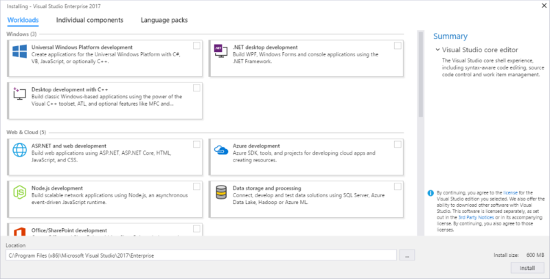
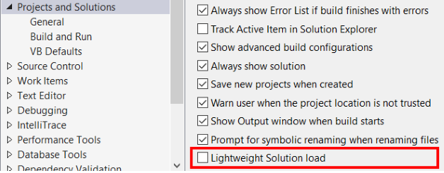

# What&#39;s New in Visual Studio 2017
Unparalleled productivity for any dev, any app, and any platform. Use Visual Studio 2017 to develop apps for Android, iOS, Windows, Linux, web, and cloud. Code fast, debug and diagnose with ease, test often, and release with confidence. You can also extend and customize Visual Studio by building your own extensions. Use version control, be agile, and collaborate efficiently with this new release!

> [!NOTE]
> For a complete list of new features and functionality in Visual Studio 2017, see the [Release Notes](https://www.visualstudio.com/news/vs2015-vs).

Here is a high-level recap of the changes we've made:

* **Performance and productivity**. We have focused not only on new and modern mobile, cloud, and desktop development capabilities, but we've also improved the overall acquisition, performance, and general developer productivity experiences. Visual Studio starts faster, is more responsive, and uses less memory than before.
* **Redefined fundamentals**. A new setup experience means that you can install more quickly and install what you want when you need it. Visual Studio start faster, whether you want to load large solutions and projects, or work on folders of code, or even a single file of code. And, Visual Studio helps you stay focused on the big picture, especially for teams embracing DevOps.
* **Cloud app development with Azure**. A built-in suite of Azure tools that enable you to easily create cloud-first apps powered by Microsoft Azure. Visual Studio makes it easy to configure, build, debug, package, and deploy apps and services on Azure.
* **Mobile app development**. In Visual Studio 2017, you can innovate and get results fast with Xamarin, which unifies your multi-platform mobile requirements by using one core codebase and set of skills. Go mobile with your existing teams, technology investments, and C# code to deliver consumer-grade experiences ahead of schedule and under budget. Accelerate every step of the mobile lifecycle to deliver world-class consumer experiences or a portfolio of productivity apps to empower your workforce.

And here are more details on some of our most notable changes.

## Performance improvements

### A new setup experience  
[Download Visual Studio 2017](https://aka.ms/vsdownload?utm_source=mscom&utm_campaign=msdocs) or [Check Visual Studio system requirements](https://www.visualstudio.com/en-us/productinfo/vs2017-system-requirements-vs)

 Visual Studio makes it easier and faster to install just the features you need, when you need them. And, it uninstalls cleanly, too.

 The most important change you'll see when you install Visual Studio is its new setup experience. On the **Workloads** tab, you'll see installation options that are grouped to represent common frameworks, languages, and platforms. It covers everything from .NET desktop development to C++ application development on Windows, Linux, and iOS.   

 

Choose the workloads you need, and change them when you need to.

Want to pick your own components instead of using workloads? Simply select the **Individual components** tab from the installer. Want to install Language Packs without also having to change the Windows language option? Choose the **Language packs** tab of the installer.  

To learn more about the new installation experience, including step-by-step instructions that walk you through it, see our [Install Visual Studio](../install/install-visual-studio.md) page.

### Start Visual Studio faster
The new Visual Studio Performance Center can help you optimize your IDE start-up time. The Performance Center lists all the extensions and tool windows that might slow down the IDE startup. You can use it to improve startup performance by determining when extensions start, or whether tool windows are open at startup.

### Decrease solution load time
Working on solutions that contain large numbers of projects doesn't mean you have to work with all the files or projects at one time. Now you can edit and debug without waiting for Visual Studio to load every project. To try this out with managed projects, turn on the  **Lightweight Solution load** from Tools -> Options -> Projects and Solutions.

  

### Faster on-demand loading of extensions
Visual Studio is moving its extensions (and working with third-party extensions too) so that they load on-demand, rather than at IDE startup. Curious about which extensions impact startup, solution load, and typing performance? You can see this information in Help -> Manage Visual Studio Performance.

  

## Productivity improvements

### Sign in across multiple accounts  
We've introduced a new identity service in Visual Studio that allows you to share user accounts across  Team Explorer, Azure Tools, Windows Store publishing, and more.

You can stay signed in longer, too. Visual Studio won't ask you to sign in again every 12 hours. To learn more, see the [Fewer Visual Studio Sign-in Prompts](https://blogs.msdn.microsoft.com/visualstudio/2016/08/15/fewer-visual-studio-sign-in-prompts/) blog post.

### Manage your extensions with Roaming Extensions Manager
It's easier to set up each development environment with your favorite extensions when you sign in to Visual Studio. The new Roaming Extension Manager keeps track of all your favorite extensions by creating a synchronized list in the cloud.  

To see a list of your extensions in Visual Studio, click  Tools > Extensions & Updates, and then click the Roaming Extension Manager.

The Roaming Extension Manager tracks all the extensions you install, but you can choose which ones you want to add to your Roaming list.

When you use the Roaming Extension Manager, you will notice 3 icon types on your list:
*  ***Roamed***: An extension that is part of this Roaming List, but not installed on your machine.
  (You can install these by using the **Download** button.)
*  ***Roamed & Installed***: All extensions that are part of this Roaming List and installed in your dev environment.
  (If you decide you do not want to roam, you can remove these by using the **Stop Roaming** button.)
*  ***Installed***: All extensions that are installed in this environment, but are not part of your Roaming List.
  (You can add extensions to the Roaming List by using the **Start Roaming** button.)

Any extension that you download while you are signed in is added to your list as **Roamed & Installed** and is part of your Roaming list, which gives you access to it from any machine.

### Experience live architecture dependency validation and live unit testing

Visual Studio can now notify you in real-time of architectural dependency rule violations as you type code in the Code Editor by using Dependency Validation diagrams (a.k.a. Layer diagrams).

Errors appear in the Error List and squiggles will appear in the text editor showing you the precise location of the violation. You are now less likely to introduce unwanted dependencies.

#### Live Unit Testing:

In Visual Studio Enterprise 2017, live unit testing gives you live unit test results and code coverage in the editor while you are coding. It works with C# and Visual Basic projects for the .NET Framework and supports three test frameworks of MSTest, xUnit, and NUnit.

### Visual Studio IDE enhancements
#### Interact with Git:
When you are working with a project in Visual Studio, you can setup and quickly commit and publish your code to a Git service. You can also manage your Git repositories by using menu clicks from buttons in the bottom right-hand corner of the IDE.

#### View and navigate code with Structure Visualizer:
The Structure Visualizer draws structure guide lines (a.k.a. indent guides) on your code. You can use these to visualize and discover what block of code you’re in at any time without having to scroll. Hovering on the lines shows you the tooltips that let you see the opening of that block and its parents. It's  available for all the languages supported via TextMate grammars as well as C#, Visual Basic, and XAML.

#### Experience improved navigation controls:
We've refreshed the navigation experience to help you get from A to B with greater confidence and fewer distractions.

* **Go To** (Ctrl+F12) &ndash; navigate from any base type or member to its various implementations.

* **Go To All** (Ctrl+T or Ctrl+,) &ndash; navigate directly to any file/type/member/symbol declaration. You can filter your result list or use the query syntax (for example, “f searchTerm” for files, “t searchTerm” for types, etc.).

 

* **Find All References (Shift+F12)** &ndash; with syntax colorization, you can group Find All Reference results by a combination of project, definition, and path. You can also “lock” results so that you can continue to find other references without losing your original results.

 

* **Indent Guides** &ndash; dotted, gray vertical lines act as landmarks in code to provide context within your frame of view. You may recognize these from the popular Productivity Power Tools.

For more information about our new productivity features, see the [Productivity in Visual Studio 2017](https://blogs.msdn.microsoft.com/visualstudio/2016/11/28/productivity-in-visual-studio-2017-rc/) blog post by Mark Wilson-Thomas.

### Visual C++
You'll see several improvements in Visual Studio, such as distributing C++ Core Guidelines with Visual Studio, updating the compiler by adding enhanced support for C++11 and C++ features, adding and updating functionality in the C++ libraries. We've also improved the performance of the C++ IDE, installation workloads, and more.

As well, we've fixed over 250 bugs and reported issues in the compiler and tools, many submitted by customers through [Microsoft Connect](https://connect.microsoft.com/VisualStudio "Microsoft Connect").

For complete details, see our [What's New for Visual C++ in Visual 2017](/cpp/top/what-s-new-for-visual-cpp-in-visual-studio) page.  

### Debugging and Diagnostics

#### Run to Click:

Now, you can more easily skip ahead during debugging without setting a breakpoint to stop on the line you want. When you are stopped in the debugger, simply click the icon that appears next to the line of code that your mouse is over. Your code will run and stop on that line the next time it is hit in your code path.

#### The New Exception Helper:

The new Exception Helper helps you view your exception information at-a-glance. The information is presented in a compact form with instant access to inner exceptions. When you diagnose a NullReferenceException, you can quickly see what was null right inside the Exception Helper.

For more information, see the [Using the New Exception Helper in Visual Studio](https://blogs.msdn.microsoft.com/visualstudioalm/2016/03/31/using-the-new-exception-helper-in-visual-studio-15-preview/) blog post.

## Talk to us  
 Why send feedback to the Visual Studio team? Because we take customer feedback seriously. It drives a lot of what we do.  

If you'd like to make suggestion about how we can improve Visual Studio, or to report a problem, please see the [Talk to Us](../ide/talk-to-us.md) page for more details.  

### Report a problem  
 Sometimes, a message isn't enough to convey the full impact of a problem you've encountered. If you experience a hang, crash, or other performance issue, you can easily share repro steps and supporting files (such as screenshots and trace & heap dump files) with us by using the **Report a Problem** tool. For more information about how to use this tool, see the [How to Report a Problem](how-to-report-a-problem-with-visual-studio-2017.md) page.  

### Track your issue in Connect  
 If you’d like to track the status of your Visual Studio feedback, simply go to [Connect](http://connect.microsoft.com/) and report the bug there. After you report it, you can return to Connect to track its status.  

## See Also  
* [What's New in Visual C++](/cpp/top/what-s-new-for-visual-cpp-in-visual-studio)
* [What's New in C#](https://docs.microsoft.com/en-us/dotnet/articles/csharp/csharp-7)  
* [What's New for Team Foundation Server](https://www.visualstudio.com/en-us/docs/whats-new)
* [Visual Studio Release Notes](https://www.visualstudio.com/news/vs2015-vs)
