# What&#39;s New in Visual Studio 2017
#### Updated for the [15.5 release](https://www.visualstudio.com/news/releasenotes/vs2017-relnotes)
Looking to upgrade from a previous version of Visual Studio? Here's what Visual Studio 2017 can offer you: Unparalleled productivity for any dev, any app, and any platform. Use Visual Studio 2017 to develop apps for Android, iOS, Windows, Linux, web, and cloud. Code fast, debug and diagnose with ease, test often, and release with confidence. You can also extend and customize Visual Studio by building your own extensions. Use version control, be agile, and collaborate efficiently with this release!

Here's a high-level recap of the changes we've made since our previous version, Visual Studio 2015:

* **Redefined fundamentals**. A new setup experience means that you can install more quickly and install what you want when you need it. Whether you want to load large solutions and projects, or work on folders of code, or even a single file of code, Visual Studio starts faster. And, Visual Studio helps you stay focused on the big picture, especially for teams embracing DevOps.
* **Performance and productivity**. We have focused on new and modern mobile, cloud, and desktop development capabilities. And, we've also improved the overall acquisition, performance, and general developer productivity experiences. Visual Studio starts faster, is more responsive, and uses less memory than before.
* **Cloud app development with Azure**. A built-in suite of Azure tools enable you to easily create cloud-first apps powered by Microsoft Azure. Visual Studio makes it easy to configure, build, debug, package, and deploy apps and services on Azure.
* **Windows app development**. Use the UWP templates in Visual Studio 2017 to create a single project for all Windows 10 devices &ndash; PC, tablet, phone, Xbox, HoloLens, Surface Hub, and more. Then, produce an app package and submit it to Microsoft Store from within Visual Studio to get your app out to customers.
* **Mobile app development**. In Visual Studio 2017, you can innovate and get results fast with Xamarin, which unifies your multi-platform mobile requirements by using one core codebase and set of skills. Go mobile with your existing teams, technology investments, and C# code to deliver consumer-grade experiences ahead of schedule and under budget. Accelerate every step of the mobile lifecycle to deliver world-class consumer experiences or a portfolio of productivity apps to empower your workforce.
* **Cross-platform development**. Seamlessly deliver software to any targeted platform. Extend DevOps processes to SQL Server through Redgate Data Tools and safely automate database deployments from Visual Studio. Or, use .NET Core to write apps and libraries that run unmodified across Windows, Linux, and macOS operating systems. (And **new in 15.3**: Get side-by-side support for .NET Core 2.0 SDKs.)
* **Games development**. With Visual Studio Tools for Unity (VSTU), you can use Visual Studio to write game and editor scripts in C# and then use its powerful debugger to find and fix errors. The latest release of VSTU includes syntax coloring for Unity's ShaderLab shader language, better debugger visualizations, and improved code generation for the MonoBehavior wizard. VSTU also brings your Unity project files, console messages, and the ability to start your game into Visual Studio so you can spend less time switching to and from the Unity Editor while writing code.
* **AI development**. With Visual Studio Tools for AI (**new in 15.5**), you can use the productivity features of Visual Studio to accelerate AI innovation. Build, test, and deploy Deep Learning / AI solutions that seamlessly integrate with Azure Machine Learning for robust experimentation capabilities, such as submitting data preparation and model training jobs transparently to different compute targets. And, Visual Studio Tools for AI provides support for custom metrics and run history tracking, which enable data science reproducibility and auditing.

> [!NOTE]
> For a complete list of new features and functionality in Visual Studio 2017, see the [current Release Notes](https://www.visualstudio.com/news/releasenotes/vs2017-relnotes). And for a peek at future feature offerings, see the [Preview Release Notes](https://www.visualstudio.com/news/releasenotes/vs2017-preview-relnotes).

Here's more detailed information about some of the most notable improvements and new features in Visual Studio 2017.

## Redefined fundamentals
### A new setup experience

[Download Visual Studio 2017](https://aka.ms/vsdownload?utm_source=mscom&utm_campaign=msdocs) or [Check Visual Studio system requirements](https://www.visualstudio.com/productinfo/vs2017-system-requirements-vs)

 Visual Studio makes it easier and faster to install just the features you need, when you need them. And, it uninstalls cleanly, too.

 The most important change to note when you install Visual Studio is its new setup experience. On the **Workloads** tab, you'll see installation options that are grouped to represent common frameworks, languages, and platforms. It covers everything from .NET desktop development to C++ application development on Windows, Linux, and iOS.

Choose the workloads you need, and change them when you need to.

 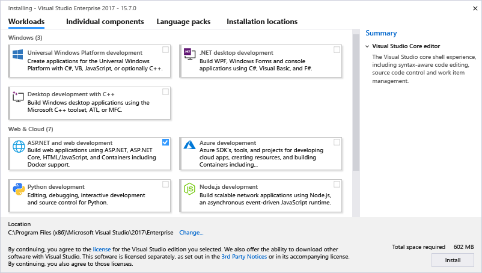

Want to pick your own components instead of using workloads? Select the **Individual components** tab from the installer. Want to install Language Packs without also having to change the Windows language option? Choose the **Language packs** tab of the installer.  

To learn more about the new installation experience, including step-by-step instructions that walk you through it, see the [Install Visual Studio](../install/install-visual-studio.md) page.

### A focus on accessibility
**New in 15.3**, we made over 1,700 targeted fixes to improve compatibility between Visual Studio and the assistive technologies that many customers use. There are dozens of scenarios that are more compatible with screen readers, high contrast themes, and other assistive technologies than ever before. The debugger, editor and shell have all gotten significant improvements, too.

For more information, see the [Accessibility improvements in Visual Studio 2017 version 15.3](https://blogs.msdn.microsoft.com/visualstudio/2017/08/14/accessibility-improvements-in-visual-studio-2017-version-15-3/) blog post.

## Performance and productivity
### Sign in across multiple accounts  
We've introduced a new identity service in Visual Studio that allows you to share user accounts across Team Explorer, Azure Tools, Microsoft Store publishing, and more.

You can stay signed in longer, too. Visual Studio won't ask you to sign in again every 12 hours. To learn more, see the [Fewer Visual Studio Sign-in Prompts](https://blogs.msdn.microsoft.com/visualstudio/2016/08/15/fewer-visual-studio-sign-in-prompts/) blog post.

### Start Visual Studio faster
The new Visual Studio Performance Center can help you optimize your IDE start-up time. The Performance Center lists all the extensions and tool windows that might slow down the IDE startup. You can use it to improve startup performance by determining when extensions start, or whether tool windows are open at startup.

### Faster on-demand loading of extensions
Visual Studio is moving its extensions (and working with third-party extensions too) so that they load on-demand, rather than at IDE startup. Curious about which extensions impact startup, solution load, and typing performance? You can see this information in Help -> Manage Visual Studio Performance.

  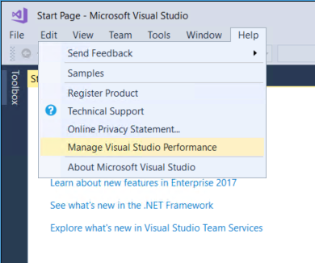

#### Manage your extensions with Roaming Extensions Manager
It's easier to set up each development environment with your favorite extensions when you sign in to Visual Studio. The new Roaming Extension Manager keeps track of all your favorite extensions by creating a synchronized list in the cloud.  

To see a list of your extensions in Visual Studio, click  Tools > Extensions & Updates, and then click the Roaming Extension Manager.

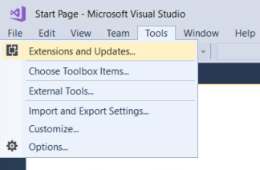

The Roaming Extension Manager tracks all the extensions you install, but you can choose which ones you want to add to your Roaming list.

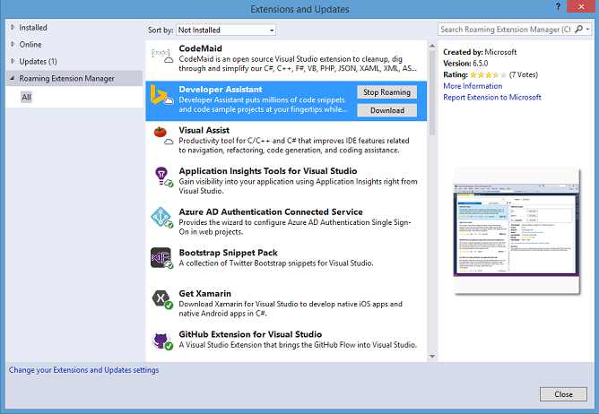

When you use the Roaming Extension Manager, there are three icon types on your list:
*  ***Roamed***: An extension that is part of this Roaming List, but not installed on your machine.
  (You can install these by using the **Download** button.)
*  ***Roamed & Installed***: All extensions that are part of this Roaming List and installed in your dev environment.
  (If you decide you do not want to roam, you can remove these by using the **Stop Roaming** button.)
*  ***Installed***: All extensions that are installed in this environment, but are not part of your Roaming List.
  (You can add extensions to the Roaming List by using the **Start Roaming** button.)

Any extension that you download while you are signed in is added to your list as **Roamed & Installed** and is part of your Roaming list, which gives you access to it from any machine.

### Experience live unit testing
In Visual Studio Enterprise 2017, live unit testing gives you live unit test results and code coverage in the editor while you are coding. It works with C# and Visual Basic projects for both the .NET Framework and .NET Core, and it supports three test frameworks of MSTest, xUnit, and NUnit.

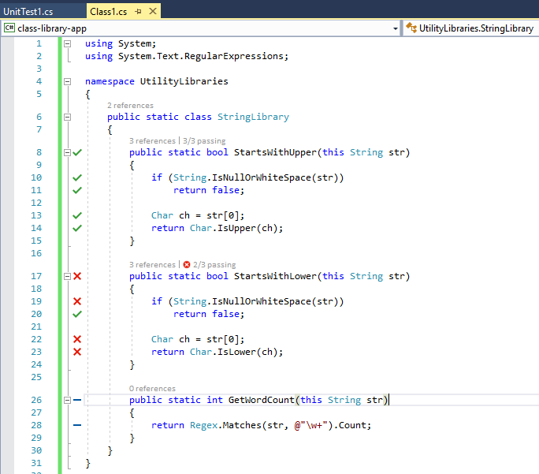

For more information, see the [Introducing Live Unit Testing](../test/live-unit-testing-intro.md). For a list of new features added in each release of Visual Studio Enterprise 2017, see [What's new in Live Unit Testing](../test/live-unit-testing-whats-new.md).

#### Setting up a CI/CD pipeline
#### Automated testing
Automated testing is a key part of any DevOps pipeline. It allows you to consistently and reliably test and release your solution on much shorter cycles. CI/CD (Continuous Integration and Continuous Delivery) flows can help make the process more efficient.

For more information about automated tests, see the [CI/CD pipeline for automated tests in DevOps](https://blogs.msdn.microsoft.com/visualstudioalmrangers/2017/04/20/set-up-a-cicd-pipeline-to-run-automated-tests-efficiently/) blog post.

And, for more information about what's new in the [Continuous Delivery Tools for Visual Studio](https://marketplace.visualstudio.com/items?itemName=VSIDEDevOpsMSFT.ContinuousDeliveryToolsforVisualStudio) DevLabs extension, see the [Committing with Confidence: Commit Time Code Quality](https://blogs.msdn.microsoft.com/visualstudio/2017/08/21/committing-with-confidence-commit-time-code-quality-information-updated/) blog post.

### Visual Studio IDE enhancements
#### Use new refactorings
Refactoring is the process of improving your code after it has been written. Refactoring changes the internal structure of the code without changing its behavior. We add new refactorings often; here are just a few:

*	Add parameter (from CallSite)
*	Generate overrides
*	Add named argument
*	Add null-check for parameters
*	Insert digit-separators into literals
*	Change base for numeric literals (for example, hex to binary)
*	Convert if-to-switch
*	Remove unused variable

For more information, see [Quick Actions](../ide/common-quick-actions.md).

#### Interact with Git
When you are working with a project in Visual Studio, you can set up and quickly commit and publish your code to a Git service. You can also manage your Git repositories by using menu clicks from buttons in the bottom right-hand corner of the IDE.

#### Experience improved navigation controls
We've refreshed the navigation experience to help you get from A to B with greater confidence and fewer distractions.

* **New in 15.4**: **Go To Definition (Ctrl+click or F12)** &ndash; Mouse users have an easier way to navigate to the definition of a member by pressing **Ctrl** and then clicking the member. Pressing **Ctrl** and hovering over a code symbol will underline it and turn it into a link. See [Go To Definition and Peek Definition](../ide/go-to-and-peek-definition.md) for more information.  

* **Go To Implementation (Ctrl+F12)** &ndash; Navigate from any base type or member to its various implementations.

* **Go To All (Ctrl+T or Ctrl+,)** &ndash; Navigate directly to any file/type/member/symbol declaration. You can filter your result list or use the query syntax (for example, "f searchTerm" for files, "t searchTerm" for types, etc.).

 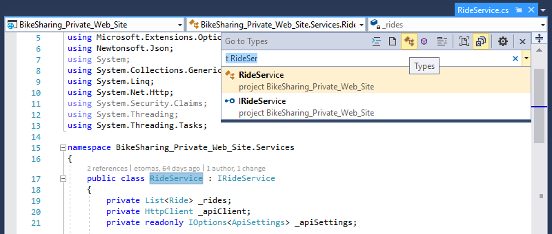

* **Find All References (Shift+F12)** &ndash; With syntax colorization, you can group Find All Reference results by a combination of project, definition, and path. You can also "lock" results so that you can continue to find other references without losing your original results.

 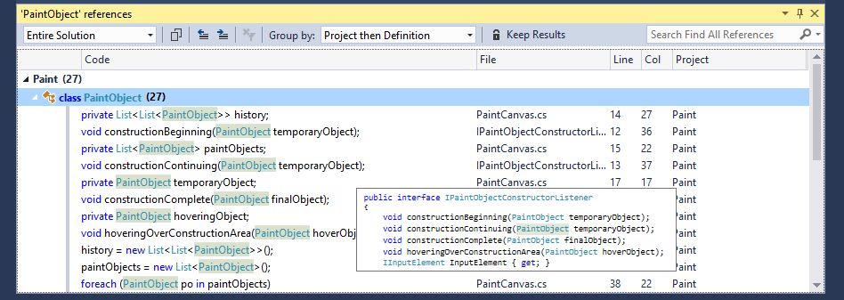

* **Structure Visualizer** &ndash; Dotted, gray vertical lines (indent guides) act as landmarks in code to provide context within your frame of view. You may recognize them from the popular Productivity Power Tools. You can use them to visualize and discover what block of code you're in at any time without having to scroll. Hovering over the lines displays a tooltip that shows you the opening of that block and its parents. It's available for all the languages supported via TextMate grammars, as well as C#, Visual Basic, and XAML.  

For more information about the new productivity features, see the [Productivity in Visual Studio 2017](https://blogs.msdn.microsoft.com/visualstudio/2016/11/28/productivity-in-visual-studio-2017-rc/) blog post by Mark Wilson-Thomas.

### Visual C++
You'll see several improvements in Visual Studio, such as distributing C++ Core Guidelines with Visual Studio, updating the compiler by adding enhanced support for C++11 and C++ features, and adding and updating functionality in the C++ libraries. We've also improved the performance of the C++ IDE, installation workloads, and more.

As well, we've fixed over 250 bugs and reported issues in the compiler and tools, many submitted by customers through [Microsoft Connect](https://connect.microsoft.com/VisualStudio "Microsoft Connect").

For complete details, see the [What's New for Visual C++ in Visual 2017](/cpp/top/what-s-new-for-visual-cpp-in-visual-studio) page.  

### Debugging and Diagnostics
#### Run to Click:
Now, you can more easily skip ahead during debugging without setting a breakpoint to stop on the line you want. When you are stopped in the debugger, just click the icon that appears next to the line of code. Your code will run and stop on that line the next time it is hit in your code path.

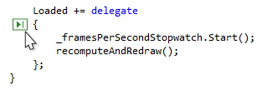

#### The new Exception Helper:
The new Exception Helper helps you view your exception information at-a-glance. The information is presented in a compact form with instant access to inner exceptions. When you diagnose a NullReferenceException, you can quickly see what was null right inside the Exception Helper.

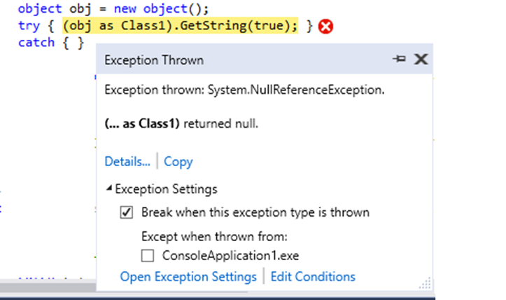

For more information, see the [Using the New Exception Helper in Visual Studio](https://blogs.msdn.microsoft.com/visualstudioalm/2016/03/31/using-the-new-exception-helper-in-visual-studio-15-preview/) blog post.

#### Snapshots and IntelliTrace step-back:
**New in 15.5**: IntelliTrace step-back automatically takes a snapshot of your application at every breakpoint and debugger step event. The recorded snapshots enable you to go back to previous breakpoints or steps and view the state of the application as it was in the past. IntelliTrace step-back can save you time when you want to see the previous application state but don't want to restart debugging or recreate the desired app state.

You can navigate and view snapshots by using the **Step Backward** and **Step Forward** buttons in the Debug toolbar. These buttons navigate the events that appear in the **Events** tab in the **Diagnostic Tools** window. Stepping backward or forward to an event automatically activates historical debugging on the selected event.

For more information, see the [View snapshots using IntelliTrace step-back](../debugger/how-to-use-intellitrace-step-back.md) page.

### Containerization
Containers provide you with increased app density and lower deployment cost along with improved productivity and DevOps agility.

#### Docker Container Tooling
**New in 15.5**
* Visual Studio includes tools for Docker containers that now support multi-stage Dockerfiles, which streamline creating optimized container images.
* By default, Visual Studio will automatically pull, build, and run the necessary container images in the background when you open a project that has Docker support. You can disable this via the **Automatically start containers in background** setting in Visual Studio.

## Cloud app development with Azure
### Azure Functions Tools
As part of the "Azure development" workload, we've included tools to help you develop Azure functions by using pre-compiled C# class libraries. Now you can build, run, and debug on your local development machine and then publish directly to Azure from Visual Studio.

For more information, see the [Azure Functions Tools for Visual Studio](https://docs.microsoft.com/azure/azure-functions/functions-develop-vs) page.

### Debug live ASP.NET apps using snappoints and logpoints in live Azure applications
**New in 15.5**: The Snapshot Debugger takes a snapshot of your in-production apps when code that you are interested in executes. To instruct the debugger to take a snapshot, you set snappoints and logpoints in your code. The debugger lets you see exactly what went wrong, without impacting traffic of your production application. The Snapshot Debugger can help you dramatically reduce the time it takes to resolve issues that occur in production environments.

Snapshot collection is available for the following web apps running in Azure App Service:

* ASP.NET applications running on .NET Framework 4.6.1 or later.
* ASP.NET Core applications running on .NET Core 2.0 or later on Windows.

For more information, see [Debug live ASP.NET apps using snappoints and logpoints](../debugger/debug-live-azure-applications.md).

## Windows app development
### Universal Windows Platform
The Universal Windows Platform (UWP) is the app platform for Windows 10. You can develop apps for UWP with just one API set, one app package, and one store to reach all Windows 10 devices &ndash; PC, tablet, phone, Xbox, HoloLens, Surface Hub, and more. UWP supports different screen sizes and a variety of interaction models, whether it be touch, mouse and keyboard, a game controller, or a pen. At the core of UWP apps is the idea that users want their experiences to be mobile across ALL their devices, and they want to use whatever device is most convenient or productive for the task at hand.

 

Choose your preferred development language&mdash;from C#, Visual Basic, C++, or JavaScript&mdash;to create a Universal Windows Platform app for Windows 10 devices. Visual Studio 2017 provides a UWP app template for each language that lets you create a single project for all devices. When your work is finished, you can produce an app package and submit it to Microsoft Store from within Visual Studio to get your app out to customers on any Windows 10 device.

**New in 15.5** 
Visual Studio 2017 version 15.5 provides the best support for the Windows 10 Fall Creators Update SDK (10.0.16299.0). The Windows 10 Fall Creators Update also brings many improvements for UWP developers. Here are some of the biggest changes: 

* **Support for .NET Standard 2.0** 
In addition to streamlined app deployment, the Windows 10 Fall Creators Update is the first release of Windows 10 to provide .NET Standard 2.0 support. Effectively, [.NET Standard](https://blogs.msdn.microsoft.com/dotnet/2016/09/26/introducing-net-standard/) is a reference implementation of the base class library that any .NET platform can implement. The goal of .NET Standard is to make it as easy as possible for .NET developers to share code across any .NET platform they choose to work on.
* **The best of both UWP and Win32**  
We have improved the Windows 10 Platform with the [Desktop Bridge](https://docs.microsoft.com/windows/uwp/porting/desktop-to-uwp-root) to make Windows 10 better for all .NET developers, whether their current focus is on UWP, WPF, Windows Forms, or Xamarin. With the new App Packaging project type in Visual Studio 2017 version 15.5, you can create Windows App Packages for your WPF or Windows Forms projects, just like you can for UWP projects. After you package your app, you get all the Windows 10 app deployment benefits and have the option to distribute via Microsoft Store (for consumer apps) or Microsoft Store for Business and Education. Because packaged apps have access to both the full UWP API surface and the Win32 APIs on desktop, you can now modernize your WPF and Windows Forms applications gradually with UWP APIs and Windows 10 features. Moreover, you can include your Win32 components in your UWP applications that light up on desktop with all Win32 capabilities. 

For more information about UWP, see the [Develop apps for the Universal Windows Platform (UWP)](../cross-platform/develop-apps-for-the-universal-windows-platform-uwp.md) page.

## Mobile app development
### Xamarin
As part of the "Mobile development with .NET" workload, developers familiar with C#, .NET, and Visual Studio can deliver native Android, iOS, and Windows apps by using Xamarin. Developers can enjoy the same the power and productivity when working with Xamarin for mobile apps, including remote debugging on Android, iOS, and Windows devices&mdash;without having to learn native coding languages like Objective-C or Java.

For more information, see the [Visual Studio and Xamarin](../cross-platform/visual-studio-and-xamarin.md) page.

### Entitlements editor
**New in 15.3**: For your iOS development needs, we've added a stand-alone Entitlements editor. It includes a user-friendly UI that can be easily browsed. To launch it, double-click your entitlements.plist file.

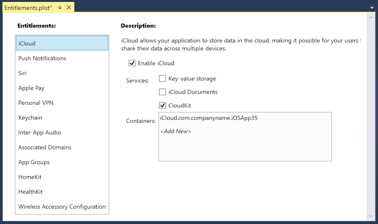

### Visual Studio Tools for Xamarin
**New in 15.4**: Xamarin Live enables developers to continuously deploy, test, and debug their apps, directly on iOS and Android devices. After downloading the Xamarin Live Player&mdash;available in the App Store or on Google Play&mdash;you can pair your device with Visual Studio and revolutionize the way you build mobile apps. This functionality is now included in Visual Studio and can be enabled by going to Tools > Options > Xamarin > Other > Enable Xamarin Live Player.

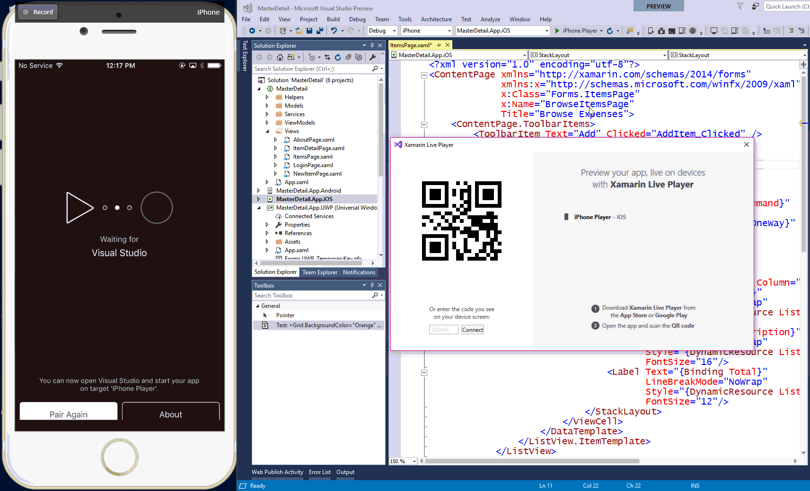

### Visual Studio App Center
**New in 15.5**: Visual Studio App Center&mdash;which is now generally available for Android, iOS, macOS, and Windows apps&mdash;has everything you need to manage the lifecycle of your apps, including automated builds, testing on real devices in the cloud, distribution to beta testers and app stores, and monitoring of real-world usage through crash and analytics data. Apps written in Objective-C, Swift, Java, C#, Xamarin, and React Native are supported across all features.

  

For more information, see the [Introducing App Center: Build, Test, Distribute and Monitor Apps in the Cloud](https://blogs.msdn.microsoft.com/vsappcenter/introducing-visual-studio-app-center/) blog post.

## Cross-platform development
### Redgate Data Tools
To extend DevOps capabilities to SQL Server database development, Redgate Data Tools are now available in Visual Studio.

Included with Visual Studio 2017 Enterprise:
- [Redgate ReadyRoll Core](http://www.red-gate.com/products/sql-development/readyroll/entrypage/microsoft-and-readyroll?utm_source=microsoft&utm_medium=link&utm_campaign=readyroll&utm_term=docs-newinvs) helps you develop migration scripts, manage database changes using source control, and safely automate deployments of SQL Server database changes alongside applications changes.
- [Redgate SQL Prompt Core](http://www.red-gate.com/products/sql-development/sql-prompt/entrypage/microsoft-and-sql-prompt?utm_source=microsoft&utm_medium=link&utm_campaign=sqlprompt&utm_term=docs-newinvs) helps you write SQL more quickly and accurately with the help of intelligent code completion. SQL Prompt autocompletes database and system objects and keywords, and offers column suggestions as you type. This results in cleaner code and fewer errors because you don't have to remember every column name or alias.

Included with all editions of Visual Studio 2017:
- [Redgate SQL Search](http://www.red-gate.com/products/sql-development/sql-search/?utm_source=microsoft&utm_medium=link&utm_campaign=sqlsearch&utm_term=docs-newinvs) increases your productivity by helping you quickly find SQL fragments and objects across multiple databases.

To learn more, see the [Redgate Data Tools in Visual Studio 2017](https://blogs.msdn.microsoft.com/visualstudio/2017/03/07/redgate-data-tools-in-visual-studio-2017/) blog post.

### .NET Core
.NET Core is a general purpose, modular, cross-platform, and open source implementation of the .NET Standard and contains many of the same APIs as the .NET Framework.

The .NET Core platform is made of several components, which include the managed compilers, the runtime, the base class libraries, and numerous application models, such as ASP.NET Core. .NET Core supports three main operating systems: Windows, Linux, and macOS. You can use .NET Core in device, cloud, and embedded/IoT scenarios.

And, it now includes Docker support.  

**New in 15.3**: Visual Studio 2017 version 15.3 supports .NET Core 2.0 development. Using .NET Core 2.0 requires downloading and installing the .NET Core 2.0 SDK separately.  

For more information, see the [.NET Core Guide](/dotnet/core/index) page.

## Games development
### Visual Studio Tools for Unity
As part of the "Games development for Unity" workload, we've included tools to help you develop cross-platform to create 2D and 3D games and interactive content. Create once and publish to 21 platforms, including all mobile platforms, WebGL, Mac, PC and Linux desktop, web, or consoles by using Visual Studio 2017 and Unity 5.6.

For more information, see the [Visual Studio Tools for Unity](../cross-platform/visual-studio-tools-for-unity.md) page.

## AI development
### Visual Studio Tools for AI
**New in 15.5**: Use the productivity features of Visual Studio to accelerate AI innovation today. Use built-in code editor features like syntax highlighting, IntelliSense, and text auto formatting. You can interactively test your deep learning application in your local environment by using step-through debugging on local variables and models.

  

For more information, see the [Visual Studio Tools for AI](../ai/about-ai-tools.md) page.

## Talk to us  
 Why send feedback to the Visual Studio team? Because we take customer feedback seriously. It drives much of what we do.  

If you want to make a suggestion about how we can improve Visual Studio, or report a problem, please see the [Talk to Us](../ide/talk-to-us.md) page.  

### Report a problem  
 Sometimes, a message isn't enough to convey the full impact of a problem you've encountered. If you experience a hang, crash, or other performance issue, you can easily share repro steps and supporting files (such as screenshots, and trace and heap dump files) with us by using the **Report a Problem** tool. For more information about how to use this tool, see the [How to Report a Problem](how-to-report-a-problem-with-visual-studio-2017.md) page.  

### Track your issue in Connect  
 If want to track the status of your Visual Studio feedback, go to [Connect](http://connect.microsoft.com/) and report the bug there. After you report it, you can return to Connect to track its status.  

## See Also
* [Visual Studio 2017 Release Notes](https://www.visualstudio.com/news/releasenotes/vs2017-relnotes)
* [What's New in Visual C++](/cpp/top/what-s-new-for-visual-cpp-in-visual-studio)
* [What's New in C#](/dotnet/csharp/whats-new)  
* [What's New for Team Foundation Server](https://www.visualstudio.com/docs/whats-new)
* [What's New in Visual Studio for Mac](https://www.visualstudio.com/vs/visual-studio-mac/)
