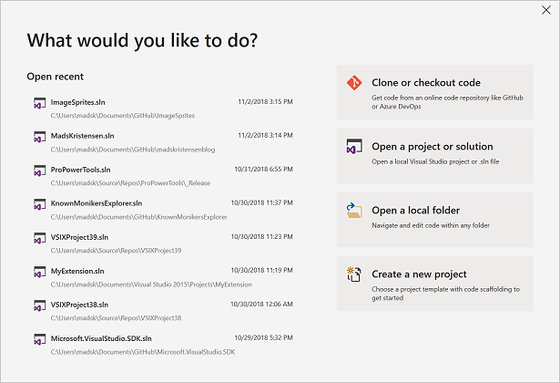
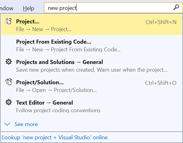
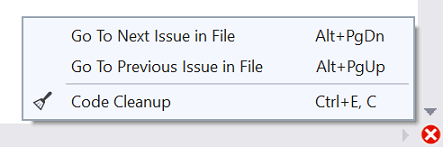
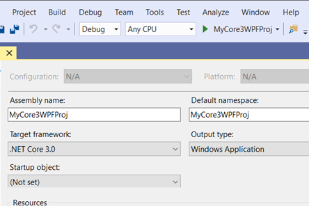
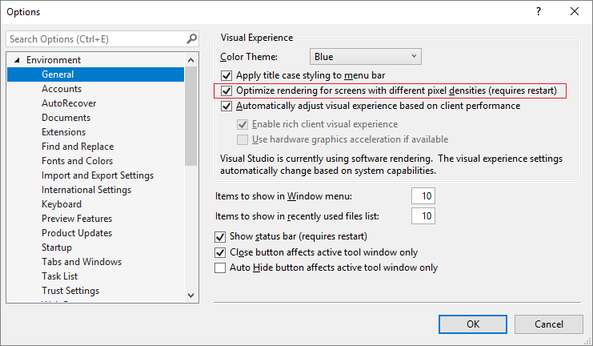
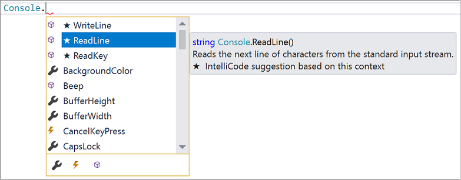

# What's new in Visual Studio 2019

**Updated for the [16.0 release](/visualstudio/releases/2019/release-notes/)**

>[!div class="button"]
>[Download RC](https://visualstudio.microsoft.com/downloads/?utm_medium=microsoft&utm_source=docs.microsoft.com&utm_campaign=button+cta&utm_content=download+vs2019)

Get best-in-class tools and services for any developer, any app, and any platform with Visual Studio 2019. Whether you are using Visual Studio for the first time or you've been using it for years, you can take advantage of its newest features for all aspects of the development lifecycle&mdash;from simplified project creation and code health management, to team- and open-source collaborative workflows.  

>[!VIDEO https://channel9.msdn.com/Events/Connect/Microsoft-Connect--2018/D190/player]

Here's a high-level recap of what Visual Studio has to offer:

* **[Personal and team productivity](#personal-and-team-productivity)**. Productivity for everyone where it matters most.
* **[Modern development support](#modern-development-support)**. Support for your current projects and future solutions.
* **[Continuous innovation](#continuous-innovation)**. Code smart with intelligent, cloud-powered support.

> [!NOTE]
> For a complete list of new features and functionality in Visual Studio 2019, see the [release notes](/visualstudio/releases/2019/release-notes/). For more information about our newest release, see the [Announcing Visual Studio 2019](https://devblogs.microsoft.com/visualstudio//) blog post.

## Personal and team productivity

It's a given that performance improvements are top of mind with every release of Visual Studio, but right up there with it is improving your productivity. Here's how we can help with that.

### New start window

The first thing you'll notice when you open Visual Studio 2019 is its new start window.

   

This new start window presents you with options to clone or check out code, open a project or solution, open a local folder, or create a new project. Having these options presented in a simple dialog helps both beginners and advanced Visual Studio users get to code quickly.

For more information, see the [Get to code: How we designed the new Visual Studio start window](https://devblogs.microsoft.com/visualstudio/get-to-code-how-we-designed-the-new-visual-studio-start-window/) blog post.

### Better search

Formerly known as Quick Launch, our new search experience is faster and more effective. Now, search results appear dynamically as you type. And, search results include keyboard shortcuts for commands, so that you can more easily memorize them for future use.

   

Whether you are looking for commands, settings, documentation, or other useful things, the new search feature makes it easier to find what you're looking for.

### One-click code cleanup

Paired with a new document health indicator is a new code cleanup command. You can use this new command to identify and then fix both warnings and suggestions with the click of a button.

   

The cleanup will format the code and apply any code fixes as suggested by the [current settings](code-styles-and-quick-actions.md), [.editorconfig files](create-portable-custom-editor-options.md), or [Roslyn analyzers](../code-quality/roslyn-analyzers-overview.md).

### Debugger improvements

#### Search within a Watch window, and format Watch values

You've probably been there before, looking in the Watch window for a string amongst a set of values. In Visual Studio 2019, we've added search in the Watch, Locals, and Autos windows to help you find the objects and values you're looking for.

You can also format how a value is displayed within the Watch, Locals, and Autos windows.  Double-click one of the items in any of the windows and add a comma (",") to access the drop-down list of possible format specifiers, each of which includes a description of its intended effect.

   

For more information, see the [Enhanced in Visual Studio 2019: Search for Objects and Properties in the Watch, Autos, and Locals Windows](https://devblogs.microsoft.com/visualstudio/enhanced-in-visual-studio-2019-search-for-objects-and-properties-in-the-watch-autos-and-locals-windows/) blog post.

### Visual Studio Live Share

[Visual Studio Live Share](https://visualstudio.microsoft.com/services/live-share/) is a developer service that allows you to share a codebase and its context with a teammate and get instant bidirectional collaboration directly from within Visual Studio. With Live Share, a teammate can read, navigate, edit, and debug a project that you've shared with them, and do so seamlessly and securely.

And with Visual Studio 2019, this service is installed by default.

For more information, see the [Visual Studio Live Share for real-time code reviews and interactive education](https://devblogs.microsoft.com/visualstudio/visual-studio-live-share-for-real-time-code-reviews-and-interactive-education/) blog post.

## Modern development support

### Manage pull requests (PRs) from the IDE

We're introducing a new extension that you can download to use with Visual Studio 2019. With this new extension, you can review, run, and even debug pull requests from your team without leaving the Visual Studio IDE [(integrated development environment)](../get-started/visual-studio-ide.md). We support code in Azure Repos today, but are expanding to support GitHub and improve the overall experience.

To get started now, download the [Pull Requests for Visual Studio](https://aka.ms/pr4vs) extension from the Visual Studio Marketplace.

### Develop with .NET Core 3 Preview

The preview release of Visual Studio 2019 supports building [.NET Core 3](https://dotnet.microsoft.com/download/dotnet-core/3.0) applications for any platform. We'll continue to support and improve cross-platform C++ development, as well as .NET mobile development for iOS and Android with Xamarin.

   

For more information, see the following pages:

* [.NET Core 3 Preview 1](https://github.com/dotnet/core/blob/master/release-notes/3.0/preview/3.0.0-preview1.md) and [.NET Core 3 Preview 2](https://github.com/dotnet/core/blob/master/release-notes/3.0/preview/3.0.0-preview2.md) release notes
* [Announcing .NET Core 3 Preview 1](https://devblogs.microsoft.com/dotnet/announcing-net-core-3-preview-1-and-open-sourcing-windows-desktop-frameworks/) and [Announcing .NET Core 3 Preview 2](https://devblogs.microsoft.com/dotnet/announcing-net-core-3-preview-2/) blog posts

## Continuous innovation

### Per-monitor aware (PMA) rendering

If you use monitors that are configured with different display scale factors, or connect remotely to a machine with display scale factors that are different from your main device, you might notice that Visual Studio looks blurry or renders at the wrong scale.

With the release of Visual Studio 2019, we are taking the first steps towards making Visual Studio a per-monitor aware (PMA) application. We're laying the foundational work that will allow Visual Studio to render correctly regardless of the display scale factors you use.

   

For more information, see the [Better multi-monitor experience with Visual Studio 2019](https://devblogs.microsoft.com/visualstudio/a-better-multi-monitor-experience-with-visual-studio-2019/) blog post.

### Visual Studio IntelliCode

[Visual Studio IntelliCode](/visualstudio/intellicode/) is an extension that enhances your software development efforts by using artificial intelligence (AI). IntelliCode trains across 2,000 open-source projects on GitHub&mdash;each with over 100 stars&mdash;to generate its recommendations.

Here are a few ways that Visual Studio IntelliCode can help enhance your productivity:

* Deliver context-aware code completions
* Guide developers to adhere to the patterns and styles of their team
* Find difficult-to-catch code issues
* Focus code reviews by drawing attention to areas that really matter

 

We initially supported only C# when we first previewed the IntelliCode extension for Visual Studio. Now, we've added support for C++ and XAML in Visual Studio, too.

And if you're using C#, we've also added the ability to train a custom model on your own code.

For more information about the recent updates, see the [Visual Studio IntelliCode supports more languages and learns from your code](https://devblogs.microsoft.com/visualstudio/visual-studio-intellicode-supports-more-languages-and-learns-from-your-code/) blog post. And, for more information about the extension and how to download it, see the [Visual Studio IntelliCode - Preview](https://go.microsoft.com/fwlink/?linkid=872707) page on Microsoft DevLabs.

## Give us feedback

Why send feedback to the Visual Studio team? Because we take customer feedback seriously. It drives much of what we do.

* If you want to make a suggestion about how we can improve Visual Studio, you can do so by using the [Provide a Suggestion](talk-to-us.md#i-want-to-make-a-suggestion-about-visual-studio-features) tool.

* If you experience a hang, crash, or other performance issue, you can easily share repro steps and supporting files with us by using the [Report a Problem](talk-to-us.md#i-want-to-report-a-problem-with-visual-studio) tool.

## See also

* [Visual Studio 2019 release notes](/visualstudio/releases/2019/release-notes/)
* [What's New in the Visual Studio 2019 SDK](../extensibility/whats-new-visual-studio-2019-sdk.md)
* [Microsoft Connect(); 2018 conference](https://www.microsoft.com/connectevent)
* [What's new in Visual Studio 2017](whats-new-visual-studio-2017.md)
