# What's new in Visual Studio 2019

**Updated for the 16.11 release.** See [full release notes](/visualstudio/releases/2019/release-notes/) | View [product roadmap](/visualstudio/productinfo/vs2019-roadmap)

>[!div class="button"]
>[Download Visual Studio 2019](https://visualstudio.microsoft.com/downloads/?cid=learn-onpage-download-cta)

With Visual Studio 2019, you'll get best-in-class tools and services for any developer, any app, and any platform. Whether you're using Visual Studio for the first time or you've been using it for years, there's a lot to like in our current version!

Here's a high-level recap of what's new, all-up:

* **[Develop](#develop)**: Stay focused and productive with improved performance, instant code cleanup, and better search results.
* **[Collaborate](#collaborate)**: Enjoy natural collaboration through a Git-first workflow, real-time editing and debugging, and code reviews right in Visual Studio.
* **[Debug](#debug)**: Highlight and navigate to specific values, optimize memory use, and take automatic snapshots of your application's execution.

For a complete list of everything that's new in this version, see the [release notes](/visualstudio/releases/2019/release-notes/). And, for more info about what's new in the 16.11 release, see the [Visual Studio 2019 v16.11 is available now](https://devblogs.microsoft.com/visualstudio/visual-studio-16-11/) blog post.

## Develop

View the following video to learn more about how you can save time with new features.   *Video length: 3.00 minutes*

> [!VIDEO https://www.youtube.com/embed/n5sJ4EewKGk]

### Improved search

Formerly known as Quick Launch, our new search experience is faster and more effective. Now, search results appear dynamically as you type. And, search results can often include keyboard shortcuts for commands, so that you can memorize them for future use.

   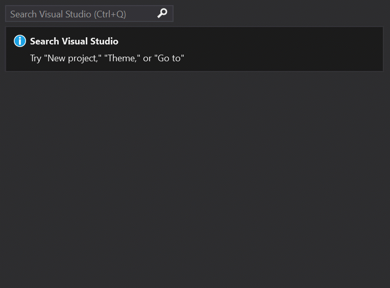

The new fuzzy search logic will find anything you need, regardless of typos. So, whether you're looking for commands, settings, documentation, or other useful things, the new search feature makes it easier to find what you're looking for.

For more information, see [Use Visual Studio search](visual-studio-search.md).

#### Intelligent search service

**New in 16.9**: By using cloud-powered technology, artificial intelligence, and machine learning, we've improved our search results. Now, not only does search in Visual Studio produce more relevant results, but it can also help you discover product features more easily, too.

For more information, see the [Intelligent Visual Studio search service](https://devblogs.microsoft.com/visualstudio/intelligent-visual-studio-search-service/) blog post.

### Refactorings

There are lots of new and highly useful refactorings in C# that make it easier to organize your code. They show up as suggestions in the light bulb and include actions such as moving members to interface or base class, adjusting namespaces to match folder structure, convert foreach-loops to Linq queries, and more.

   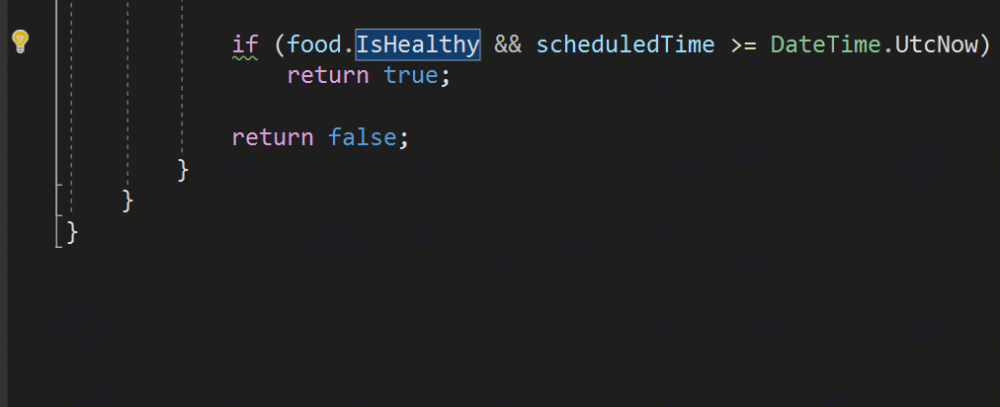

Simply invoke the refactorings by pressing **Ctrl+.** and selecting the action you want to take.

### IntelliCode

[Visual Studio IntelliCode](/visualstudio/intellicode/) enhances your software development efforts by using artificial intelligence (AI). IntelliCode trains across 2,000 open-source projects on GitHub&mdash;each with over 100 stars&mdash;to generate its recommendations.

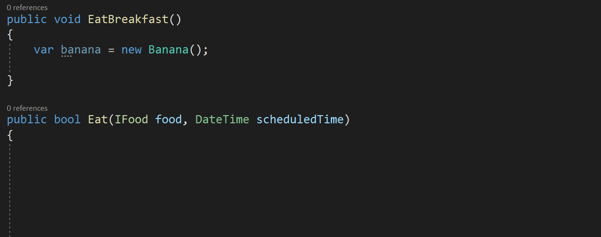

Here are a few ways that Visual Studio IntelliCode can help enhance your productivity:

* Deliver context-aware code completions
* Guide developers to adhere to the patterns and styles of their team
* Find difficult-to-catch code issues
* Focus code reviews by drawing attention to areas that really matter

We initially supported only C# when we first previewed the IntelliCode as an extension for Visual Studio. Now, **new in 16.1**, we've added support for C# and XAML "in-the-box". (Support for C++ and TypeScript/JavaScript are still in preview, however.)

And if you're using C#, we've also added the ability to train a custom model on your own code.

For more information about IntelliCode, see the [Announcing the general availability of IntelliCode plus a sneak peek](https://devblogs.microsoft.com/visualstudio/announcing-the-general-availability-of-intellicode-plus-a-sneak-peek/) and [Code more, scroll less with Visual Studio IntelliCode](https://devblogs.microsoft.com/visualstudio/code-more-scroll-less-with-visual-studio-intellicode/) blog posts.

### Code cleanup

Paired with a new document health indicator is a new code cleanup command. You can use this new command to identify and then fix both warnings and suggestions with a single action (or click of a button).

The cleanup will format the code and apply any code fixes as suggested by the [current settings](code-styles-and-code-cleanup.md) and [.editorconfig files](create-portable-custom-editor-options.md).

   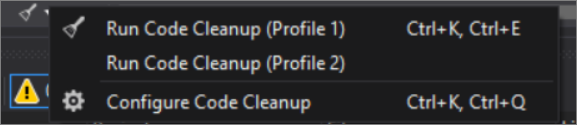

You can also save collections of fixers as a profile. For example, if you have a small set of targeted fixers that you apply frequently while you code, and then you have another comprehensive set of fixers to apply before a code review, you can configure profiles to address these different tasks.

   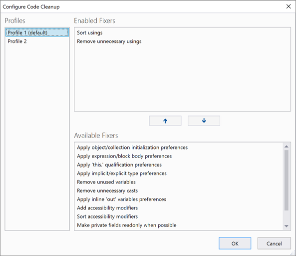

### Per-monitor aware (PMA) rendering

If you use monitors that are configured with different display scale factors, or connect remotely to a machine with display scale factors that are different from your main device, you might notice that Visual Studio looks blurry or renders at the wrong scale.

With the release of Visual Studio 2019, we're making Visual Studio a per-monitor aware (PMA) application. Now, Visual Studio renders correctly regardless of the display scale factors you use.

    rendering in Visual Studio 2019.")

For more information, see the [Better multi-monitor experience with Visual Studio 2019](https://devblogs.microsoft.com/visualstudio/a-better-multi-monitor-experience-with-visual-studio-2019/) blog post.

### Test Explorer

**New in 16.2**: We've updated Test Explorer to provide better handling of large test sets, easier filtering, more discoverable commands, tabbed playlist views, and customizable columns that let you fine-tune what test information is displayed.

   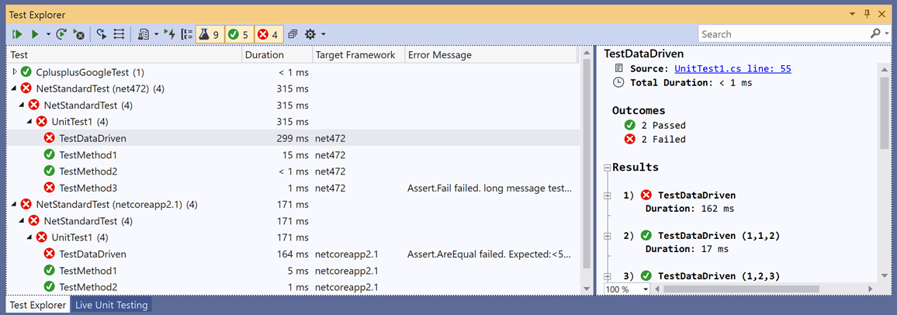

### .NET Core

**New in 16.3**: We've included support for .NET Core 3.0. Cross-platform, open source&mdash;and fully supported by Microsoft.

For more information, see the [Announcing .NET Core 3.0](https://devblogs.microsoft.com/dotnet/announcing-net-core-3-0/) blog post.

## Collaborate

View the following video to learn more about how you can team up to solve issues.   *Video length: 4.22 minutes*

> [!VIDEO https://www.youtube.com/embed/dKLJsiK1QU8]

### Git-first workflow

Something you'll notice when you open Visual Studio 2019 is its new start window.

   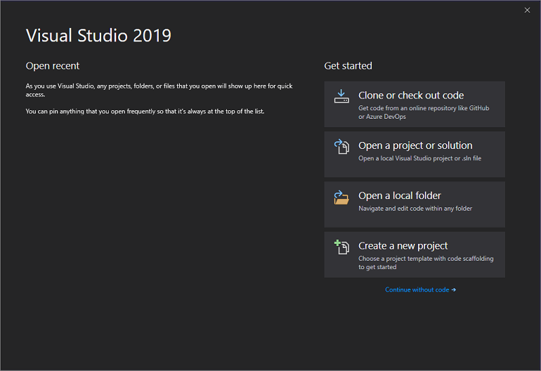

The start window presents you with several options to get you to code quickly. We've placed the option to clone or check out code from a repo, first.

   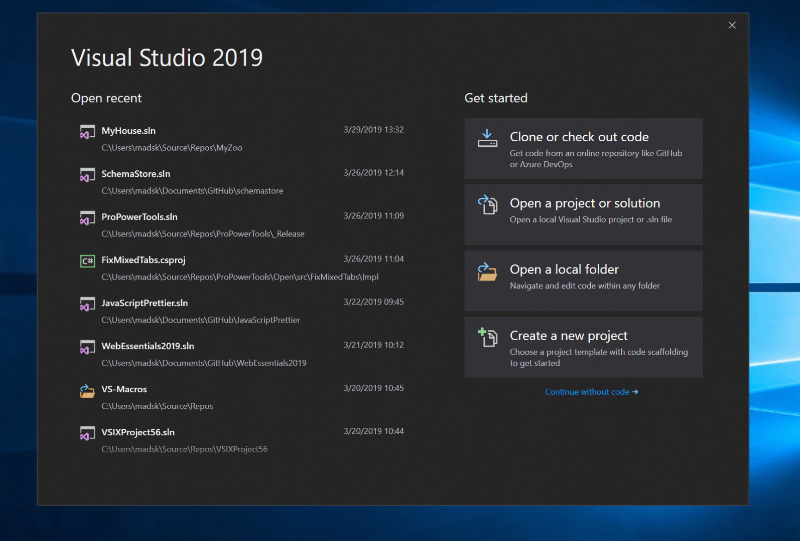

The start window also includes options to open a project or solution, open a local folder, or create a new project.

For more information, see the [Get to code: How we designed the new Visual Studio start window](https://devblogs.microsoft.com/visualstudio/get-to-code-how-we-designed-the-new-visual-studio-start-window/) blog post.

### Git productivity

**New in 16.8**: Git is now the default version control experience in Visual Studio 2019. We have built out the feature set and iterated on it based on your feedback during the past two releases. The new experience has now been turned on by default for everyone. From the new Git menu, you can clone, create, or open repositories. Use the integrated Git tool windows to commit and push changes to your code, manage branches, stay up to date with your remote repositories, and resolve merge conflicts.

For more information, see the [Git experience in Visual Studio](../version-control/git-with-visual-studio.md) page.

### Live Share

[Visual Studio Live Share](https://visualstudio.microsoft.com/services/live-share/) is a developer service that allows you to share a codebase and its context with a teammate and get instant bidirectional collaboration directly from within Visual Studio. With Live Share, a teammate can read, navigate, edit, and debug a project that you've shared with them, and do so seamlessly and securely.

And with Visual Studio 2019, this service is installed by default.

For more information, see the [Visual Studio Live Share for real-time code reviews and interactive education](https://devblogs.microsoft.com/visualstudio/visual-studio-live-share-for-real-time-code-reviews-and-interactive-education/) blog post and the [Live Share now included with Visual Studio 2019](https://devblogs.microsoft.com/visualstudio/live-share-now-included-with-visual-studio-2019/) blog post.

### Integrated code reviews

We're introducing a new extension that you can download to use with Visual Studio 2019. With this new extension, you can review, run, and even debug pull requests from your team without leaving Visual Studio. We support code in both GitHub and Azure DevOps repositories.

   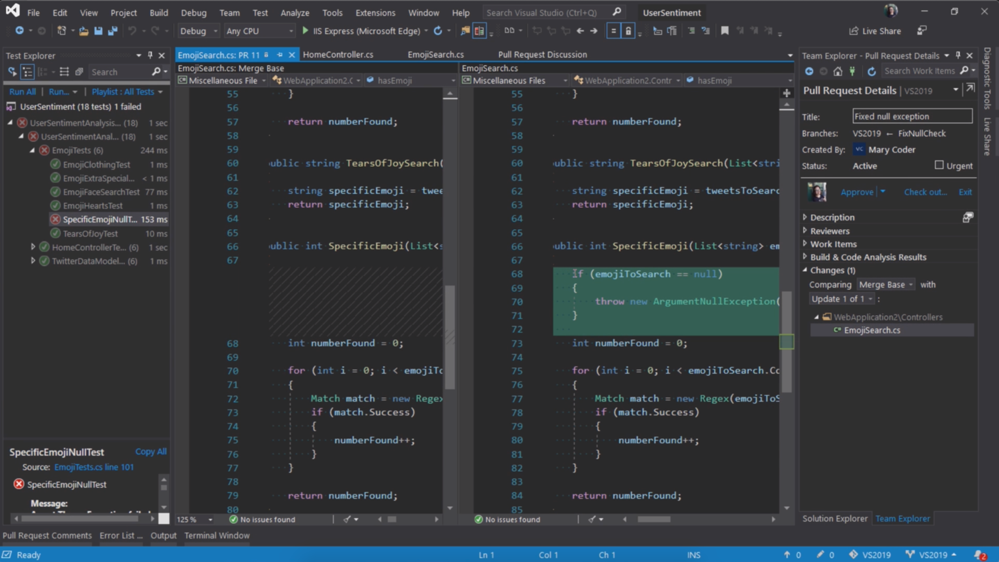

For more information, see the [Code reviews using the Visual Studio Pull Requests extension](https://devblogs.microsoft.com/visualstudio/code-reviews-using-the-visual-studio-pull-requests-extension/) blog post.

## Debug

View the following video to learn more about how you can zero in with precise targeting while you debug.   *Video length: 3.54 minutes*

> [!VIDEO https://www.youtube.com/embed/hr72Fs8n_9c]

### Performance gains

We've taken the once-exclusive C++ data breakpoints and adapted them for .NET Core applications.

   

So whether you're coding in C++ or .NET Core, data breakpoints can be a good alternative to just placing regular breakpoints. Data breakpoints are also great for scenarios such as finding where a global object is being modified or being added or removed from a list.

And, if you're a C++ developer who develops large applications, Visual Studio 2019 has made symbols out of proc, which allows you to debug those applications without experiencing memory-related issues.

### Search while debugging

You've probably been there before, looking in the Watch window for a string amongst a set of values. In Visual Studio 2019, we've added search in the Watch, Locals, and Autos windows to help you find the objects and values you're looking for.

   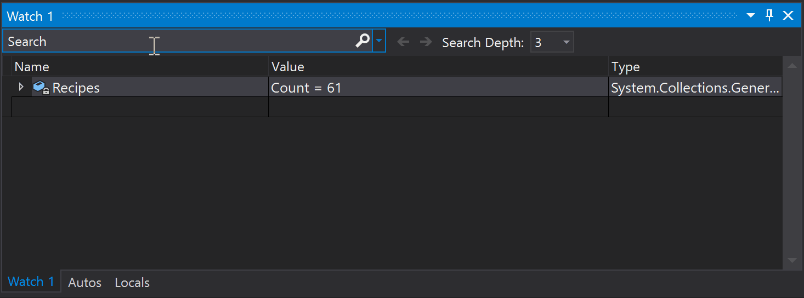

You can also format how a value is displayed within the Watch, Locals, and Autos windows. Select (by double-clicking) one of the items in any of the windows and add a comma (",") to access the drop-down list of possible format specifiers, each of which includes a description of its intended effect.

   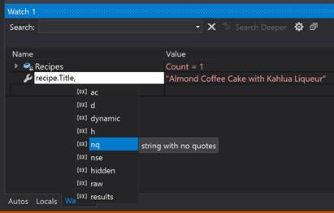

For more information, see the [Enhanced in Visual Studio 2019: Search for Objects and Properties in the Watch, Autos, and Locals Windows](https://devblogs.microsoft.com/visualstudio/enhanced-in-visual-studio-2019-search-for-objects-and-properties-in-the-watch-autos-and-locals-windows/) blog post.

### Snapshot Debugger

Get a snapshot of your app's execution in the cloud to see exactly what's happening. (This feature is available in Visual Studio Enterprise, only.)

   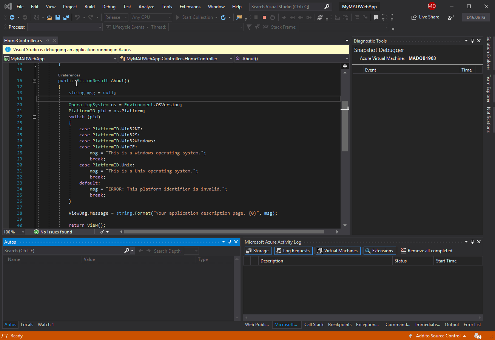

We've added support for targeting ASP.NET (Core and desktop) applications that run on an Azure VM. And, we've added support for applications that run in an Azure Kubernetes Service. The Snapshot Debugger can help you dramatically reduce the time it takes to resolve issues that occur in production environments.

For more information, see the [Debug live ASP.NET Azure apps using the Snapshot Debugger](../debugger/debug-live-azure-applications.md) page, and the [Introducing Time Travel Debugging for Visual Studio Enterprise 2019](https://devblogs.microsoft.com/visualstudio/introducing-time-travel-debugging-for-visual-studio-enterprise-2019/) blog post.

### Microsoft Edge Insider support

**New in 16.2**: You can set a breakpoint in a JavaScript application and start a debug session by using the [Microsoft Edge Insider](https://www.microsoftedgeinsider.com/) browser. When you do so, Visual Studio opens a new browser window with debugging enabled, which you can then use to step through application JavaScript within Visual Studio.

   

### Pinnable Properties tool

**New in 16.4**: Now, it's easier to identify objects by their properties while debugging with the new Pinnable Properties tool. Just hover the cursor over a property you want to display in the debugger window of the Watch, Autos, and Locals windows, select the pin icon, and immediately see the information you're looking for at the top of the window!

   

For more information, see the [Pinnable Properties: Debug & Display Managed Objects YOUR Way](https://devblogs.microsoft.com/visualstudio/pinnable-properties-debug-display-managed-objects-your-way/) blog post.

## What's next

We update Visual Studio often with new features that can make your development experience even better. To learn more about our latest innovations, check out the [Visual Studio Blog](https://devblogs.microsoft.com/visualstudio/). For a record of what we've released in preview to date, take a look at the [Preview Release Notes](/visualstudio/releases/2019/release-notes-preview/). And for a list of what we're planning to release next, see the [Visual Studio Roadmap](/visualstudio/productinfo/vs-roadmap).

Meanwhile, here's what's currently in the works:

- **Improved Git experience in Visual Studio 2019**

   Although the Git version control tool is default experience in Visual Studio 2019 [version 16.8](/visualstudio/releases/2019/release-notes-history/) and later, we continue to add features to enhance the experience in the newest release of Visual Studio 2019, [version 16.11](/visualstudio/releases/2019/release-notes-preview/).

   For more information, see the [Version control in Visual Studio](/visualstudio/version-control/) page.

- **Visual Studio 2022 is now available**

    Our newest version, [Visual Studio 2022](/visualstudio/releases/2022/release-notes/) is faster, more approachable, and more lightweight. And, for the first time ever, Visual Studio is 64-bit.

    For a download link and more info, see the [Visual Studio 2022 vision](https://devblogs.microsoft.com/visualstudio/visual-studio-2022/) blog post, along with the [**Visual Studio 2022 Preview 3 now available**](https://devblogs.microsoft.com/visualstudio/visual-studio-2022-preview-3-now-available/) blog post, too.

## Give us feedback

Why send feedback to the Visual Studio team? Because we take customer feedback seriously. It drives much of what we do.

* If you want to make a suggestion about how we can improve Visual Studio, you can do so by using the [Suggest a Feature](suggest-a-feature.md) tool.

* If you experience an issue where Visual Studio stops responding, crashes, or other performance issue, you can easily share repro steps and supporting files with us by using the [Report a Problem](how-to-report-a-problem-with-visual-studio.md) tool.

## Related content

* [What's new in Visual Studio 2022 (Preview)](whats-new-visual-studio-2022.md)
* [What's new in the Visual Studio docs](whats-new-visual-studio-docs.md)
* [Visual Studio 2019 release notes](/visualstudio/releases/2019/release-notes/)
* [Visual Studio 2019 for Mac release notes](/visualstudio/releasenotes/vs2019-mac-relnotes/)
* [What's new in the Visual Studio 2019 SDK](../extensibility/whats-new-visual-studio-2019-sdk.md)
* [What's new for C++ in Visual Studio](/cpp/overview/what-s-new-for-visual-cpp-in-visual-studio/)
* [What's new for C# 9.0](/dotnet/csharp/whats-new/csharp-9)
* [What's new in .NET 5](/dotnet/core/dotnet-five)
* [What's new in .NET Framework](/dotnet/framework/whats-new/)
