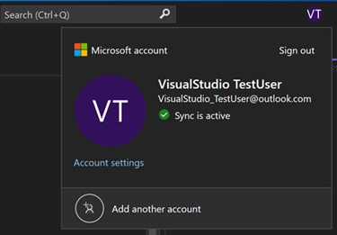
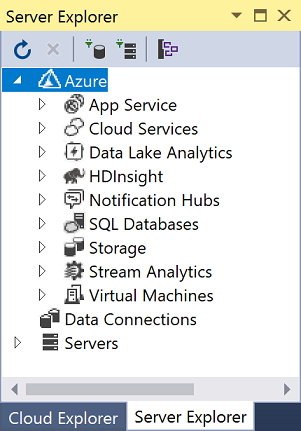
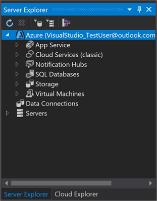
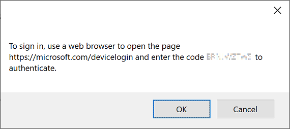
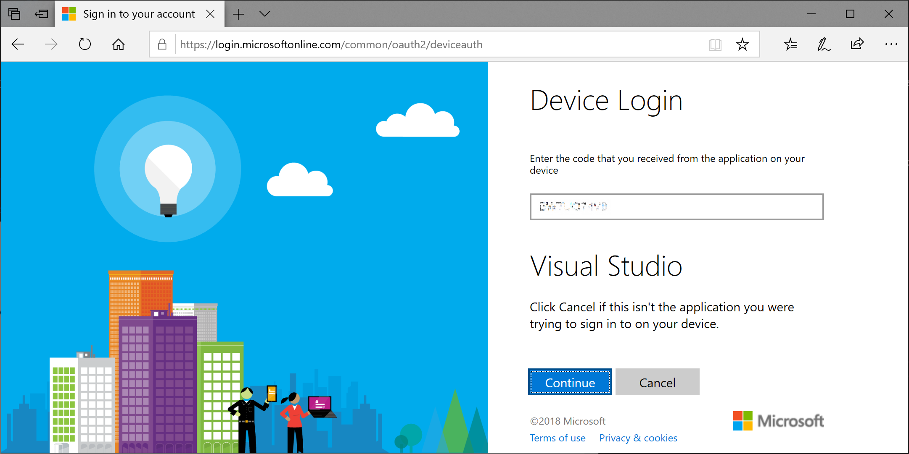
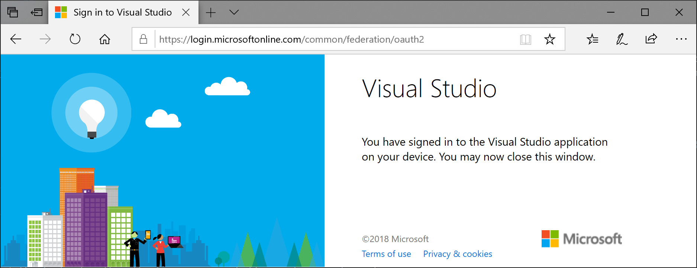

# Work with multiple user accounts

::: moniker range="vs-2017"
This article shows you how to add multiple accounts to Visual Studio. It also shows you how to see the resources accessible from those accounts in places such as the **Add Connected Service** dialog, **Server Explorer**, and **Team Explorer**.
::: moniker-end

::: moniker range=">=vs-2019"
This article shows you how to add multiple accounts to Visual Studio. It also shows you how to see the resources accessible from those accounts in places such as the **Add Connected Service** dialog and **Server Explorer**.
::: moniker-end

If you have multiple Microsoft accounts and/or work or school accounts, you can add them all to Visual Studio so that you can access the resources from any account without having to sign in to it separately. Azure, Application Insights, Azure DevOps, and Microsoft 365 services all support the streamlined sign-in experience.

After you add multiple accounts on one machine, that set of accounts roams with you if you sign in to Visual Studio on another machine.

> [!NOTE]
> Although the account names roam, the credentials do not. You'll be prompted to enter credentials for those other accounts the first time you attempt to use their resources on a new machine.

## Sign in to Visual Studio

Sign into Visual Studio with a Microsoft account or an organizational account. You should see your user name appear in the upper corner of the window, similar to this:

::: moniker range="<=vs-2019"

::: moniker-end

::: moniker range="vs-2022"

::: moniker-end

### Access your Azure account in Server Explorer

To open Server Explorer, choose **View** > **Server Explorer** (or, if you're using the "General" [environment settings](../ide/environment-settings.md), press **Ctrl**+**Alt**+**S**). Expand the **Azure** node and notice that it contains the resources available in the Azure account that's associated with the account that you used to sign in to Visual Studio. It looks similar to the following image:

::: moniker range="<=vs-2019"

::: moniker-end

::: moniker range="vs-2022"

::: moniker-end

The first time you use Visual Studio on any specific device, the dialog only shows the subscriptions registered under the account that you signed in with. You can access resources for any of your other accounts directly from **Server Explorer** by right-clicking on the **Azure** node, choosing **Manage and Filter Subscriptions**, and then adding your accounts from the account picker control. You can then choose another account, if desired, by clicking the down arrow and choosing from the list of accounts. After choosing the account, you can customize which subscriptions under that account to display in **Server Explorer**.

The next time you open **Server Explorer**, the resources for that subscription are displayed.

### Access your Azure account via Add Connected Service dialog

1. Open an existing project, or create a new project.

1. Choose the project node in **Solution Explorer**, and then right-click and choose **Add** > **Connected Service**.

   The **Connected Services** window appears and shows you the list of services in the Azure account that's associated with your Visual Studio personalization account. You don't have to sign in separately to Azure. However, you do need to sign in to the other accounts the first time you attempt to access their resources from a different machine.

### Access Azure Active Directory in a Web project

Azure Active Directory (AAD) enables support for end-user single sign-in in ASP.NET MVC web apps or AD authentication in web API services. Domain authentication is different from individual user account authentication. Users that have access to your Active Directory domain can use their existing AAD accounts to connect to your web applications. Microsoft 365 apps can also use domain authentication.

::: moniker range="vs-2017"

To see this in action, create a new **ASP.NET Core Web Application** project. In the **New ASP.NET Core Web Application** dialog box, choose the **Web Application** template, and then choose **Change Authentication**.

The **Change Authentication** dialog box appears where you can choose what kind of authentication to use in your application.

For more information about the different kinds of authentication in ASP.NET, see [Create ASP.NET web projects in Visual Studio](/aspnet/visual-studio/overview/2013/creating-web-projects-in-visual-studio#authentication-methods).

### Access your Azure DevOps organization

From the main menu, choose **Team** > **Manage Connections** to open the **Team Explorer - Connect** window. Choose **Manage Connections** > **Connect to a Project**. In the **Connect to a Project** dialog, select a project from the list (or select **Add TFS Server** and enter the URL to your server). When you select a URL, you're logged in without having to reenter your credentials.

For more information, see [Connect to projects in Team Explorer](connect-team-project.md).

::: moniker-end

::: moniker range="vs-2019"

To see this in action, create a new **ASP.NET Core Web App** project. On the **Additional information** page, choose **.NET Core 3.1 (Long-term support)** from the **Target Framework** drop-down, and then choose an authentication type from the **Authentication Type** drop-down.

::: moniker-end

::: moniker range=">=vs-2022"

To see this in action, create a new **ASP.NET Core Web App** project. On the **Additional information** page, choose **.NET Core 6 (Long-term support)** from the **Target Framework** drop-down, and then choose an authentication type from the **Authentication Type** drop-down.

::: moniker-end

::: moniker range=">=vs-2019"

## Add an additional account to Visual Studio

To add an additional account to Visual Studio:

1. Choose **File** > **Account Settings**.

1. From **All Accounts**, choose an account by using the **+** or the **Add** dropdown.

1. On the **Sign in to your account** page, select the account or choose **Use another account**. Follow the prompts to enter the new account credentials.

(Optional) Now you can go to **Server Explorer** and see the Azure services associated with the account you just added. In **Server Explorer**, right-click on the **Azure** node and choose **Manage and Filter Subscriptions**. Choose the new account by clicking the drop-down arrow next to the current account, and then choose which subscriptions you want to display in **Server Explorer**. You should see all the services associated with the specified subscription. Even though you're not currently signed into Visual Studio with the second account, you are signed in to that account's services and resources. The same is true for **Project** > **Add Connected Service**.
::: moniker-end

::: moniker range="vs-2017"
## Add an additional account to Visual Studio

To add an additional account to Visual Studio:

1. Choose **File** > **Account Settings**.

1. Under **All Accounts**, choose **Add an account**.

1. On the **Sign in to your account** page, select the account or choose **Use another account**. Follow the prompts to enter the new account credentials.

(Optional) Now you can go to **Server Explorer** and see the Azure services associated with the account you just added. In **Server Explorer**, right-click on the **Azure** node and choose **Manage and Filter Subscriptions**. Choose the new account by clicking the drop-down arrow next to the current account, and then choose which subscriptions you want to display in **Server Explorer**. You should see all the services associated with the specified subscription. Even though you're not currently signed into Visual Studio with the second account, you are signed in to that account's services and resources. The same is true for **Project** > **Add Connected Service** and **Team** > **Connect to Team Foundation Server**.

### Add an account using device code flow

In some cases, you can't sign in or add an account in the regular manner. This can happen if Internet Explorer is blocked for some reason, or if your network is behind a firewall. To work around this, you can enable *device code flow* to add an account or reauthenticate your account. Device code flow lets you sign in using a different browser or on a different machine&mdash;either physical or virtual (VM).

To sign in using device code flow:

1. Open the [**Accounts**](reference/accounts-environment-options-dialog-box.md) page under **Tools** > **Options** > **Environment**, and then select **Enable device code flow when adding or re-authenticating an account**. Choose **OK** to close the options pages.

1. Choose **File** > **Account Settings** to open the account management page.

1. Choose **Add an account** under **All Accounts**.

   A dialog box shows you a URL and a code to paste into a web browser.

   

1. Press **Ctrl**+**C** to copy the text of the dialog, and then choose **OK** to close the dialog. Paste the text you copied into a text editor such as Notepad. This makes it easier to copy the code in the next step.

1. Navigate to the device login URL on the machine or web browser you want to use to sign in to Visual Studio, and then paste or enter the code you copied into the box that says **Code**.

   The **Visual Studio** app name should appear further down on the page.

1. Under **Visual Studio**, choose **Continue**.

   

1. Follow the prompts to enter your account credentials.

   A page appears telling you that you've signed into Visual Studio on your device, and that you can close the browser window.

   

1. Go back to the account management page in Visual Studio and you'll see the newly added account listed under **All Accounts**. Choose **Close**.

::: moniker-end

::: moniker range=">=vs-2019"

### Add a GitHub account to Visual Studio

Starting with version 16.8, you’ll be able to add both GitHub and GitHub Enterprise accounts to your keychain. You’ll be able to add and leverage them just as you do with Microsoft accounts, which means that you’ll have an easier time accessing your GitHub resources across Visual Studio.

For detailed instructions, see [Work with GitHub accounts in Visual Studio](work-with-github-accounts.md).

::: moniker-end

## See also

- [Sign in to Visual Studio](signing-in-to-visual-studio.md)
- [Sign in to Visual Studio for Mac](/visualstudio/mac/signing-in)
