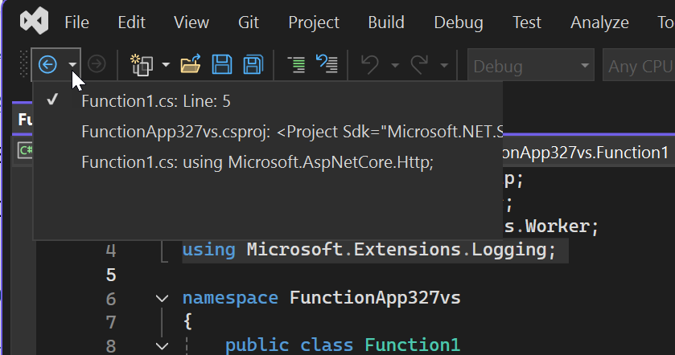
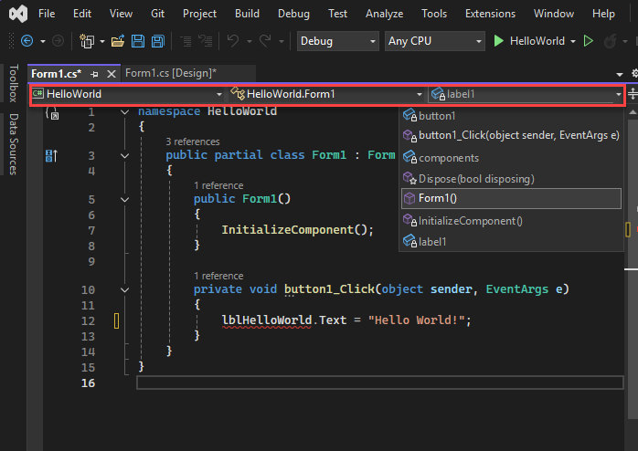

# Write code in the code editor
The Visual Studio editor provides many features that make it easier for you to write and manage your code and text. You can expand and collapse different blocks of code by using outlining. You can learn more about the code you are using by using IntelliSense, the **Object Browser**, and the Call Hierarchy. You can find code by using features such as **Go To**, **Go To Definition**, and **Find All References**. You can insert blocks of code with code snippets, and you can generate code by using features such as **Generate From Usage**. If you have never used the Visual Studio editor before, see [Editing Your Code](https://www.visualstudio.com/features/ide-vs) for a quick overview.  

 You can view your code in a number of different ways. To see a class view of your solution, you can open the **Class View** window or expand nodes in **Solution Explorer** under your class files.

 You can search and replace text for single or multiple files. For more information, see [Finding and Replacing Text](../ide/finding-and-replacing-text.md). You can use regular expressions to find and replace text. For more information, see [Using Regular Expressions in Visual Studio](../ide/using-regular-expressions-in-visual-studio.md).  

 The different Visual Studio languages offer different sets of features, and in some cases the features behave differently in different languages. Many of these differences are specified in the descriptions of the features, but for more information you can see the sections on specific Visual Studio languages.  

> [!IMPORTANT]
>  The Visual Studio edition and the settings you are using may affect the features in the IDE. They might differ from those described in this topic.  

## Editor Features  

|||  
|-|-|  
|Syntax Coloring|Some syntax elements of code and markup files are colored differently to distinguish them. For example, keywords (such as `using` in C# and `Imports` in Visual Basic) are one color, but types (such as `Console` and `Uri`) are another color. Other syntax elements are also colorized, such as string literals and comments. C++ uses color to differentiate among types, enumerations, and macros, among other tokens.   You can see the default color for each type, and you can change the color for any specific syntax element in the [Fonts and Colors, Environment, Options Dialog Box](../ide/reference/fonts-and-colors-environment-options-dialog-box.md), which you can open from the **Tools** menu.|  
|Error and Warning Marks|As you add code and build your solution, you may see (a) different-colored wavy underlines (known as squiggles) or (b) light bulbs appearing in your code. Red squiggles denote syntax errors, blue denotes compiler errors, green denotes warnings, and purple denotes other types of errors. [Light bulbs](../ide/perform-quick-actions-with-light-bulbs.md) suggest fixes for problems and make it easy to apply the fix.   You can see the default color for each error and warning squiggle in the **Tools/Options/Environment/Fonts and Colors** dialog box. Look for **Syntax Error**, **Compiler Error**, **Warning**, and **Other Error**.|  
|Brace Matching|When the insertion point is placed on an open brace in a code file, both it and the closing brace are highlighted. This feature gives you immediate feedback on misplaced or missing braces. You can turn brace matching on or off with the **Automatic Delimiter Highlighting** setting (**Tools/Options/Text Editor**). You can change the highlight color in the **Fonts and Colors** setting (**Tools/Options/Environment**). Look for **Brace Matching (Highlight)** or **Brace Matching (Rectangle)**.|  
|Structure Visualizer|Dotted lines connect matching braces in code files, making it easier to see opening and closing brace pairs. This can help you find code in your codebase more quickly. You can turn these lines on or off with the **Show structure guidelines** in the **Display** section of the **Tools/Options/Text Editor/General** page.|
|Line Numbers|Line numbers can be displayed in the left margin of the code window. They are not displayed by default. You can turn this option on in the **Text Editor All Languages** settings (**Tools/Options/Text Editor/All Languages**). You can display line numbers for individual programming languages by changing the settings for those languages (**Tools/Options/Text Editor/\<language>**). For line numbers to print, you must select Include line numbers in the **Print** dialog box.|  
|Change Tracking|The color of the left margin allows you to keep track of the changes you have made in a file. Changes you have made since the file was opened but not saved are denoted by a yellow bar on the left margin (known as the selection margin). After you have saved the changes (but before closing the file), the bar turns green. If you undo a change after you have saved the file, the bar turns orange. To turn this feature off and on, change the **Track changes** option in the **Text Editor** settings (**Tools/Options/Text Editor**).|  
|Selecting Code and Text|You can select text either in the standard continuous stream mode or in box mode, in which you select a rectangular portion of text instead of a set of lines. To make a selection in box mode, press ALT as you drag the mouse over the selection (or press ALT + SHIFT + \<arrow key>). The selection includes all of the characters within the rectangle defined by the first character and the last character in the selection. Anything typed or pasted into the selected area is inserted at the same point on each line.|  
|Zoom|You can zoom in or out in any code window by pressing and holding the CTRL key and moving the scroll wheel on the mouse (or CTRL + SHIFT + . to increase and CTRL + SHIFT + , to decrease). You can also use the Zoom box in the lower left corner of the code window to set a specific zoom percentage. The zoom feature does not work in tool windows.|  
|Virtual Space|By default, lines in Visual Studio editors end after the last character, so that the RIGHT ARROW key at the end of a line moves the cursor to the beginning of the next line. In some other editors a line does not end after the last character, and you can place your cursor anywhere on the line. You can enable virtual space in the editor in the **Tools/Options/Text Editor/All Languages** settings. Note that you can enable either **Virtual Space** or **Word Wrap**, but not both.|  
|Printing|You can use the options in the **Print** dialog box to include line numbers or hide collapsed regions of code when you print a file. In the **Page Setup** dialog box, you can also choose to print the full path and the name of the file by choosing **Page header**.   You can set color printing options in the **Tools/Options/Environment/Fonts and Colors** dialog box. Choose **Printer** in the **Show settings for** list to customize color printing. You can specify different colors for printing a file than for editing a file.|  
|Global Undo and Redo|The **Undo Last Global Action** and **Redo Last Global Action** commands on the **Edit** menu undo or redo global actions that affect multiple files. Global actions include renaming a class or namespace, performing a find-and-replace operation across a solution, refactoring a database, or any other action that changes multiple files. You can apply the global undo and redo commands to actions in the current Visual Studio session, even after you close the solution in which an action was applied.|  

## Advanced Editing Features  
 You can find a number of advanced features on the **Edit/Advanced** submenu. Not all these features are available for all types of code files.  

|||  
|-|-|  
|Format Document|Sets the proper indentation of lines of code and moves curly braces to separate lines in the document.|  
|Format Selection|Sets the proper indentation of lines of code and moves curly braces to separate lines in the selection.|  
|Tabify Selected Lines|Changes leading spaces to tabs where appropriate.|  
|Untabify Selected Lines|Changes leading tabs to spaces. If you want to convert all the spaces in your file to tabs (or all the tabs to spaces), you can use the `Edit.ConvertSpacesToTabs` and `Edit.ConvertTabsToSpaces` commands. These commands do not appear in Visual Studio menus, but you can call them from the Quick Access window or the command window.|  
|Make Uppercase|Changes all characters in the selection to uppercase, or if there is no selection, changes the character at the insertion point to uppercase.|  
|Make Lowercase|Changes all characters in the selection to lowercase, or if there is no selection, changes the character at the insertion point to lowercase.|  
|Move selected Lines Up|Moves the selected line up one line. Shortcut: ALT + UP ARROW.|
|Move Selected Lines Down|Moves the selected line down one line. Shortcut: ALT + DOWN ARROW.|
|Validate Document|Validates JScript code files.|  
|Delete Horizontal White Space|Deletes tabs or spaces at the end of the current line.|  
|View White Space|Displays spaces as raised dots, and tabs as arrows. The end of a file is displayed as a rectangular glyph. If **Tools/Options/Text Editor/All Languages/Word Wrap/Show visible glyphs for word wrap** is selected, that glyph is also displayed.|  
|Word Wrap|Causes all the lines in a document to be visible in the code window. You can turn word wrap off and on in the Text Editor All Languages settings (**Tools/Options/ Text Editor/All Languages**).|  
|Uncomment Selection|Adds comment characters to the selection or the current line.|  
|Comment Selection|Removes comment characters from the selection or the current line.|  
|Increase Line Indent|Adds a tab (or the equivalent spaces) to the selected lines or the current line.|  
|Decrease Line Indent|Removes a tab (or the equivalent spaces) from the selected lines or the current line.|  
|Select Tag|In a document that contains tags (for example, XML or HTML), selects the tag.|  
|Select Tag Content|In a document that contains tags (for example, XML or HTML), selects the content.|  

## Navigate and find code  
You can move around in a document in several different ways. In addition to the standard operations, you can use the **Navigate Backward** (CTRL + MINUS) and **Navigate Forward** (CTRL + SHIFT + MINUS) buttons on the toolbar to move the insertion point to previous locations or return to more recent locations in the active document. These buttons retain the last 20 locations of the insertion point.

The Structure Visualizer feature in the code editor shows *structure guide lines* -  vertical dashed lines that indicate matching curly braces in your codebase. This makes it easier to see where logical blocks begin and end.

To disable structure guide lines, go to **Tools**, **Options**, **Text Editor**, **General** and clear the **Show structure guide lines** box.

You can also use the enhanced scroll bar in a code window to get a bird’s-eye view of your code. In map mode, you can see previews of the code when you move the cursor up and down the scroll bar, For more information, see [How to: Track Your Code by Customizing the Scrollbar](../ide/how-to-track-your-code-by-customizing-the-scrollbar.md).  

The following commands are code-specific navigation methods:  

|||  
|-|-|  
|Find All References|(Context menu or SHIFT + F12): Finds all the references to the selected element in the solution.|  
|Go To|Has the following commands: **Go To Line** (CTRL + G): Move to the specified line number in the active document. **Go to All** (CTRL + T): Move to the specified line, type, file, member, or symbol. **Go to File** (CTRL + 1, CTRL + F): Move to the specified file in the solution. **Go to Type** (CTRL + 1, CTRL + T): Move to the specified type in the solution. **Go to Member** (CTRL + 1, CTRL + M): Move to the specified member in the solution. **Go to Symbol** (CTRL + 1, CTRL + S): Move to the specifed symbol in the solution. See more on these commands in the section "Find code using Go To commands" later in this topic.|  
|Go To Definition|(Context menu or F12): Finds the definition of the selected element.|  
|Go To Implementation|(Context menu or CTRL + F12): Finds the place in the code where the selected element is implemented.|
|Peek Definition|(Context menu or ALT + F12): Finds the definition of the selected element and displays it in a popup window. For more information, see [How to: View and Edit Code by Using Peek Definition (Alt+F12)](../ide/how-to-view-and-edit-code-by-using-peek-definition-alt-plus-f12.md).|  
|Next Method, Previous Method|(**Edit/Next Method, Previous Method**) In Visual Basic code files, use these commands to move the insertion point to different methods.|  
|Reference Highlighting|When you click a symbol in the source code, all instances of that symbol are highlighted in the document. The highlighted symbols may include declarations and references, and many other symbols that **Find All References** would return. These include the names of classes, objects, variables, methods, and properties. In Visual Basic code, keywords for many control structures are also highlighted. To move to the next or the previous highlighted symbol, press CTRL+SHIFT+DOWN ARROW or CTRL+SHIFT+UP ARROW. You can change the highlighting color in **Tools/Options/Environment/Fonts and Colors/Highlighted Reference.**|  
|Find code-related info|You can find info about specific code, like changes and who made those changes, references, bugs, work items, code reviews, and unit test status when you use CodeLens in the code editor. CodeLens works like a heads-up display when you use Visual Studio Enterprise with Team Foundation Server. See [Find code changes and other history](../ide/find-code-changes-and-other-history-with-codelens.md).|
|View Call Hierarchy|(Context menu or CTRL + K, CTRL + T).|  

 You can also use the **navigation bar** (dropdown boxes at the top of the code window) to find code in a codebase. You can choose a type or member to go directly to it. The navigation bar appears when you edit code in a Visual Basic, C#, or C++ code base.

 

 To hide the navigation bar, change the **Navigation bar** option in the Text Editor All Languages settings (**Tools**, **Options**, **Text Editor**, **All Languages**, or you can change the settings for individual languages). You can navigate in the dropdown boxes as follows:  

-   To shift focus from the code window to the navigation bar, press the shortcut key combination CTRL+F2.  

-   To return focus from the navigation bar to the code window, press the ESC key.  

-   To shift focus from item to item on the navigation bar, press the TAB key.  

-   To select the Navigation bar item that has focus and return to the IDE, press the ENTER key  

-   To navigate to a class or type, choose its name in the left dropdown.  

-   To navigate directly to a procedure in a class, choose a procedure in the right dropdown.  

 In a partial class, members defined outside the current code file may be disabled (appear in grey).  

## Find code using Go To commands
Visual Studio's **Go To** commands perform a focused search of your code to help you quickly find specified items in code files, file paths and code symbols. Unlike other text searches such as Find or Find in Files, Go To limits its search to areas where actual code is, such as in files, forms and code modules. For example, if you search for a string in an ASP.NET web application using Find or Find in Files in the whole solution, you might get hits that include instances of the string in code remarks. By using a Go To command, though, your search might pinpoint the function you are looking for, ignoring instances of the string in code remarks.

### Find code using Go To

1. Open a solution or folder in Visual Studio.
1. On the main menu, choose **Edit**, **Go To**. A small text box appears in the upper corner of the code editor.
1. In the text box, enter the name of the code element you want to find.

    

    As you type, the results appear in a dropdown list below the text box.
1. To go to an element, choose it in the list.

### Filter your search

By default, the specified item is searched for in all solution items. However, you can limit your code search to specific element types by prefacing the search terms with the following letters and symbols.

|||  
|-|-|
|None|No preface symbol. This finds the specified term in all lines, files, types, members, and symbols. Shortcut: CTRL + T|
|:|Go to the specified line number. Shortcut: CTRL + G|
|f|Go to the specified file name. Shortcut: CTRL + 1, CTRL + F|
|t|Go to the specified type. Shortcut: CTRL + 1, CTRL + T|
|m|Go to the specified member. Shortcut: CTRL + 1, CTRL + M|
|#|Go to the specified symbol. Shortcut: CTRL + 1, CTRL + S|

For example, to limit your search to only code symbols, preface your Go To query with an "#" character, or choose **Edit**, **Go To**, **Go to Symbol** on the menu. Searching for `# application` displays only symbols that contain the word "application".

You can also quickly change the search filter by choosing buttons on the Go To window's toolbar. Buttons that change the filters are on the left side, and the buttons that change the scope of the search are on the right side.

If you use [camel casing](https://en.wikipedia.org/wiki/Camel_case) in your code, you can find code elements faster by entering only the capital letters of code element name. For example, if your code has a type called `CredentialViewModel`, you can narrow down the search by choosing the Type filter and then entering just the capital letters of the name (`CVM`) in the Go To window.

This feature is particularly helpful if your code has long names.

## Finding references in your codebase
To find where particular code elements are referenced throughout your codebase, you can use the **Find All References** command. To use **Find All References**, choose that command on the context (right-click) menu of the element you want to find the references for, or choose the SHIFT + F12 keys.

The results appear in a tool window named **'*{element}*' references**, where *{element}* is the name of the item you are searching for. A toolbar in this References window enables you to:
- Change the scope of the search in a dropdown list box. You can choose to look only in changed documents all the way up to the entire solution.
- Copy the selected referenced item by choosing the **Copy** button.
- Choose buttons to go to the next or previous location in the list, or choose the F8 and SHIFT + F8 keys to do so.
- Remove any filters on the returned results by choosing the **Clear All Filters** button.
- Change how returned items are grouped by choosing a setting in the **Group by:** dropdown list box.
- Keep the current search results window by choosing the **Keep Results** button.
- Search for strings within the search results by entering text in the **Search Find All Referencs** text box.

You can also hover the mouse over any search result to see a preview of the returned item.

To keep the results of your search, choose the **Keep Results** button. When you choose this button, the current search results stay in this window, and new search results appear in a new tool window.

### Change reference groupings
By default, references are grouped by project, then by definition. However, you can change this grouping order by changing the setting in the **Group by:** dropdown list box on the toolbar. For example, you can change it from the default setting of **Definition then project** to **Project then definition**, as well to other settings.

**Definition** and **Project** are the two default groupings used, but you can add others by choosing the **Grouping** command on the selected item's context menu. Adding more groupings can be helpful if your solution has a lot of files and paths.

## Customize the Editor  
You can share your Visual Studio settings with another developer, have your settings conform to a standard, or return to Visual Studio default settings by using the **Import and Export Settings Wizard** command on the **Tools** menu. In the **Import and Export Settings Wizard**, you can change selected general settings or language and project-specific settings.

To define new hotkeys or redefine existing hotkeys, go to **Tools**, **Options**, **Environment**, **Keyboard**. For more information about hotkeys, see [Default Keyboard Shortcuts](../ide/default-keyboard-shortcuts-in-visual-studio.md).  

For more information about customizing the editor, see [Customizing the Editor](../ide/customizing-the-editor.md). For information about language-specific editor options, see [Using the Visual Studio Development Environment for C#](../csharp-ide/using-the-visual-studio-development-environment-for-csharp.md) and [Options, Text Editor, JavaScript, Formatting](../ide/reference/options-text-editor-javascript-formatting.md).

## See Also  
 [Visual Studio IDE](../ide/visual-studio-ide.md)
