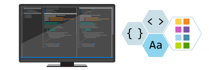
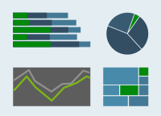
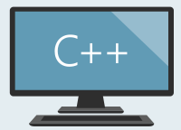
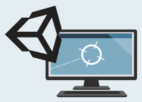
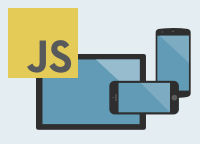
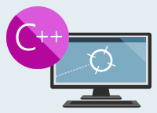
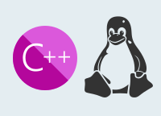

<!-- markdownlint-disable MD033 -->

    

        <ul class="cardsY panelContent featuredContent">
            <li>
                <a href="/visualstudio/install/install-visual-studio">
                    

                        

                            

                                

                                    

                                        
                                    

                                

                                

                                    <h3>Setup &amp; Installation</h3>
                                    
Learn how to install and set up Visual Studio.

                                

                            

                        

                    

                </a>
            </li>
            <li>
                <a href="/visualstudio/ide/visual-studio-ide">
                    

                        

                            

                                

                                    

                                        
                                    

                                

                                

                                    <h3>Get Started with Visual Studio</h3>
                                    
Develop any app for any platform.

                                

                            

                        

                    

                </a>
            </li>
            <li>
                <a href="/visualstudio/ide/whats-new-visual-studio-2019">
                    

                        

                            

                                

                                    

                                        
                                    

                                

                                

                                    <h3>What&#39;s New in Visual Studio</h3>
                                

                            

                        

                    

                </a>
            </li>
        </ul>
    

    

        <h1>Visual Studio Documentation</h1>
        <ul class="pivots">
            <li>
                <a href="#get-started">Get Started</a>
                <ul id="get-started">
                    <li>
                        
                        <ul id="get-started1" class="cardsL">
                            <li>
                                

                                    

                                        

                                            

                                                <h3>Learn how to use Visual Studio</h3>
                                                <ul class="noBullet">
                                                    <li><a class="barLink" href="get-started/visual-studio-ide.md">Start a guided tour</a></li>
                                                    <li><a class="barLink" href="get-started/tutorial-open-project-from-repo.md">Open code from a repo</a></li>
                                                    <li><a class="barLink" href="ide/index-writing-code.md">Write and edit code</a></li>
                                                    <li><a class="barLink" href="ide/compiling-and-building-in-visual-studio.md">Build your code</a></li>
                                                    <li><a class="barLink" href="debugger/debugger-feature-tour.md">Debug your code</a></li>
                                                    <li><a class="barLink" href="test/getting-started-with-unit-testing.md">Test your code</a></li>
                                                    <li><a class="barLink" href="data-tools/create-a-sql-database-by-using-a-designer.md">Access data locally or in the cloud</a></li>
                                                </ul>
                                            

                                        

                                    

                                

                            </li>
                            <li>
                                

                                    

                                        

                                            

                                                <h2>Follow a tutorial</h2>
                                                <table cellpadding="0" cellspacing="0" border="0">
                                                    <tr>
                                                        <td style="border-top-color:transparent!important;padding-left:0;">
                                                            <ul class="noBullet">
                                                                <li>
                                                                    <a class="barLink" href="/visualstudio/get-started/csharp/">
                                                                        
                                                                        C#
                                                                    </a>
                                                                </li>                                             <li>
                                                                    <a class="barLink" href="/visualstudio/ide/quickstart-fsharp">
                                                                        
                                                                        F#
                                                                    </a>
                                                                </li>
                                                                <li>
                                                                    <a class="barLink" href="/visualstudio/get-started/visual-basic/">
                                                                        
                                                                        Visual Basic
                                                                    </a>
                                                                </li>
                                                            </ul>
                                                        </td>
                                                        <td style="border-top-color:transparent!important;padding-left:0;">
                                                            <ul class="noBullet">                                     <li>
                                                                    <a class="barLink" href="/cpp/get-started/tutorial-console-cpp">
                                                                        
                                                                        C++
                                                                    </a>
                                                                </li>
                                                                <li>
                                                                    <a class="barLink" href="/visualstudio/python/">
                                                                        
                                                                        Python</a>
                                                                </li>
                                                                <li>
                                                                    <a class="barLink" href="/visualstudio/javascript/">
                                                                        
                                                                        JavaScript</a>
                                                                </li>
                                                            </ul>
                                                        </td>
                                                    </tr>
                                                </table>
                                            

                                        

                                    

                                

                            </li>
                            <li>
                                

                                    

                                        

                                            

                                                <h3>Create an app</h3>
                                                <ul class="noBullet">
                                                    <li>
                                                        <a class="barLink" href="/visualstudio/get-started/csharp/tutorial-uwp">
                                                            
                                                            Universal Windows app</a>
                                                    </li>
                                                    <li>
                                                        <a class="barLink" href="/visualstudio/ide/walkthrough-create-a-simple-application-with-visual-csharp-or-visual-basic">
                                                            
                                                            Windows desktop app</a>
                                                    </li>
                                                    <li>
                                                        <a class="barLink" href="/visualstudio/cross-platform/cross-platform-mobile-development-in-visual-studio">
                                                            
                                                            Mobile app</a>
                                                    </li>
                                                    <li>
                                                        <a class="barLink" href="/visualstudio/cross-platform/getting-started-with-visual-studio-tools-for-unity">
                                                            
                                                            Unity game</a>
                                                    </li>
                                                    <li>
                                                        <a class="barLink" href="/aspnet/core/tutorials/razor-pages/razor-pages-start?view=aspnetcore-2.1">
                                                            
                                                            Web app with ASP.NET Core</a>
                                                    </li>
                                                </ul>
                                            

                                        

                                    

                                

                            </li>
                        </ul>
                    </li>
                </ul>
            </li>
            <li>
                <a href="#features">Tasks</a>
                <ul id="features">
                    <li>
                        
                        <ul id="features1" class="cardsC">
                            <li>
                                <a href="ide/index-writing-code.md">
                                    

                                        

                                            

                                                

                                                    

                                                        
                                                    

                                                

                                                

                                                    <h3>Develop</h3>
                                                    
Write and manage your code using the code editor.

                                                

                                            

                                        

                                    

                                </a>
                            </li>
                            <li>
                                <a href="ide/compiling-and-building-in-visual-studio.md">
                                    

                                        

                                            

                                                

                                                    

                                                        
                                                    

                                                

                                                

                                                    <h3>Build</h3>
                                                    
Compile and build your source code.

                                                

                                            

                                        

                                    

                                </a>
                            </li>
                            <li>
                                <a href="/visualstudio/debugger/">
                                    

                                        

                                            

                                                

                                                    

                                                        
                                                    

                                                

                                                

                                                    <h3>Debug</h3>
                                                    
Investigate and fix bugs in your code.

                                                

                                            

                                        

                                    

                                </a>
                            </li>
                            <li>
                                <a href="test/improve-code-quality.md">
                                    

                                        

                                            

                                                

                                                    

                                                        
                                                    

                                                

                                                

                                                    <h3>Test</h3>
                                                    
Organize your testing processes.

                                                

                                            

                                        

                                    

                                </a>
                            </li>
                            <li>
                                <a href="/visualstudio/deployment/">
                                    

                                        

                                            

                                                

                                                    

                                                        
                                                    

                                                

                                                

                                                    <h3>Deploy</h3>
                                                    
Share your apps using Web Deploy, InstallShield, and Continuous Integration, and more.

                                                

                                            

                                        

                                    

                                </a>
                            </li>
                            <li>
                                <a href="/visualstudio/version-control/">
                                    

                                        

                                            

                                                

                                                    

                                                        
                                                    

                                                

                                                

                                                    <h3>Version Control</h3>
                                                    
Share code using version control technologies such as Git and TFVC.

                                                

                                            

                                        

                                    

                                </a>
                            </li>
                            <li>
                                <a href="/azure/devops/">
                                    

                                        

                                            

                                                

                                                    

                                                        
                                                    

                                                

                                                

                                                    <h3>DevOps</h3>
                                                    
Continuously build and release your apps in the cloud, and implement Agile practices with Azure DevOps Services.

                                                

                                            

                                        

                                    

                                </a>
                            </li>
                            <li>
                                <a href="/visualstudio/profiling/">
                                    

                                        

                                            

                                                

                                                    

                                                        
                                                    

                                                

                                                

                                                    <h3>Measure Performance</h3>
                                                    
Identify bottlenecks and optimize code performance by using diagnostic tools.
                                                    

                                                

                                            

                                        

                                    

                                </a>
                            </li>
                            <li>
                                <a href="/visualstudio/extensibility/">
                                    

                                        

                                            

                                                

                                                    

                                                        
                                                    

                                                

                                                

                                                    <h3>Extend</h3>
                                                    
Add your own functionality to the Visual Studio IDE to improve your development experience.

                                                

                                            

                                        

                                    

                                </a>
                            </li>
                            <li>
                                <a href="data-tools/accessing-data-in-visual-studio.md">
                                    

                                        

                                            

                                                

                                                    

                                                        
                                                    

                                                

                                                

                                                    <h3>Data</h3>
                                                    
Create data apps that connect to any database or service, and anywhere&#8212;local or cloud. 

                                                

                                            

                                        

                                    

                                </a>
                            </li>
                            <li>
                                <a href="/visualstudio/liveshare/">
                                    

                                        

                                            

                                                

                                                    

                                                        
                                                    

                                                

                                                

                                                    <h3>Collaborate</h3>
                                                    
Share, edit, and debug code in a collaborative, real-time environment. 

                                                

                                            

                                        

                                    

                                </a>
                            </li>
                            <li>
                                <a href="/visualstudio/containers">
                                    

                                        

                                            

                                                

                                                    

                                                        
                                                    

                                                

                                                

                                                    <h3>Develop with Containers</h3>
                                                    
Use containers to isolate modular components and improve scalability.

                                                

                                            

                                        

                                    

                                </a>
                            </li>
                        </ul>
                    </li>
                </ul>
            </li>
            <li>
                <a href="#languages">Languages</a>
                <ul id="languages">
                    <li>
                        
                        <ul id="languages1" class="cardsF">
                            <li>
                                

                                    

                                        

                                            

                                                

                                                    
                                                

                                            

                                            

                                                <a href="/dotnet/csharp/">
                                                    <h3>C#</h3>
                                                    
A modern object-oriented programming language with functional programming capabilities for building any application on the .NET platform.

                                                </a>
                                            

                                        

                                    

                                

                            </li>
                            <li>
                                

                                    

                                        

                                            

                                                

                                                    
                                                

                                            

                                            

                                                <a href="/dotnet/visual-basic/">
                                                    <h3>Visual Basic</h3>
                                                    
A modern, easy to learn, object-oriented programming language for the .NET platform, focused on easily creating Windows applications.

                                                </a>
                                            

                                        

                                    

                                

                            </li>
                            <li>
                                

                                    

                                        

                                            

                                                

                                                    
                                                

                                            

                                            

                                                <a href="/cpp/">
                                                    <h3>C++</h3>
                                                    
A powerful and flexible programming language and development environment for creating applications for Windows, Linux, iOS, and Android.

                                                </a>
                                            

                                        

                                    

                                

                            </li>
                            <li>
                                

                                    

                                        

                                            

                                                

                                                    
                                                

                                            

                                            

                                                <a href="/dotnet/fsharp/">
                                                    <h3>F#</h3>
                                                    
A modern functional programming language with object-oriented capabilities for the .NET platform, focused on making Functional Programming easier for any task.

                                                </a>
                                            

                                        

                                    

                                

                            </li>
                            <li>
                                

                                    

                                        

                                            

                                                

                                                    
                                                

                                            

                                            

                                                <a href="/visualstudio/javascript/">
                                                    <h3>JavaScript</h3>
                                                    
A lightweight, cross-platform, scripting language often used to help make web pages more interactive.

                                                </a>
                                            

                                        

                                    

                                

                            </li>
                            <li>
                                

                                    

                                        

                                            

                                                

                                                    
                                                

                                            

                                            

                                                <a href="http://www.typescriptlang.org/docs/tutorial.html">
                                                    <h3>TypeScript</h3>
                                                    
A superset of JavaScript that compiles to plain JavaScript and enables you to create more scalable code.

                                                </a>
                                            

                                        

                                    

                                

                            </li>
                            <li>
                                

                                    

                                        

                                            

                                                

                                                    
                                                

                                            

                                            

                                                <a href="/visualstudio/python/">
                                                    <h3>Python</h3>
                                                    
A dynamic object-oriented, high-level programming language often used for rapid application development.

                                                </a>
                                            

                                        

                                    

                                

                            </li>
                            <li>
                                

                                    

                                        

                                            

                                                

                                                    
                                                

                                            

                                            

                                                <a href="/visualstudio/rtvs/">
                                                    <h3>R</h3>
                                                    
(Visual Studio 2017 only) An extensible programming language typically used for statistical computing and graphics.

                                                </a>
                                            

                                        

                                    

                                

                            </li>
                        </ul>
                    </li>
                </ul>
            </li>
            <li>
                <a href="#workloads">Workloads</a>
                <ul id="workloads">
                    <li>
                        <a href="#web">Web &amp; Cloud</a>
                        <ul id="web" class="cardsC">
                            <li>
                                

                                    
Develop modern web apps using Visual Studio and powerful open tools.
                                    

                                

                            </li>
                            <li>
                                <a href="/aspnet/">
                                    

                                        

                                            

                                                

                                                    

                                                        
                                                    

                                                

                                                

                                                    <h3>Web development</h3>
                                                    
Build web apps with ASP.NET and standards-based technologies like HTML, JavaScript, and CSS.

                                                

                                            

                                        

                                    

                                </a>
                            </li>
                            <li>
                                <a href="/visualstudio/azure">
                                    

                                        

                                            

                                                

                                                    

                                                        
                                                    

                                                

                                                

                                                    <h3>Azure development and management</h3>
                                                    
Easily build, test, deploy, and manage scalable apps and services on the Microsoft cloud.

                                                

                                            

                                        

                                    

                                </a>
                            </li>
                            <li>
                                <a href="/visualstudio/python/">
                                    

                                        

                                            

                                                

                                                    

                                                        
                                                    

                                                

                                                

                                                    <h3>Python</h3>
                                                    
Interactive development for Python apps, using familiar frameworks including Django and Flask.

                                                

                                            

                                        

                                    

                                </a>
                            </li>
                            <li>
                                <a href="javascript/quickstart-vuejs-with-nodejs.md">
                                    

                                        

                                            

                                                

                                                    

                                                        
                                                    

                                                

                                                

                                                    <h3>Node.js</h3>
                                                    
Build scalable network applications using Node.js, an asynchronous, event-driven JavaScript runtime.

                                                

                                            

                                        

                                    

                                </a>
                            </li>
                            <li>
                                <a href="/visualstudio/data-tools/">
                                    

                                        

                                            

                                                

                                                    

                                                        
                                                    

                                                

                                                

                                                    <h3>Data storage and processing</h3>
                                                    
Tools and frameworks to develop and test data solutions using SQL Server, Azure Data Lake, or Hadoop.

                                                

                                            

                                        

                                    

                                </a>
                            </li>
                            <li>
                                <a href="python/data-science-and-analytical-applications-workload.md">
                                  

                                    

                                      

                                        

                                          

                                            
                                        

                                        

                                          

                                            <h3>Data science and analytical applications</h3>
                                            
Languages and tooling for creating data science applications, including Python and F# (and R in Visual Studio 2017 only).

                                        

                                      

                                    

                                  

                                </a>
                            </li>
                            <li>
                                <a href="https://developer.microsoft.com/office/docs">
                                    

                                        

                                            

                                                

                                                    

                                                        
                                                    

                                                

                                                

                                                    <h3>Office/SharePoint development</h3>
                                                    
Create Office and SharePoint add-ins and solutions using C#, Visual Basic, and JavaScript.

                                                

                                            

                                        

                                    

                                </a>
                            </li>
                        </ul>
                    </li>
                    <li>
                        <a href="#windows">Windows</a>
                        <ul id="windows" class="cardsC">
                            <li>
                                

                                    
Develop apps and games using Visual Studio to reach every device running Windows.

                                

                            </li>
                            <li>
                                <a href="cross-platform/develop-apps-for-the-universal-windows-platform-uwp.md">
                                    

                                        

                                            

                                                

                                                    

                                                        
                                                    

                                                

                                                

                                                    <h3>Universal Windows Platform development</h3>
                                                    
Develop applications for Windows 10 with the Windows Universal Platform and C#, VB, or C++.

                                                

                                            

                                        

                                    

                                </a>
                            </li>
                            <li>
                                <a href="/dotnet/framework/develop-client-apps">
                                    

                                        

                                            

                                                

                                                    

                                                        
                                                    

                                                

                                                

                                                    <h3>.NET Desktop development</h3>
                                                    
Build WPF, Windows Forms, and console applications using the .NET Framework.

                                                

                                            

                                        

                                    

                                </a>
                            </li>
                            <li>
                                <a href="/cpp/windows/desktop-applications-visual-cpp">
                                    

                                        

                                            

                                                

                                                    

                                                        
                                                    

                                                

                                                

                                                    <h3>Windows development with C++</h3>
                                                    
Build classic Windows-based applications using the power of MFC, ATL, and the Microsoft C++ toolset.

                                                

                                            

                                        

                                    

                                </a>
                            </li>
                        </ul>
                    </li>
                    <li>
                        <a href="#mobile">Mobile &amp; Gaming</a>
                        <ul id="mobile" class="cardsC">
                            <li>
                                

                                    
Create native or hybrid mobile apps that target Android, iOS, and Windows.

                                

                            </li>
                            <li>
                                <a href="/xamarin/">
                                    

                                        

                                            

                                                

                                                    

                                                        
                                                    

                                                

                                                

                                                    <h3>Mobile development with .NET</h3>
                                                    
Build cross-platform applications for iOS, Android, or Windows using Xamarin.

                                                

                                            

                                        

                                    

                                </a>
                            </li>
                            <li>
                                <a href="cross-platform/visual-studio-tools-for-unity.md">
                                    

                                        

                                            

                                                

                                                    

                                                        
                                                    

                                                

                                                

                                                    <h3>Game development with Unity</h3>
                                                    
Create 2D and 3D games with unity, a powerful cross-platform development environment.

                                                

                                            

                                        

                                    

                                </a>
                            </li>
                            <li>
                                <a href="/visualstudio/cross-platform/tools-for-cordova/?view=toolsforcordova-2017">
                                    

                                        

                                            

                                                

                                                    

                                                        
                                                    

                                                

                                                

                                                    <h3>Mobile development with JavaScript</h3>
                                                    
(Visual Studio 2017 and Visual Studio 2015 only) Build cross-platform applications for iOS, Android, or Windows using the Apache Cordova framework.

                                                

                                            

                                        

                                    

                                </a>
                            </li>
                            <li>
                                <a href="/visualstudio/cross-platform/">
                                    

                                        

                                            

                                                

                                                    

                                                        
                                                    

                                                

                                                

                                                    <h3>Mobile development with C++</h3>
                                                    
Build cross-platform applications for iOS, Android, or Windows using C++.

                                                

                                            

                                        

                                    

                                </a>
                            </li>
                            <li>
                                <a href="/windows/uwp/gaming/e2e">
                                    

                                        

                                            

                                                

                                                    

                                                        
                                                    

                                                

                                                

                                                    <h3>Game development with C++</h3>
                                                    
Use the full power of C++ to build professional games powered by DirectX, Unreal, or Cocos2D.

                                                

                                            

                                        

                                    

                                </a>
                            </li>
                        </ul>
                    </li>
                    <li>
                        <a href="#other">Other Toolsets</a>
                        <ul id="other" class="cardsC">
                            <li>
                                <a href="/visualstudio/extensibility/">
                                    

                                        

                                            

                                                

                                                    

                                                        
                                                    

                                                

                                                

                                                    <h3>Visual Studio extension development</h3>
                                                    
Create add-ons that extend Visual Studio, such as commands, code analyzers, and tool windows.

                                                

                                            

                                        

                                    

                                </a>
                            </li>
                            <li>
                                <a href="/cpp/linux/">
                                    

                                        

                                            

                                                

                                                    

                                                        
                                                    

                                                

                                                

                                                    <h3>Linux development with C++</h3>
                                                    
Create and debug applications running in a Linux environment.

                                                

                                            

                                        

                                    

                                </a>
                            </li>
                            <li>
                                <a href="/dotnet/core/">
                                    

                                        

                                            

                                                

                                                    

                                                        
                                                    

                                                

                                                

                                                    <h3>.NET Core cross-platform development</h3>
                                                    
Build cross-platform applications using .NET Core, ASP.NET Core, HTML, JavaScript, and container development tools.

                                                

                                            

                                        

                                    

                                </a>
                            </li>
                        </ul>
                    </li>
                </ul>
            </li>
            </li>
            </li>
        </ul>
    

    

        <h2>Keep in touch with us</h2>
        <ul class="links">
           <li>
                <a href="https://devblogs.microsoft.com/visualstudio/">
                    Blog
                </a>
            </li>
            <li>
                <a href="https://twitter.com/VisualStudio">
                    Twitter
                </a>
            </li>
            <li>
                <a href="https://stackoverflow.com/questions/tagged/visual-studio">
                    Stack Overflow
                </a>
            </li>
            <li>
                <a href="ide/talk-to-us.md">
                    Issue Reporting
                </a>
            </li>
            <li>
                <a href="https://developercommunity.visualstudio.com/spaces/8/index.html">
                    Developer Community
                </a>
            </li>
        </ul>
    

