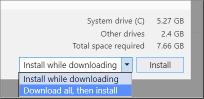

# Create an offline installation package of Visual Studio for local installation

> 📣 **We'd love to hear your feedback!**
> *Please take a moment to complete this [survey](https://aka.ms/learnlayoutfeedback) and let us know how we can improve the layout experience. Thank you for your support!*

Visual Studio is designed to work well in various computer configurations. In this article, you learn how to create an offline installation package of files for installation on the **local machine**.

> [!IMPORTANT]
> If you are an enterprise IT administrator who wants to perform a deployment of Visual Studio throughout a network of client workstations, or if you need to create an installation package of files to transfer to or install onto *another* machine, refer to our [Visual Studio Administrators Guide](https://aka.ms/vs/admin/guide), the [create a network-based installation of Visual Studio](create-a-network-installation-of-visual-studio.md) page, and the [deploy a layout onto a client machine](deploy-a-layout-onto-a-client-machine.md) documentation.

## Use the "Download all, then install" feature

Sometimes online access is problematic. For example, you might have an unreliable internet connection or your internet connection might have low bandwidth. For situations like these, you have other methods available for acquiring Visual Studio. You can use the **Download all, then install** feature from the Visual Studio Installer to download an installation package on the local machine *before* you install it locally, or you can use the command line to create a local installation package to install locally later.

After you [download the bootstrapper](#step-1---download-the-visual-studio-bootstrapper), run it to install Visual Studio. It'll first install and then launch the latest version of the Visual Studio Installer, which you can use to customize and configure your installation, download installation packages, and install the product.

To complete downloading the product before installation starts, select the **Download all, then install** option in the dropdown at the bottom of the default **Workloads** tab of the Visual Studio Installer. The purpose of this feature is to download the Visual Studio packages in advance on the computer where Visual Studio will eventually be installed. By downloading the packages locally first, you can then safely disconnect from the internet before you install Visual Studio.

   

> [!NOTE]
> The **Download all, then install** functionality downloads a Visual Studio installation package that is customized to the local machine. Don't transfer this downloaded installation package to another computer, as it's not designed to work that way.
>
> If you want to download an installation package, host it on a network share or an intranet website, and transfer it to or install it on another machine, then you'll need to create a network layout as described in the [create a network-based installation of Visual Studio](create-a-network-installation-of-visual-studio.md) documentation.

You can also configure future updates of Visual Studio to respect the **Download all, then install** behavior. For more information, see the [installation and download behavior](/visualstudio/install/update-visual-studio?#installation-and-download-behaviors-1) documentation.

## Use the command line to create a local layout

### Step 1 - Download the Visual Studio bootstrapper

[Download the correct bootstrapper for the version and edition of Visual Studio you want](create-a-network-installation-of-visual-studio.md#download-the-visual-studio-bootstrapper-to-create-the-layout) and copy it into the directory you want to use as the source location for your local layout. The bootstrapper is the executable you use to create, update, or modify your local layout. You must have an internet connection to complete this step. 

### Step 2 - Create a local layout

Open a command prompt with administrator privileges, navigate to the directory where you downloaded the bootstrapper, and use the [bootstrapper's parameters](use-command-line-parameters-to-install-visual-studio.md#layout-command-and-command-line-parameters) to create your local layout. You must have an internet connection to complete this step.

You can install a language other than English by changing `en-US` to a locale from the [list of language locales](use-command-line-parameters-to-install-visual-studio.md#list-of-language-locales), and you can use the [list of components and workloads](workload-and-component-ids.md) to further customize your local layout.

Here are some common local layout creation examples. More examples can be found on the [create a network layout of Visual Studio](create-a-network-installation-of-visual-studio.md#configure-the-contents-of-a-layout) page and on the [command-line parameter examples](command-line-parameter-examples.md#using---layout-to-create-a-network-layout-or-a-local-cache) page.

- To create a complete local layout with all features and all languages (this'll take a long time&mdash;we have *lots* of features!), run:

   ```shell
    vs_enterprise.exe --layout c:\localVSlayout
    ```
::: moniker range="vs-2019"

   > [!NOTE]
   > Make sure that your full installation path is less than 80 characters and that your machine has ample storage. A complete local layout of Visual Studio requires a minimum of 41 GB of disk space. For more information, see [System requirements](/visualstudio/releases/2019/system-requirements/).

::: moniker-end

::: moniker range=">=vs-2022"

   > [!NOTE]
   > Make sure that your full installation path is less than 80 characters and that your machine has ample storage. A complete local layout of Visual Studio requires a minimum of 45 GB of disk space. For more information, see [System requirements](/visualstudio/releases/2022/system-requirements/).

::: moniker-end

- For .NET web and .NET desktop development for only one language, run:

   ```shell
    vs_enterprise.exe --layout c:\localVSlayout --add Microsoft.VisualStudio.Workload.ManagedDesktop --add Microsoft.VisualStudio.Workload.NetWeb --lang en-US
    ```
    
- For C++ desktop development including all recommended and optional components, for only one language run:

   ```shell
    vs_enterprise.exe --layout c:\localVSlayout --add Microsoft.VisualStudio.Workload.NativeDesktop --includeRecommended --includeOptional --lang en-US 
    ```
    
- You can also [use an exported vsconfig file](create-a-network-installation-of-visual-studio.md#configure-the-contents-of-a-layout) to customize the layout content, [verify](create-a-network-installation-of-visual-studio.md?#verify-a-layout) a layout, or [fix](create-a-network-installation-of-visual-studio.md?#fix-a-layout) a layout.

### Step 3 - Install Visual Studio from the local layout

When you install Visual Studio from a local layout, the Visual Studio Installer uses the local versions of the files. But if you select components during installation that aren't in the layout, then the Visual Studio Installer attempts to download them from the internet. To make sure you install only the files you previously downloaded, use the same [command-line options](use-command-line-parameters-to-install-visual-studio.md) you used to create the local layout. To make sure your installer doesn't try to access the internet when it's installing the product, use the `--noweb` switch.

For example, if you created a local installation layout with the following command:

::: moniker range="<=vs-2019"

```shell
vs_enterprise.exe --layout c:\localVSlayout --add Microsoft.VisualStudio.Workload.ManagedDesktop --add Microsoft.VisualStudio.Workload.NetWeb --add Component.GitHub.VisualStudio --includeOptional --lang en-US
```

Then use the following command to run the installation and prevent the client machine from accessing the internet:

```shell
c:\localVSlayout\vs_enterprise.exe --noWeb --add Microsoft.VisualStudio.Workload.ManagedDesktop --add Microsoft.VisualStudio.Workload.NetWeb --add Component.GitHub.VisualStudio --includeOptional
```

::: moniker-end

::: moniker range=">=vs-2022"

```shell
vs_enterprise.exe --layout c:\localVSlayout --add Microsoft.VisualStudio.Workload.ManagedDesktop --add Microsoft.VisualStudio.Workload.NetWeb --includeOptional --lang en-US
```

Then use the following command to run the installation and prevent the client machine from accessing the internet:

```shell
c:\localVSlayout\vs_enterprise.exe --noWeb --add Microsoft.VisualStudio.Workload.ManagedDesktop --add Microsoft.VisualStudio.Workload.NetWeb --includeOptional
```

::: moniker-end

> [!IMPORTANT]
> If you're using Visual Studio Community, you might be prompted to sign in within 30 days of installation, but it won't impact your ability to use the product.

> [!NOTE]
> If you get an error that a signature is invalid, you must [install updated certificates](install-certificates-for-visual-studio-offline.md). Open the Certificates folder in your local layout. Double-click each of the certificate files, and then click through the Certificate Manager wizard. If you're asked for a password, leave it blank.

[!INCLUDE[install_get_support_md](includes/install_get_support_md.md)]

## Related content

- [Visual Studio Administrators Guide](https://aka.ms/vs/admin/guide)
- [Install certificates required for Visual Studio offline installation](../install/install-certificates-for-visual-studio-offline.md)
- [Use command-line parameters to install Visual Studio](use-command-line-parameters-to-install-visual-studio.md)
- [Visual Studio workload and component IDs](workload-and-component-ids.md)
- [Update a network-based installation of Visual Studio](update-a-network-installation-of-visual-studio.md)
- [Install Help Viewer for offline documentation](../help-viewer/overview.md)
