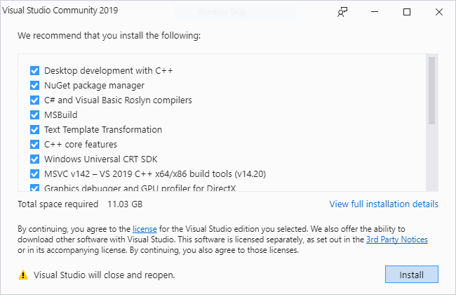

# Import or export configurations

Now, you can export selected workloads and components to a Visual Studio installation configuration file, and then import them later into new or existing installations. To share the configuration files with others, simply check them into your source repos. 

::: moniker range="vs-2017"

> [!NOTE]
> This functionality is available only in Visual Studio 2017 version 15.9 and later. 

::: moniker-end

::: moniker range="vs-2019"

::: moniker-end

In Visual Studio 2017 Update 15.9 we added the ability to export and import workload and component selection to a Visual Studio installation configuration file. Developers can import these files into new or existing installations. Checking these files into your source repos makes them easy to share. However, developers still need to import these to get the features they need.

## Automatically install missing components

New in Visual Studio 2019: you can save these files as .vsconfig files in your solution root directory and when the solution (or solution directory) is opened, Visual Studio will automatically detect which components are missing and prompt you to install them.

Exporting your configuration
In Visual Studio 2019, you can create a .vsconfig file right from Solution Explorer:
Right-click on your solution.
Click Add > Installation Configuration File
Confirm the location where you want to save the .vsconfig file (defaults to your solution root directory).
Click Review details
Select or deselect any changes you want to make and click Export
To help keep the installation footprint minimal, only export those components you know you need to build, test, and possibly publish your solution. One way you can do this is to install a second instance of Visual Studio or install into a virtual machine, add those workloads and optional components you know are necessary, and build and test your solution. Add components as needed until the solution builds successfully, then export your configuration.

https://devblogs.microsoft.com/setup/configure-visual-studio-across-your-organization-with-vsconfig/