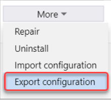
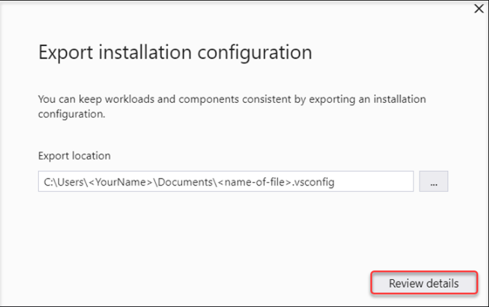

# Import or export installation configurations

You can use installation configuration files to configure what Visual Studio installs. To do so, export the workloads, components, and Marketplace extension information into a `.vsconfig` file by using the Visual Studio Installer. Once you have a `*.vsconfig` file, you can further refine it manually and add or remove additional items. The structure and syntax of the `*.vsconfig` file is [described below](#vsconfig-file-format). You can also import the configuration file into a new or existing Visual Studio installation, use it to create or modify a layout or an offline installation, put it in a solution directory or repo and trigger an install of missing components, and share it with others.

## Export a configuration using the Visual Studio Installer

You can export an installation configuration file from a previously installed instance of Visual Studio. 

> [!NOTE]
> Starting with Visual Studio 2022 version 17.10 Preview, you can now export [Visual Studio Marketplace extensions](https://marketplace.visualstudio.com/vs) that were loaded in an instance wide context into a *.vsconfig file. If you'd like the `export` functionality to be able to export other types of extensions such as those loaded from a network share or those loaded in user context, [please let us know](https://developercommunity.visualstudio.com/t/Ability-to-export-non-marketplace-or-use/10602937).

### Use the Visual Studio Installer UI

1. Open the Visual Studio Installer.

1. On the product card, choose the **More** button, and then select **Export configuration**.

   

1. Browse to or type the location where you want to save your .vsconfig file, and then choose **Review details**.

   

1. Verify that your selections are accurate, and then choose **Export**.

   ::: moniker range="vs-2022"

      :::image type="content" source="../install/media/vs-2022/export-configuration-confirmation-1.png" alt-text="Screenshot of the Export Window.":::

   ::: moniker-end

### Export a configuration file programmatically

You can programmatically export a configuration file of a particular Visual Studio instance by using the `export` verb as described in the [Install Visual Studio from the command line](use-command-line-parameters-to-install-visual-studio.md) documentation.

## Import a configuration using the Visual Studio Installer

You can import an installation configuration file into a previously installed instance of Visual Studio, or you can use it to initialize a new installation of Visual Studio. Importing a configuration file into Visual Studio will install anything listed in the config file that's not already installed. 

### Use the Visual Studio Installer UI

When you're ready to import an installation configuration file, follow these steps.

1. Open the Visual Studio Installer and close Visual Studio. Most Installer operations require that the Visual Studio product itself is closed. 

1. On either the **Installed** tab or the **Available** tab, select **More** > **Import configuration** on the Visual Studio product card.

1. Locate the `.vsconfig` file that you want to import, and then choose **Review details**.

1. Verify that your selections are accurate, and then choose **Modify**.

### Programmatically use a configuration file to add components to an existing installation
 
You can use the `--config` parameter to either initialize or modify an existing installation and add components. The example below uses the installer on the client machine to `modify` an existing installation.

```shell
"C:\Program Files (x86)\Microsoft Visual Studio\Installer\setup.exe" modify --installPath "C:\Program Files\Microsoft Visual Studio\2022\Professional" --config "C:\myconfig.vsconfig" --passive --allowUnsignedExtensions
```

> [!NOTE]
> To add components to an existing installation by using a config file (`*.vsconfig`), you'll need to `modify` your installed product and **not** `update` it. `Update` just updates existing installed components to the latest version. To learn more about the different installer operations, refer to the [Install Visual Studio from the command line](use-command-line-parameters-to-install-visual-studio.md) documentation.

## Use a configuration file to initialize the contents of a layout

Using the correct bootstrapper that corresponds to the version and edition of Visual Studio that you want, open an administrator command prompt and run the following command to use the `--config` parameter to configure the contents of a layout.  [More information about using *.vsconfig files to initialize and install from layouts can be found here](create-a-network-installation-of-visual-studio.md#use-a-configuration-file-to-initialize-the-contents-of-a-layout).

```shell
vs_enterprise.exe --layout "c:\localVSlayout" --config "c:\myconfig.vsconfig" --lang en-US
```

## Use a configuration file to automatically install missing components

If you save a `*.vsconfig` file into your solution root directory and then open a solution, Visual Studio will automatically detect any missing components and will prompt you to install them.

> [!NOTE]
> If your `*.vsconfig` file contains extensions, then currently, only those extensions that are hosted on the [Visual Studio Marketplace](https://marketplace.visualstudio.com/) will trigger the automatic "is-missing" detection and installation. If you would like this logic to include extensions that were installed from a non-Marketplace location, please [provide details about your scenario here](https://developercommunity.visualstudio.com/t/post/10607414).


You can also generate a `*.vsconfig` file right from **Solution Explorer**.

1. Right-click on your solution file.

1. Choose **Add** > **Installation Configuration File**.

1. Confirm the location where you want to save the .vsconfig file, and then choose **Review details**.

1. Make sure you've got the workloads and components that you want, and then choose **Export**.

We also created an open source utility that locates Visual Studio installation configuration `*.vsconfig` files downstream recursively and merges them all together. You can find [more information about the VSConfigFinder tool here](https://github.com/microsoft/VSConfigFinder).

## vsconfig file format

The `*.vsconfig` file is a json file format that contains a components section and optionally an extensions section. The components section contains [workloads and components](workload-and-component-ids.md) and looks like this:

```shell
{
  "version": "1.0", 
  "components": [ 
    "Microsoft.VisualStudio.Component.CoreEditor", 
    "Microsoft.VisualStudio.Workload.CoreEditor", 
    "Microsoft.VisualStudio.Component.NuGet" 
    ] 
}
```

### Extensions

Starting in [Visual Studio 2022 version 17.9](/visualstudio/releases/2022/release-notes), you can specify extensions in the `*.vsconfig` file and use the Visual Studio Installer to load them machine wide making them available for all users. Starting in Visual Studio 2022 version 17.10 Preview, you can use the Visual Studio Installer to `export` Visual Studio Marketplace extensions into the *.vsconfig file that were loaded in an instance wide context as [described previously](#export-a-configuration-using-the-visual-studio-installer). 

There are a few known caveats with supporting extensions in the config file.

1. Since the extensions loaded via a config file are installed instance wide, you must have admin permissions or have been granted control of the installer via the [AllowStandardUserControl](https://aka.ms/vs/setup/policies) policy in order to install them. Note that any extensions previously installed by the Visual Studio Extension Manager had the capability of being (and were typically) installed per user, not instance wide, and the user didn't need to have admin permissions to install.
1. The Visual Studio Installer currently only supports importing certain types of extensions, such as those contained in a `*.vsix` package or those that aren't exceedingly "complicated". If you have an extension that is not being loaded via a config file properly, please let us know about it via a new [Developer Community suggestion](https://developercommunity.visualstudio.com/VisualStudio/suggest).  
1. Only extensions that are hosted on the [Visual Studio Marketplace](https://marketplace.visualstudio.com/) will trigger the automatic "missing" detection and installation if the *.vsconfig file is in a solution directory. If you'd like this logic to include extensions that were installed from a non-Marketplace location, [please provide details about your scenario here](https://developercommunity.visualstudio.com/t/VS-solution-load-should-detect-and-promp/10607414).
1. If you are programmatically using a `*.vsconfig` file to add extensions, then you will also need to use the new [`--allowUnsignedExtensions` parameter](use-command-line-parameters-to-install-visual-studio.md) to allow **un**signed extensions to be loaded in `--passive` or `--quiet` context. If you're installing from a layout, you can add the [`"allowUnsignedExtensions" : true` syntax to your `response.json` file](/visualstudio/install/automated-installation-with-response-file#example-customized-layout-response-file-content) to achieve a similar effect. 

All instance wide extensions are automatically updated approximately once a day via a scheduled task. You can find more information [here](/visualstudio/ide/finding-and-using-visual-studio-extensions#automatic-extension-updates).

The .vsconfig file format that includes extensions should look like this.

```shell
{
  "version": "1.0", 
  "components": [ 
    // Whatever components you want to install come here, in quotes, separated by commas.
    // You can use the installer to select the components you want to install and then export them,
    // Or you can specify the ones you want according to the [component-id's](https://learn.microsoft.com/en-us/visualstudio/install/workload-and-component-ids).
    // This array should not be null! If you don't want to install any component, just leave the array empty.
  ],
  "extensions": [
    // The extensions you want to install are specified in this section, in quotes, separated by commas.
    // Extensions are optional in .vsconfig, so if you don't want any, you can delete the entire extensions section.
    // The extensions must be in a *.vsix package
    // Make sure that the extensions you specify are designed to work with that version of Visual Studio.
    // examples below
    "https://marketplace.visualstudio.com/items?itemName=MadsKristensen.ImageOptimizer64bit",   //unsigned extension
    "https://marketplace.visualstudio.com/items?itemName=vsext.RegexMatchVisualizer",  //signed extension
    "c:\\mylocaldrive\\someextension.vsix",
    "\\\\server\\share\\myextension.vsix",
    "https://myweb/anotherextension.vsix"
  ]
}
```

[!INCLUDE[install_get_support_md](includes/install_get_support_md.md)]

## Related content

* [Configure Visual Studio across your organization with .vsconfig April 2019 blog post](https://devblogs.microsoft.com/setup/configure-visual-studio-across-your-organization-with-vsconfig/)
* [Create a network installation of Visual Studio](create-a-network-installation-of-visual-studio.md)
* [Update a networked-based installation of Visual Studio](update-a-network-installation-of-visual-studio.md)
* [Control updates to Visual Studio deployments](controlling-updates-to-visual-studio-deployments.md)
* [Configure policies for enterprise deployments](configure-policies-for-enterprise-deployments.md)
