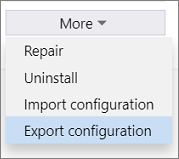
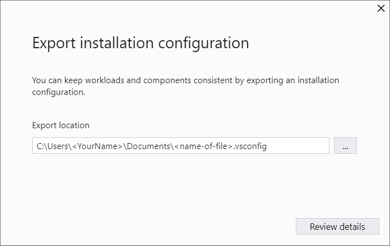
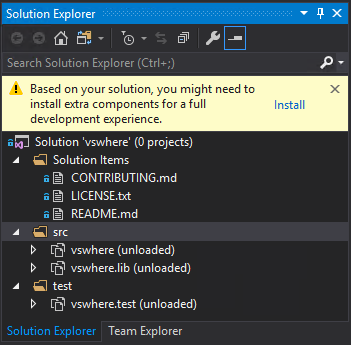

# Import or export installation configurations

You can configure Visual Studio across your organization with installation configuration files. To do so, simply export the workload and component information to a .vsconfig file by using the Visual Studio installer. You can then import the configuration into new or existing installations, and share them with others, too.

Here's how.

::: moniker range="vs-2017"

> [!NOTE]
> This functionality is available only in Visual Studio 2017 version 15.9 and later.

::: moniker-end

## Export a configuration

You can choose to export an installation configuration file from either a previously installed instance of Visual Studio or one that you're currently installing.

1. Open the Visual Studio Installer.

1. On the product card, choose the **More** button, and then select **Export configuration**.

   

1. Browse to or type the location where you want to save your .vsconfig file, and then choose **Review details**.

   

1. Make sure you've got the workloads and components that you want, and then choose **Export**.

## Import a configuration

When you're ready to import an installation configuration file, follow these steps.

1. Open the Visual Studio Installer.

1. On the product card, choose the **More** button, and then select **Import configuration**.

1. Locate the .vsconfig file that you want to import, and then choose **Review details**.

1. Make sure you've got the workloads and components that you want, and then choose **Close**.

::: moniker range=">=vs-2019"

## Automatically install missing components

**New in Visual Studio 2019**: When you save a .vsconfig file to your solution root directory and then open a solution, Visual Studio automatically detects which components are missing and prompts you to install them.

You can also generate a .vsconfig file right from Solution Explorer.

1. Right-click on your solution file.

1. Choose **Add** > **Installation Configuration File**.

1. Confirm the location where you want to save the .vsconfig file, and then choose **Review details**.

1. Make sure you've got the workloads and components that you want, and then choose **Export**.

::: moniker-end

> [!NOTE]
> For more information, see the [Configure Visual Studio across your organization with .vsconfig](https://devblogs.microsoft.com/setup/configure-visual-studio-across-your-organization-with-vsconfig/) blog post.

[!INCLUDE[install_get_support_md](includes/install_get_support_md.md)]

## See also

* [Create a network installation of Visual Studio](create-a-network-installation-of-visual-studio.md)
* [Update a networked-based installation of Visual Studio](update-a-network-installation-of-visual-studio.md)
* [Control updates to Visual Studio deployments](controlling-updates-to-visual-studio-deployments.md)
* [Set defaults for enterprise deployments](set-defaults-for-enterprise-deployments.md)
