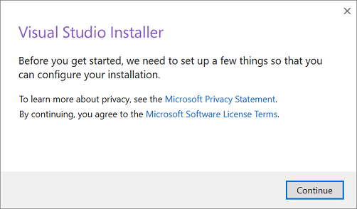
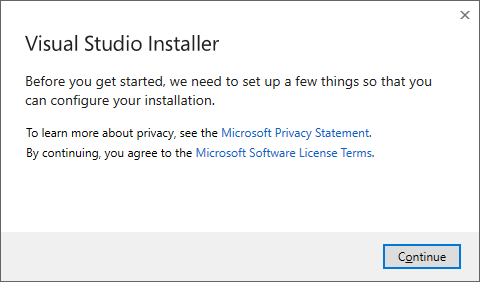
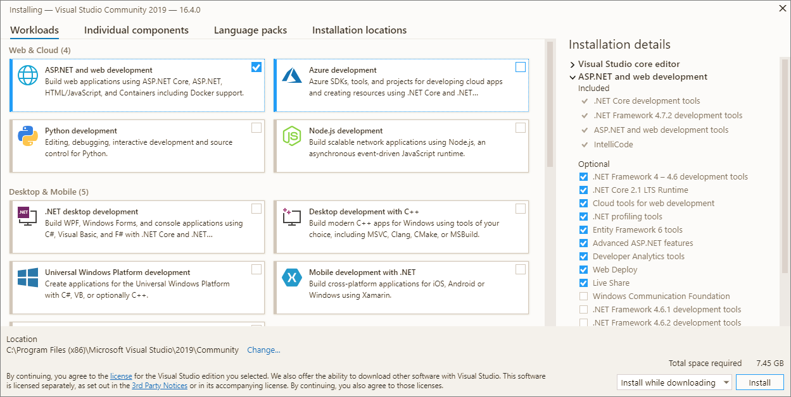
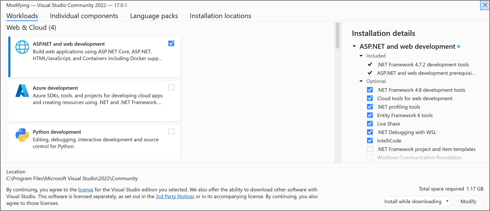
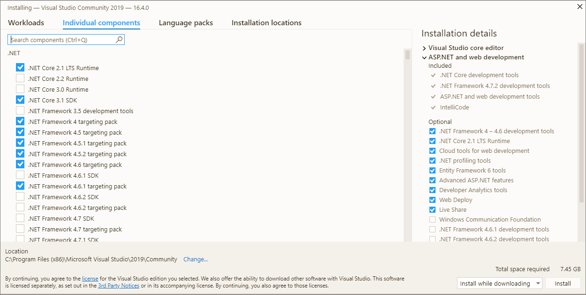
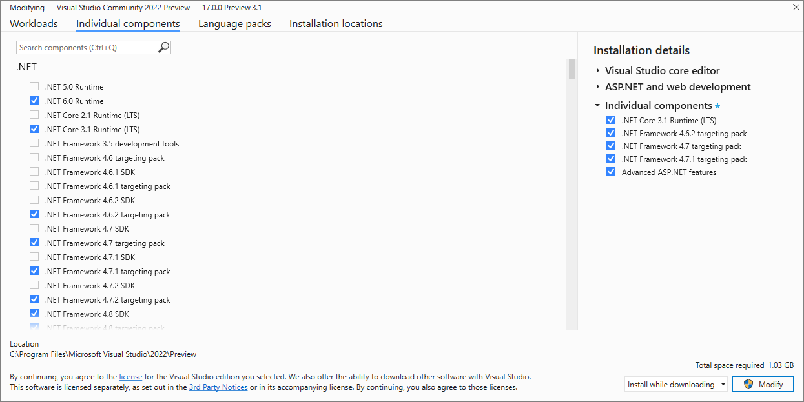
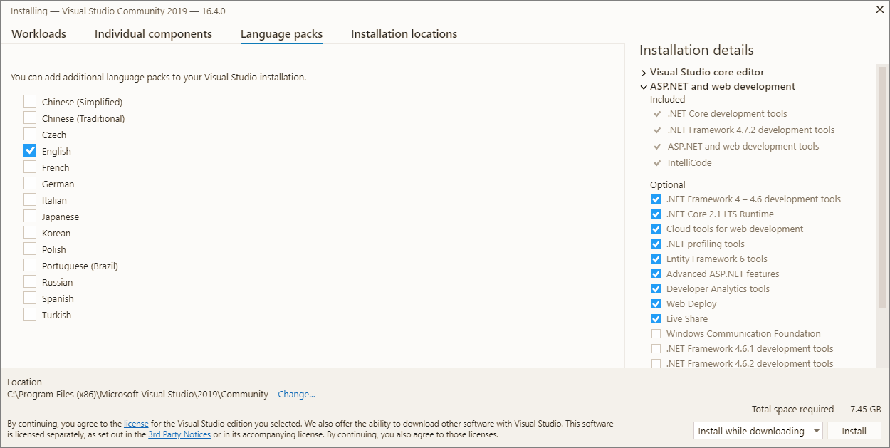
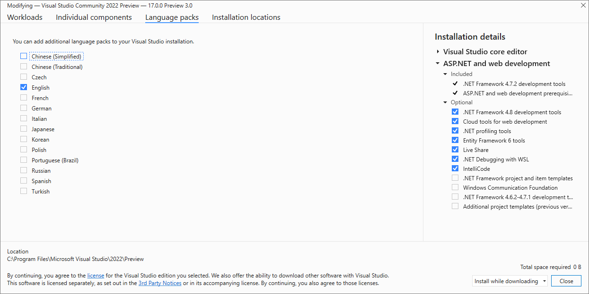
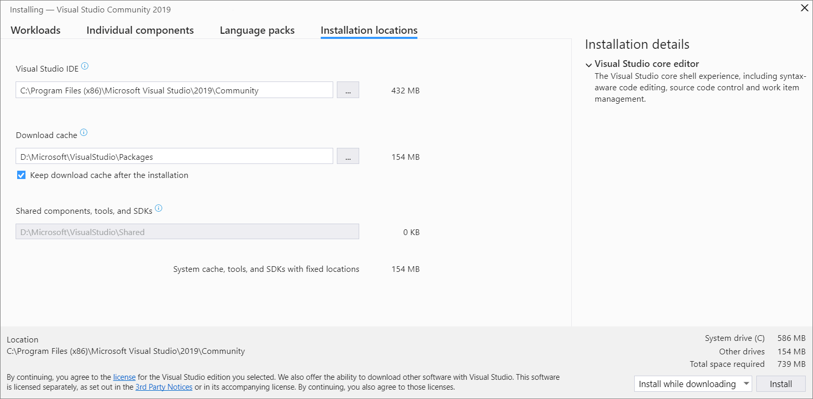
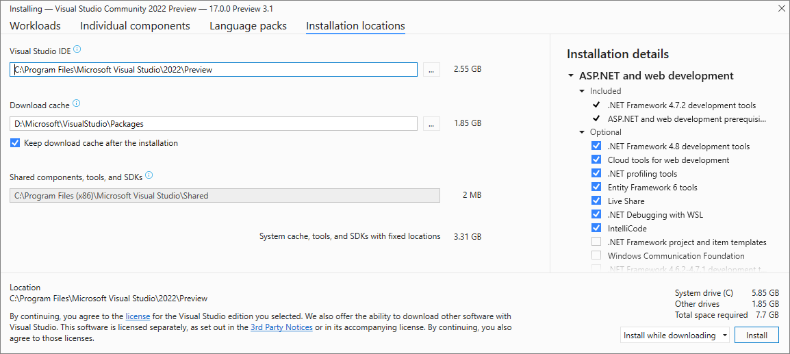

# Install Visual Studio

 [!INCLUDE [Visual Studio](~/includes/applies-to-version/vs-windows-only.md)]

::: moniker range="vs-2019"

Welcome to Visual Studio 2019! In this version, it's easy to choose and install just the features you need. And because of its reduced minimum footprint, it installs quickly and with less system impact.

::: moniker-end

::: moniker range=">=vs-2022"

Welcome to Visual Studio 2022! In this version, it's easy to choose and install just the features you need.

::: moniker-end

> [!NOTE]
> This topic applies to Visual Studio on Windows. For Visual Studio for Mac, see [Install Visual Studio for Mac](/visualstudio/mac/installation/). If you need to programmatically install Visual Studio, refer to the [online command line documentation](use-command-line-parameters-to-install-visual-studio.md).

::: moniker range="vs-2019"

Want to know more about what else is new in this version? See our [release notes](/visualstudio/releases/2019/release-notes/).

::: moniker-end

::: moniker range=">=vs-2022"

Want to know more about what else is new in this version? See our [release notes](/visualstudio/releases/2022/release-notes/).

::: moniker-end

Ready to install? We'll walk you through it, step-by-step.

## Step 1 - Make sure your computer is ready for Visual Studio

Before you begin installing Visual Studio:

::: moniker range="vs-2019"

1. Check the [system requirements](/visualstudio/releases/2019/system-requirements). These requirements help you know whether your computer supports Visual Studio 2019.

1. Make sure that the user performing the installation has administrator permissions on the machine. For more information, see [User Permissions and Visual Studio](/visualstudio/ide/user-permissions-and-visual-studio).

1. Apply the latest Windows updates. These updates ensure that your computer has both the latest security updates and the required system components for Visual Studio.

1. Reboot. The reboot ensures that any pending installs or updates don't hinder your Visual Studio install.

1. Free up space. Remove unneeded files and applications from your system drive by, for example, running the Disk Cleanup app.

For questions about running other versions of Visual Studio side by side with Visual Studio 2019, see [Visual Studio 2019 Platform Targeting and Compatibility](/visualstudio/releases/2019/compatibility/).

::: moniker-end

::: moniker range=">=vs-2022"

1. Check the [system requirements](/visualstudio/releases/2022/system-requirements). These requirements help you know whether your computer supports Visual Studio 2022.

1. Make sure that the user performing the installation has administrator permissions on the machine. For more information, see [User Permissions and Visual Studio](/visualstudio/ide/user-permissions-and-visual-studio).

1. Apply the latest Windows updates. These updates ensure that your computer has both the latest security updates and the required system components for Visual Studio.

1. Reboot. The reboot ensures that any pending installs or updates don't hinder your Visual Studio install.

1. Free up space. Remove unneeded files and applications from your system drive by, for example, running the Disk Cleanup app.

You can install Visual Studio 2022 side-by-side with other versions. For more information, see [Visual Studio 2022 platform targeting and compatibility](/visualstudio/releases/2022/compatibility) and [Install Visual Studio versions side-by-side](install-visual-studio-versions-side-by-side.md).

::: moniker-end

## Step 2 - Determine which version and edition of Visual Studio to install

You will need to decide which version and edition of Visual Studio to install. The most common options are:

::: moniker range="vs-2019"

- The latest release of Visual Studio 2019 that is hosted on Microsoft servers. To install this, click on the following button and then choose the edition you want. A small "bootstrapper" file will then be downloaded into your **Downloads** folder.

 > [!div class="button"]
 > [Download Visual Studio](/visualstudio/releases/2019/release-notes/)

::: moniker-end

::: moniker range=">=vs-2022"

- The latest release of Visual Studio 2022 that is hosted on Microsoft servers. To install this, click on the following button and then choose the edition you want. A small "bootstrapper" file will then be downloaded into your **Downloads** folder.

 > [!div class="button"]
 > [Download Visual Studio](https://visualstudio.microsoft.com/downloads)

::: moniker-end

- If you already have Visual Studio installed, you can [install another version alongside it](/visualstudio/install/install-visual-studio-versions-side-by-side#install-different-editions-within-the-same-major-visual-studio-version-side-by-side) by choosing one that is offered in the Visual Studio Installer's **Available** tab.

::: moniker range="vs-2019"

- You can download a bootstrapper for a very specific version from the [Visual Studio 2019 Release History](/visualstudio/releases/2019/history#installing-an-earlier-release) page and use it to install Visual Studio. 

::: moniker-end

::: moniker range=">=vs-2022"

- You can download a bootstrapper for a very specific version from the [Visual Studio 2022 Release History page](/visualstudio/releases/2022/release-history#release-dates-and-build-numbers) page and use it to install Visual Studio.

::: moniker-end

- Your IT administrator may point you to a specific location to install Visual Studio from.

## Step 3 - Initiate the installation

If you downloaded a bootstrapper file, then you can use it to install Visual Studio. The bootstrapper will first install the latest version of the Visual Studio Installer. The installer is a separate program that provides everything you need to both install and customize Visual Studio.

::: moniker range="vs-2019"

1. From your **Downloads** folder, double-click the bootstrapper that matches or is similar to one of the following files:

   * **vs_community.exe** for Visual Studio Community
   * **vs_professional.exe** for Visual Studio Professional
   * **vs_enterprise.exe** for Visual Studio Enterprise

::: moniker-end

::: moniker range=">=vs-2022"

1. From your **Downloads** folder, double-click the bootstrapper named **VisualStudioSetup.exe** or named something like **vs_community.exe** to start the installation.  

::: moniker-end

1. If you receive a User Account Control notice, choose **Yes**.  We'll ask you to acknowledge the Microsoft [License Terms](https://visualstudio.microsoft.com/license-terms/) and the Microsoft [Privacy Statement](https://privacy.microsoft.com/privacystatement). Choose **Continue**.

::: moniker range="<=vs-2019"

   

::: moniker-end

::: moniker range=">=vs-2022"

   

::: moniker-end

You can also intiate an installation of any product that is offered on the [Visual Studio Installer's Available tab](/visualstudio/install/install-visual-studio-versions-side-by-side#install-different-editions-within-the-same-major-visual-studio-version-side-by-side). 

## Step 4 - Choose workloads

After the Visual Studio Installer is installed, you can use it to customize your installation by selecting the feature sets—or workloads—that you want. Here's how.

::: moniker range="vs-2019"

1. Find the workload you want in the **Visual Studio Installer**.

   

     For example, choose the "ASP.NET and web development" workload. It comes with the default core editor, which includes basic code editing support for over 20 languages, the ability to open and edit code from any folder without requiring a project, and integrated source code control.

1. After you choose the workload(s) you want, choose **Install**.

    Next, status screens appear that show the progress of your Visual Studio installation.

::: moniker-end

::: moniker range=">=vs-2022"

1. Select the workload you want in the **Visual Studio Installer**.

   

     Review the workload summaries to decide which workload supports the features you need. For example, choose the **ASP.NET and web development** workload to edit ASP.NET Web pages with Web Live Preview or build responsive web apps with Blazor, or choose from **Desktop & Mobile** workloads to develop cross-platform apps with C#, or C++ projects that target C++20.

1. After you choose the workload(s) you want, select **Install**.

    Next, status screens appear that show the progress of your Visual Studio installation.

::: moniker-end

> [!TIP]
> At any time after installation, you can install workloads or components that you didn't install initially. If you have Visual Studio open, go to **Tools** > **Get Tools and Features...** which opens the Visual Studio Installer. Or, open the **Visual Studio Installer** from the Start menu. From there, you can choose the workloads or components that you wish to install. Then, choose **Modify**.

## Step 5 - Choose individual components (optional)

If you don't want to use the Workloads feature to customize your Visual Studio installation, or you want to add more components than a workload installs, you can do so by installing or adding individual components from the **Individual components** tab. Choose what you want, and then follow the prompts.

::: moniker range="vs-2019"

  

::: moniker-end

::: moniker range=">=vs-2022"

  

::: moniker-end

## Step 6 - Install language packs (optional)

By default, the installer program tries to match the language of the operating system when it runs for the first time. To install Visual Studio in a language of your choosing, choose the **Language packs** tab from the Visual Studio Installer, and then follow the prompts.

::: moniker range="vs-2019"

  

::: moniker-end

::: moniker range=">=vs-2022"

  

::: moniker-end

### Change the installer language from the command line

::: moniker range="<=vs-2019"

Another way that you can change the default language is by running the installer from the command line. 
For example, you can force the installer to run in English by using the following command: 

  ```shell
  vs_installer.exe --locale en-US
  ```

The installer will remember this setting when it is run the next time. The installer supports the following language tokens: zh-cn, zh-tw, cs-cz, en-us, es-es, fr-fr, de-de, it-it, ja-jp, ko-kr, pl-pl, pt-br, ru-ru, and tr-tr.

::: moniker-end

::: moniker range=">=vs-2022"

Another way that you can change the default language is by running the installer from the command line. 
For example, you can force the installer to run in English by using the following command: 

  ```shell
  vs_installer.exe --locale en-US
  ```

The installer will remember this setting when it's run the next time. The installer supports these [language locales](/visualstudio/install/use-command-line-parameters-to-install-visual-studio?view=vs-2022&preserve-view=true#list-of-language-locales): zh-cn, zh-tw, cs-cz, en-us, es-es, fr-fr, de-de, it-it, ja-jp, ko-kr, pl-pl, pt-br, ru-ru, and tr-tr.

::: moniker-end

## Step 7 - Select the installation location (optional)

::: moniker range="vs-2019"

You can reduce the installation footprint of Visual Studio on your system drive. You can choose to move the download cache, shared components, SDKs, and tools to different drives, and keep Visual Studio on the drive that runs it the fastest.

  

::: moniker-end

::: moniker range=">=vs-2022"

You can reduce the installation footprint of Visual Studio on your system drive. For more information, see [Select installation locations](change-installation-locations.md).

  

::: moniker-end

> [!IMPORTANT]
> You can select a different drive for **Visual Studio IDE** or **Download cache** only when you first install Visual Studio. If you've already installed it and want to change drives, you must uninstall Visual Studio and then reinstall it.
>
> If you've installed Visual Studio on your computer before, you won't be able to change the **Shared components, tools, and SDKs** path and it will appear greyed out. This location is shared by all installations of Visual Studio.

## Step 8 - Start developing

::: moniker range="vs-2019"

1. After Visual Studio installation is complete, select the **Launch** button to get started developing with Visual Studio.

1. On the start window, choose **Create a new project**.

1. In the search box, enter the type of app you want to create to see a list of available templates. The list of templates depends on the workloads that you chose during installation. To see different templates, choose different workloads.

   You can also filter your search for a specific programming language by using the **Language** drop-down list. You can filter by using the **Platform** list and the **Project type** list, too.

1. Visual Studio opens your new project, and you're ready to code!

::: moniker-end

::: moniker range=">=vs-2022"

1. After your Visual Studio installation is complete, select the **Launch** button to get started developing with Visual Studio.

1. On the start window, choose **Create a new project**.

1. In the template search box, enter the type of app you want to create to see a list of available templates. The list of templates depends on the workloads that you chose during installation. To see different templates, choose different workloads.

   You can also filter your search for a specific programming language by using the **Language** drop-down list. You can filter by using the **Platform** list and the **Project type** list, too.

1. Visual Studio opens your new project, and you're ready to code!

::: moniker-end

[!INCLUDE[install_get_support_md](includes/install_get_support_md.md)]

## See also

* [Update Visual Studio](update-visual-studio.md)
* [Modify Visual Studio](modify-visual-studio.md)
* [Uninstall Visual Studio](uninstall-visual-studio.md)
* [Create an offline installation of Visual Studio](create-an-offline-installation-of-visual-studio.md)
* [Use command-line parameters to install Visual Studio](use-command-line-parameters-to-install-visual-studio.md)
* [Install Visual Studio for Mac](/visualstudio/mac/installation)
