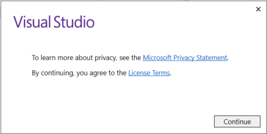
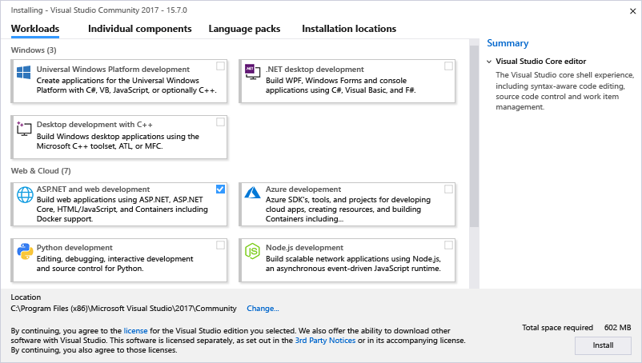
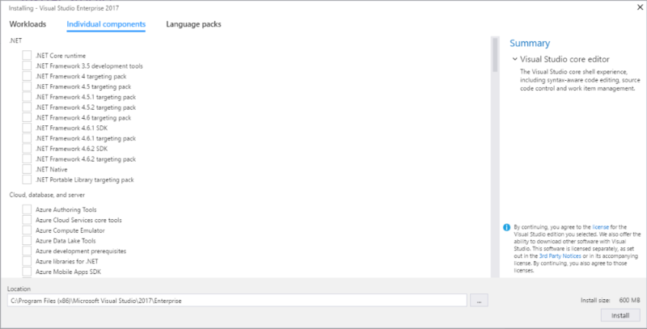
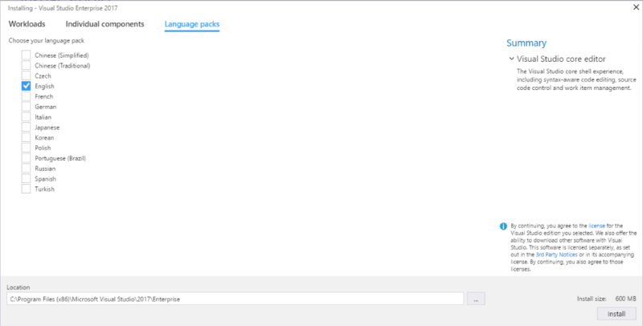
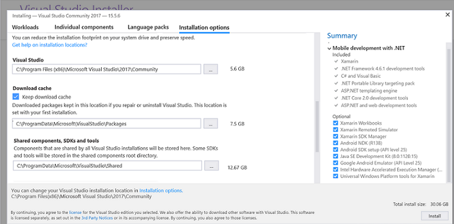

# Install Visual Studio

Welcome to a new way to install Visual Studio! In this version, we've made it easier for you to select and install just the features you need. We've also reduced the minimum footprint of Visual Studio so that it installs more quickly and with less system impact than ever before.

> [!NOTE]
> This topic applies to Visual Studio on Windows. For Visual Studio for Mac, see [Install Visual Studio for Mac](/visualstudio/mac/installation).

Want to know more about what else is new in this version? See our [release notes](/visualstudio/releasenotes/vs2017-relnotes).

Ready to install? We'll walk you through it, step-by-step.

## Step 1 - Make sure your computer is ready for Visual Studio

Before you begin installing Visual Studio:

1. Check the [system requirements](/visualstudio/productinfo/vs2017-system-requirements-vs). These requirements help you know whether your computer supports Visual Studio 2017.
2. Apply the latest Windows updates. These updates ensure that your computer has both the latest security updates and the required system components for Visual Studio.
3. Reboot. The reboot ensures that any pending installs or updates don't hinder the Visual Studio install.
4. Free up space. Remove unneeded files and applications from your %SystemDrive% by, for example, running the Disk Cleanup app.

For questions about running previous versions of Visual Studio side by side with Visual Studio 2017, see the [Visual Studio compatibility details](/visualstudio/productinfo/vs2017-compatibility-vs#compatibility-with-previous-releases).

## Step 2 - Download Visual Studio

Next, download the Visual Studio bootstrapper file. To do so, choose the following button, select the edition of Visual Studio 2017 that you want, choose **Save**, and then choose **Open folder**.

 > [!div class="button"]
 > [Download Visual Studio 2017](https://visualstudio.microsoft.com/downloads/?utm_medium=microsoft&utm_source=docs.microsoft.com&utm_campaign=button+cta&utm_content=download+vs2017)
 

## Step 3 - Install the Visual Studio installer

Then, run the bootstrapper file to install the Visual Studio Installer. This new lightweight installer includes everything you need to both install and customize Visual Studio 2017.

1. From your **Downloads** folder, double-click the bootstrapper that matches or is similar to one of the following files:

   * **vs_enterprise.exe** for Visual Studio Enterprise
   * **vs_professional.exe** for Visual Studio Professional
   * **vs_community.exe** for Visual Studio Community    

   If you receive a User Account Control notice, choose **Yes**.

2. We'll ask you to acknowledge the Microsoft [License Terms](https://visualstudio.microsoft.com/license-terms/) and the Microsoft [Privacy Statement](https://privacy.microsoft.com/privacystatement). Choose **Continue**.

   

## Step 4 - Select workloads

After the installer is installed, you can use it to customize your installation by selecting the feature sets—or workloads—that you want. Here's how.

1. Find the workload you want in the **Installing Visual Studio** screen.

   

     For example, choose the ".NET desktop development" workload. It comes with the default core editor, which includes basic code editing support for over 20 languages, the ability to open and edit code from any folder without requiring a project, and integrated source code control.

2. After you select the workload(s) you want, choose **Install**.

    Next, status screens appear that show the progress of your Visual Studio installation.

3. After the new workloads and components are installed, choose **Launch**.

> [!TIP]
> At any time after installation, you can install workloads or components that you didn't install initially. If you have Visual Studio open, go to **Tools** > **Get Tools and Features...** which opens the Visual Studio Installer. Or, open **Visual Studio Installer** from the Start menu. From there, you can select the workloads or components that you wish to install, then choose **Modify**.

## Step 5 - Select individual components (Optional)

If you don't want to use the Workloads feature to customize your Visual Studio installation, you can do so by installing individual components instead. To select individual components, choose the **Individual components** option from the Visual Studio Installer, select what you want, and then follow the prompts.

  

## Step 6 - Install language packs (Optional)

By default, the installer program tries to match the language of the operating system when it runs for the first time. To install Visual Studio 2017 in a language of your choosing, choose the **Language packs** option from the Visual Studio Installer, and follow the prompts.

  

### Change the installer language from the command line

Another way that you can change the default language is by running the installer from the command line. For example, you can force the installer to run in English by using the following command: `vs_installer.exe --locale en-US`. The installer will remember this setting when it is run the next time. The installer supports the following language tokens: zh-cn, zh-tw, cs-cz, en-us, es-es, fr-fr, de-de, it-it, ja-jp, ko-kr, pl-pl, pt-br, ru-ru, and tr-tr.

## Step 7 - Change the installation location (Optional)

**New in 15.7**: You can now reduce the installation footprint of Visual Studio on your system drive. You can choose to move the download cache, shared components, SDKs, and tools to different drives, and keep Visual Studio on the drive that runs it the fastest.

  

For more information, see the [Change installation locations in Visual Studio](change-installation-locations.md) page.

## Step 8 - Start developing

::: moniker range="vs-2017"

1. After Visual Studio installation is complete, choose the **Launch** button to get started developing with Visual Studio.

2. Choose **File**, and then choose **New Project**.

3. Select a project type.

   For example, to [build a C++ app](../ide/getting-started-with-cpp-in-visual-studio.md), choose **Installed**, expand **Visual C++**, and then select the C++ project type that you want to build.

   To [build a C# app](../get-started/csharp/tutorial-wpf.md), choose **Installed**, expand **Visual C#**, and then select the C# project type that you want to build.

::: moniker-end

::: moniker range="vs-2019"

1. After Visual Studio installation is complete, choose the **Launch** button to get started developing with Visual Studio.

1. On the start window, choose **Create a new project**.

1. In the search box, enter the type of app you want to create to see a list of templates. (For example, type *WFP*.)

  > [!TIP]
  > You can filter your search for a specific programming language by using the **Language** drop-down list. You can also filter by using the **Platform** list and the **Project type** list. 

1. Visual Studio opens your new project, and you're ready to code!

::: moniker-end

[!INCLUDE[install_get_support_md](includes/install_get_support_md.md)]

## See also

* [Update Visual Studio](update-visual-studio.md)
* [Modify Visual Studio](modify-visual-studio.md)
* [Uninstall Visual Studio](uninstall-visual-studio.md)
* [Create an offline installation of Visual Studio](create-an-offline-installation-of-visual-studio.md)
* [Use command-line parameters to install Visual Studio](use-command-line-parameters-to-install-visual-studio.md)
* [Install Visual Studio for Mac](/visualstudio/mac/installation)