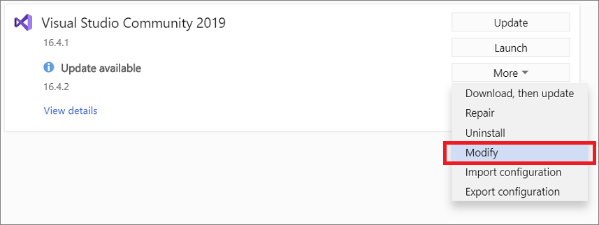
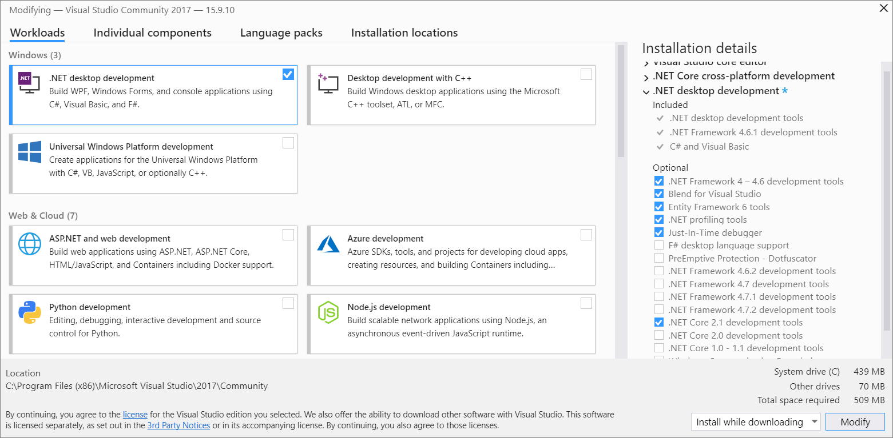

# Modify Visual Studio workloads, components, and language packs

::: moniker range=">=vs-2019"

It's easy to modify Visual Studio so that it includes only what you want, when you want it. To do so, open the Visual Studio Installer to add or remove workloads and components.

::: moniker-end

::: moniker range="vs-2017"

Not only have we made it easier for you to personalize Visual Studio to match the tasks you want to accomplish, we've also made it easier to customize Visual Studio, too. To do so, open the new Visual Studio Installer and make the changes you want.

::: moniker-end

## Prerequisites

+ To install, update, or modify Visual Studio, you must log on with an account that has administrative permissions. For more information, see [User permissions and Visual Studio](../ide/user-permissions-and-visual-studio.md).

+ The following procedures assume that you have an internet connection. For more information about how to modify a previously created [offline installation](create-an-offline-installation-of-visual-studio.md) of Visual Studio, see both the [Update a network-based installation of Visual Studio](update-a-network-installation-of-visual-studio.md) page and the [Control updates to network-based Visual Studio deployments](controlling-updates-to-visual-studio-deployments.md) page.

## Launch the installer

To make modifications to your installation, you need to launch the Visual Studio installer.

::: moniker range="vs-2017"

1. Find the Visual Studio Installer on your computer.

     For example, on a computer running Windows 10, select **Start**, and then scroll to the letter **V**, where it's listed as **Visual Studio Installer**.

     

     >[!TIP]
     >On some computers, the Visual Studio Installer might be listed under the letter **"M"** as the **Microsoft Visual Studio Installer**.   Alternatively, you can find the Visual Studio Installer in the following location: `C:\Program Files (x86)\Microsoft Visual Studio\Installer\vs_installer.exe`

1. Open the installer, and then choose **Modify**.

     

     > [!IMPORTANT]
     > If you have an update pending, the Modify button is in a different place. This way, you can modify Visual Studio without updating it, should you choose to do so. Click **More**, and then choose **Modify**.
     >
     > 

::: moniker-end

::: moniker range=">=vs-2019"

1. Find the **Visual Studio Installer** on your computer.

     In the Windows Start menu, you can search for "installer".

     

     > [!NOTE]
     > You can also find the Visual Studio Installer in the following location:
     >
     > `C:\Program Files (x86)\Microsoft Visual Studio\Installer\vs_installer.exe`

    You might have to update the installer before continuing. If so, follow the prompts.

1. In the installer, look for the edition of Visual Studio that you installed, and then choose **Modify**.

     

     > [!IMPORTANT]
     > If you have an update pending, the Modify button is in a different place. This way, you can modify Visual Studio without updating it, should you want to. Choose **More**, and then choose **Modify**.
     >
     > 

::: moniker-end

## Change workloads or individual components

::: moniker range="vs-2017"

 [Workloads](https://visualstudio.microsoft.com/vs/support/selecting-workloads-visual-studio-2017/) contain the features you need for the programming language or platform that you're using. Use workloads to modify Visual Studio so that it supports the work you want to do, when you want to do it.

1. In the Visual Studio Installer, choose the **Workloads** tab, and then select or deselect the workloads that you want.

   Alternately, if you don't want to use workloads to customize your Visual Studio installation, choose the **Individual Components** tab and  select the components you want, and then follow the prompts.

    

1. Choose whether you want to accept the default **Install while downloading** option or the **Download all, then install** option.

    

    The "Download all, then install" option is handy if you want to download first and then install later.

1. Choose **Modify**.

1. If desired, choose the **Workloads** tab, and then select or deselect the workloads that you want.

1. After the new workloads are installed, choose **Launch** from the Visual Studio Installer to open Visual Studio.

::: moniker-end

::: moniker range=">=vs-2019"

 Workloads contain the features you need for the programming language or platform that you're using. Use workloads to modify Visual Studio so that it supports the work you want to do, when you want to do it.

 > [!TIP]
>For more information about which tool and component bundles you need for development, see [Visual Studio workloads](https://visualstudio.microsoft.com/vs/#workloads).

1. In the Visual Studio Installer, choose the **Workloads** tab, and then select or deselect the workloads that you want.

    

1. Choose whether you want to accept the default **Install while downloading** option or the **Download all, then install** option.

    

    The "Download all, then install" option is handy if you want to download first and then install later.

1. Choose **Modify**.

1. After the new workloads are installed, choose **Launch** from the Visual Studio Installer to open Visual Studio.

::: moniker-end

>[!TIP]
> For information about the SQL Server Data Tools (SSDT) component, see [Download and install SSDT for Visual Studio](/sql/ssdt/download-sql-server-data-tools-ssdt?view=sql-server-ver15&preserve-view=true).

## Modify language packs

By default, the installer matches the language of the operating system when it runs for the first time. However, you can change the language whenever you want. 

To do so:

1. Choose the **Language packs** tab in the Visual Studio Installer.
1. Select the language you prefer.
1. Follow the prompts.

[!INCLUDE[install_get_support_md](includes/install_get_support_md.md)]

## See also

* [List of Visual Studio workload & component IDs](workload-and-component-ids.md)
* [Update Visual Studio](update-visual-studio.md)
* [Update a network-based installation of Visual Studio](update-a-network-installation-of-visual-studio.md)
* [Uninstall Visual Studio](uninstall-visual-studio.md)
