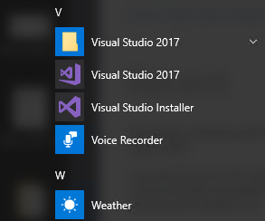
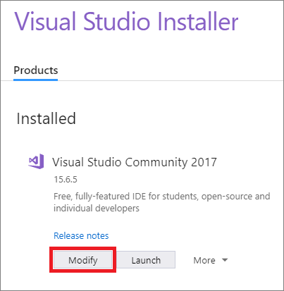
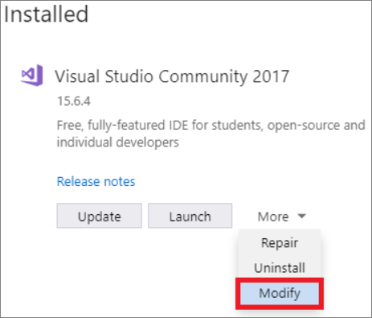
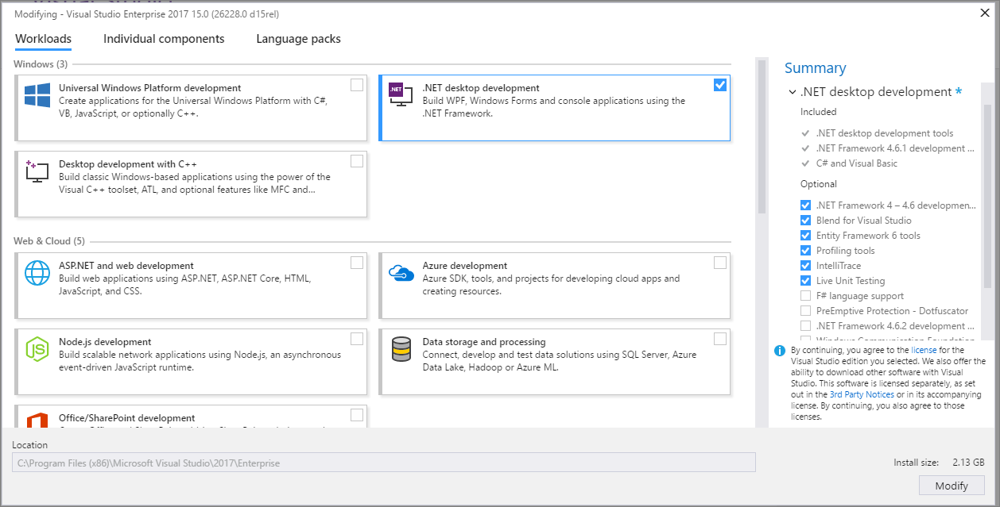
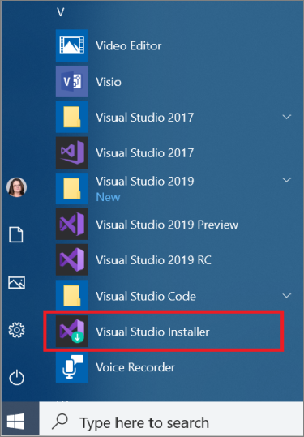
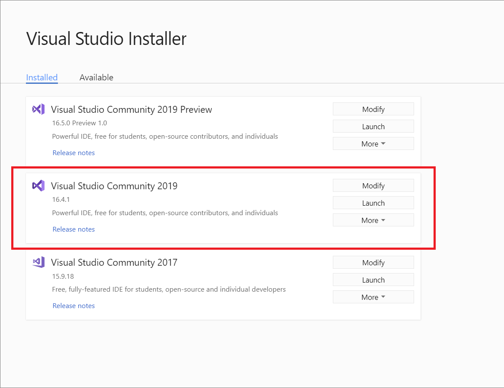
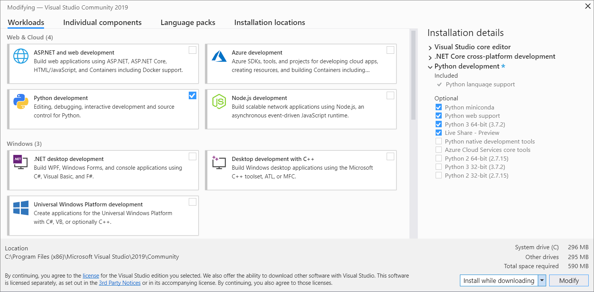

# Modify Visual Studio by adding or removing workloads and components

::: moniker range="vs-2019"

It's easy to modify Visual Studio so that it includes only what you want, when you want it. To do so, open the Visual Studio Installer to add or remove workloads and components.

::: moniker-end

::: moniker range="vs-2017"

Not only have we made it easier for you to personalize Visual Studio to match the tasks you want to accomplish, we've also made it easier to customize Visual Studio, too. To do so, start the new Visual Studio Installer and make the changes you want.

::: moniker-end

Here's how.

## Modify workloads

 Workloads contain the features you need for the programming language or platform that you are using. Use workloads to modify Visual Studio so that it supports the work you want to do, when you want to do it.

>[!IMPORTANT]
>To install, update, or modify Visual Studio, you must log on with an account that has administrative permissions. For more information, see [User Permissions and Visual Studio](../ide/user-permissions-and-visual-studio.md).

::: moniker range="vs-2017"

1. Find the Visual Studio Installer on your computer.

     For example, on a computer running Windows 10, select **Start**, and then scroll to the letter **V**, where it's listed as **Visual Studio Installer**.

     

     >[!NOTE]
     >On some computers, the Visual Studio Installer might be listed under the letter **"M"** as the **Microsoft Visual Studio Installer**.   Alternatively, you can find the Visual Studio Installer in the following location: `C:\Program Files (x86)\Microsoft Visual Studio\Installer\vs_installer.exe`

1. Click or tap to start the installer, and then choose **Modify**.

     

     If you have an update pending, the Modify button is in a different place. This way, you can modify Visual Studio without updating it, should you choose to do so. Click **More**, and then choose **Modify**.

     

1. From the **Workloads** screen, select or deselect the workloads that you want to install or uninstall.

    

1. Choose **Modify** again.

1. After the new workloads and components are installed, choose **Launch**.

::: moniker-end

::: moniker range="vs-2019"

1. Find the Visual Studio Installer on your computer.

     For example, on a computer running Windows 10, select **Start**, and then scroll to the letter **V**, where it's listed as **Visual Studio Installer**.

     

     > [!NOTE]
     > You can also find the Visual Studio Installer in the following location:
     >
     > `C:\Program Files (x86)\Microsoft Visual Studio\Installer\vs_installer.exe`

    You might have to update the installer before continuing. If so, follow the prompts.

1. In the installer, look for the edition of Visual Studio that you installed, and then choose **Modify**.

     

1. In the **Workloads** tab, select or deselect the workloads that you want to install or uninstall.

    

1. Choose whether you want to accept the default **Install while downloading** option or the **Download all, then install** option.

    

    The "Download all, then install" option is handy if you want to download first and then install later.

1. Choose **Modify**.

1. After the new workloads and components are installed, choose **Launch** from the Visual Studio Installer.

::: moniker-end

## Modify individual components

If you don't want to install workloads to customize your Visual Studio installation, choose the **Individual Components** tab from the Visual Studio Installer, select what you want, and then follow the prompts.

[!INCLUDE[install_get_support_md](includes/install_get_support_md.md)]

## See also

* [Update Visual Studio](update-visual-studio.md)
* [Update a network-based installation of Visual Studio](update-a-network-installation-of-visual-studio.md)
* [Uninstall Visual Studio](uninstall-visual-studio.md)
