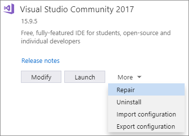
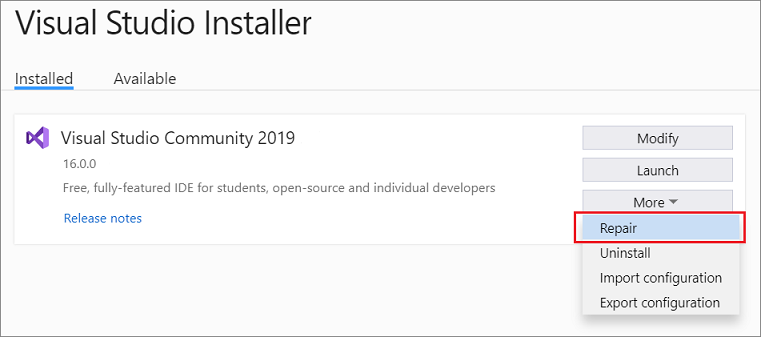

# Repair Visual Studio

Sometimes your Visual Studio installation becomes damaged or corrupted. A repair is useful for fixing install-time issues across all install operations, including updates.

## When to use repair
* If you're having installation payload issues. This may happen when writing the file to disk is not successful, and can't be fixed by deleting the corrupted file. Repair can re-acquire needed files. 
* If you're having client-side download issues. Assuming you've resolved any connection or proxy issues, repair may help. 
* If you're having issues updating Visual Studio. Repair fixes many common update issues. 

> [!TIP] 
> If the install issue is caused by an issue in an underlying Windows service, like Windows Installer, repair may hit the same issue. Systemic issues can include a broken Windows Installer or unstable internet connection. To check for a systemic issue, use the error report generated from the installation operation.

> [!NOTE] 
> Repairing Visual Studio resets user settings, and re-installs the assemblies you already have. If you're experiencing a product issue, create a [Visual Studio Feedback Ticket](https://aka.ms/feedback/suggest?space=8), as repair might not solve the issue.

## How to repair
::: moniker range="vs-2017"

1. Find the **Visual Studio Installer** on your computer.

     For example, on a computer running Windows 10 Anniversary Update or later, select **Start**, and then scroll to the letter **V**, where it's listed as **Visual Studio Installer**.

   > [!NOTE]
   > On some computers, the Visual Studio Installer might be listed under the letter **"M"** as the **Microsoft Visual Studio Installer**.
   >
   > Alternatively, you can find the Visual Studio Installer in the following location:
   >`C:\Program Files (x86)\Microsoft Visual Studio\Installer\vs_installer.exe`

1. Open the installer, choose **More**, and then choose **Repair**.

    

   > [!NOTE]
   > Repairing Visual Studio will reset the environment. Local customizations like per-user extensions installed without elevation, user settings, and profiles will be removed. Your synchronized settings such as themes, colors, key bindings will be restored.
   >

   > [!TIP]
   > The **Repair** option appears only for installed instances of Visual Studio. If you do not see the **Repair** option, chances are that you've selected **More** in a version that's listed in the Visual Studio Installer as "Available" rather than "Installed".

::: moniker-end

::: moniker range="vs-2019"

1. Find the **Visual Studio Installer** on your computer.

     In the Windows Start menu, you can search for "installer".

     

     > [!NOTE]
     > You can also find the Visual Studio Installer in the following location:
     >
     > `C:\Program Files (x86)\Microsoft Visual Studio\Installer\vs_installer.exe`

    You might have to update the installer before continuing. If so, follow the prompts.

1. In the installer, look for the edition of Visual Studio that you installed. Next, choose **More**, and then choose **Repair**.

     

   > [!NOTE]
   > Repairing Visual Studio will reset the environment. Local customizations like per-user extensions installed without elevation, user settings, and profiles will be removed. Your synchronized settings such as themes, colors, key bindings will be restored.
   >

   > [!TIP]
   > The **Repair** option appears only for installed instances of Visual Studio. If you do not see the **Repair** option, chances are that you've selected **More** in a version that's listed in the Visual Studio Installer as "Available" rather than "Installed".

::: moniker-end

[!INCLUDE[install_get_support_md](includes/install_get_support_md.md)]

## See also

* [Install Visual Studio](install-visual-studio.md)
* [Update Visual Studio](update-visual-studio.md)
* [Uninstall Visual Studio](uninstall-visual-studio.md)
* [Troubleshooting Visual Studio installation and upgrade issues](troubleshooting-installation-issues.md)
