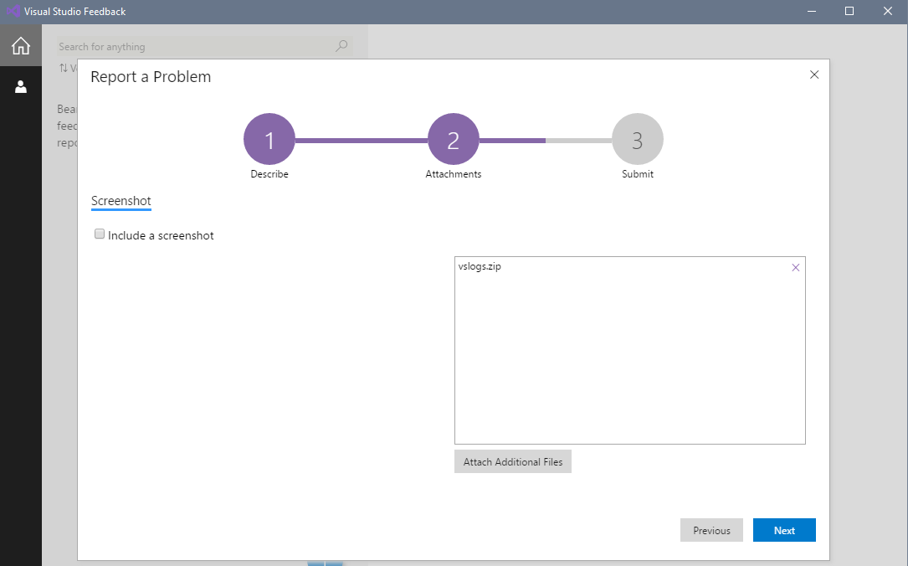

# Troubleshooting Visual Studio 2017 installation and upgrade failures

## Symptoms
When you try to install or update Microsoft Visual Studio 2017, the operation fails.

## Workaround
To work around this issue, follow these steps.

### Step 1 - Check whether this problem is a known issue
There are some known issues with the Visual Studio Installer that Microsoft is working on fixing. Check the [Known Issues section of our release notes](https://www.visualstudio.com/en-us/news/releasenotes/vs2017-relnotes#KIinstall) to see if there's a workaround for your problem.

### Step 2 - Check with the developer community
Search on your error message with the [Visual Studio Developer Community](https://developercommunity.visualstudio.com/spaces/8/index.html. Other members of the community may have documented a solution to your problem.

### Step 3 - Delete the Visual Studio Installer directory to fix upgrade problems
The Visual Studio Installer bootstrapper is a minimal light-weight executable that installs the rest of the Visual Studio Installer. Deleting Visual Studio Installer files and then rerunning the bootstrapper might solve some update failures. To do this, follow these steps:

1. Close the Visual Studio Installer.
2. Delete the Visual Studio Installer directory. Typically, the directory is C:\Program Files (x86)\Microsoft Visual Studio\Installer.
3. Run the Visual Studio Installer bootstrapper. You may find the bootstrapper in your Downloads folder with a file name that follows a ```vs_[Visual Studio edition]__*.exe``` pattern. If you don't find that application, you can download the bootstrapper by going to the [Visual Studio downloads](https://www.visualstudio.com/downloads/) page and clicking **download** for your edition of Visual Studio. Run this executable to reset your installation metadata.
4. Try to install or update Visual Studio again. If the Installer continues to fail, go to step 4 immediately below.
<br/>**Note:** This step will reinstall Visual Studio Installer files and reset installation metadata. 

### Step 4 - Report a problem
In some situations, such as those related to corrupted files, the problems may have to be looked at on a case-by-case basis:

1. Download the [Microsoft Visual Studio and the .NET Framework Log Collection Tool](https://www.microsoft.com/en-us/download/details.aspx?id=12493), and then run it. This tool collects and compiles available setup logs for Visual Studio, .NET Framework, and SQL Server installations.
2. Open the Visual Studio Installer, and then click **Report a problem** to open the Visual Studio Feedback tool.

3. Give your problem report a title, and provide relevant details. Click **Next** to go to the **Attachments** section, and then attach the generated log file (typically, the file is at %TEMP%\vslogs.zip).

4. Click **Next** to review your problem report, and then click **Submit**.

### Step 5 - Run InstallCleanup.exe to clean up installation files
As a last resort, you can run InstallCleanup.exe. InstallCleanup.exe is a utility that's packaged with the Visual Studio Installer, and it cleans up installation files. This isn't a full reinstall. This utility deletes cache and instance data for Visual Studio 2017.

1. Close the Visual Studio Installer.
2. Open an administrator command prompt. To do this, follow these steps:
   * On the **Start** menu, click **Run** (Start + R).
   * Type **cmd**.
   * Right-click **Command Prompt**, and then choose **Run as administrator**.
3. Type the full path of the InstallCleanup.exe utility, and pass the following command line switch: -f. By default, the path of the utility is as follows:<br/>```C:\Program Files (x86)\Microsoft Visual Studio\Installer\resources\app\layout\InstallCleanup.exe```
4. Rerun the bootstrapper that's described in Step 3.
5. Try to install or update Visual Studio again.

## How to troubleshoot an offline installer
Here is a table of known issues and some workarounds when installing from a local layout that might help.

| Issue       | Item                   | Solution |
| ----------- | ---------------------- | -------- |
| Users do not have access to files. | permissions (ACLs) | Make sure that you adjust the permissions (ACLs) so that they grant Read access to other users  *before* you share the offline install. |
| New workloads, components, or languages fail to install.  | `--layout`  | Make sure you have internet access if you install from a partial layout and select workloads, components, or languages that are not available in the earlier layout. |


