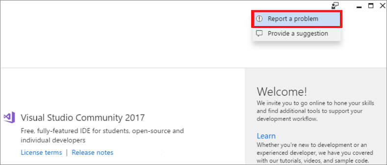
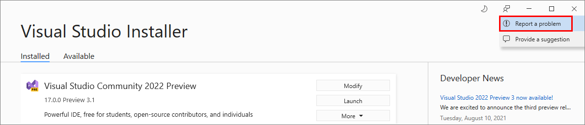

# Troubleshoot Visual Studio installation and upgrade issues

> [!IMPORTANT]
> Having a problem installing? We can help. We offer an [**installation chat**](https://visualstudio.microsoft.com/vs/support/#talktous) (English only) support option.

This troubleshooting guide includes step-by-step instructions that should resolve most installation issues.

## Online installations

The following steps apply to a typical online installation. For an offline installation, see [How to troubleshoot an offline installation](#offline-installations).

### Step 1 - Check whether the problem is a known issue

::: moniker range="vs-2017"

There are some known issues with the Visual Studio Installer that Microsoft is working on fixing. To see if there's a workaround for your problem, check the [Known Issues section of our release notes](/visualstudio/releasenotes/vs2017-relnotes#-known-issues).

::: moniker-end

::: moniker range="vs-2019"

There are some known issues with the Visual Studio Installer that Microsoft is working on fixing. To see if there's a workaround for your problem, check the [Known Issues section of our release notes](/visualstudio/releases/2019/release-notes#-known-issues).

::: moniker-end

::: moniker range=">=vs-2022"

There are some known issues with the Visual Studio Installer that Microsoft is working on fixing. Check if your problem is already solved, or find workarounds, in the [Known Issues section of our release notes](/visualstudio/releases/2022/release-notes#-known-issues).

::: moniker-end

### Step 2 - Try repairing Visual Studio

Repair fixes many common update issues. For more about when and how to repair Visual Studio, see [Repair Visual Studio](repair-visual-studio.md).

### Step 3 - Check with the developer community

Search for your error message in the [Visual Studio Developer Community](https://aka.ms/feedback/suggest?space=8) channel. Other members of the community might have found a solution or workaround to your problem.

### Step 4 - Delete the Visual Studio Installer folder to fix upgrade problems

The Visual Studio Installer bootstrapper is a light-weight executable that initiates the install of the Visual Studio Installer. Deleting the Visual Studio Installer files and then rerunning the bootstrapper solves some update failures.

> [!NOTE]
> Performing the following actions reinstalls the Visual Studio Installer files and resets the installation metadata.

::: moniker range="vs-2017"

1. Close the Visual Studio Installer.
1. Delete the Visual Studio Installer installation directory. Typically, the directory is `C:\Program Files (x86)\Microsoft Visual Studio\Installer`.
1. Run the Visual Studio Installer bootstrapper. You might find the bootstrapper in your Downloads folder with a file name that follows a `vs_[Visual Studio edition]__*.exe` pattern. If you don't find that application, you can download the bootstrapper by going to the [Visual Studio downloads](https://visualstudio.microsoft.com/vs/older-downloads/?utm_medium=microsoft&utm_source=docs.microsoft.com&utm_campaign=vs+2017+download) page and clicking **Download** for your edition of Visual Studio. Then, run the executable to reset your installation metadata.
1. Try to install or update Visual Studio again. If the Installer continues to fail, go to the next step.

::: moniker-end

::: moniker range="vs-2019"

1. Close the Visual Studio Installer.
1. Delete the Visual Studio Installer directory. Typically, the directory is `C:\Program Files (x86)\Microsoft Visual Studio\Installer`.
1. Run the Visual Studio Installer bootstrapper. You might find the bootstrapper in your Downloads folder with a file name that matches a `vs_[Visual Studio edition]__*.exe` pattern. If you don't find that application, you can download the bootstrapper by going to the [Visual Studio downloads](https://visualstudio.microsoft.com/downloads) page and clicking **Download** for your edition of Visual Studio. Then, run the executable to reset your installation metadata.
1. Try to install or update Visual Studio again. If the Installer continues to fail, go to the next step.

::: moniker-end

::: moniker range=">=vs-2022"

1. Close the Visual Studio Installer.
1. Delete the Visual Studio Installer folder. Typically, the folder path is `C:\Program Files (x86)\Microsoft Visual Studio\Installer`.
1. Run the Visual Studio Installer bootstrapper. You might find the bootstrapper in your **Downloads** folder with a file name that matches a `vs_[Visual Studio edition]__*.exe` pattern. Or, you can download the bootstrapper for your edition of Visual Studio from the [Visual Studio downloads](https://visualstudio.microsoft.com/downloads) page. Then, run the executable to reset your installation metadata.
1. Try to install or update Visual Studio again. If the Visual Studio Installer continues to fail, proceed to the [Report a problem](#step-5---report-a-problem) step.

::: moniker-end

### Step 5 - Report a problem

In some situations, such as when there are corrupted files, issues might require case-by-case troubleshooting. To help us help you, follow these steps:

::: moniker range="vs-2017"

1. Collect your setup logs. See [How to get the Visual Studio installation logs](#installation-logs) for details.
1. Open the Visual Studio Installer, and then click **Report a problem** to open the Visual Studio Feedback tool.

1. Give your problem report a title, and provide relevant details. Click **Next** to go to the **Attachments** section, and then attach the generated log file (typically, the file is at `%TEMP%\vslogs.zip`).
1. Click **Next** to review the problem report, and then click **Submit**.

::: moniker-end

::: moniker range="vs-2019"

1. Collect your setup logs. See [How to get the Visual Studio installation logs](#installation-logs) for details.
1. Open the Visual Studio Installer, and then click **Report a problem** to open the Visual Studio Feedback tool.

1. Give your problem report a title, and provide relevant details. Click **Next** to go to the **Attachments** section, and then attach the generated log file (typically, the file is at `%TEMP%\vslogs.zip`).
1. Click **Next** to review your problem report, and then click **Submit**.

::: moniker-end

::: moniker range=">=vs-2022"

1. Collect your setup logs. See [How to get the Visual Studio installation logs](#installation-logs) for details.
1. Open the Visual Studio Installer, and then choose **Report a problem** to open the Visual Studio Feedback tool.

1. Give your problem report a title, and provide the relevant details. The most recent setup log for the Visual Studio Installer is automatically added to the **Additional attachments** section of your problem report.
1. Choose **Submit**.

::: moniker-end

### Step 6 - Remove Visual Studio installation files

As a last resort, you can remove all Visual Studio installation files and product information:

1. Follow the steps on the [Remove Visual Studio](remove-visual-studio.md) page.
1. Rerun the Visual Studio Installer bootstrapper. You might find the bootstrapper in your **Downloads** folder with a file name that matches a `vs_[Visual Studio edition]__*.exe` pattern. Or, you can download the bootstrapper for your edition of Visual Studio from the [Visual Studio downloads](https://visualstudio.microsoft.com/downloads) page.
1. Try to reinstall Visual Studio.

### Step 7 - Contact us (optional)

If none of the previous steps help you successfully install or upgrade Visual Studio, contact us by using our [**live chat**](https://visualstudio.microsoft.com/vs/support/#talktous) support option (English only) for further assistance.

## Offline installations

Here are some known issues and workarounds that might help you when you create an [offline installation](create-an-offline-installation-of-visual-studio.md) and install from a local layout.

| Issue       | Solution |
| ----------- | -------- |
| Users can't access files | Make sure that you adjust the permissions (ACLs) so that they grant **read** access to other users *before* you share the offline install. |
| New workloads, components, or language packs fail to install | Make sure that you have internet access if you install from a partial layout and if you select workloads, components, or languages that weren't previously downloaded for that partial layout. |

To resolve issues with a [network installation](create-a-network-installation-of-visual-studio.md), see [Troubleshoot network-related errors when you install or use Visual Studio](troubleshooting-network-related-errors-in-visual-studio.md).

## Installation logs

Setup logs help us troubleshoot most installation issues. When you submit an issue by using [Report a Problem](../ide/how-to-report-a-problem-with-visual-studio.md) in the Visual Studio Installer, the most recent setup log for the Visual Studio Installer is automatically added to your report.

If you contact Microsoft Support, you might be asked to collect setup logs by using the [Microsoft Visual Studio and .NET Framework log collection tool](https://www.microsoft.com/download/details.aspx?id=12493). The log collection tool collects setup logs from all components installed by Visual Studio, including .NET Framework, Windows SDK, and SQL Server. It also collects computer information, a Windows Installer inventory, and Windows event log information for the Visual Studio Installer, Windows Installer, and System Restore.

To collect the logs:

1. [Download the tool](https://www.microsoft.com/download/details.aspx?id=12493).
1. Open an administrative command prompt.
1. Run `Collect.exe` in the folder where you saved the tool.
1. The tool generates a `vslogs.zip` file in your `%TEMP%` folder, typically at `C:\Users\YourName\AppData\Local\Temp\vslogs.zip`.

> [!NOTE]
> The tool must be run under the same user account that the failed installation was run under. If you are running the tool from a different user account, set the `–user:<name>` option to specify the user account under which the failed installation was run. Run `Collect.exe -?` from an administrator command prompt for additional options and usage information.

## Live help

If the solutions listed in this troubleshooting guide don't help you successfully install or upgrade Visual Studio, use our [**live chat**](https://visualstudio.microsoft.com/vs/support/#talktous) support option (English only) for further assistance.

## See also

* [Repair Visual Studio](repair-visual-studio.md)
* [Remove Visual Studio](remove-visual-studio.md)
* [Install and use Visual Studio and Azure Services behind a firewall or proxy server](install-and-use-visual-studio-behind-a-firewall-or-proxy-server.md)
* [Tools for detecting and managing Visual Studio instances](tools-for-managing-visual-studio-instances.md)
* [Visual Studio administrator guide](visual-studio-administrator-guide.md)
