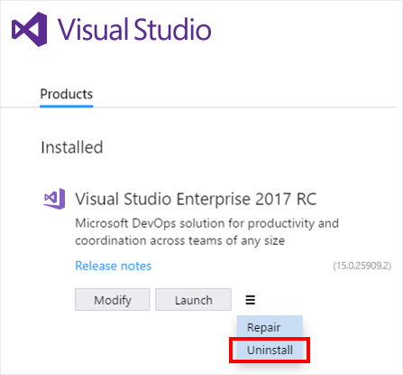

# Uninstall Visual Studio
This page walks you through uninstalling Visual Studio, our integrated suite of productivity tools for developers.  

1.  Find the Visual Studio installer on your computer.  

     For example, on a computer running Windows 10 Anniversary Update, click **Start**, and then scroll to the letter **M**, where you’ll see it listed as **Microsoft Visual Studio Installer**.  

     

2.  Click to start the installer, click the  icon, and then click **Uninstall**.  

       

3.  Click **OK** to confirm your choice.

       

If you change your mind later and want to reinstall Visual Studio 2017 RC, simply start the Visual Studio installer again, then click **Install** from the selection screen.

## See Also  
* [Install Visual Studio](../install/install-visual-studio-2015.md)
* [How to Report a Problem with Visual Studio 2017 RC](../ide/how-to-report-a-problem-with-visual-studio-2017.md)
