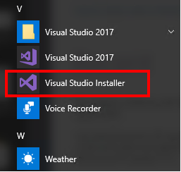
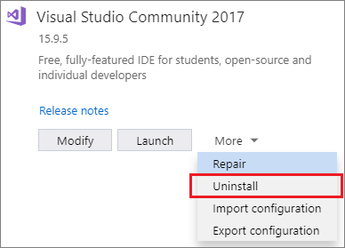

# Uninstall Visual Studio

This page walks you through uninstalling Visual Studio, our integrated suite of productivity tools for developers.

> [!NOTE]
> This topic applies to Visual Studio on Windows. For Visual Studio for Mac, see [Uninstall Visual Studio for Mac](/visualstudio/mac/uninstall).

::: moniker range="vs-2017"

1. Find the Visual Studio Installer on your computer.

     For example, on a computer running Windows 10 Anniversary Update or later, select **Start** and scroll to the letter **V**, where it's listed as **Visual Studio Installer**.

     

   > [!NOTE]
   > On some computers, the Visual Studio Installer might be listed under the letter **"M"** as the **Microsoft Visual Studio Installer**.   Alternatively, you can find the Visual Studio Installer in the following location: `C:\Program Files (x86)\Microsoft Visual Studio\Installer\vs_installer.exe`

1. In the installer, look for the edition of Visual Studio that you installed. Next, choose **More**, and then choose **Uninstall**.

     

1. Click **OK** to confirm your choice.

If you change your mind later and want to reinstall Visual Studio 2017, start the Visual Studio Installer again, and then select **Install** from the selection screen.

## Uninstall Visual Studio Installer

To completely remove all installations of Visual Studio 2017 and the Visual Studio Installer from your machine, uninstall it from Apps & Features.

1. In Windows 10, type **Apps and Features** in the "Type here to search" box.
1. Find **Microsoft Visual Studio 2017** (or, **Visual Studio 2017**).
1. Choose **Uninstall**.
1. Then, find **Microsoft Visual Studio Installer**.
1. Choose **Uninstall**.

::: moniker-end

::: moniker range="vs-2019"

1. Find the Visual Studio Installer on your computer.

     For example, on a computer running Windows 10, select **Start**, and then scroll to the letter **V**, where it's listed as **Visual Studio Installer**.

     

     > [!NOTE]
     > You can also find the Visual Studio Installer in the following location:
     >
     > `C:\Program Files (x86)\Microsoft Visual Studio\Installer\vs_installer.exe`

    You might have to update the installer before continuing. If so, follow the prompts.

1. In the installer, look for the edition of Visual Studio that you installed. Next, choose **More**, and then choose **Uninstall**.

     

1. Click **OK** to confirm your choice.

     

If you change your mind later and want to reinstall Visual Studio 2019, start the Visual Studio Installer again, choose the **Available** tab,  choose the edition of Visual Studio that you want to install, and then select **Install**.

## Uninstall Visual Studio Installer

To remove all installations of Visual Studio 2019 and the Visual Studio Installer from your machine, uninstall it from Apps & Features.

1. In Windows 10, type **Apps and Features** in the "Type here to search" box.
1. Find **Visual Studio 2019**.
1. Choose **Uninstall**.
1. Then, find **Microsoft Visual Studio Installer**.
1. Choose **Uninstall**.

::: moniker-end

[!INCLUDE[install_get_support_md](includes/install_get_support_md.md)]

## See also

* [Modify Visual Studio](modify-visual-studio.md)
* [Update Visual Studio](update-visual-studio.md)
* [Uninstall Visual Studio for Mac](/visualstudio/mac/uninstall)
