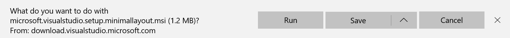
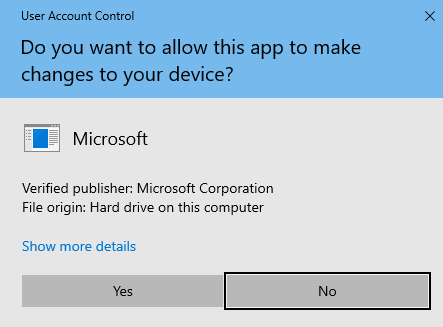

# Update Visual Studio using a minimal offline layout

For computers that are not connected to the internet, creating a minimal layout is the easiest and fastest way to update your offline Visual Studio instances.

The minimal layout tool generates a layout tailored specifically to your team's needs. Enterprise administrators can use this tool to create update layout(s) for most versions of Visual Studio, including Visual Studio 2017. Unlike a full Visual Studio layout, a minimal layout only contains the updated packages, so it is always smaller and faster to generate and deploy. You can further minimize the size of the update layout by specifying only the desired languages, workloads, and components.

## How to generate a minimal layout

> [!IMPORTANT]
> These instructions assume that you've previously created and used layouts. For more information about how to do so, see the [Update a network-based installation of Visual Studio](update-a-network-installation-of-visual-studio.md) page.
>
> For a better understanding of the Visual Studio lifecycle, see the [Visual Studio Product Lifecycle and Servicing](/visualstudio/productinfo/vs-servicing) page.
>

This tool creates update layouts for Visual Studio 2017 (15.9) and onwards. The layout can be deployed to network/offline machines to update Visual Studio instances. During [normal layout creation](update-a-network-installation-of-visual-studio.md), all the packages for that particular release are downloaded. Normal layout creation is required for repairing, uninstalling, and other standard operations on Visual Studio instances. The minimal layout downloads only updated packages, so it's smaller and easier to copy to offline machines.

### Installing the minimal layout tool

 1. First, download the minimal layout tool located [here](https://aka.ms/vs/installer/minimallayout). Make sure to choose **Save** when prompted, then select **Run**.

     

 2. Next, accept the User Account Control prompt by clicking **Yes**.

     

 3. The minimal layout tool will be installed to `C:\Program Files (x86)\Microsoft Visual Studio\MinimalLayout`.

### How to use the minimal layout tool

`MinimalLayout.exe` uses the following commands and options to generate the layout. At least one command is required to run the tool. Here's how you'll run the tool:

```MinimalLayout.exe [command] <options>...```

#### Commands

* **Preview**: Use this command to preview how many packages will download, and the total space used to create this layout.
* **Generate**: Use this command to generate the minimal layout for updating Visual Studio.
* **Regenerate**: Use this command to regenerate a layout using an existing minimal layout response file. Every minimal layout produces a `MinimalLayout.json` response file, which contains the original minimal layout input parameters. You can use the **Regenerate** command and a `MinimalLayout.json` response file to regenerate the minimal layout. This is useful if you want to create a minimal layout for a new Visual Studio update based on the previous minimal layout's response file.

   For this command, a `MinimalLayout.json` file path from an already generated layout is required.

   ```shell
   MinimalLayout.exe regenerate --filePath C:\MinimalLayout\MinimalLayout.json
   ```

* **Verify**: Use this command to determine if the layout folder is corrupted.
* **Fix**: Use this command to fix a corrupted layout folder, including replacing any missing packages from the layout folder.

#### Options

| Options                                             | Description                                                                                                                                                                                                                                                                                                                                                                                                                                 | Required/Optional               | Example                                                                                                                                                          |
|-----------------------------------------------------|---------------------------------------------------------------------------------------------------------------------------------------------------------------------------------------------------------------------------------------------------------------------------------------------------------------------------------------------------------------------------------------------------------------------------------------------|---------------------------------|------------------------------------------------------------------------------------------------------------------------------------------------------------------|
| --targetLocation &lt;dir&gt;                        | Specifies a directory in which to create a minimal offline layout.                                                                                                                                                                                                                                                                                                                                                                          | Required                        | --targetLocation c:\VSLayout\                                                                                                                                    |
| --baseVersion &lt;version&gt;                       | The minimal offline layout will be generated starting with this version.                                                                                                                                                                                                                                                                                                                                                                    | Required                        | --baseVersion 16.4.0                                                                                                                                             |
| --targetVersion &lt;version&gt;                     | The minimal offline layout will be generated up to and including this version.                                                                                                                                                                                                                                                                                                                                                              | Required                        | --targetVersion 16.4.4                                                                                                                                           |
| --languages                                         | Specifies the languages to include in the minimal offline layout. Multiple values can be specified, separated by spaces.                                                                                                                                                                                                                                                                                                                    | Required                        | --languages en-US fr-FR                                                                                                                                          |
| --productIds &lt;one or more product IDs&gt;        | The ID(s) of the product(s) from which the minimal offline layout will be generated, separated by commas. <br> <ul><li>Microsoft.VisualStudio.Product.Enterprise</li><li>Microsoft.VisualStudio.Product.Professional</li><li>Microsoft.VisualStudio.Product.BuildTools</li><li>Microsoft.VisualStudio.Product.TestAgent</li><li>Microsoft.VisualStudio.Product.TestController</li><li>Microsoft.VisualStudio.Product.TeamExplorer</li></ul> | Required                        | --productIds Microsoft.VisualStudio.Product.Enterprise,Microsoft.VisualStudio.Product.Professional                                                               |
| --filePath                                          | The file path of the MinimalLayout.json file from an already created layout. This option is only used with the Regenerate command.                                                                                                                                                                                                                                                                                                          | Required for Regenerate command | --filePath C:\VSLayout\minimalLayout.json <br><br> **Note that the Regenerate command only takes --filePath as an option.**                                      |
| --add &lt;one or more workload or component IDs&gt; | Specifies one or more workload or component IDs to add. Additional components can be added globally using --includeRecommended and/or <br> –-includeOptional. Multiple workloads or component IDs can be specified, separated by a space.                                                                                                                                                                                                   | Optional                        | --add Microsoft.VisualStudio.Workload.ManagedDesktop Microsoft.VisualStudio.Workload.NetWeb Component.GitHub.VisualStudio                                        |
| --includeRecommended                                | Includes the recommended components for any workloads that are installed, but not the optional components.                                                                                                                                                                                                                                                                                                                                  | Optional                        | For a  specific workload: <br> --add Microsoft.VisualStudio.Workload. ManagedDesktop;includeRecommended <br><br> To apply to all workloads: --includeRecommended |
| --includeOptional                                   | Includes the optional components for any workloads that are installed, including the recommended components.                                                                                                                                                                                                                                                                                                                                | Optional                        | For a specific workload: <br>--add Microsoft.VisualStudio.Workload. ManagedDesktop;includeOptional <br><br> To apply to all workloads: --includeOptional         |

### Generating a minimal layout

> [!IMPORTANT]
> These instructions assume that you've previously created a network installation layout. For more information about how to do so, see the [Create a network installation of Visual Studio](create-a-network-installation-of-visual-studio.md) page.

Create a minimal layout using the **generate** command for your specified range of versions. You'll also need to know the productId, languages, and any specific workloads required. This minimal layout will update any Visual Studio instance from the base version up to and including the target version.

Before creating the layout, you can find out the total size of the download and the number of packages included by using the **preview** command. This command takes the same options as the **generate** command, and the details are written to the console.

Let's walk through a few examples of how to preview, generate, and regenerate a minimal layout:

* First, here's an example of how to preview a layout for Visual Studio Enterprise versions 16.4.0 to 16.4.4 for English only.

  ```shell
  MinimalLayout.exe preview --targetLocation c:\VSLayout\ --productIds Microsoft.VisualStudio.Product.Enterprise --baseVersion 16.4.0 --targetVersion 16.4.4 --languages en-US
  ```

* Here's how to generate that same layout with one workload.

  ```shell
  MinimalLayout.exe generate --targetLocation c:\VSLayout\ --productIds Microsoft.VisualStudio.Product.Enterprise --baseVersion 16.4.0 --targetVersion 16.4.4 --add Microsoft.VisualStudio.Workload.ManagedDesktop;includeOptional --languages en-US
  ```

* And here's how to regenerate a minimal offline layout using an existing response file.

  ```shell
  MinimalLayout.exe regenerate --filepath c:\VSLayout\MinimalLayout.json
  ```

A few other examples using the **generate** command:

* Here's how to add an additional workload, and include only the recommended packages.

  ```shell
  MinimalLayout.exe generate --targetLocation c:\VSLayout\ --productIds Microsoft.VisualStudio.Product.Professional --baseVersion 16.4.0 --targetVersion 16.4.4 --add Microsoft.VisualStudio.Workload.ManagedDesktop Microsoft.VisualStudio.Workload.NetWeb;includeRecommended --languages en-US
  ```

* You can also generate a minimal offline layout which supports multiple products.

  ```shell
  MinimalLayout.exe generate --targetLocation c:\VSLayout\ --productIds Microsoft.VisualStudio.Product.Enterprise,Microsoft.VisualStudio.Product.Professional --baseVersion 16.4.0 --targetVersion 16.4.4 --languages en-US
  ```

* And finally, here's how you'd include multiple languages in your minimal layout.

  ```shell
  MinimalLayout.exe generate --targetLocation c:\VSLayout\ --productIds Microsoft.VisualStudio.Product.Enterprise --baseVersion 16.4.0 --targetVersion 16.4.4 --add Microsoft.VisualStudio.Workload.ManagedDesktop;includeOptional --languages en-US fr-FR
  ```

### How to maintain a minimal layout

Use the **verify** and **fix** commands to maintain your minimal layout after it's created. The **verify** command determines if there are any corrupt or missing packages in the minimal layout. If you encounter any problems after running the **verify** command, use the **fix** command to correct those missing or corrupt packages.

* Here's how to verify if a layout has corrupt or missing packages:

  ```shell
  MinimalLayout.exe Verify --targetLocation c:\VSLayout\ --productIds Microsoft.VisualStudio.Product.Enterprise --baseVersion 16.4.0 --targetVersion 16.4.4 --add Microsoft.VisualStudio.Workload.ManagedDesktop --includeRecommended --languages en-US
  ```

* And here's how to fix that layout:

  ```shell
  MinimalLayout.exe fix --targetLocation C:\VSLayout\ --productIds Microsoft.VisualStudio.Product.Enterprise --baseVersion 16.4.0 --targetVersion 16.4.4 --add Microsoft.VisualStudio.Workload.ManagedDesktop;includeRecommended --languages en-US
  ```

>[!NOTE]
> This layout cannot be used to repair a Visual Studio installation. To repair an existing instance of Visual Studio, see [Repair Visual Studio](repair-visual-studio.md).
>

### How to use a minimal offline layout to update an existing installation of Visual Studio

After generating a minimal layout, you can copy the entire minimal layout folder to a client machine. This is required if the computer doesn't have access to the minimal layout folder in its original location.

Navigate to the folder and identify the bootstrapper application name. The name of the bootstrapper application depends on the ProductId value specified while generating the minimal layout. Refer to the table below for common examples.

| ProductId value                             | Application name    |
|---------------------------------------------|---------------------|
| Microsoft.VisualStudio.Product.Enterprise   | vs_enterprise.exe   |
| Microsoft.VisualStudio.Product.Professional | vs_professional.exe |
| Microsoft.VisualStudio.Product.BuildTools   | vs_buildtools.exe   |

The update is applied to a Visual Studio instance in two steps. Start by updating the Visual Studio Installer, then update Visual Studio.

::: moniker range="vs-2019"

1. **Update the Visual Studio Installer**

    Run the following command, substituting `vs_enterprise.exe`  with the correct bootstrapper application name if necessary.

    ```shell
    vs_enterprise.exe --quiet --update --offline C:\VSLayout\vs_installer.opc
    ```

2. **Update the Visual Studio application**

    To update Visual Studio, you need to specify the installPath of the Visual Studio instance you wish to update. If multiple instances of Visual Studio are installed, each one needs to be updated separately. We strongly recommend you specify the `–noWeb` option with the update command to prevent the installation of components that aren't in the minimal layout. This prevents you from leaving Visual Studio in an unusable state.

    Run the following command, substituting the installPath command-line parameter appropriately. Be sure to use the correct bootstrapper application name as well.

    ```shell
    vs_enterprise.exe update --noWeb --quiet --installpath "C:\Program Files (x86)\Microsoft Visual Studio\2019\Enterprise"
    ```

::: moniker-end

::: moniker range="=vs-2022"

1. **Update the Visual Studio Installer**

    Run the following command, substituting `vs_enterprise.exe`  with the correct bootstrapper application name if necessary.

    ```shell
    vs_enterprise.exe --quiet --update --offline C:\VSLayout\vs_installer.opc
    ```

2. **Update the Visual Studio application**

    To update Visual Studio, you need to specify the installPath of the Visual Studio instance you wish to update. If multiple instances of Visual Studio are installed, each one needs to be updated separately. We strongly recommend you specify the `–noWeb` option with the update command to prevent the installation of components that aren't in the minimal layout. This prevents you from leaving Visual Studio in an unusable state.

    Run the following command, substituting the installPath command-line parameter appropriately. Be sure to use the correct bootstrapper application name as well.

    ```shell
    vs_enterprise.exe update --noWeb --quiet --installpath "C:\Program Files\Microsoft Visual Studio\2022\Enterprise"
    ```

::: moniker-end

::: moniker range=">=visualstudio"

1. **Update the Visual Studio Installer**

    Run the following command, substituting `vs_enterprise.exe`  with the correct bootstrapper application name if necessary.

    ```shell
    vs_enterprise.exe --quiet --update --offline C:\VSLayout\vs_installer.opc
    ```

2. **Update the Visual Studio application**

    To update Visual Studio, you need to specify the installPath of the Visual Studio instance you wish to update. If multiple instances of Visual Studio are installed, each one needs to be updated separately. We strongly recommend you specify the `–noWeb` option with the update command to prevent the installation of components that aren't in the minimal layout. This prevents you from leaving Visual Studio in an unusable state.

    Run the following command, substituting the installPath command-line parameter appropriately. Be sure to use the correct bootstrapper application name as well.

    ```shell
    vs_enterprise.exe update --noWeb --quiet --installpath "C:\Program Files\Microsoft Visual Studio\18\Enterprise"
    ```

::: moniker-end

[!INCLUDE[install_get_support_md](includes/install_get_support_md.md)]

## Related content

* [Install Visual Studio](install-visual-studio.md)
* [Visual Studio administrator guide](visual-studio-administrator-guide.md)
* [Use command-line parameters to install Visual Studio](use-command-line-parameters-to-install-visual-studio.md)
* [Tools for detecting and managing Visual Studio instances](tools-for-managing-visual-studio-instances.md)
* [How to define settings in a response file](automated-installation-with-response-file.md)
* [Control updates to network-based Visual Studio deployments](controlling-updates-to-visual-studio-deployments.md)
* [Visual Studio product lifecycle and servicing](/visualstudio/productinfo/vs-servicing)
