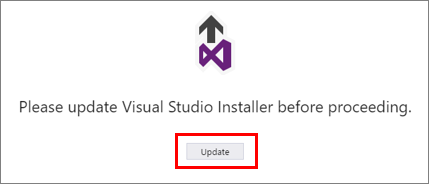
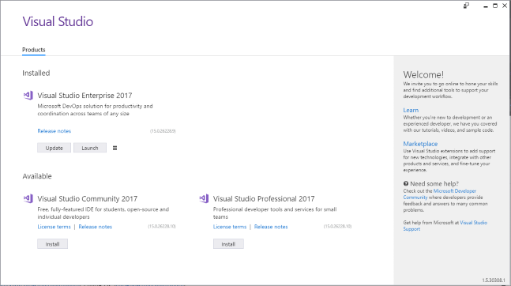
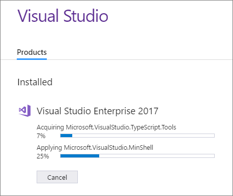

# Update Visual Studio 2017 to the most recent release
We update Visual Studio often to fix customer-reported issues and to extend its functionality. To make sure you have the most [current, optimized release of Visual Studio](https://www.visualstudio.com/en-us/news/releasenotes/vs2017-relnotes#release-history), you'll want to update it. Here's how.

## Update the Visual Studio Installer

1.  Find the Visual Studio Installer on your computer.

     For example, on a computer running Windows 10 Anniversary Update, select **Start**, and then scroll to the letter **V**, where you’ll see it listed as **Visual Studio Installer**.

     

     >[!NOTE]
     On some computers, the Visual Studio Installer might be listed under the letter **M** as the **Microsoft Visual Studio Installer**.

2.  If an update is available for the installer, you will see a prompt to update it. Click or tap **Update** to continue.

     

   After the update is complete, the Visual Studio Installer will open.

     

## Update Visual Studio

1. Open the Visual Studio Installer.

2. Look for the edition of Visual Studio that is installed on your computer, and then click or tap the **Update** button.

     

     >[!NOTE]
     If you don't see the Update button, then you already have the [most current release](https://www.visualstudio.com/en-us/news/releasenotes/vs2017-relnotes#release-history).

   Your updates will begin to install.  

     

3. When the update is complete, you might be asked to reboot your computer. If so, do so.

4. Start Visual Studio.

## Get support
Sometimes, things can go wrong. If your Visual Studio installation fails, see the [Troubleshooting Visual Studio 2017 installation and upgrade failures](https://support.microsoft.com/help/4015967/troubleshooting-visual-studio-2017-installation-and-upgrade-failures) KB article for troubleshooting tips.

## See also
* [Install Visual Studio 2017](https://go.microsoft.com/fwlink/?linkid=833223)
* [Modify Visual Studio](modify-visual-studio.md)
* [Uninstall Visual Studio 2017](uninstall-visual-studio.md)
* [How to Report a Problem with Visual Studio 2017](../ide/how-to-report-a-problem-with-visual-studio-2017.md)
