# Update Visual Studio to the most recent release

::: moniker range="vs-2017"

We encourage you to update to the most [recent release](/visualstudio/releasenotes/vs2017-relnotes/) of Visual Studio 2017 so that you always get the latest features, fixes, and improvements.

And if you'd like to try out our newest version, consider downloading and installing [Visual Studio 2019](https://visualstudio.microsoft.com/downloads) instead.

> [!IMPORTANT]
> You must log on with an account that has administrative permissions to install, update, or modify Visual Studio. For more information, see [User Permissions and Visual Studio](../ide/user-permissions-and-visual-studio.md).
>
> [!NOTE]
> This topic applies to Visual Studio on Windows. For Visual Studio for Mac, see [Update Visual Studio for Mac](/visualstudio/mac/update).

## Update Visual Studio 2017 version 15.6 or later

We've streamlined the installation and update experience to make it easier to use directly from within the IDE. Here's how to update from version 15.6 and later to newer versions of Visual Studio.

### Using the Notifications hub

When there's an update, there's a corresponding notification flag in Visual Studio.

1. Save your work.

1. Choose the notification flag to open the **Notifications** hub, and then choose the update that you want to install.

   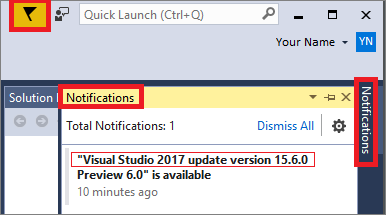

      > [!TIP]
      > An update for an edition of Visual Studio 2017 is cumulative, so always choose to install the one with the most recent version number.

1. When the **Update** dialog box opens, choose **Update Now**.

    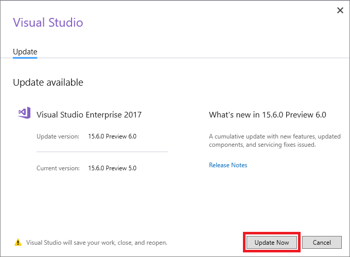

     If a User Access Control dialog box opens, choose **Yes**. Next, a "Please wait" dialog might open for a moment, and then the Visual Studio Installer opens to start the update.

     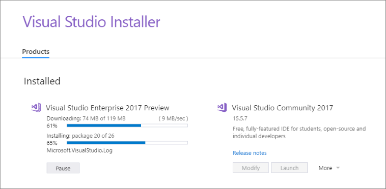

     Your update continues. Then, when it's complete, Visual Studio restarts.

     > [!NOTE]
     > When you run Visual Studio in administrator mode, you must manually restart Visual Studio after the update.

### Using the IDE

You can check for an update and then install the update from the menu bar in Visual Studio.

1. Save your work.

1. Choose **Help** > **Check for Updates**.

     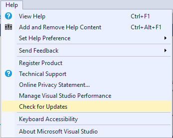

1. When the **Update** dialog box opens, choose **Update Now**.

   The update proceeds as described in the previous section, and then Visual Studio restarts after the update completes successfully.

   > [!NOTE]
   > When you run Visual Studio in administrator mode, you must manually restart Visual Studio after the update.

### Using the Visual Studio Installer

As in earlier versions of Visual Studio, you can use the Visual Studio Installer to install an update.

1. Save your work.

1. Open the installer. The Visual Studio Installer might require updating before you continue.

   > [!NOTE]
   > On a computer running Windows 10, you can find the installer under the letter **V** as the **Visual Studio Installer**, or under the letter **M** as the **Microsoft Visual Studio Installer**.

1. On the **Product** page in the installer, look for the edition of Visual Studio that you installed previously.

1. If an update is available, you see an **Update** button. (It might take a few seconds for the installer to determine whether an update is available.)

   Choose the **Update** button to install the updates.

     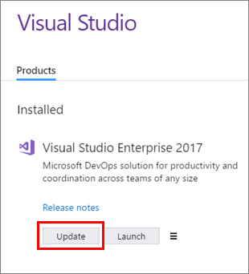

## Update Visual Studio 2017 version 15.5 or earlier

If you're using an earlier version, here's how to apply an update from Visual Studio 2017 version 15.0 through version 15.5.

### Update by using the Notifications hub

1. When there are updates, there's a corresponding notification flag in Visual Studio.

   

   Choose the notification flag to open the **Notifications** hub.

   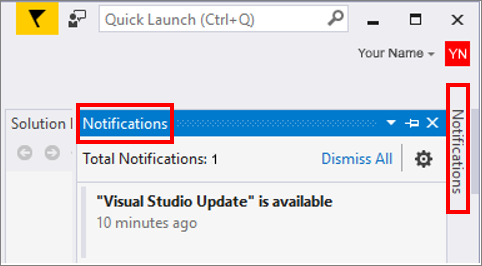

      > [!TIP]
      > An update for an edition of Visual Studio 2017 is cumulative, so always choose to install the one with the most recent version number.

1. Choose **"Visual Studio Update" is available**, which opens the **Extensions and Updates** dialog box.

   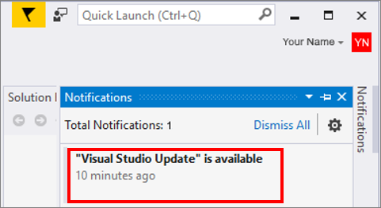

1. In the **Extensions and Updates** dialog box, choose the **Update** button.

   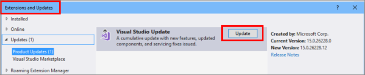

#### More about Visual Studio notifications

Visual Studio notifies you when an update is available for Visual Studio itself or for any components, and also when certain events occur in the Visual Studio environment.

* When the notification flag is yellow, there's a Visual Studio product update available for you to install.
* When the notification flag is red, there's a problem with your license.
* When the notification flag is black, there are optional or informational messages to review.

Choose the notifications flag to open the **Notifications** hub and then choose the notifications that you want to act on. Or, choose to ignore or dismiss a notification.

 

If you choose to ignore a notification, Visual Studio stops showing it. If you want to reset the list of ignored notifications, choose the **Settings** button in the Notifications hub.

   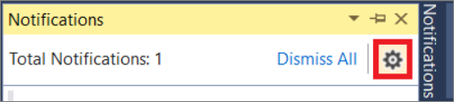

### Update by using the Visual Studio Installer

1. Open the installer. You might need to update the installer before continuing. If this is the case, you're prompted to do so.

   > [!NOTE]
   > On a computer running Windows 10, you can find the installer under the letter **V** as the **Visual Studio Installer**, or under the letter **M** as the **Microsoft Visual Studio Installer**.

1. On the **Product** page in the installer, look for the edition of Visual Studio that installed previously.

1. If an update is available, you see an **Update** button. (It might take a few seconds for the installer to determine whether an update is available.)

   Choose the **Update** button to install the updates.

     

::: moniker-end

::: moniker range="vs-2019"

We encourage you to update to the most [recent release](/visualstudio/releases/2019/release-notes/) of Visual Studio 2019 so that you always get the latest features, fixes, and improvements.

And if you haven't already installed Visual Studio 2019, go to the [Visual Studio downloads](https://visualstudio.microsoft.com/downloads) page to install it for free.

> [!IMPORTANT]
> You must log on with an account that has administrative permissions to install, update, or modify Visual Studio. For more information, see [User Permissions and Visual Studio](../ide/user-permissions-and-visual-studio.md).
>
> [!NOTE]
> This topic applies to Visual Studio on Windows. For Visual Studio for Mac, see [Update Visual Studio for Mac](/visualstudio/mac/update).

Here's how to update Visual&nbsp;Studio&nbsp;2019.

## Use the Visual Studio Installer

1. Open the installer.

     

   You might have to update the installer before continuing. If so, follow the prompts.

1. In the installer, look for the edition of Visual Studio that you installed.

   For example, if you previously installed Visual&nbsp;Studio Community&nbsp;2019 and there's an update for it, then an **Update available** message appears in the installer.

     

1. Choose **Update** to install the updates.

    

1. After the update is complete, you might be asked to restart your computer. If so, do so, and then start Visual Studio as you typically would.

   If you aren't asked to restart your computer, choose **Launch** to start Visual Studio from the installer.

    

## Use the IDE

You can check for an update and then install it by using the menu bar or the search box in Visual Studio 2019.

### Open Visual Studio

1. From the Windows **Start** menu, choose **Visual Studio 2019**.

    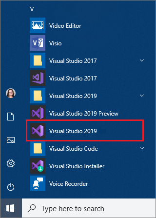

1. Under **Get started**, choose any option to open the IDE.

    

    Visual Studio opens. In the IDE, a **Visual Studio 2019 update** message appears.

    

1. In the **Visual Studio 2019 update** message, choose **View details**.

   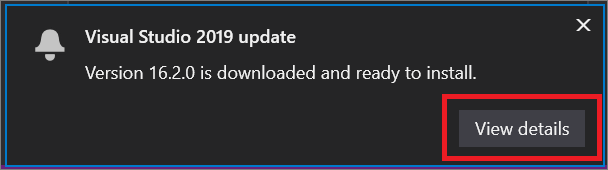

1. In the **Update downloaded and ready to install** dialog box, choose **Update**.

     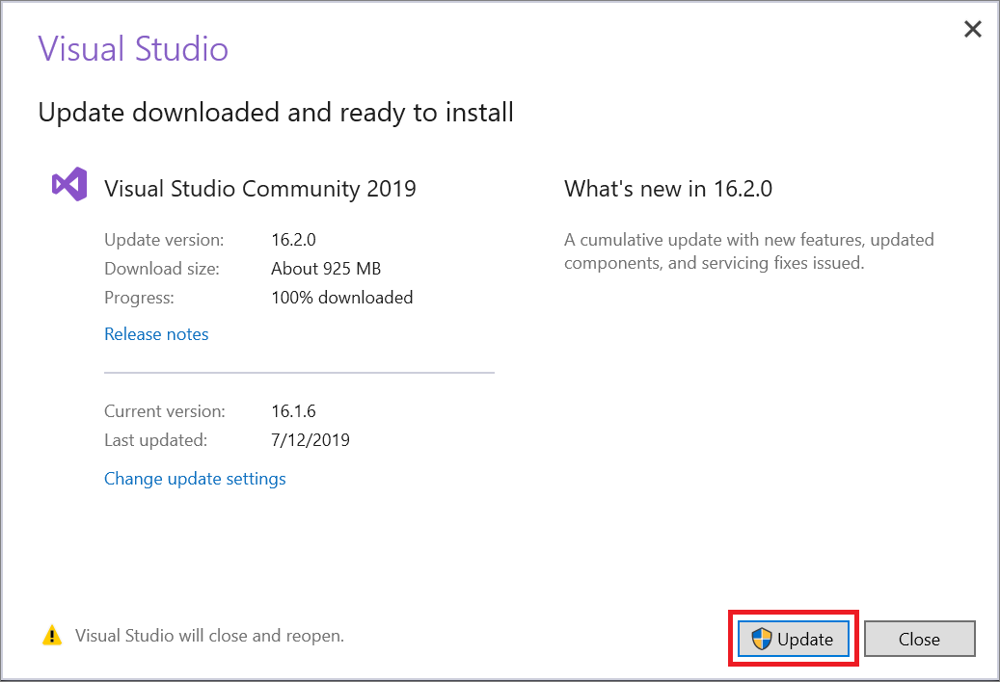

   Visual Studio updates, closes, and then reopens.

### In Visual Studio

1. From the menu bar, choose **Help**, and then choose **Check for Updates**.

     

    > [!NOTE]
    > You can also use the search box in the IDE to check for updates. Press **Ctrl**+**Q**, type "check for updates", and then choose the search result that matches.

1. In the **Update available** dialog box, choose **Update**.

     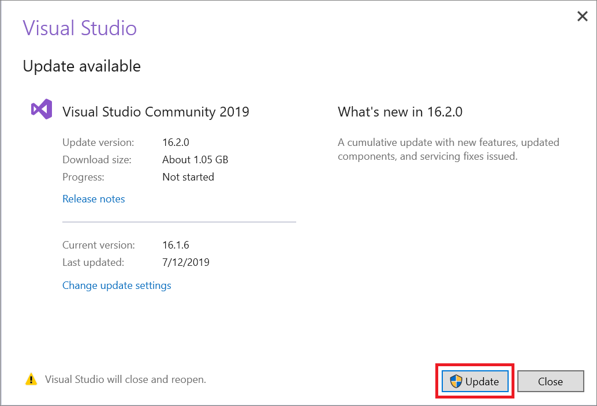

   Visual Studio updates, closes, and then reopens.

## Use the Notifications hub

1. In Visual Studio, save your work.

1. Choose the notification icon from the lower-right corner of the Visual Studio IDE to open the **Notifications** hub.

   

1. In the **Notifications hub**, choose the update that you want to install, and then choose **View details**.

     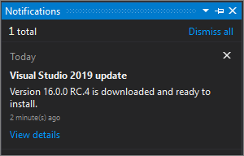

      > [!TIP]
      > An update for an edition of Visual Studio 2019 is cumulative, so always choose to install the one with the most recent version number.

1. In the **Update available** dialog box, choose **Update**.

   Visual Studio updates, closes, and then reopens.

## Customize update settings

You can customize the update settings in Visual Studio in several different ways, such as by changing the installation mode and by selecting automatic downloads.

There are two installation modes to choose from:

* **Install while downloading**
* **Download all, then install**

You can also choose the **Automatically download updates** setting, which allows updates to download while your machine is idle.

Here's how:

1. On the menu bar, choose **Tools** > **Options**.

2. Expand **Environment**, and then choose **Product Updates**.

    

3. Choose the installation mode and the automatic download options you want for your Visual Studio updates.

::: moniker-end

[!INCLUDE[install_get_support_md](includes/install_get_support_md.md)]

## See also

* [Install Visual Studio versions side-by-side](install-visual-studio-versions-side-by-side.md)
* [Update a network-based installation of Visual Studio](update-a-network-installation-of-visual-studio.md)
* [Update Visual Studio while on a servicing baseline](update-servicing-baseline.md)
* [Control updates to network-based Visual Studio deployments](controlling-updates-to-visual-studio-deployments.md)
* [Modify Visual Studio](modify-visual-studio.md)
* [Uninstall Visual Studio](uninstall-visual-studio.md)
