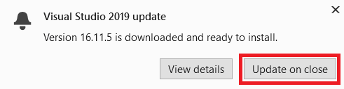
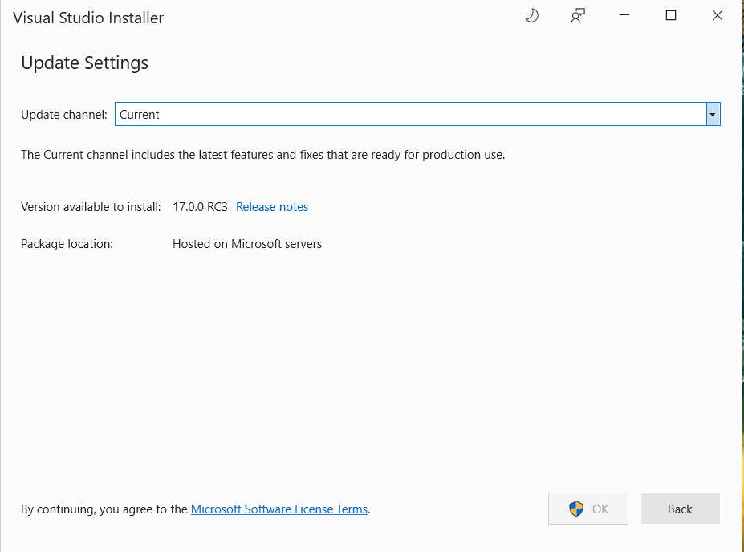
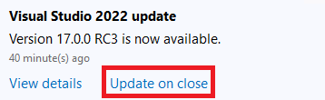

# Update Visual Studio

This topic discusses how to update a client installation of Visual Studio.  If you are an IT Administrator and want to configure your organization's clients to update from a network layout, refer to the [Visual Studio Administrators Guide](https://aka.ms/vs/admin/guide), particularly the section on [manage and update a network installations](../install/update-a-network-installation-of-visual-studio.md).

This topic applies to Visual Studio on Windows. For Visual Studio for Mac, see [Update Visual Studio for Mac](/visualstudio/mac/update). 

## Before you update

In order to install, update, or modify Visual Studio, you must be logged on to the machine with an account that has administrative permissions. If you are logged in as a typical user and try to perform one of these commands, then you'll get a User Account Control notice prompting you for admin credentials. For more information, see [User Permissions and Visual Studio](../ide/user-permissions-and-visual-studio.md).

We highly recommend saving your work before performing an update.

Visual Studio must be installed on the machine before you can update it. To install the current version of Visual Studio from Microsoft hosted servers, go to the [Visual Studio downloads](https://visualstudio.microsoft.com/downloads) page. If you are currently using another instance of Visual Studio, you can either [install a new instance of Visual Studio side-by-side to your existing installation](../install/install-visual-studio-versions-side-by-side.md), or you can [uninstall the previous instance of Visual Studio](../install/uninstall-visual-studio.md) before installing this new one.

::: moniker range="vs-2017"

We encourage you to update to the most [recent release](/visualstudio/releasenotes/vs2017-relnotes/) of Visual Studio 2017 so that you always get the latest features, security fixes, and improvements. And if you'd like to try out our newest version, consider downloading and installing [Visual Studio 2022](https://visualstudio.microsoft.com/downloads).

## Use the Notifications hub

1. When there's an update, there's a corresponding notification flag in the title bar of the Visual Studio IDE. Choose the notification flag to open the **Notifications** hub, and then choose the update that you want to install.

   

1. When the **Update** dialog box opens, choose **Update Now**.

    

     If a User Access Control dialog box opens, choose **Yes**. Next, a "Please wait" dialog might open for a moment, and then the Visual Studio Installer opens to start the update.

     

     Your update will complete, and then Visual Studio will restart.

## Manually check for updates

1. You can check to see if an update is available by choosing **Help** > **Check for Updates** on the menu bar.

     

1. When the **Update** dialog box opens, choose **Update Now**.

   The update proceeds as described in the previous section, and then Visual Studio restarts after the update completes successfully.

## Use the Visual Studio Installer

1. As in earlier versions of Visual Studio, you can use the Visual Studio Installer to install an update.  First, find the **Visual Studio Installer** on your computer.  In the Windows Start menu, you can search for "installer".  

1. Open the installer. The Visual Studio Installer might require updating before you continue.

1. On the **Product** page in the installer, look for the edition of Visual Studio that you installed previously and now want to update.

1. If an update is available, you see an **Update** button. (It might take a few seconds for the installer to determine whether an update is available.)

   Choose the **Update** button to install the updates.

     

::: moniker-end

::: moniker range="vs-2019"

We encourage you to update to the most [recent release](/visualstudio/releases/2019/release-notes/) of Visual Studio 2019 so that you always get the latest features, security fixes, and improvements. And if you'd like to try out our newest version, consider downloading and installing [Visual Studio 2022](https://visualstudio.microsoft.com/downloads).

There are several different ways to update an installation of Visual Studio. You can update through the Visual Studio Installer, you can check for updates or use the Notification hub in the IDE, or you can update by running a [specific version of the bootstrapper](/visualstudio/releases/2019/history). Here's how to update Visual&nbsp;Studio&nbsp;2019 using these various methods.

## Use the Visual Studio Installer

1. Find the **Visual Studio Installer** on your computer.

   In the Windows Start menu, you can search for "installer".

   

   You might have to update the installer before continuing. If so, follow the prompts.

1. In the installer, look for the instance of Visual Studio that you want to update.

   For example, if you previously installed Visual&nbsp;Studio Community&nbsp;2019 and there's an update for it, then an **Update available** message appears in the installer.

     

1. Choose **Update** to install the updates.

    

1. After the update is complete, you might be asked to restart your computer. If so, do so, and then start Visual Studio as you typically would.

   If you aren't asked to restart your computer, choose **Launch** to start Visual Studio from the installer.

    

## Use the message box in the IDE

1.  When you open Visual Studio is, the IDE checks to see if an update is available.  In certain situations, a **Visual Studio 2019 update** message will briefly appear. If you want to update now, then choose **View details**.  If you want to defer the update until when you close Visual Studio, choose **Update on Close**.

    

1. If you chose **View details**, then in the subsequent **Update downloaded and ready to install** dialog box, choose **Update** to update now.

     

## Manually check for updates

1. You can check to see if an update is available by choosing **Help** from the menu bar, and then choosing **Check for Updates**.  You can also use the search box by pressing **Ctrl**+**Q**, typing "check for updates", and then choosing the search result that matches. 

     

1. In the **Update available** dialog box, choose **Update**.

     

## Use the Notifications hub

1. Choose the notification icon from the lower-right corner of the Visual Studio IDE to open the **Notifications** hub.

   

1. In the **Notifications hub**, choose the update that you want to install. If you want to update now, then choose **View details**. If you want to defer the update until when you close Visual Studio, choose **Update on Close**.

     

1. If you chose **View details**, then in the subsequent **Update available** dialog box, choose **Update**.

## Run a specific bootstrapper
If you're an Enterprise or Professional customer, you can update your instance of Visual Studio 2019 to any specific version that has been released, as long as it's a higher version than what is currently installed. To update your instance of Visual Studio 2019 via this method, [navigate to the Visual Studio 2019 release history page](/visualstudio/releases/2019/history), download the bootstrapper that corresponds to the desired update version into your product installation directory, and then double click on it to initiate the update.  

## Customize update settings

There are several different settings that can be customized to control the update behavior. A few of these settings are native to Visual Studio 2019 and deal with how and when the product bits are downloaded and installed. Other settings, such as the ability to configure the source of the updates, require the presence of the newer Visual Studio 2022 installer.  

### Installation and download behaviors

1. On the menu bar, choose **Tools** > **Options**.

1. Expand **Environment**, and then choose **Product Updates**.

    

1. Observe the configuration options that are available to set in this dialog. You can choose the **Automatically download updates** setting, which allows updates to download while your machine is idle. There are also two installation modes to choose from: **Install while downloading**, and **Download all, then install**.   Choose the installation mode and the automatic download setting you want for your Visual Studio updates.

### Configure source location of updates
If you're in an enterprise environment, then it's possible to configure the location that your client instances looks for updates. This is useful in situations where your client installed from a network layout, but you later want the clients to get updates from a different network layout. The ability to configure update locations requires the presence of the newer Visual Studio 2022 installer, which can be obtained by either installing Visual Studio 2022 on the client machine, or by an administrator pushing it out through a network layout. For more information about how to use this feature, refer to the [Visual Studio 2022 documentation on configuring source location of updates](/visualstudio/install/update-visual-studio?view=vs-2022&preserve-view=true#configure-source-location-of-updates-1). Refer also to information on how to configure your Visual Studio 2019 layouts to [use the latest Visual Studio 2022 installer](/visualstudio/install/create-a-network-installation-of-visual-studio#configure-the-layout-to-always-use-the-latest-installer). 

## Update on close

In Visual Studio 2019 version 16.9, we introduced the concept of **Update on Close**.  When an update is available, the update notification UI in the IDE provides a way to defer the update to when you voluntarily close Visual Studio. The **Update on Close** button appears in the update notification message box, and it also can be selected in the notification hub. The **Update on Close** command is not a permanent setting; it applies only to the current update. In other words, the **Update on Close** deferral must be chosen each time you acknowledge or dismiss the notification that the update is available.

   

::: moniker-end

::: moniker range=">=vs-2022"

We encourage you to update to the most [recent release](/visualstudio/releases/2022/release-notes) of Visual Studio 2022 so that you always get the latest features, security fixes, and improvements.

There are several different ways to update an installation of Visual Studio. You can update through the Visual Studio Installer, you can check for updates or use the notification hub in the IDE, or you can update by running a [specific version of the bootstrapper](/visualstudio/releases/2022/release-history). Here's how to update Visual&nbsp;Studio&nbsp;2022 using these various methods.

## Use the Visual Studio Installer

1. Find the **Visual Studio Installer** on your computer.

   In the Windows Start menu, search for "installer", and then select **Visual Studio Installer** from the results.

   

   If you're prompted to update the Visual Studio Installer before continuing, do so by following the prompts.

1. In the Visual Studio Installer, look for the installation of Visual Studio that you want to update. 

   For example, if you previously installed Visual Studio Community 2022 and there's an update for it, then an **Update available** message appears in the Visual Studio Installer.

     

1. Choose **Update** to install the update.

    

1. After the update is complete, the Visual Studio Installer might prompt you to restart your computer. If so, do so, and then start Visual Studio as you typically would.

    If you aren't asked to restart your computer, choose **Launch** to start Visual Studio from the Visual Studio Installer.

    

## Use the message box in the IDE

1. When you open Visual Studio, the IDE checks to see if an update is available.  In certain situations, a **Visual Studio 2022 update** message will briefly appear. If you want to update now, then choose **View details**.  If you want to defer the update until when you close Visual Studio, choose **Update on Close**.

    

1. If you chose **View details**, then in the subsequent **Update available** dialog box, choose **Update** to update now. 

     

## Manually check for updates

1. You can check to see if an update is available by choosing **Help** from the menu bar, and then choosing **Check for Updates**.  You can also use the search box by pressing **Ctrl**+**Q**, typing "check for updates", and then choosing the search result that matches. 

     

1. In the **Update available** dialog box, choose **Update**.

     

## Use the Notifications hub

1. Choose the notification icon from the lower-right corner of the Visual Studio IDE to open the **Notifications hub**.

   

1. In the **Notifications hub**, choose the update that you want to install. If you want to update now, then choose **View details**. If you want to defer the update until when you close Visual Studio, choose **Update on Close**.

     

1. If you chose **View details**, then in the subsequent **Update available** dialog box, choose **Update**.

## Run a specific bootstrapper
If you're an Enterprise or Professional customer, you can update your instance of Visual Studio 2022 to any specific version that has been released, as long as it's a higher version than what is currently installed. To update your instance of Visual Studio 2022 via this method, [navigate to the Visual Studio 2022 release history page](/visualstudio/releases/2022/release-history), download the bootstrapper that corresponds to the desired update version into your product installation directory, and then double-click on it to initiate the update.

## Customize update settings

There are several different settings that can be customized to control the update behavior, such as how and when the product bits are downloaded and installed, or where the update source location is.  

### Installation and download behaviors

1. On the menu bar, choose **Tools** > **Options**.

1. Expand **Environment**, and then choose **Product Updates**.

    

1. Observe the configuration options that are available to set in this dialog. You can choose the **Automatically download updates** setting, which allows updates to download while your machine is idle. There are also two installation modes to choose from: **Install while downloading**, and **Download all, then install**.   Choose the installation mode and the automatic download setting you want for your Visual Studio updates.

### Configure source location of updates
With Visual Studio 2022, you can now configure where your clients will get their updates from. These update source locations are called "channels", and you can find more information about channel purpose and availability in the [Visual Studio Release Rhythm](/visualstudio/productinfo/release-rhythm) documentation. Microsoft makes both the Current and the Preview channels available to everyone, and the long term servicing channels (LTSCs) are available to Enterprise and Professional customers. IT Administrators can also configure the update source locations, such as network layouts, that the clients should have access to. Refer to the [Visual Studio Administrators Guide](https://aka.ms/vs/admin/guide) for additional options and details on how to set this up. 

There are two ways to bring up the Update Settings dialog, which allows you to change the channel that your Visual Studio instance should get its updates from. 

1. Open the Visual Studio installer, select the instance you want to configure, choose the **More button** and then choose the **Update settings** menu option. Refer to previous instructions for how to find the Visual Studio Installer.

    

2. An alternative way to invoke the Update Settings dialog is to open the Visual Studio IDE, bring up the Update available dialog (either **View details** on an update notification or **Check for updates** on the Help menu) and click on the Change update settings link.   

    
    
The **Update settings** dialog will look like this.

   

By choosing the correct value in the **Update channel** dropdown, you can control the source location of future updates for this instance of Visual Studio. Additional things to keep in mind are:
 * The Preview and Current channels are available for all editions of Visual Studio, and the LTSC channels are only available for Professional and Enterprise customers. 
 * You can choose to update your instance of Visual Studio immediately after you configure the update channel location. Or you can defer the actual product update until some later time. The act of configuring the update channel and the act of updating the product are two independent events. 
 * When you update to a new channel, you will install the most recent release on that channel. If you are an enterprise customer and want to install a particular version on a channel, then follow the Run a specific bootstrapper instructions described previously. 
 * You can only change the update channel if the version of the product that's available at the tip of that channel is **greater** than the version you have installed. For example, you can always transition from the Current channel to the Preview channel, but you can't transition from the Preview channel to the Current channel until the latest release on the Current channel surpasses the version of Preview that you have installed. 
 * LTSC channels all have expiration dates. Once the LTSC has expired, it will not be able to be used as a source of updates, and it will disappear from this list.
 * All Microsoft channels are hosted on Microsoft servers and require access to the internet.
 * Each instance of Visual Studio has the ability to independently configure its source for updates. So, if you have two instances of Visual Studio 2022 installed, each can update from a different channel. 
 * IT Administrators can control the values in the **Update channel** dropdown. For example, they can add network layout locations as update sources. They can also suppress Microsoft hosted locations from being available as update source options. This functionality works for Visual Studio 2019 installs too. For information on how to configure these update locations, refer to the [Visual Studio Administrators Guide](https://aka.ms/vs/admin/guide)

## Update on close

When an update is available, the update notification UI in the IDE provides a way to defer the update until you voluntarily close Visual Studio. The **Update on Close** button appears in the update notification message box, and it also can be selected in the **Notification** hub. The **Update on Close** command is not a permanent setting; it applies only to the current update. In other words, the **Update on Close** deferral must be chosen each time you acknowledge or dismiss the notification that the update is available.

   

::: moniker-end

## Administrator updates

If you are part of an organization that centralizes management of software installations, then your enterprise administrator might control how Visual Studio updates your machine. For more about how to control or configure the types of updates your machine can accept, see [Using Configuration Manager to deploy Visual Studio updates](../install/applying-administrator-updates.md#using-configuration-manager-to-deploy-visual-studio-updates).

[!INCLUDE[install_get_support_md](includes/install_get_support_md.md)]

## See also

* [Install Visual Studio versions side-by-side](install-visual-studio-versions-side-by-side.md)
* [Update a network-based installation of Visual Studio](update-a-network-installation-of-visual-studio.md)
* [Visual Studio enterprise guide](visual-studio-enterprise-guide.md)
* [Update Visual Studio while on a servicing baseline](update-servicing-baseline.md)
* [Control updates to network-based Visual Studio deployments](controlling-updates-to-visual-studio-deployments.md)
* [Modify Visual Studio](modify-visual-studio.md)
* [Uninstall Visual Studio](uninstall-visual-studio.md)
