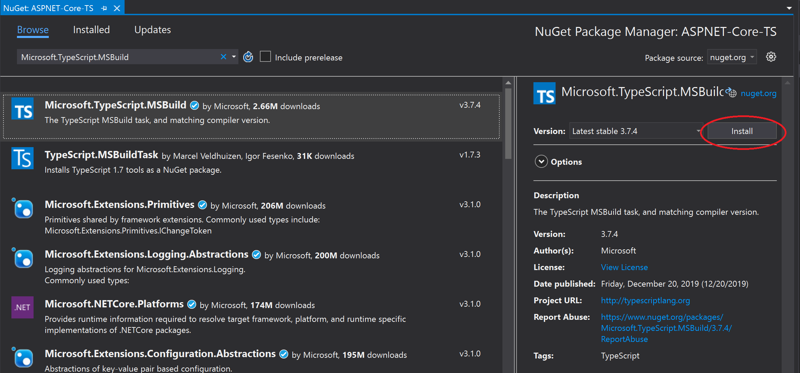

# Compile TypeScript code (ASP.NET Core)

Use the TypeScript NuGet package to add TypeScript support to your ASP.NET Core projects. Starting in Visual Studio 2019, it's recommended that you use the NuGet package instead of the TypeScript SDK. The TypeScript NuGet package provides greater portability across different platforms and environments.

For ASP.NET Core projects, one common usage for the NuGet package is to compile TypeScript using the .NET Core CLI. In .NET scenarios, the NuGet package is the preferred option, and it's the only way to enable TypeScript compilation using .NET Core CLI commands such as `dotnet build` and `dotnet publish`. Also, for [MSBuild integration](https://www.staging-typescript.org/docs/handbook/compiler-options-in-msbuild.html) with ASP.NET Core and TypeScript, choose the NuGet package.

> [!IMPORTANT]
> For projects based on the [JavaScript Project System (JSPS)](../javascript/javascript-in-visual-studio.md#project-templates), or *.esproj* projects, use the [npm package](../javascript/compile-typescript-code-npm.md) instead of NuGet to add TypeScript support.

## Add TypeScript support with NuGet

[The TypeScript NuGet package](https://www.nuget.org/packages/Microsoft.TypeScript.MSBuild) adds TypeScript support. When the NuGet package for TypeScript 3.2 or higher is installed into your project, the corresponding version of the TypeScript language service gets loaded in the editor.

If Visual Studio is installed, then the node.exe bundled with it will automatically be picked up by Visual Studio. If you don't have Node.js installed, we recommend you install the LTS version from the [Node.js](https://nodejs.org/en/download/) website.

1. Open your ASP.NET Core project in Visual Studio.

1. In Solution Explorer (right pane). right-click the project node and choose **Manage NuGet Packages**. In the **Browse** tab, search for **Microsoft.TypeScript.MSBuild**, and then click **Install** to install the package.

   

   Visual Studio adds the NuGet package under the **Dependencies** node in Solution Explorer. The following package reference gets added to your *.csproj file.

   ```xml
   <PackageReference Include="Microsoft.TypeScript.MSBuild" Version="5.8.3">
      <PrivateAssets>all</PrivateAssets>
      <IncludeAssets>runtime; build; native; contentfiles; analyzers; buildtransitive</IncludeAssets>
   </PackageReference>
   ```

1. Right-click the project node and choose **Add > New Item**. Choose the **TypeScript JSON Configuration File**, and then click **Add**.

   If you don't see all the item templates, choose **Show All Templates**, and then choose the item template.

   Visual Studio adds the *tsconfig.json* file to the project root. You can use this file to [configure options](https://www.typescriptlang.org/docs/handbook/tsconfig-json.html) for the TypeScript compiler.

1. Open *tsconfig.json* and update to set the compiler options that you want.

   Use the following example, which shows a simple *tsconfig.json* file.

   ```json
   {
     "compilerOptions": {
       "noImplicitAny": false,
       "noEmitOnError": true,
       "removeComments": false,
       "sourceMap": true,
       "target": "es5",
       "outDir": "wwwroot/js"
     },
     "include": [
       "scripts/**/*"
     ]
   }
   ```

   In this example:
   - *include* tells the compiler where to find TypeScript (*.ts) files.
   - *outDir* option specifies the output folder for the plain JavaScript files transpiled by the TypeScript compiler.
   - *sourceMap* option indicates whether the compiler generates *sourceMap* files.

   The previous configuration provides only a basic introduction to configuring TypeScript. For information on other options, see [tsconfig.json](https://www.typescriptlang.org/docs/handbook/tsconfig-json.html).

### Build the application

1. Add TypeScript (*.ts*) or TypeScript JSX (*.tsx*) files to your project, and then add TypeScript code. For a simple example of TypeScript, use the following code:

   ```typescript
   let message: string = 'Hello World';
   console.log(message);
   ```

1. If you're using an older non-SDK style project, follow instructions in [Remove default imports](#remove-default-imports) before building.

1. Choose **Build > Build Solution**.

   Although the app builds automatically when you run it, we want to take a look at something that happens during the build process:

   If you generated source maps, open the folder specified in the *outDir* option and you find the generated *.js file(s) along with the generated *js.map file(s).

   Source map files are required for debugging.

1. If you want to compile every time you save the project, use the *compileOnSave* option in *tsconfig.json*.

   ```json
   {
      "compileOnSave":  true,
      "compilerOptions": {
      }
   }
   ```

For an example of using gulp with the Task Runner to build your app, see [ASP.NET Core and TypeScript](https://www.typescriptlang.org/docs/handbook/asp-net-core.html).

If you run into issues where Visual Studio is using a version of Node.js or a third-party tool that is different than what the version you expected, you may need to set the path for Visual Studio to use. Choose **Tools** > **Options**. Under **Projects and solutions**, choose **Web Package Management** > **External Web Tools**.

### Run the application

Press **F5** or select the Start button at the top of the window.

### NuGet package structure details

`Microsoft.TypeScript.MSBuild.nupkg` contains two main folders:

- *build* folder

    Two files are located in this folder.
    Both are entry points - for the main TypeScript target file and props file respectively.

    1. *Microsoft.TypeScript.MSBuild.targets*

        This file sets variables that specify the run-time platform, such as a path to *TypeScript.Tasks.dll*, before importing *Microsoft.TypeScript.targets* from the *tools* folder.

    2. *Microsoft.TypeScript.MSBuild.props*

        This file imports *Microsoft.TypeScript.Default.props* from the *tools* folder and sets properties indicating that the build has been initiated through NuGet.

- *tools* folder

    Package versions prior to 2.3 only contain a tsc folder. *Microsoft.TypeScript.targets* and *TypeScript.Tasks.dll* are located at the root level.

    In package versions 2.3 and later, the root level contains `Microsoft.TypeScript.targets` and `Microsoft.TypeScript.Default.props`. For more details on these files, see [MSBuild Configuration](https://www.typescriptlang.org/docs/handbook/compiler-options-in-msbuild.html).

    Additionally, the folder contains three subfolders:

    1. *net45*

        This folder contains `TypeScript.Tasks.dll` and other DLLs on which it depends.
        When building a project on a Windows platform, MSBuild uses the DLLs from this folder.

    2. *netstandard1.3*

        This folder contains another version of `TypeScript.Tasks.dll`, which is used when building projects on a non-Windows machine.

    3. *tsc*

        This folder contains `tsc.js`, `tsserver.js` and all dependency files required to run them as node scripts.

        > [!NOTE]
        > If Visual Studio is installed, then the NuGet package automatically picks up the version of *node.exe* bundled with Visual Studio. Otherwise, Node.js must be installed on the machine.

        Versions prior to 3.1 contained a `tsc.exe` executable to run the compilation. In version 3.1, the executable was removed in favor of using `node.exe`.

### Remove default imports

In older ASP.NET Core projects that use the [non-SDK-style format](/nuget/resources/check-project-format), you may need to remove some project file elements.

If you're using the NuGet package for MSBuild support for a project, the project file must not import `Microsoft.TypeScript.Default.props` or `Microsoft.TypeScript.targets`. The files get imported by the NuGet package, so including them separately may cause unintended behavior.

1. Right-click the project and choose **Unload Project**.

1. Right-click the project and choose **Edit \<*project file name*\>**.

   The project file opens.

1. Remove references to `Microsoft.TypeScript.Default.props` and `Microsoft.TypeScript.targets`.

   The imports to remove look similar to the following XML:

   ```xml
   <Import
      Project="$(MSBuildExtensionsPath32)\Microsoft\VisualStudio\v$(VisualStudioVersion)\TypeScript\Microsoft.TypeScript.Default.props"
      Condition="Exists('$(MSBuildExtensionsPath32)\Microsoft\VisualStudio\v$(VisualStudioVersion)\TypeScript\Microsoft.TypeScript.Default.props')" />

   <Import
      Project="$(MSBuildExtensionsPath32)\Microsoft\VisualStudio\v$(VisualStudioVersion)\TypeScript\Microsoft.TypeScript.targets"
      Condition="Exists('$(MSBuildExtensionsPath32)\Microsoft\VisualStudio\v$(VisualStudioVersion)\TypeScript\Microsoft.TypeScript.targets')" />
   ```
