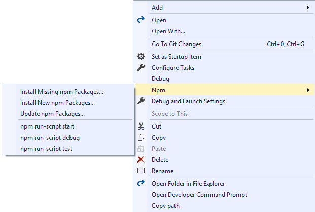

# Develop JavaScript and TypeScript code in Visual Studio without solutions or projects

 [!INCLUDE [Visual Studio](~/includes/applies-to-version/vs-windows-only.md)]

Starting in Visual Studio 2017, you can [develop code without projects or solutions](../ide/develop-code-in-visual-studio-without-projects-or-solutions.md), which enables you to open a folder of code and immediately start working with rich editor support such as IntelliSense, search, refactoring, debugging, and more. In addition to these features, the Node.js Tools for Visual Studio adds support for building TypeScript files, managing npm packages, and running npm scripts.

To get started, select **File** > **Open** > **Folder** from the toolbar. Solution Explorer displays all the files in the folder, and you can open any of the files to begin editing. In the background, Visual Studio indexes the files to enable npm, build, and debug features.

> [!TIP]
> Before using an Open Folder project, try creating a solution from existing Node.js code. In some scenarios, this method provides better feature support in Visual Studio. To create the project, choose **File > New Project > JavaScript > From Existing Node.js code**, and then choose your project folder as the source.

## Prerequisites

- Visual Studio 2017 version 15.8 or later versions
- Visual Studio **Node.js development** workload must be installed

## npm integration

If the folder you open contains a *package.json* file, you can right-click *package.json* to show a context menu (shortcut menu) specific to npm.



In the shortcut menu, you can manage the packages installed by npm in the same way that you
[manage npm packages](npm-package-management.md) when using a project file.

In addition, the menu also allows you to run scripts defined in the `scripts` element in *package.json*. These scripts will use the version of Node.js available on the `PATH` environment variable. The scripts run in a new window. This is a great way to execute build or run scripts.

## Build and debug

### package.json

If the *package.json* in the folder specifies a `main` element, the **Debug** command will be available in the right-click shortcut menu for *package.json*.
Clicking this will start *node.exe* with the specified script as its argument.

### JavaScript files

You can debug JavaScript files by right-clicking a file and selecting **Debug** from the shortcut menu. This starts *node.exe* with that JavaScript file as its argument.

> [!NOTE]
> If you don't see the **Debug** menu option, you may need to create the project from existing Node.js code, as described previously.

### TypeScript files and tsconfig.json

If there is no *tsconfig.json* present in the folder, you can right-click a TypeScript file to see shortcut menu commands to build and debug that file. When you use these commands, you build or debug using *tsc.exe* with default options. (You need to build the file before you can debug.)

> [!NOTE]
> When building TypeScript code, we use the newest version installed in `C:\Program Files (x86)\Microsoft SDKs\TypeScript`.

If there is a *tsconfig.json* file present in the folder, you can right-click a TypeScript file to see a menu command to debug that TypeScript file. The option appears only if there is no `outFile` specified in *tsconfig.json*. If an `outFile` is specified, you can debug that file by right-clicking *tsconfig.json* and selecting the correct option. The `tsconfig.json` file also gives you a build option to allow you to specify compiler options.

> [!NOTE]
> You can find more information about *tsconfig.json* in the
[tsconfig.json TypeScript Handbook page](https://www.typescriptlang.org/docs/handbook/tsconfig-json.html).

## Unit Tests
You can enable the unit test integration in Visual Studio by specifying a test root in your *package.json*:

```json
{
    // ...
    "vsTest":{
        "testRoot": "./tests"
    }
    // ...
}
```

The test runner enumerates the locally installed packages to determine which test framework to use.
If none of the supported frameworks are recognized, the test runner defaults to *ExportRunner*. The other
supported frameworks are:

* Mocha ([mochajs.org](https://mochajs.org/))
* Jasmine ([Jasmine.github.io](https://jasmine.github.io/))
* Tape ([github.com/substack/tape](https://github.com/substack/tape))
* Jest ([jestjs.io](https://jestjs.io/))

After opening Test Explorer (choose **Test** > **Windows** > **Test Explorer**), Visual Studio discovers and displays tests.

> [!NOTE]
> The test runner will only enumerate the JavaScript files in the test root, if your application is written in
> TypeScript you need to build those first.
