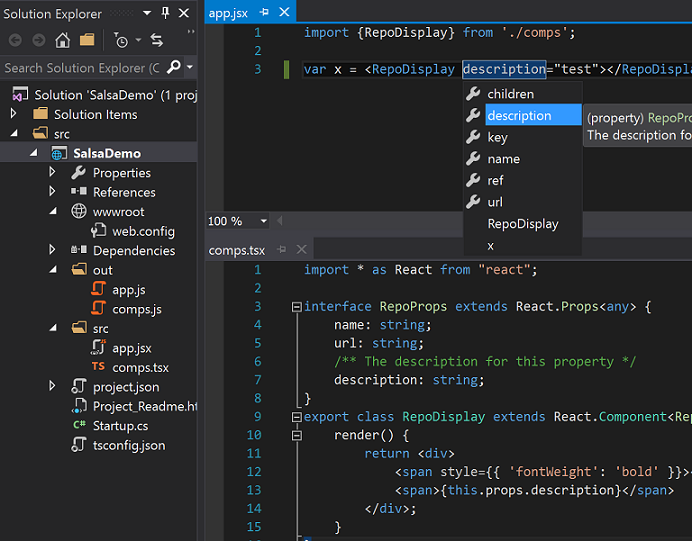

# JavaScript in Visual Studio 2017

JavaScript is a first-class language in Visual Studio. You can use most or all of the standard editing aids (code snippets, IntelliSense, and so on) when you write JavaScript code in the Visual Studio IDE. You can write JavaScript code for many application types and services.

> [!NOTE]
> We have joined the community-wide effort to make [MDN web docs](https://developer.mozilla.org/en-US/) the web's one-stop, premiere development resource, by redirecting all (500+ pages) of Microsoft's JavaScript API reference from docs.microsoft.com to their MDN counterparts. For details, see this [announcement](https://blogs.windows.com/msedgedev/2018/06/26/chakra-docs-mdn-web-docs/).

## <a name="ES6"></a> Support for ECMAScript 2015 (ES6) and beyond

Visual Studio now supports syntax for ECMAScript language updates such as ECMAScript 2015/2016.

### What is ECMAScript 2015?

JavaScript is still evolving as a programming language and [TC39](https://www.ecma-international.org/memento/tc39-m.htm) is the committee responsible for making updates.
ECMAScript 2015 is an update to the JavaScript language that brings helpful new syntax and functionality. For a deep dive on ES6 features, check out [this](http://es6-features.org/#Constants) reference site.

In addition to support for ECMAScript 2015, Visual Studio also supports ECMAScript 2016 and will have support for future versions of ECMAScript as they are released. To keep up with TC39 and the latest changes in ECMAScript, follow their work on [GitHub](https://github.com/tc39).

### Transpile JavaScript

A common problem with JavaScript is that you want to use the latest ES6+ language features because they help you be more productive, but your runtime environments (often browsers) don't yet support these new features. This means that you either have to keep track of which browsers support what features (which can be tedious), or you need a way to convert your ES6+ code into a version that your target runtimes understand (usually ES5). Converting your code to a version that the runtime understands is commonly referred to as "transpiling".

One of the key features of TypeScript is the ability transpile ES6+ code to ES5 or ES3 so that you can write the code that makes you most productive, but still run your code on any platform. Because JavaScript in [!include[vs_dev15](../../docs/misc/includes/vs_dev15_md.md)] uses the same language service as TypeScript, it too can take advantage of ES6+ to ES5 transpilation.

Before transpilation can be set up, some understanding of the configuration options is required.
TypeScript is configured via a `tsconfig.json` file.
In the absence of such a file, some default values are used.
For compatibility reasons, these defaults are different in a context where only JavaScript files (and optionally `.d.ts` files) are present.
To compile JavaScript files, a `tsconfig.json` file must be added, and some of these options must be set explicitly.

The required settings for the tsconfig file are as follows:

- `allowJs`: This value must be set to `true` for JavaScript files to be recognized. The default value is `false`, because TypeScript compiles to JavaScript, and the compiler should not include files it just compiled.
- `outDir`: This value should be set to a location not included in the project, in order that the emitted JavaScript files are not detected and then included in the project (see `exclude`).
- `module`: If using modules, this setting tells the compiler which module format the emitted code should use (for example `commonjs` for Node, or bundlers such as Browserify).
- `exclude`: This setting states which folders not to include in the project.
The output location, as well as non-project folders such as `node_modules` or `temp`, should be added to this setting.
- `enableAutoDiscovery`: This setting enables the automatic detection and download of definition files as outlined previously.
- `compileOnSave`: This setting tells the compiler if it should recompile any time a source file is saved in Visual Studio.
- `typeAcquisition`: This set of settings control the behavior of automatic type acquisition (further explain in [this section](../ide/javascript-intellisense.md#Auto))

In order to convert JavaScript files to CommonJS modules and place them in an `./out` folder, you could use the following `tsconfig.json` file:

```json
{
  "compilerOptions": {
    "module": "commonjs",
    "allowJs": true,
    "outDir": "out"
  },
  "exclude": [
    "node_modules",
    "wwwroot",
    "out"
  ],
  "compileOnSave": true,
  "typeAcquisition": {
    "enable": true
  }
}
```

With the settings in place, if a source file (`./app.js`) existed and contained several ECMAScript 2015 language features as follows:

```js
import {Subscription} from 'rxjs/Subscription';  // ES6 import

class Foo {  // ES6 Class
    sayHi(name) {
        return `Hi ${name}, welcome to Salsa!`;  // ES6 template string
    }
}

export let sqr = x => x * x;  //ES6 export, let, and arrow function
export default Subscription;  //ES6 default export
```

Then a file would be emitted to `./out/app.js` targeting ECMAScript 5 (the default) that looks something like the following:

```js
"use strict";
var Subscription_1 = require('rxjs/Subscription');
var Foo = (function () {
    function Foo() {
    }
    Foo.prototype.sayHi = function (name) {
        return "Hi " + name + ", welcome to Salsa!";
    };
    return Foo;
}());
exports.sqr = function (x) { return x * x; };
Object.defineProperty(exports, "__esModule", { value: true });
exports.default = Subscription_1.Subscription;
```

## Better IntelliSense

JavaScript IntelliSense in [!include[vs_dev15](../../docs/misc/includes/vs_dev15_md.md)] will now display a lot more information on parameters and member lists. This new information is provided by the TypeScript language service, which uses static analysis behind the scenes to better understand your code. You can read more about the new IntelliSense experience and how it works [here](../ide/javascript-intellisense.md).

## <a name="JSX"></a> JSX syntax support

JavaScript in [!include[vs_dev15](../../docs/misc/includes/vs_dev15_md.md)] has rich support for the JSX syntax. JSX is a syntax set that allows HTML tags within JavaScript files.

The following illustration shows a React component defined in the `comps.tsx` TypeScript file, and then this component being used from the `app.jsx` file, complete with IntelliSense for completions and documentation within the JSX expressions.
You don't need TypeScript here, this specific example just happens to contain some TypeScript code as well.



> [!NOTE]
> To convert the JSX syntax to React calls, the setting `"jsx": "react"` must be added to the `compilerOptions` in the `tsconfig.json` file.

The JavaScript file created at `./out/app.js' upon build would contain the code:

```js
"use strict";
var comps_1 = require('./comps');
var x = React.createElement(comps_1.RepoDisplay, {description: "test"});
```

## Configure your JavaScript project

The language service is powered by static analysis, which means it analyzes your source code without actually executing it in order to return IntelliSense results and provide other editing features.
Therefore, the larger the quantity and size of files that are included your project context, the more memory and CPU will be used during analysis.
Because of this, there are a few default assumptions that are made about your project shape:

- `package.json` and `bower.json` list dependencies used by your project and by default are included in Automatic Type Acquisition (ATA)
- A top level `node_modules` folder contains library source code and its contents are excluded from the project context by default
- Every other `.js`, `.jsx`, `.ts`, and `.tsx` file is possibly one of *your own* source files and must be included in project context

In most cases, you will be able to just open your project and have great experience using the default project configuration. However, in projects that are large or have different folder structures, it may be desirable to further configure the language service to better focus only on your own source files.

### Override defaults

You can override the default configuration by adding a `tsconfig.json` file to your project root.
A `tsconfig.json` has several different options that can manipulate your project context.
A few of them are listed below, but for a full set of all options available, [see the schema store](http://json.schemastore.org/tsconfig).

## Important `tsconfig.json` options

```json
{
  "compilerOptions": {
    "allowJs": true,          // include .js and .jsx in project context (defaults to only .ts and .tsx)
    "noEmit": true            // turns off downlevel compiler
  },
  "files": [],                // list of explicit files to include in the project context. Highest priority.
  "include": [],              // list of folders or glob patterns to include in the project context.
  "exclude": [],              // list of folders or glob patterns to exclude. Overridden by files array.
  "typeAcquisition": {
    "enable": true,           // Defaulted to "false" with a tsconfig. Enables better IntelliSense in JS.
    "include": [ "jquery" ],  // Specific libs to fetch .d.ts files that weren't picked up by ATA
    "exclude": [ "node" ]     // Specific libs to not fetch .d.ts files for
  }
}
```

### Example project configuration

Given a project with the following setup:

- project's source files are in `wwwroot/js`
- project's lib files are in `wwwroot/lib`
- `bootstrap`, `jquery`, `jquery-validation`, and `jquery-validation-unobtrusive` are listed in the `bower.json`
- `kendo-ui` has been manually added to the lib folder


You could use the following `tsconfig.json` to make sure the language service only analyzes your source files in the `js` folder, but still fetches and uses `.d.ts` files for the libraries in your `lib` folder.

```json
{
  "compilerOptions": {
    "allowJs": true,
    "noEmit": true
  },
  "exclude": ["wwwroot/lib"],  //ignore lib folders, we will get IntelliSense via ATA
  "typeAcquisition": {
    "enable": true,
    "include": [ "kendo-ui" ]  //kendo-ui wasn't added via bower, so we need to list it here
  }
}
```

## Troubleshooting The JavaScript language service has been disabled for the following project(s)
When you open a JavaScript project that has a very large amount of content, you might get a message that reads "The JavaScript language service has been disabled for the following project(s)". The most common reason for having a very large amount of JavaScript source is due to including libraries with source code that exceeds a 20MB project limit.

A simple way to optimize your project is to add a `tsconfig.json` file in your project root to let the language service know which files are safe to ignore. Use the sample below to exclude the most common directories where libraries are stored:

```json
{
  "compilerOptions": {
    "allowJs": true,
    "allowSyntheticDefaultImports": true,
    "maxNodeModuleJsDepth": 2,
    "noEmit": true,
    "skipLibCheck": true
  },
  "exclude": [
    "**/bin",
    "**/bower_components",
    "**/jspm_packages",
    "**/node_modules",
    "**/obj",
    "**/platforms"
  ]
}
```

Add more directories as you see fit. Some other examples include "vendor" or "wwwroot/lib" directories.

> [!NOTE]
> The compiler property `disableSizeLimit` can be used as well to disable the 20MB check limit. Take special precautions when using this property because disabling the limit might crash the language service.

## Notable Changes from Visual Studio 2015

As [!include[vs_dev15](../../docs/misc/includes/vs_dev15_md.md)] features a completely new language service, there are a few behaviors that will be different or absent from the previous experience.
The most notable changes are the replacement of VSDoc with JSDoc, the removal of custom `.intellisense.js` extensions, and limited IntelliSense for specific code patterns.

### No more `///<references/>` or `_references.js`

Previously it was fairly complicated to understand at any given moment which files were in your IntelliSense scope. Sometimes it was desirable to have all your files in scope and other times it wasn't, and this led to complex configurations involving manual reference management. Going forward you no longer need to think about reference management and so you don't need triple slash references comments or `_references.js` files.

See the [JavaScript IntelliSense](../ide/javascript-intellisense.md) page for more info on how IntelliSense works.

### VSDoc

XML documentation comments, sometimes referred to as VSDocs, could previously be used to decorate your source code with additional data that would be used to buff up IntelliSense results.
VSDoc is no longer supported in favor of [JSDoc](https://jsdoc.app/about-getting-started.html) which is easier to write and the accepted standard for JavaScript.

### `.intellisense.js` extensions

Previously, you could author [IntelliSense extensions](/previous-versions/visualstudio/visual-studio-2015/ide/extending-javascript-intellisense) which would allow you to add custom completion results for third-party libraries.
These extensions were fairly difficult to write and installing and referencing them was cumbersome, so going forward the new language service won't support these files.
As an easier alternative, you can write a TypeScript definition file to provide the same IntelliSense benefits as the old `.intellisense.js` extensions.
You can learn more about declaration (`.d.ts`) file authoring [here](http://www.typescriptlang.org/docs/handbook/declaration-files/introduction.html).

### Unsupported patterns

Because the new language service is powered by static analysis rather than an execution engine (read [this issue](https://github.com/Microsoft/TypeScript/issues/4789) for information of the differences), there are a few JavaScript patterns that no longer can be detected.
The most common pattern is the "expando" pattern.
Currently the language service cannot provide IntelliSense on objects that have properties tacked on after declaration.
For example:

```js
var obj = {};
obj.a = 10;
obj.b = "hello world";
obj. // IntelliSense won't show properties a or b
```

You can get around this by declaring the properties during object creation:

```js
var obj = {
    "a": 10,
    "b": "hello world"
}
obj. // IntelliSense shows properties a and b
```

You can also add a JSDoc comment as follows:

```js
/**
 * @type {{a: number, b: string}}
 */
var obj = {};
obj.a = 10;
obj.b = "hello world";
obj. // IntelliSense shows properties a and b
```
