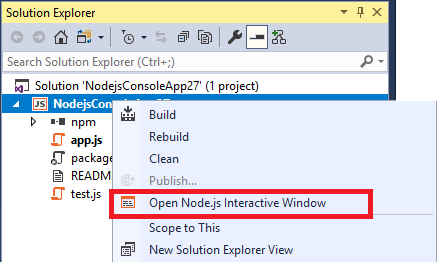
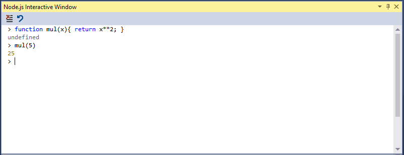

# Work with the Node.js interactive window

Node.js Tools for Visual Studio include an interactive window for the installed Node.js runtime. This window allows you to enter JavaScript code and see the results immediately, as well as execute npm commands to interact with the current project. The interactive window is also known as a REPL (**R**ead/**E**valuate/**P**rint **L**oop).

## Open the interactive window

You can open the interactive window by right-clicking the Node.js project node in Solution Explorer and selecting **Open Node.js Interactive Window**.

The default short-cut keys to open the Node.js interactive window are **[CTRL] + K, N**. Or, you can open the window from the toolbar by choosing **View** > **Windows** > **Node.js Interactive Window**.

## Use the REPL

Once opened, you can enter commands.

The interactive window has several built-in commands, which start with a dot prefix to distinguish them from any JavaScript function that you declare. The following commands are supported:

**.cls, .clear**
Clears the contents of the editor window, leaving the history and execution context intact.

**.help**
Displays help on the specified command, or on all available commands and key bindings if none is specified.

**.info**
Shows information about the current used Node.js executable.

**.npm**
Runs an npm command. If the solution contains more than one project, specify the target project using `.npm [projectname] <npm arguments>`.

**.reset**
Resets the execution environment to the initial state, keep history.

**.save**
Saves the current REPL session to a file.