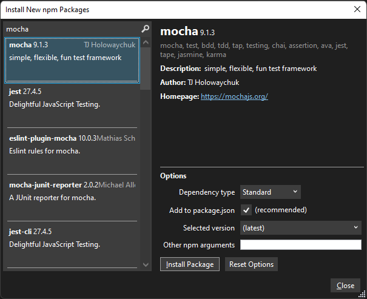
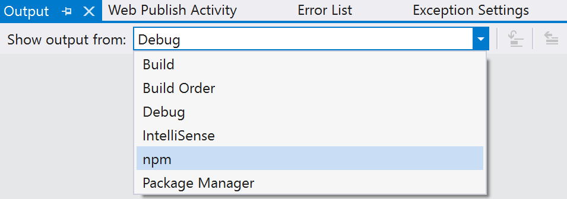
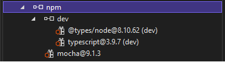

# Manage npm packages in Visual Studio

npm allows you to install and manage packages for use in both Node.js and ASP.NET Core applications. Visual Studio makes it easy to interact with npm and issue npm commands through the UI or directly. If you're unfamiliar with npm and want to learn more, go to the [npm documentation](https://docs.npmjs.com/).

Visual Studio integration with npm is different depending on your project type.
::: moniker range=">=vs-2022"
* [CLI-based projects (.esproj)](#cli-based-project-esproj)
* [ASP.NET Core](#aspnet-core-projects)
* [Open folder (Node.js)](../javascript/develop-javascript-code-without-solutions-projects.md)
::: moniker-end

::: moniker range="<=vs-2019"
* [Node.js](#nodejs-projects)
* [ASP.NET Core](#aspnet-core-projects)
* [Open folder (Node.js)](../javascript/develop-javascript-code-without-solutions-projects.md)
::: moniker-end

> [!IMPORTANT]
> npm expects the *node_modules* folder and *package.json* in the project root. If your app's folder structure is different, you should modify your folder structure if you want to manage npm packages using Visual Studio.

::: moniker range=">=vs-2022"
## CLI-based project (.esproj)

Starting in Visual Studio 2022, the npm package manager is available for [CLI-based projects](../javascript/javascript-in-vs-2022.md#project-templates), so you can now download npm modules similarly to the way you download NuGet packages for ASP.NET Core projects. Then you can use *package.json* to modify and delete packages.

To open the package manager, from Solution Explorer, right-click the **npm** node in your project and choose **Add npm package**.

:::image type="content" source="../javascript/media/vs-2022/npm-packages-open-manager-esproj.png" alt-text="Open package manager from Solution Explorer" border="true":::

Next, you can search for npm packages, select one, and install by selecting **Install Package**.

:::image type="content" source="../javascript/media/vs-2022/npm-packages-install-esproj.png" alt-text="Install new npm package for esproj" border="true":::
::: moniker-end

::: moniker range="<=vs-2019"
## Node.js projects

For Node.js projects (.njsproj), you can perform the following tasks:

* [Install packages from Solution Explorer](#npmInstallWindow)
* [Manage installed packages from Solution Explorer](#solutionExplorer)
* [Use the `.npm` command in the Node.js Interactive Window](#interactive)

These features work together and synchronize with the project system and the *package.json* file in the project.

### Prerequisites

You need the **Node.js development** workload and the Node.js runtime installed to add npm support to your project. For detailed steps, see [Create a Node.js and Express app](./tutorial-nodejs.md?toc=%252fvisualstudio%252fjavascript%252ftoc.json).

> [!NOTE]
> For existing Node.js projects, use the **From existing Node.js code** solution template or the [Open folder (Node.js)](../javascript/develop-javascript-code-without-solutions-projects.md) project type to enable npm in your project.

### <a name="npmInstallWindow"></a> Install packages from Solution Explorer (Node.js)

For Node.js projects, the easiest way to install npm packages is through the npm package installation window. To access this window, right-click the **npm** node in the project and select **Install New npm Packages**.

:::image type="content" source="../javascript/media/solution-explorer-install-package.png" alt-text="Install new npm package for Node.js" border="true":::

In this window you can search for a package, specify options, and install.



* **Dependency type** - Chose between **Standard**, **Development**, and **Optional** packages. Standard specifies that the package is a runtime dependency, whereas Development specifies that the package is only required during development.
* **Add to package.json** - Recommended. This configurable option is deprecated.
* **Selected version** - Select the version of the package you want to install.
* **Other npm arguments** - Specify other standard npm arguments. For example, you can enter a version value such as `@~0.8` to install a specific version that is not available in the versions list.

You can see the progress of the installation in the **npm** output in the **Output** window (to open the window, choose **View** > **Output** or press **Ctrl** + **Alt** + **O**). This might take some time.



> [!TIP]
> You can search for scoped packages by prepending the search query with the scope you're interested in, for example, type `@types/mocha` to look for TypeScript definition files for mocha. Also, when installing type definitions for TypeScript, you can specify the TypeScript version you're targeting by specifying a version, such as `@ts2.6`, in the npm argument field.

### <a name="solutionExplorer"></a>Manage installed packages in Solution Explorer (Node.js)

npm packages are shown in Solution Explorer. The entries under the **npm** node mimic the dependencies in the *package.json* file.



### Package status

*  - Installed and listed in package.json
*  - Installed, but not explicitly listed in package.json
*  - Not installed, but listed in package.json

Right-click the **npm** node to take one of the following actions:

* **Install New npm Packages** Opens the UI to install new packages.
* **Install npm Packages** Runs the npm install command to install all packages listed in *package.json*. (Runs `npm install`.)
* **Update npm Packages** Updates packages to the latest versions, according to the semantic versioning (SemVer) range specified in *package.json*. (Runs `npm update --save`.). SemVer ranges are typically specified using "~" or "^". For more information, [package.json configuration](../javascript/configure-packages-with-package-json.md).

Right-click a package node to take one of the following actions:

* **Install npm Package(s)** Runs the npm install command to install the package version listed in *package.json*. (Runs `npm install`.)
* **Update npm Package(s)** Updates the package to the latest version, according to the SemVer range specified in *package.json*. (Run `npm update --save`.) SemVer ranges are typically specified using "~" or "^".
* **Uninstall npm Package(s)** Uninstalls the package and removes it from *package.json* (Runs `npm uninstall --save`.)

>[!NOTE]
> For help resolving issues with npm packages, see [Troubleshooting](#troubleshooting-npm-packages).

### <a name="interactive"></a>Use the .npm command in the Node.js Interactive Window (Node.js)

You can also use the `.npm` command in the Node.js Interactive Window to execute npm commands. To open the window, right-click the project in Solution Explorer and choose **Open Node.js Interactive Window** (or press **Ctrl** + **K**, **N**).

In the window, you can use commands such as the following to install a package:

`.npm install azure@4.2.3`

 > [!Tip]
 > By default, npm will execute in your project's home directory. If you have multiple projects
 > in your solution specify the name or the path of the project in brackets.
 > `.npm [MyProjectNameOrPath] install azure@4.2.3`

 > [!Tip]
 > If your project doesn't contain a package.json file, use `.npm init -y` to create a new package.json file
 > with default entries.
::: moniker-end

## ASP.NET Core projects

For projects such as ASP.NET Core projects, you can add npm support in your project and use npm to install packages.

>[!NOTE]
> For ASP.NET Core projects, you can also use [Library Manager](/aspnet/core/client-side/libman/?view=aspnetcore-3.1&preserve-view=true) or yarn instead of npm to install client-side JavaScript and CSS files. One of these options might be necessary if you require integration with MSBuild or the dotnet CLI for package management, which is not provided by npm.

If your project does not already include a *package.json* file, you can add one to enable npm support by adding a *package.json* file to the project.

1. To add the *package.json* file, right-click the project in Solution Explorer and choose **Add** > **New Item** (or press **Ctrl** + **SHIFT** + **A**). Use the search box to find the npm file, choose the **npm Configuration File**, use the default name, and click **Add**.

1. Include one or more npm packages in the `dependencies` or `devDependencies` section of *package.json*. For example, you might add the following to the file:

   ```json
   "devDependencies": {
      "gulp": "4.0.2",
      "@types/jquery": "3.5.29"
   }
   ```

   When you save the file, Visual Studio adds the package under the **Dependencies / npm** node in Solution Explorer. If you don't see the node, right-click **package.json** and choose **Restore Packages**. To view package installation status, select **npm** output in the Output window.

   You can configure npm packages using `package.json`. Either open `package.json` directly, or right-click the npm node in Solution Explorer and choose **Open package.json**.

## Troubleshooting npm packages

* If you see any errors when building your app or transpiling TypeScript code, check for npm package incompatibilities as a potential source of errors. To help identify errors, check the npm Output window when installing the packages, as described previously in this article. For example, if one or more npm package versions has been deprecated and results in an error, you might need to install a more recent version to fix errors. For information on using *package.json* to control npm package versions, see [package.json configuration](../javascript/configure-packages-with-package-json.md).

* In some ASP.NET Core scenarios, Solution Explorer might not show the correct status for installed npm packages due to a known issue described [here](https://github.com/aspnet/Tooling/issues/479). For example, the package might appear as not installed when it is installed. In most cases, you can update Solution Explorer by deleting *package.json*, restarting Visual Studio, and re-adding the *package.json* file as described earlier in this article. Or, when installing packages, you can use the npm Output window to verify installation status.

* In some ASP.NET Core scenarios, the npm node in Solution Explorer might not be visible after you build the project. To make the node visible again, right-click the project node and choose **Unload Project.** Then right-click the project node and choose **Reload Project**.

::: moniker range="<=vs-2019"

* For Node.js projects, you must have the **Node.js development** workload installed for npm support. npm requires Node.js. If you don't have Node.js installed, we recommend you install the LTS version from the [Node.js](https://nodejs.org/en/download/) website for best compatibility with outside frameworks and libraries.

::: moniker-end
