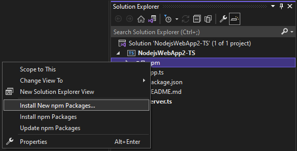

# npm and package management

npm allows you to install and manage packages for use in your Node.js applications. If you're unfamiliar with
npm, and want to learn more, go to the [npm Documentation](https://docs.npmjs.com/).

There are several ways you can work with npm in Node.js tools for Visual Studio:
1. [npm install window](#npmInstallWindow)
1. [Managing installed packages in the Solution Explorer](#solutionExplorer)
1. [`.npm` in the Node.js Interactive Window](#interactive)

These all work together and synchronize with the project system, and the `package.json` in the project.

## npm install window
The easiest way to install npm packages is through npm Install Window. To access that right-click on the npm node in the project and select Install New npm Packages.

In the window you can search for a package, specify options, and install. 

* **Dependency type** - allows you to chose between Standard, Development, and Optional. 
Standard indicates the package is a runtime dependency, where 
Development indicates it's only required during development.
* **Add to package.json** - Deprecated
* **Selected version** - Allows you to select which version of the package you want to install.
* **Other npm arguments** - Any other npm arguments you want to specify, e.g. `@~0.8` if you want to install 
a specific version not in the versions list.

You can see the progress of the installation in the npm tab in the output window.

> [!Tip]
> You can search for scoped packages by prepending the search query with the scope you're interested in, 
e.g. `@types/mocha`

> [!Tip]
> When installing type definitions for TypeScript, specify the TypeScript version you're targetting by adding
`@ts2.6` in the npm argument field.

## Managing installed packages in the Solution Explorer
npm packages are shown in the solution explorer, and mimics the dependencies in the packages.json.

### Package status
*  installed and listed in package.json
*  installed, but not explicitly 
listed in package.json
*  not installed, but listed in package.json

Right-click on a package node or the npm node to do the following:
* **Install missing packages** that are listed in package.json
* **Update packages** to the latest version
* **Uninstall a package** and remove from the package.json

## .npm in the Node.js Interactive Window

You can also use the `.npm` command in the Node.js Interactive Window to execute
 npm commands. To open the window, right-click the project in Solution Explorer and choose **Open Node.js Interactive Window**.

`.npm install azure@4.2.3`
 
 > [!Tip]
 > By default, npm will execute in your project's home directory. If you have multiple projects 
 > in your solution specify the name or the path of the project in brackets. 
 `.npm [MyProjectNameOrPath] install azure@4.2.3`

 > [!Tip]
 > If your project doesn't contain a package.json file, use `.npm init -y` to create a new package.json file
  with default entries. 