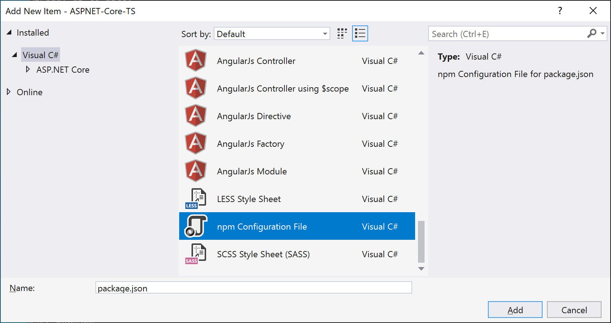
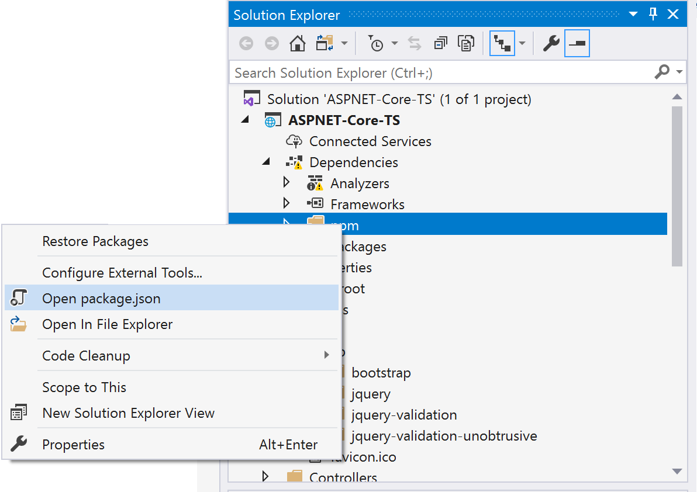
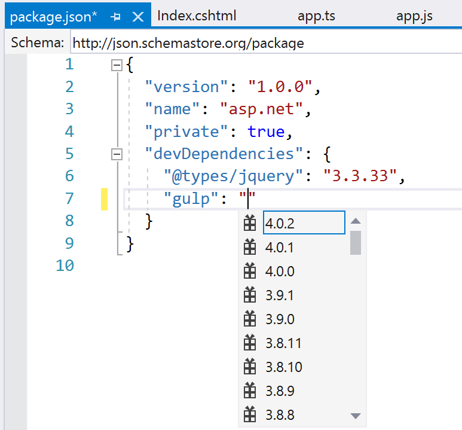

# Manage npm packages in Visual Studio

npm allows you to install and manage packages for use in your Node.js applications. Visual Studio makes it easy to interact with npm and issue npm commands through the UI or directly. If you're unfamiliar with npm and want to learn more, go to the [npm documentation](https://docs.npmjs.com/).

Visual Studio integration with npm is different depending on your project type.
* [Node.js](#nodejs-projects)
* [ASP.NET Core](#aspnet-core-projects)
* [Open folder (Node.js)](../javascript/develop-javascript-code-without-solutions-projects.md)

> [!Important]
> npm expects the *node_modules* folder and *package.json* in the project root. If your app's folder structure is different, you should modify your folder structure if you want to manage npm packages using Visual Studio.

> [!NOTE]
> For existing Node.js projects, use the **From existing Node.js code** solution template to enable npm in your project.

## Node.js projects

For Node.js projects, use one the following methods:
* [Install packages from Solution Explorer](#npmInstallWindow)
* [Manage installed packages from Solution Explorer](#solutionExplorer)
* [Use the `.npm` command in the Node.js Interactive Window](#interactive)

These features work together and synchronize with the project system and the *package.json* file in the project.

### <a name="npmInstallWindow"></a> Install packages from Solution Explorer (Node.js)

For Node.js projects, the easiest way to install npm packages is through the npm package installation window. To access this window, right-click the **npm** node in the project and select **Install New npm Packages**.


In this window you can search for a package, specify options, and install.


* **Dependency type** - Chose between **Standard**, **Development**, and **Optional** packages. Standard specifies that the package is a runtime dependency, whereas Development specifies that the package is only required during development.
* **Add to package.json** - This option is deprecated
* **Selected version** - Select the version of the package you want to install.
* **Other npm arguments** - Specify other standard npm arguments. For example, you can enter a version value such as `@~0.8` to install a specific version that is not available in the versions list.

You can see the progress of the installation in the npm tab in the Output window. This may take some time.

> [!TIP]
> You can search for scoped packages by prepending the search query with the scope you're interested in, for example, type `@types/mocha` to look for TypeScript definition files for mocha. Also, when installing type definitions for TypeScript, you can specify the TypeScript version you're targeting by adding `@ts2.6` in the npm argument field.

### <a name="solutionExplorer"></a>Manage installed packages in Solution Explorer (Node.js)

npm packages are shown in Solution Explorer. The entries under the **npm** node mimic the dependencies in the *package.json* file.


### Package status
*  - Installed and listed in package.json
*  - Installed, but not explicitly
listed in package.json
*  - Not installed, but listed in package.json

Right-click a package node or the **npm** node to take one of the following actions:
* **Install missing packages** that are listed in *package.json*
* **Update packages** to the latest version
* **Uninstall a package** and remove from *package.json*

### <a name="interactive"></a>Use the .npm command in the Node.js Interactive Window (Node.js)

You can also use the `.npm` command in the Node.js Interactive Window to execute
 npm commands. To open the window, right-click the project in Solution Explorer and choose **Open Node.js Interactive Window**.

In the window, you can use commands such as the following to install a package:

`.npm install azure@4.2.3`

 > [!Tip]
 > By default, npm will execute in your project's home directory. If you have multiple projects
 > in your solution specify the name or the path of the project in brackets.
 > `.npm [MyProjectNameOrPath] install azure@4.2.3`

 > [!Tip]
 > If your project doesn't contain a package.json file, use `.npm init -y` to create a new package.json file
 > with default entries.

 ## ASP.NET Core projects

For projects such as ASP.NET Core projects, you can integrate npm support in your project and use npm to install packages.
* [Add npm support to a project](#npmAdd)
* [Install packages using package.json](#npmInstallPackage)

>[!NOTE]
> For ASP.NET Core projects, you can also use [Library Manager](https://docs.microsoft.com/aspnet/core/client-side/libman/?view=aspnetcore-3.1) or yarn instead of npm to install client-side JavaScript and CSS files.

### <a name="npmAdd"></a> Add npm support to a project (ASP.NET Core)

If your project does not already include a *package.json* file, you can add one enable npm support by adding a package.json file to the project.

1. To add the file, right-click the project in Solution Explorer and choose **Add** > **New Item**. Choose the **npm Configuration File**, use the default name, and click **Add**.

   

1. Include one or more npm packages in the `dependencies` or `devDependencies` section of *package.json*. For example, you might add the following to the file:

   ```json
   "devDependencies": {
      "gulp": "4.0.2",
      "@types/jquery": "3.3.33"
   }
   ```

When you save the file, Visual Studio adds the package under the **Dependencies / npm** node in Solution Explorer. If you don't see the node, right-click **package.json** and choose **Restore Packages**.

### <a name="npmInstallPackage"></a>Install packages using package.json (ASP.NET Core)

For projects with npm included, you can configure npm packages using `package.json`. Right-click the npm node in Solution Explorer and choose **Open package.json**.



IntelliSense in *package.json* helps you select a particular version of an npm package.



When you save the file, Visual Studio adds the package under the **Dependencies / npm** node in Solution Explorer. If you don't see the node, right-click **package.json** and choose **Restore Packages**.

Check progress on package installation by switching to **npm** output in the **Output** window.


