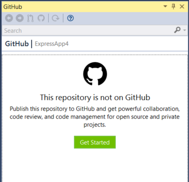
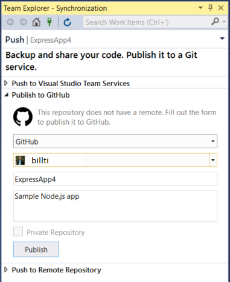
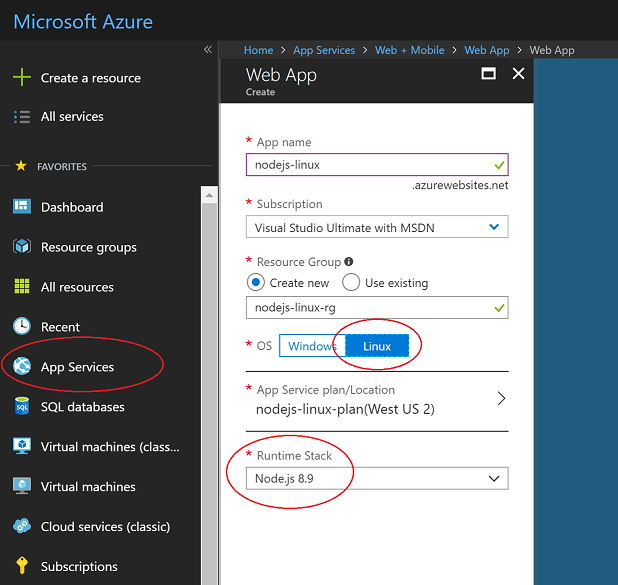
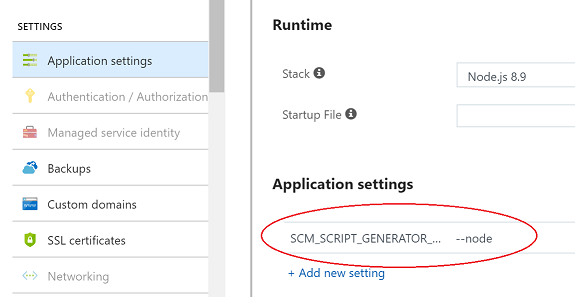
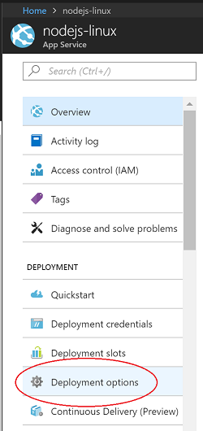
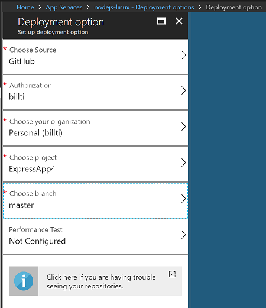
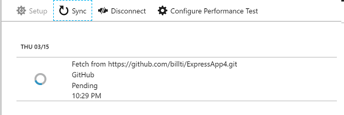
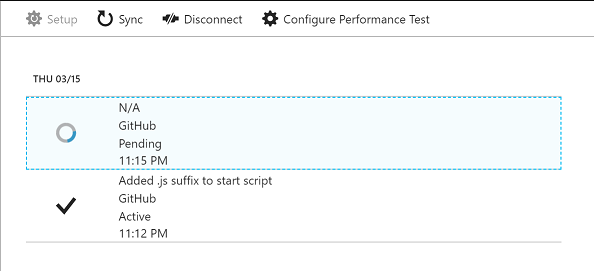

# Publish a Node.js application to Azure (Linux App Service)

This tutorial walks you through the task of creating a simple Node.js application and publishing it to Azure.

When publishing a Node.js application to Azure, there are several options. These include Azure App Service, a VM running an OS of your choosing, Azure Container Service (AKS) for management with Kubernetes, a Container Instance using Docker, and more. For more details on each of these options, see [Compute](https://azure.microsoft.com/product-categories/compute/).

For this tutorial, you deploy the app to [Linux App Service](/azure/app-service/containers/app-service-linux-intro).
Linux App Service deploys a Linux Docker container to run the Node.js application (as opposed to the Windows App Service, which runs Node.js apps behind IIS on Windows).

This tutorial shows how to create a Node.js application starting from a template installed with the Node.js Tools for Visual Studio, push the code to a repository on GitHub, and then provision an Azure App Service via the Azure web portal so that you can deploy from the GitHub repository. To use the command-line to provision the Azure App Service and push the code from a local Git repository, see [Create Node.js App](/azure/app-service/containers/quickstart-nodejs).

> [!IMPORTANT]
> The information in this article applies only to the Node.js project type (.njsproj). The template used in this article is no longer available starting in Visual Studio 2022 version 17.8 Preview 2.

In this tutorial, you learn how to:
> [!div class="checklist"]
> * Create a Node.js project
> * Create a GitHub repository for the code
> * Create a Linux App Service on Azure
> * Deploy to Linux

## Prerequisites

* You must have Visual Studio installed and the Node.js development workload.

    If you haven't already installed Visual Studio 2019, go to the [Visual Studio downloads](https://aka.ms/vs/download/?cid=learn-onpage-download-cta/) page to install it for free.

    If you need to install the workload but already have Visual Studio, go to **Tools** > **Get Tools and Features...**, which opens the Visual Studio Installer. Choose the **Node.js development** workload, then choose **Modify**.

    

* You must have the Node.js runtime installed.

    If you don't have it installed, install the LTS version from the [Node.js](https://nodejs.org/en/download/) website. In general, Visual Studio automatically detects the installed Node.js runtime. If it does not detect an installed runtime, you can configure your project to reference the installed runtime in the properties page (after you create a project, right-click the project node and choose **Properties**).

## Create a Node.js project to run in Azure

1. Open Visual Studio.

1. Create a new TypeScript Express app.

    Press **Esc** to close the start window. Type **Ctrl + Q** to open the search box, type **Node.js**, then choose **Create new Basic Azure Node.js Express 4 application** (TypeScript). In the dialog box that appears, choose **Create**.

    If you don't see the **Basic Azure Node.js Express 4 application** project template, you must add the **Node.js development** workload. For detailed instructions, see the [Prerequisites](#prerequisites).

    Visual Studio creates the project and opens it in Solution Explorer (right pane).

1. Press **F5** to build and run the app, and make sure that everything is running as expected.

1. Select **File** > **Add to source control** to create a local Git repository for the project.

    At this point, a Node.js app using the Express framework and written in TypeScript is working and checked in to local source control.

1. Edit the project as desired before proceeding to the next steps.

## Push code from Visual Studio to GitHub

To set up GitHub for Visual Studio:

1. Make sure the [GitHub Extension for Visual Studio](https://visualstudio.github.com/) is installed and enabled using the menu item **Tools** > **Extensions and Updates**.

2. From the menu select **View** > **Other Windows** > **GitHub**.

    The GitHub window opens.

3. If you don't see the **Get Started** button in the GitHub window, click **File** > **Add to Source Control** and wait for the UI to update.

    

4. Click **Get started**.

    If you are already connected to GitHub, the toolbox appears similar to the following illustration.

    

5. Complete the fields for the new repository to publish, and then click **Publish**.

    After a few moments, a banner stating "Repository created successfully"  appears.

    In the next section, you learn how to publish from this repository to an Azure App Service on Linux.

## Create a Linux App Service in Azure

1. Sign in to the [Azure portal](https://portal.azure.com).

2. Select **App Services** from the list of services on the left, and then click **Add**.

3. If required, create a new Resource Group and App Service plan to host the new app.

4. Make sure to set the **OS** to **Linux**, and set **Runtime Stack** to the required Node.js version, as shown in the illustration.

    

5. Click **Create** to create the App Service.

    It might take a few minutes to deploy.

6. After it is deployed, go to the **Application settings** section, and add a setting with a name of `SCM_SCRIPT_GENERATOR_ARGS` and a value of `--node`.

    

    > [!WARNING]
    > The App Service deployment process uses a set of heuristics to determine which type of application to try and run. If a .*sln* file is detected in the deployed content, it will assume an MSBuild based project is being deployed. The setting added above overrides this logic and specifies explicitly that this is a Node.js application. Without this setting, the Node.js application will fail to deploy if the .*sln* file is part of the repository being deployed to the App Service.

7. Under **Application settings**, add another setting with a name of `WEBSITE_NODE_DEFAULT_VERSION` and a value of `8.9.0`.

8. After it is deployed, open the App Service and select **Deployment options**.

    

9. Click **Choose source**, and then choose **GitHub**, and then configure any required permissions.

    

10. Select the repository and branch to publish, and then select **OK**.

    

    The **deployment options** page appears while syncing.

    

    Once it is finished syncing, a check mark will appear.

    The site is now running the Node.js application from the GitHub repository, and it is accessible at the URL created for the Azure App Service (by default the name given to the Azure App Service followed by `.azurewebsites.net`).

## Modify your app and push changes

1. Add the code shown here in *app.ts* after the line `app.use('/users', users);`. This adds a REST API at the URL */api*.

    ```typescript
    app.use('/api', (req, res, next) => {
        res.json({"result": "success"});
    });
    ```

2. Build the code and test it locally, then check it in and push to GitHub.

    In the Azure portal, it takes a few moments to detect changes in the GitHub repo, and then a new sync of the deployment starts. This looks similar to the following illustration.

    

3. Once deployment is complete, navigate to the public site and append */api* to the URL. The JSON response gets returned.

## Troubleshooting

* If the node.exe process dies (that is, an unhandled exception occurs), the container restarts.
* When the container starts up, it runs through various heuristics to figure out how to start the Node.js process. Details of the implementation can be seen at
[generateStartupCommand.js](https://github.com/Azure/app-service-builtin-images/blob/master/node/8.9.4/startup/generateStartupCommand.js).
* You can connect to the running container via SSH for investigations. This is easily done using the Azure portal. Select the App Service, and scroll down the list of tools until reaching **SSH** under the **Development Tools** section.
* To aid in troubleshooting, go to the **Diagnostics logs** settings for the App Service, and change the **Docker Container logging** setting from **Off** to **File System**. Logs are created in the container under */home/LogFiles/*_docker.log*, and can be accessed on the box using SSH or FTP(S).
* A custom domain name might be assigned to the site, rather than the *.azurewebsites.net URL assigned by default. For more details, see the topic [Map Custom Domain](/azure/app-service/app-service-web-tutorial-custom-domain).
* Deploying to a staging site for further testing before moving into production is a best practice. For details on how to configure this, see the topic
[Create staging environments](/azure/app-service/web-sites-staged-publishing).
* See the [App Service on Linux FAQ](/azure/app-service/containers/app-service-linux-faq) for more commonly asked questions.

## Next steps

In this tutorial, you learned how create a Linux App Service and deploy a Node.js application to the service. You might want to learn more about Linux App Service.

> [!div class="nextstepaction"]
> [Linux App Service](/azure/app-service/containers/app-service-linux-intro)
