# Overview of the Visual Studio IDE for JavaScript

In this 5-10 minute introduction to the Visual Studio integrated development environment (IDE), we take a tour of some of the windows, menus, and other UI features.

If you haven't installed Visual Studio, go to the [Visual Studio downloads](https://aka.ms/vs/download/?cid=learn-onpage-download-cta) page to install it for free.

## Start window

The first thing you see after you launch Visual Studio is the start window. The start window is designed to help you "get to code" faster. It has options to close or check out code, open an existing project or solution, create a new project, or simply open a folder that contains some code files. If the start window isn't open, choose **File > Start Window** to open it.

::: moniker range=">=vs-2022"
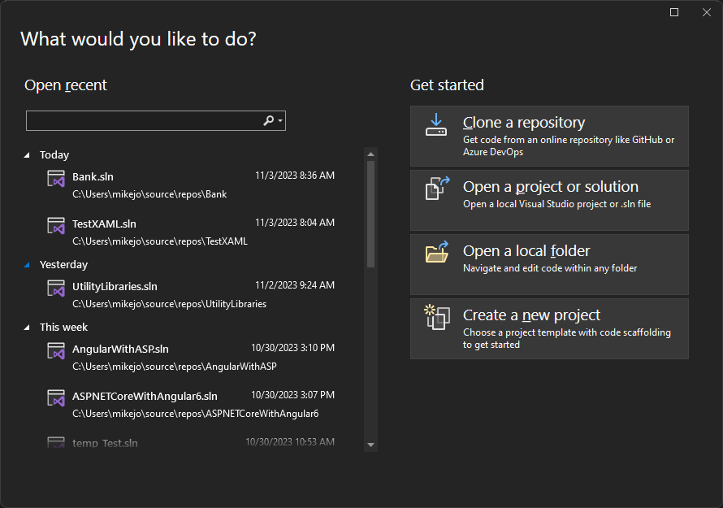
::: moniker-end
::: moniker range="<=vs-2019"
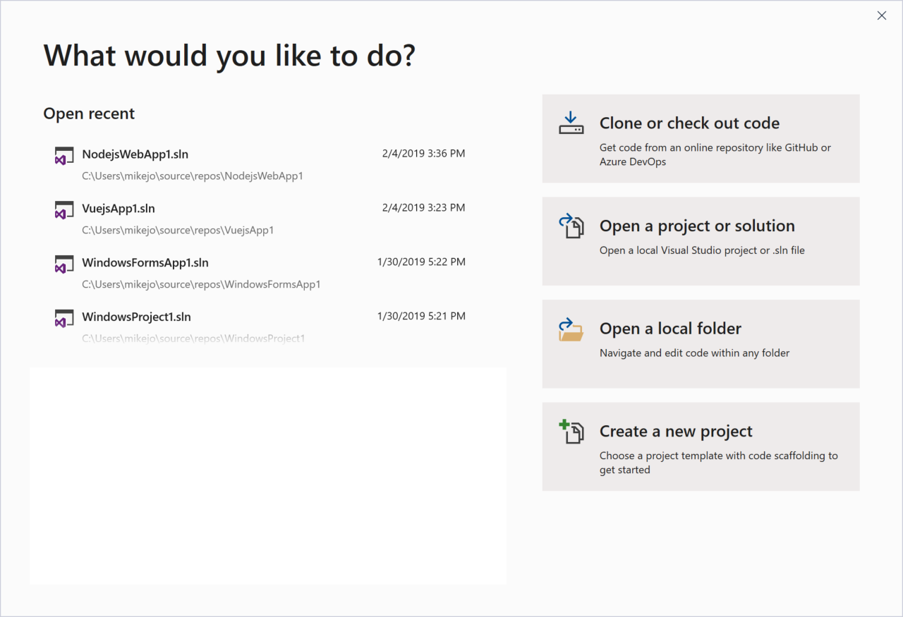
::: moniker-end

If this is the first time you're using Visual Studio, your recent projects list will be empty.

If you work with non-MSBuild based codebases, use the **Open a local folder** option to open your code in Visual Studio. For more information, see [Develop code in Visual Studio without projects or solutions](develop-javascript-code-without-solutions-projects.md). Otherwise, you can create a new project or clone a project from a source provider such as GitHub or Azure DevOps.

The **Continue without code** option simply opens the Visual Studio development environment without any specific project or code loaded. You might choose this option to join a [Live Share](/visualstudio/liveshare/) session or attach to a process for debugging. You can also press **Esc** to close the start window and open the IDE.

## Create a project

To continue exploring Visual Studio's features, let's create a new project.

1. On the start window, select **Create a new project**, and then in the search box type in **javascript** or **typescript** to filter the list of project types to those that contain "javascript" or "typescript" in their name or language type.

   Visual Studio provides various kinds of project templates that help you get started coding quickly.

   ::: moniker range=">=vs-2022"
   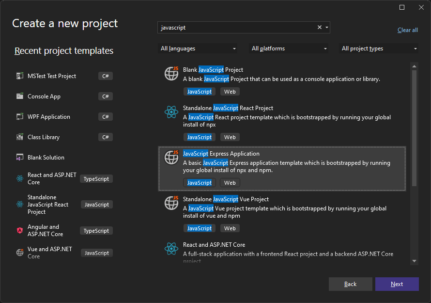
   ::: moniker-end
   ::: moniker range="<=vs-2019"
   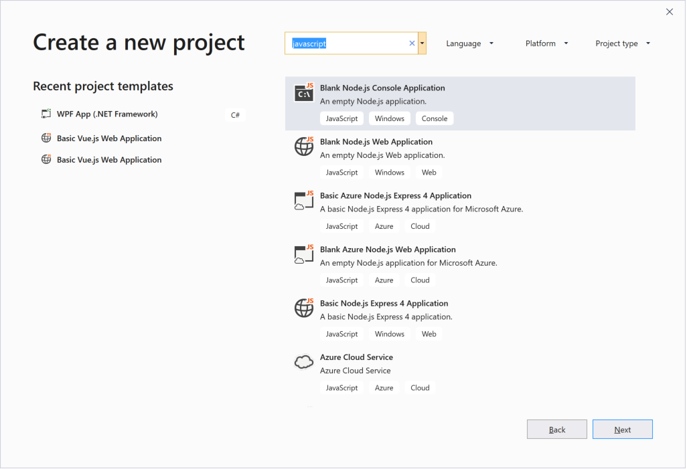
   ::: moniker-end

::: moniker range=">=vs-2022"
2. Choose a **JavaScript Express Application** project template and click **Next**.
::: moniker-end
::: moniker range="<=vs-2019"
2. Choose a **Blank Node.js Web Application** project template and click **Next**.
::: moniker-end

3. In the **Configure your new project** dialog box that appears, accept the default project name and choose **Create**.

   ::: moniker range=">=vs-2022"
   The project is created. In the right pane, select *app.js* to open the file in the **Editor** window. The **Editor** shows the contents of files, and is where you do most of your coding work in Visual Studio.

   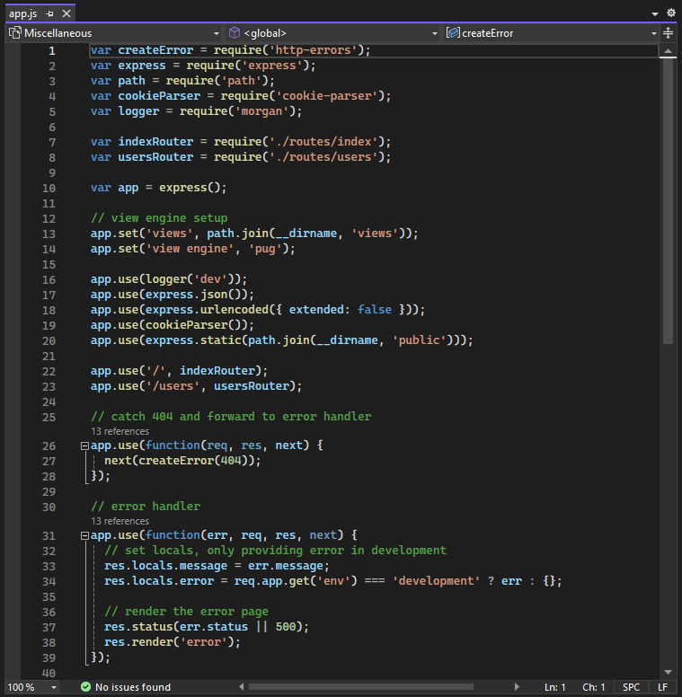
   ::: moniker-end
   ::: moniker range="<=vs-2019"
   The project is created and a file named *server.js* opens in the **Editor** window. The **Editor** shows the contents of files, and is where you do most of your coding work in Visual Studio.

   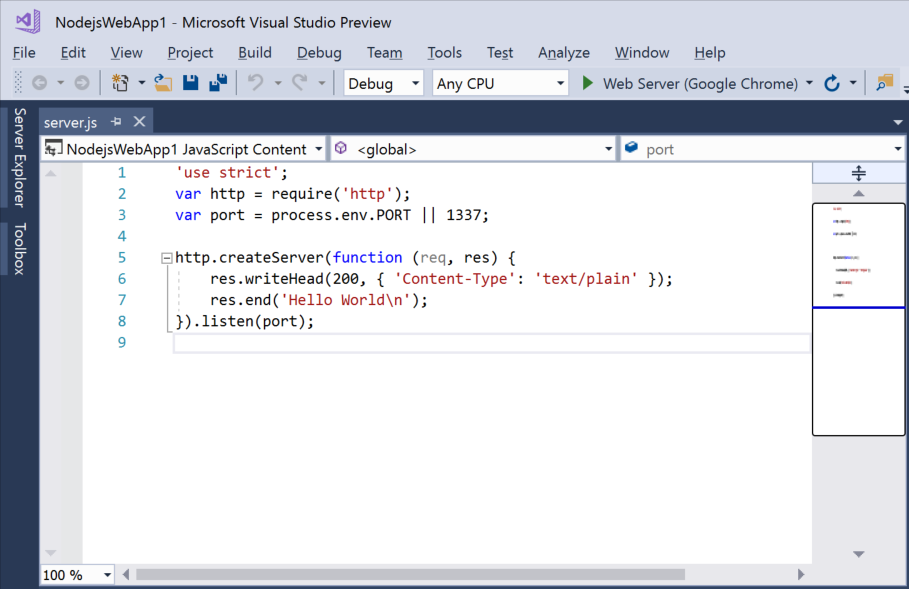
   ::: moniker-end

## Solution Explorer

**Solution Explorer**, which is typically on the right-hand side of Visual Studio, shows you a graphical representation of the hierarchy of files and folders in your project, solution, or code folder. You can browse the hierarchy and navigate to a file in **Solution Explorer**.

::: moniker range=">=vs-2022"

::: moniker-end
::: moniker range="<=vs-2019"

::: moniker-end

## Menus

The menu bar along the top of Visual Studio groups commands into categories. For example, the **Project** menu contains commands related to the project you're working in. On the **Tools** menu, you can customize how Visual Studio behaves by selecting **Options**, or add features to your installation by selecting **Get Tools and Features**.

::: moniker range=">=vs-2022"

::: moniker-end
::: moniker range="<=vs-2019"

::: moniker-end

Let's open the **Error List** window by choosing the **View** menu, and then **Error List**.

## Error List

The **Error List** shows you errors, warning, and messages regarding the current state of your code. If there are any errors (such as a missing brace or semicolon) in your file, or anywhere in your project, they're listed here.

::: moniker range=">=vs-2022"

::: moniker-end
::: moniker range="<=vs-2019"

::: moniker-end

## Output window

The **Output** window shows you output messages from building your project and from your source control provider.

Let's build the project to see some build output. From the **Build** menu, choose **Build Solution**. The **Output** window automatically obtains focus and display a successful build message.

::: moniker range=">=vs-2022"
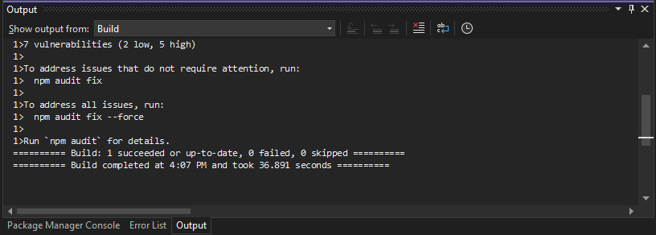
::: moniker-end
::: moniker range="<=vs-2019"
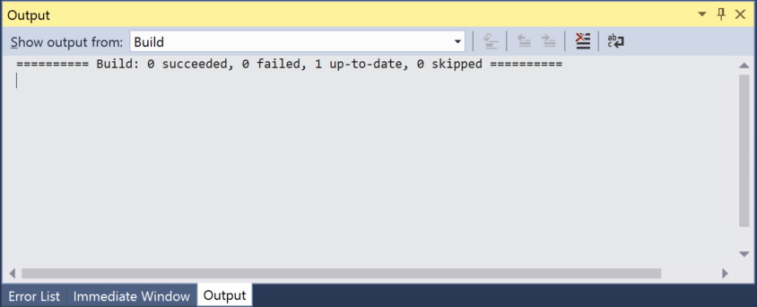
::: moniker-end

## Search box

The Search box is a quick and easy way to do pretty much anything in Visual Studio. You can enter some text related to what you want to do, and it'll show you a list of options that pertain to the text. For example, imagine you want to increase the build output's verbosity to display additional details about what exactly build is doing. Here's how you might do that:

1. If you don't see the Search box, press **Ctrl**+**Q** to open it, and then type _verbosity_ into the box.

::: moniker range="visualstudio"

2. From the displayed results, double-click the **MSBuild project build output verbosity** (projectsAndSolutions.buildAndRun.outputVerbosity) entry.

   :::image type="content" source="media/visualstudio/quickstart-ide-quick-launch.png" border="false" alt-text="Screenshot that shows how to use the Search box in Visual Studio.":::

   The **Options** pane opens to the **All Settings** > **Projects and Solutions** > **Build and Run** section.

3. Use the dropdown and set **MSBuild project build output verbosity** option to **Normal**, and then click **OK**.

::: moniker-end
::: moniker range="vs-2022"

2. From the displayed results, double-click the **Change MSBuild verbosity** (Projects and Solutions > Build and Run) entry.

   

   The **Options** dialog opens to the **Projects and Solutions** > **Build and Run** section.

::: moniker-end
::: moniker range="<=vs-2019"

2. From the displayed results, double-click the **Change MSBuild verbosity** (Projects and Solutions > Build and Run) entry.

   

   The **Options** dialog opens to the **Projects and Solutions** > **Build and Run** options page.

::: moniker-end

::: moniker range="<=vs-2022"

3. Use the dropdown and set **MSBuild project build output verbosity** option to **Normal**, and then select **OK**.

::: moniker-end

4. Build the project again by right-clicking the project in **Solution Explorer** and choosing **Rebuild** from the context menu.

   This time the **Output** window shows more verbose logging from the build process.

   ::: moniker range=">=vs-2022"
   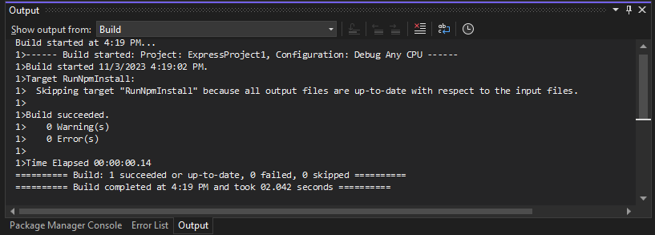
   ::: moniker-end
   ::: moniker range="<=vs-2019"
   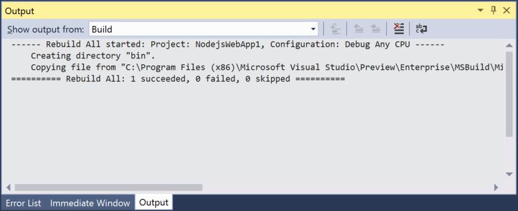
   ::: moniker-end

## Send Feedback menu

Should you encounter any problems while you're using Visual Studio, or if you have suggestions for how to improve the product, you can use the **Send Feedback** menu at the top of the Visual Studio window.

::: moniker range=">=vs-2022"
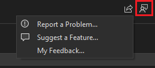
::: moniker-end
::: moniker range="<=vs-2019"

::: moniker-end

## Next steps

We've looked at just a few of the features of Visual Studio to get acquainted with the user interface. To explore further:

> [!div class="nextstepaction"]
> [Learn about the code editor](write-and-edit-code.md)

> [!div class="nextstepaction"]
> [Learn about projects and solutions](../get-started/tutorial-projects-solutions.md)

## See also

- [Overview of the Visual Studio IDE](../get-started/visual-studio-ide.md)
- [More features of Visual Studio 2017](../ide/advanced-feature-overview.md)
- [Change theme and font colors](../ide/how-to-change-fonts-and-colors-in-visual-studio.md)